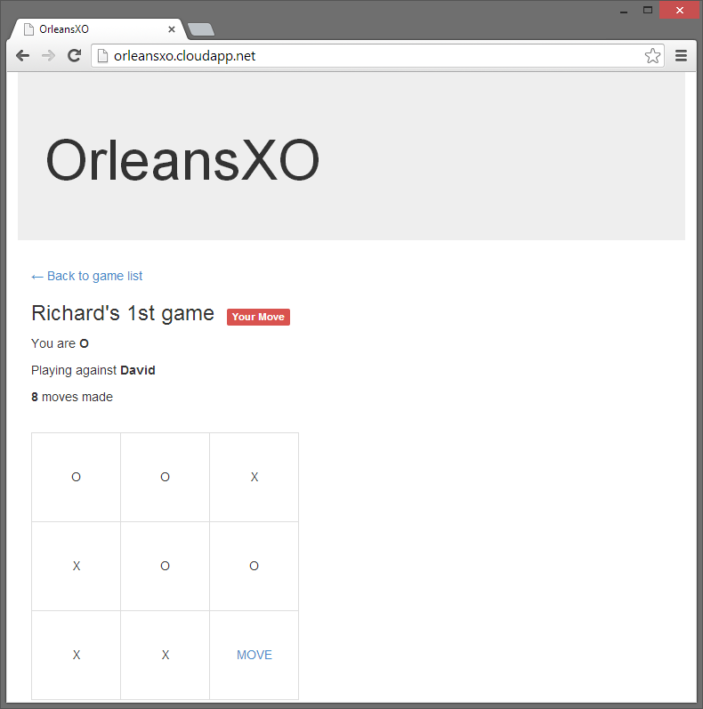

TicTacToe is based on the classic board game, also known as "noughts and crosses." Its game logic is simple, which makes it an excellent sample for showing how a turn-based game could be easily implemented in Orleans. 

A game like this may not at first sight seem a natural fit for Orleans, if you only think about it in terms of a single player game. However, within a social game context, such as a Facebook game, where thousands of players could be playing dozens of games at any one time - some games waiting for the opponent to join, others mid game, waiting for the next move to play out, then it is a much more natural fit. Orleans enables the developer to concentrate on expressing game logic as grains, letting the runtime handle the scale.

This sample also demonstrates how an Orleans application can be deployed to Windows Azure.



### Running the Sample
The sample comes complete with a Windows Azure project, so it can be run locally in the Windows Azure local emulator, or deployed as a real cloud service. If running locally, you will need to create multiple "private" browsing sessions, to ensure each browser session is recognized as a new player. 

To run locally without the emulator:

1. Open the `TicTacToe.sln` file in Visual Studio and build the solution. 
2. Set the TicTacToe.Grains project as the startup project. 
3. Press F5 to start the application. 
4. Start the TicTacToe.Web project manually using the Project context menu -> Debug -> Start new instance 
5. Your browser should open, asking you to enter your name.

To run locally using the Azure emulator:

1. Open the `TicTacToe.sln` file in Visual Studio and build the solution. 
2. Set the TicTacToe.Azure project as the startup project. 
3. Start the Azure Compute Emulator if necessary. 
4. Press F5 to start the application. 
5. Your browser should open, asking you to enter your name.

To run in Windows Azure:

1. Open the `TicTacToe.sln` file in Visual Studio and build the solution. 
2. Expand the `TicTacToe.Azure` project, and in the `Roles` folder, open the properties for `TicTacToe.Web` and `TicTacToe.WorkerRole`. 
3. Set the value for the `DataConnectionString` setting for both roles to a Windows Azure Storage Account. 
4. Right click on the `TicTacToe.Azure` project, and click `Publish`. 
5. Follow the instructions in the wizard to deploy the application on Azure. 
6. The application will deploy, and you will be able to access on http://YOURCLOUDSERVICE.cloudapp.net/

### How it works
There are two main grain types in OrleansXO, one represents a player, the other representing a game.

**User Grain**

A `PlayerGrain` is activated for each player logging in to the system. A GUID is used to uniquely identify the user, which is stored in a cookie by the MVC web application. The IPlayer interface defines the operations a player can perform:

``` csharp
public interface IPlayer : IGrain 
{
    Task<List<GameSummary>> GetGameSummaries();
    Task<Guid> CreateGame();
    Task<GameState> JoinGame(Guid gameId);
    Task LeaveGame(Guid gameId, GameOutcome outcome);
    Task SetUsername(string username);
    Task<string> GetUsername(); 
}
```

The player grain handles the creating of new games (so another player can then join), leaving a game (once it is over), and tracking the progress of all active games.

**Game Grain**

Each game is also represented by a `GameGrain`. They are also uniquely identify using a GUID.

``` csharp
public interface IGame : Orleans.IGrain 
{
    Task<GameState> AddPlayerToGame(Guid player);
    Task<GameState> GetState();
    Task<List<GameMove>> GetMoves();
    Task<GameState> MakeMove(GameMove move);
    Task<GameSummary> GetSummary(Guid player);
    Task SetName(string name);  
}
```

Once a user grain creates a game, that user is automatically added as one of the players. Once a game is joined by a second player, the game can start. The players make their turns until the game ends with either a draw or a winner. 

The `GameGrain` maintains the state of the game, the players in the game, whose turn it is next, and whether the game is in play or finished. 

The `MakeMove` method handles the game logic, checking the validity of a move and, once played, checks if that move ends the game. In the case of the game ending, the player grains are informed of the outcome via the LeaveGame call.

The game was designed with social gaming in mind, so the main mechanism for inviting other players is an "out of band" from the game, and would probably be an invite to a friend, sending the GUID that represents the game. As an optimization purely for testing, a pairing grain was created that uses MemoryCache to hold a the list of games that are available to join, with an expiry of one hour, to stop "stale" games appearing on the list.

 An ASP.NET MVC application serves an HTML page. JavaScript running in the browser polls the web server, and retrieve JSON data, which it renders using [Handlebars templates](http://handlebarsjs.com/).


