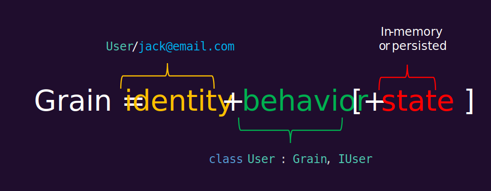

<p align="center">
  <image src="https://raw.githubusercontent.com/dotnet/orleans/gh-pages/assets/logo_full.png" alt="Orleans logo" width="600px">
</p>

[](http://www.nuget.org/profiles/Orleans)
[](https://twitter.com/intent/follow?screen_name=msftorleans)

[](https://aka.ms/orleans-discord)

### Orleans is a cross-platform framework for building robust, scalable distributed applications

Orleans builds on the developer productivity of .NET and brings it to the world of distributed applications, such as cloud services. Orleans scales from a single on-premises server to globally distributed, highly-available applications in the cloud.

Orleans takes familiar concepts like objects, interfaces, async/await, and try/catch and extends them to multi-server environments. As such, it helps developers experienced with single-server applications transition to building resilient, scalable cloud services and other distributed applications. For this reason, Orleans has often been referred to as "Distributed .NET".

It was created by [Microsoft Research](http://research.microsoft.com/projects/orleans/) and introduced the [Virtual Actor Model](http://research.microsoft.com/apps/pubs/default.aspx?id=210931) as a novel approach to building a new generation of distributed systems for the Cloud era. The core contribution of Orleans is its programming model which tames the complexity inherent to highly-parallel distributed systems without restricting capabilities or imposing onerous constraints on the developer.

## Grains



The fundamental building block in any Orleans application is a *grain*. Grains are entities comprising user-defined identity, behavior, and state. Grain identities are user-defined keys which make Grains always available for invocation. Grains can be invoked by other grains or by external clients such as Web frontends, via strongly-typed communication interfaces (contracts). Each grain is an instance of a class which implements one or more of these interfaces.

Grains can have volatile and/or persistent state that can be stored in any storage system. As such, grains implicitly partition application state, enabling automatic scalability and simplifying recovery from failures. Grain state is kept in memory while the grain is active, leading to lower latency and less load on data stores.

<p align="center">
  <image src="assets/managed_lifecycle.svg" alt="A diagram showing the managed lifecycle of a grain">
</p>

Instantiation of grains is automatically performed on demand by the Orleans runtime. Grains which are not used for a while are automatically removed from memory to free up resources. This is possible because of their stable identity, which allows invoking grains whether they are already loaded into memory or not. This also allows for transparent recovery from failure because the caller does not need to know on which server a grain is instantiated on at any point in time. Grains have a managed lifecycle, with the Orleans runtime responsible for activating/deactivating, and placing/locating grains as needed. This allows the developer to write code as if all grains were always in-memory.

Taken together, the stable identity, statefulness, and managed lifecycle of Grains are core factors that make systems built on Orleans scalable, performant, &amp; reliable without forcing developers to write complex distributed systems code.

### Example: IoT cloud backend

Consider a cloud backend for an [Internet of Things](https://en.wikipedia.org/wiki/Internet_of_things) system. This application needs to process incoming device data, filter, aggregate, and process this information, and enable sending commands to devices. In Orleans, it is natural to model each device with a grain which becomes a *digital twin* of the physical device it corresponds to. These grains keep the latest device data in memory, so that they can be quickly queried and processed without the need to communicate with the physical device directly. By observing streams of time-series data from the device, the grain can detect changes in conditions, such as measurements exceeding a threshold, and trigger an action.

A simple thermostat could be modeled as follows:

```csharp
public interface IThermostat : IGrainWithStringKey
{
    Task<List<Command>> OnUpdate(ThermostatStatus update);
}
```

Events arriving from the thermostat from a Web frontend can be sent to its grain by invoking the `OnUpdate` method which optionally returns a command back to the device.

```csharp
var thermostat = client.GetGrain<IThermostat>(id);
return await thermostat.OnUpdate(update);
```

The same thermostat grain can implement a separate interface for control systems to interact with:

```csharp
public interface IThermostatControl : IGrainWithStringKey
{
    Task<ThermostatStatus> GetStatus();

    Task UpdateConfiguration(ThermostatConfiguration config);
}
```

These two interfaces (`IThermostat` and `IThermostatControl`) are implemented by a single implementation class:

```csharp
public class ThermostatGrain : Grain, IThermostat, IThermostatControl
{
    private ThermostatStatus _status;
    private List<Command> _commands;

    public Task<List<Command>> OnUpdate(ThermostatStatus status)
    {
        _status = status;
        var result = _commands;
        _commands = new List<Command>();
        return Task.FromResult(result);
    }
    
    public Task<ThermostatStatus> GetStatus() => Task.FromResult(_status);
    
    public Task UpdateConfiguration(ThermostatConfiguration config)
    {
        _commands.Add(new ConfigUpdateCommand(config));
        return Task.CompletedTask;
    }
}
```

The `Grain` class above does not persist its state. A more thorough example demonstrating state persistence is available in the docs, for more information see [Microsoft Orleans: Grain Persistence](https://docs.microsoft.com/dotnet/orleans/grains/grain-persistence).

## Orleans runtime

The Orleans runtime is what implements the programming model for applications. The main component of the runtime is the *silo*, which is responsible for hosting grains. Typically, a group of silos run as a cluster for scalability and fault-tolerance. When run as a cluster, silos coordinate with each other to distribute work, detect and recover from failures. The runtime enables grains hosted in the cluster to communicate with each other as if they are within a single process.

In addition to the core programming model, the silo provides grains with a set of runtime services, such as timers, reminders (persistent timers), persistence, transactions, streams, and more. See the [features section](#features) below for more detail.

Web frontends and other external clients call grains in the cluster using the client library which automatically manages network communication. Clients can also be co-hosted in the same process with silos for simplicity.

Orleans is compatible with .NET Standard 2.0 and above, running on Windows, Linux, and macOS, in full .NET Framework or .NET Core.

## Features

Orleans is a feature-rich framework. It provides a set of services that enable the development of distributed systems. The following sections describe the features of Orleans.

### Persistence

Orleans provides a simple persistence model which ensures that state is available to a grain before requests are processed and that consistency is maintained. Grains can have multiple named persistent data objects, for example, one called "profile" for a user's profile and one called "inventory" for their inventory. This state can be stored in any storage system. For example, profile data may be stored in one database and inventory in another. While a grain is running, this state is kept in memory so that read requests can be served without accessing storage. When the grain updates its state, a `state.WriteStateAsync()` call ensures that the backing store is updated for durability and consistency. For more information see [Microsoft Orleans: Grain Persistence](https://docs.microsoft.com/dotnet/orleans/grains/grain-persistence).

### Distributed ACID transactions

In addition to the simple persistence model described above, grains can have *transactional state*. Multiple grains can participate in [ACID](https://en.wikipedia.org/wiki/ACID) transactions together regardless of where their state is ultimately stored. Transactions in Orleans are distributed and decentralized (there is no central transaction manager or transaction coordinator) and have [serializable isolation](https://en.wikipedia.org/wiki/Isolation_(database_systems)#Isolation_levels). For more information, see the [Microsoft Orleans: Transactions](https://docs.microsoft.com/dotnet/orleans/grains/transactions).

### Streams

Streams help developers to process series of data items in near-real time. Streams in Orleans are *managed*: streams do not need to be created or registered before a grain or client publishes to a stream or subscribes to a stream. This allows for greater decoupling of stream producers and consumers from each other and from the infrastructure. Stream processing is reliable: grains can store checkpoints (cursors) and reset to a stored checkpoint during activation or at any point afterwards.

Streams supports batch delivery of messages to consumers to improve efficiency and recovery performance.
Streams are backed by queueing services such as Azure Event Hubs, Amazon Kinesis, and others. An arbitrary number of streams can be multiplexed onto a smaller number of queues and the responsibility for processing these queues is balanced evenly across the cluster.

### Timers &amp; reminders

Reminders are a durable scheduling mechanism for grains. They can be used to ensure that some action is completed at a future point even if the grain is not currently activated at that time. Timers are the non-durable counterpart to reminders and can be used for high-frequency events which do not require reliability. For more information, see [Microsoft Orleans: Timers and reminders](https://docs.microsoft.com/dotnet/orleans/grains/timers-and-reminders).

### Flexible grain placement

When a grain is activated in Orleans, the runtime decides which server (silo) to activate that grain on. This is called grain placement. The placement process in Orleans is fully configurable: developers can choose from a set of out-of-the-box placement policies such as random, prefer-local, and load-based, or custom logic can be configured. This allows for full flexibility in deciding where grains are created. For example, grains can be placed on a server close to resources which they need to operate on or other grains which they communicate with.

### Grain versioning &amp; heterogeneous clusters

Application code evolves over time and upgrading live, production systems in a manner which safely accounts for these changes can be challenging, particularly in stateful systems. Grain interfaces in Orleans can be optionally versioned. The cluster maintains a mapping of which grain implementations are available on which silos in the cluster and the versions of those implementations. This version information is used by the runtime in conjunction with placement strategies to make placement decisions when routing calls to grains. In addition to safe update of versioned grains, this also enables heterogeneous clusters, where different silos have different sets of grain implementations available. For more information, see [Microsoft Orleans: Grain interface versioning](https://docs.microsoft.com/dotnet/orleans/grains/grain-versioning/grain-versioning).

### Elastic scalability &amp; fault tolerance

Orleans is designed to scale elastically. When a silo joins a cluster it is able to accept new activations and when a silo leaves the cluster (either because of scale down or a machine failure) the grains which were activated on that silo will be re-activated on remaining silos as needed. An Orleans cluster can be scaled down to a single silo. The same properties which enable elastic scalability also enable fault tolerance: the cluster automatically detects and quickly recovers from failures.

### Run anywhere

Orleans runs anywhere that .NET Core or .NET Framework are supported. This includes hosting on Linux, Windows, and macOS and deploying to Kubernetes, virtual or physical machines, on premises or in the cloud, and PaaS services such as Azure Cloud Services.

### Stateless workers

Stateless workers are specially marked grains which do not have any associated state and can be activated on multiple silos simultaneously. This enables increased parallelism for stateless functions. For more information, see [Microsoft Orleans: Stateless worker grains](https://docs.microsoft.com/dotnet/orleans/grains/stateless-worker-grains) documentation.

### Grain call filters

Logic which is common to many grains can be expressed as [an interceptor, or Grain call filter](https://docs.microsoft.com/dotnet/orleans/grains/interceptors). Orleans supports filters for both incoming and outgoing calls. Some common use-cases of filters are: authorization, logging and telemetry, and error handling.

### Request context

Metadata and other information can be passed along a series of requests using [request context](https://docs.microsoft.com/dotnet/orleans/grains/request-context). Request context can be used for holding distributed tracing information or any other user-defined values.

## Documentation

The official documentation for Microsoft Orleans is available at <https://docs.microsoft.com/dotnet/orleans>.

## [Samples](./samples/#readme)

A variety of samples are available in the official [.NET Samples Browser](https://docs.microsoft.com/samples/browse/?terms=orleans).

## Get started

Please see the [getting started tutorial](https://docs.microsoft.com/dotnet/orleans/tutorials-and-samples/tutorial-1).

### Building

On Windows, run the `build.cmd` script to build the NuGet packages locally, then reference the required NuGet packages from `/Artifacts/Release/*`.
You can run `Test.cmd` to run all BVT tests, and `TestAll.cmd` to also run Functional tests.

On Linux and macOS, run the `build.sh` script or `dotnet build` to build Orleans.

## Official builds

The latest stable, production-quality release is located [here](https://github.com/dotnet/orleans/releases/latest).

Nightly builds are published to [a NuGet feed](https://orleans.pkgs.visualstudio.com/orleans-public/_packaging/orleans-builds/nuget/v3/index.json). These builds pass all functional tests, but are not thoroughly tested as the stable builds or pre-release builds published to NuGet.

<details>
<summary>
Using the nightly build packages in your project
</summary>

To use nightly builds in your project, add the MyGet feed using either of the following methods:

1. Changing the .csproj file to include this section:

```xml
  <RestoreSources>
    $(RestoreSources);
    https://orleans.pkgs.visualstudio.com/orleans-public/_packaging/orleans-builds/nuget/v3/index.json;
  </RestoreSources>
```

or

1. Creating a `NuGet.config` file in the solution directory with the following contents:

```xml
<?xml version="1.0" encoding="utf-8"?>
<configuration>
  <packageSources>
    <clear />
    <add key="orleans-builds"
      value="https://orleans.pkgs.visualstudio.com/orleans-public/_packaging/orleans-builds/nuget/v3/index.json" />
  <add key="nuget" value="https://api.nuget.org/v3/index.json" />
  </packageSources>
</configuration>
```

</details>

## Community

[](https://aka.ms/orleans-discord)
    
* Ask questions by [opening an issue on GitHub](https://github.com/dotnet/orleans/issues) or on [Stack Overflow](https://stackoverflow.com/questions/ask?tags=orleans)
* [Chat on Discord](https://aka.ms/orleans-discord)
* Follow the [@msftorleans](https://twitter.com/msftorleans) Twitter account for Orleans announcements.
* [OrleansContrib - GitHub organization for community add-ons to Orleans](https://github.com/OrleansContrib/) Various community projects, including Monitoring, Design Patterns, Storage Providers, etc.
* Guidelines for developers wanting to [contribute code changes to Orleans](CONTRIBUTING.md).
* You are also encouraged to report bugs or start a technical discussion by starting a new [thread](https://github.com/dotnet/orleans/issues) on GitHub.

## License

This project is licensed under the [MIT license](LICENSE).

## Quick links

* [Microsoft Research project home](http://research.microsoft.com/projects/orleans/)
* Technical Report: [Distributed Virtual Actors for Programmability and Scalability](http://research.microsoft.com/apps/pubs/default.aspx?id=210931)
* [Microsoft Orleans: Documentation](https://docs.microsoft.com/dotnet/orleans/)
* [Contributing](CONTRIBUTING.md)
