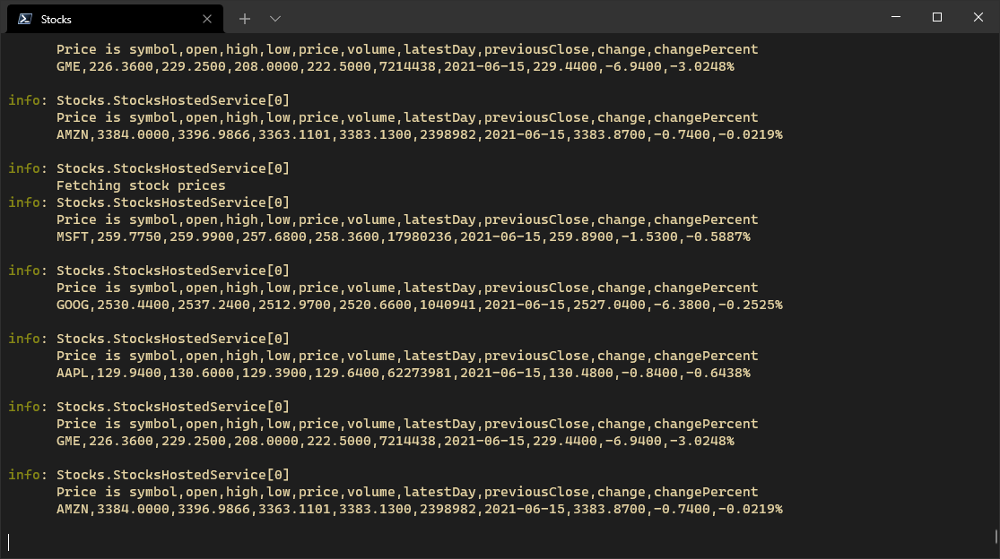
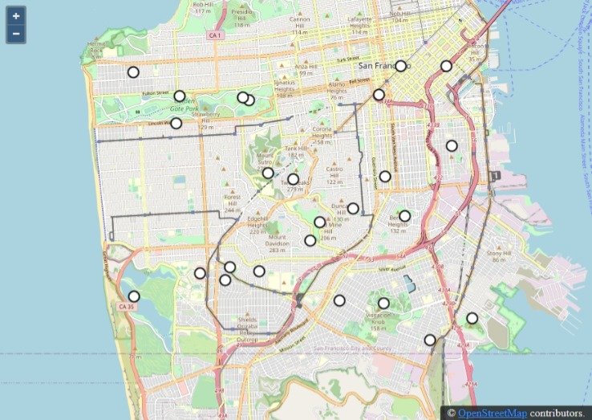
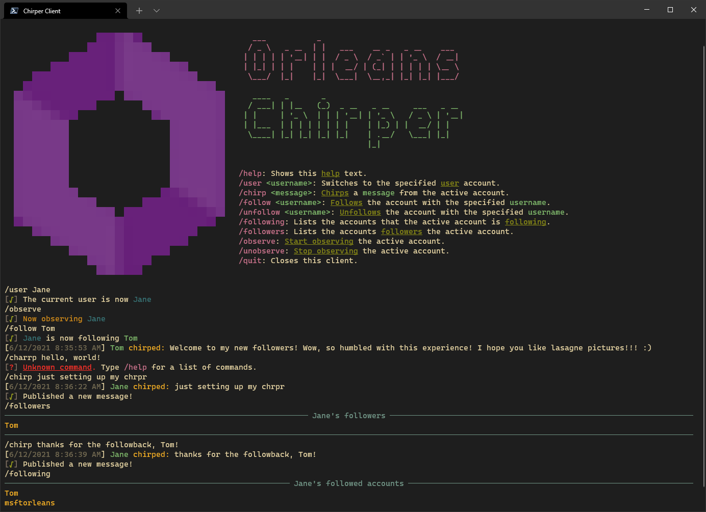
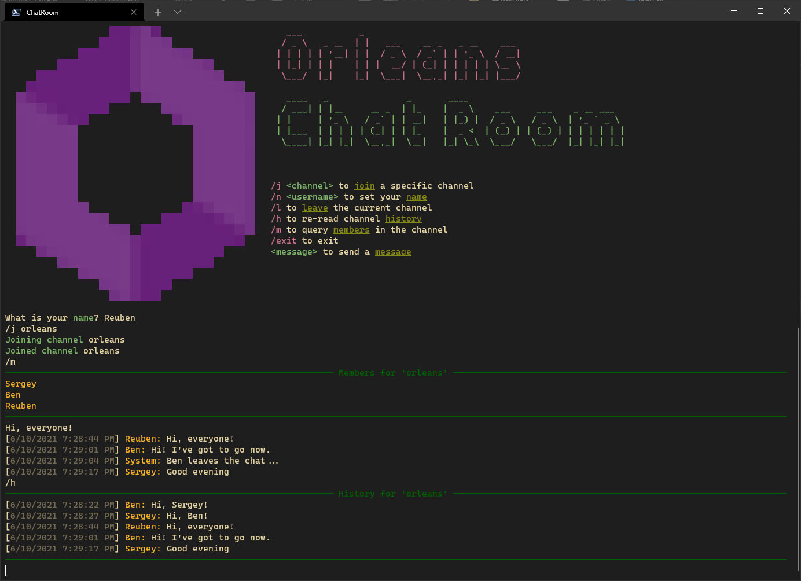

# Orleans Samples

## [Hello, World!](./HelloWorld/README.md)

    

A *Hello, World!* application which demonstrates how to create and use your first grains.

## [Stocks](./Stocks/README.md)

    

A stock price application which fetches prices from a remote service using an HTTP call and caches prices temporarily in a grain. A `BackroundService` periodically polls for updates stock prices from various `StockGrain` grains which correspond to a set of stock symbols.

## [Adventure](./Adventure/README.md)

    

A short text adventure game built using Orleans in the style of [Colossal Cave Adventure](https://en.wikipedia.org/wiki/Colossal_Cave_Adventure), [Zork](https://en.wikipedia.org/wiki/Zork), and [Microsoft Adventure](https://en.wikipedia.org/wiki/Microsoft_Adventure):

## [Presence](./Presence/README.md)

    

A gaming presence service, similar to one of the Orleans-based services built for [Halo](https://www.xbox.com/games/halo). A presence service tracks players and game sessions in near-real-time.

## [GPS Tracker](./GPSTracker/README.md)

    

A service for tracking GPS-equipped [IoT](https://en.wikipedia.org/wiki/Internet_of_Things) devices on a map. Device locations are updated in near-real-time using SignalR and hence this sample demonstrates one approach to integrating Orleans with SignalR. The device updates originate from a *device gateway*, which is implemented using a separate process which connects to the main service and simulates a number of devices moving in a pseudorandom fashion around an area of San Francisco.

## [Chirper](./Chirper/README.md)

    

A social network pub/sub system, with short text messages being sent between users.
Publishers send out short *"Chirp"* messages (not to be confused with *"Tweets"*, for a variety of legal reasons) to any other users that are following them.

## [Tic Tac Toe](./TicTacToe/README.md)

    

A Web-based [Tic-tac-toe](https://en.wikipedia.org/wiki/Tic-tac-toe) game.

## [Voting](./Voting/README.md)

    

A Web application for voting on a set of choices. This sample demonstrates deployment to Kubernetes.
The application uses [.NET Generic Host](https://docs.microsoft.com/dotnet/core/extensions/generic-host) to co-host [ASP.NET Core](https://docs.microsoft.com/aspnet/core) and Orleans as well as the [Orleans Dashboard](https://github.com/OrleansContrib/OrleansDashboard) together in the same process.

    

## [Chat Room](./ChatRoom/README.md)

    

A terminal-based chat application built using [Orleans Streaming](http://dotnet.github.io/orleans/docs/streaming/index.html).

## [Bank Account](./BankAccount/README.md)

    

Simulates bank accounts, using ACID transactions to transfer random amounts between a set of accounts.

## [Transport Layer Security](./TransportLayerSecurity/README.md)

    

Demonstrates how to configure mutual-TLS (mTLS) authentication for Orleans.

## [HanBaoBao](https://github.com/ReubenBond/hanbaobao-web)

    

An English-Mandarin dictionary Web application demonstrating deployment to Kubernetes, fan-out grain calls, and request throttling.

## [Visual Basic Hello World](./VBHelloWorld/README.md)

A *Hello, World!* application using Visual Basic.

## [F# Hello World](./FSharpHelloWorld/README.md)

A *Hello, World!* application using F#.

## Streaming: Simple

## Streaming: Custom Data Adapter