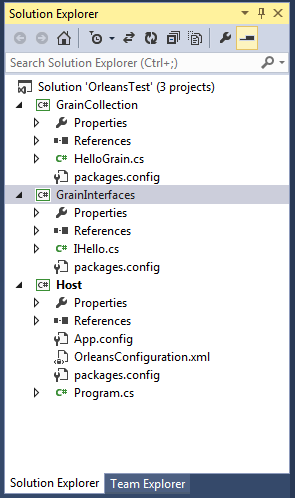

This tutorial provides step by step instructions for creating a basic functioning Orleans application. It is designed to be self-contained and minimalistic, with the following traits.


- It does not need the SDK or Extension to be installed, and relies on the Nuget packages only.  
- Tested in both Visual Studio 2013 and 2015 using Orleans 1.0.9.
- Has no reliance on SQL or Azure

Keep in mind, this is only a tutorial and lacks appropriate error handling and other goodies that would be useful for a production environment. However, it should help the reader get a real hands-on for all the different facets of Project Orleans and allow them to focus their continued learning on the parts most relevant to them.


## Project Setup


For this tutorial we’re going to need to create 3 projects.  A Library that contains the interfaces (Communication interfaces), a library that contains the implementation (Called Grains), and a simple console application that will Host our Silo.  For further understanding of this terminology please see the document Getting Started with Orleans.

The Solution will eventually look like this.  (Missing files will be added in sections below)




#### Within Visual Studio

1. Create a blank solution called OrleansTest
2. Create a New Console Application called Host
3. Create a New class library called GrainInterfaces
4. Create a New class library called GrainCollection

We use just the default project types in c#. 


#### Delete the Extras

1. Delete Class1.cs from GrainCollection
2. Delete Class1.cs from GrainInterfaces


#### Add the following References

1. GrainCollection References GrainInterfaces
2. Host References GrainInterfaces
3. Host References GrainCollection


## Adding Orleans

Orleans is available via Nuget.  The primary goodness is in Microsoft.Orleans.Core but we will be including packages that provide additional functionality.  Specifically, we will be using Template packages, which provide the autocode generation for us our Grains and Interfaces, and the Runtime which is used for hosting.

#### With Nuget

1. Add Microsoft.Orleans.Templates.Interfaces to GrainInterfaces
2. Add Microsoft.Orleans.Templates.Grains to GrainCollection
3. Add Microsoft.Orleans.OrleansRuntime to Host

## Creating our Grain Interface

In GrainInterfaces Create an interface IHello.cs


``` csharp

public interface IHello : Orleans.IGrainWithIntegerKey
{
    Task<string> SayHello(string msg);
}
```
        
## Creating our Implementation

In GrainCollection create a class  HelloGrain.cs

``` csharp

class HelloGrain : Orleans.Grain, IHello
{
    public Task<string> SayHello(string msg)
    {
        return Task.FromResult(string.Format("You said {0}, I say: Hello!", msg));
    }
}

```

## Host
The host requires the most amount of attention to get Orleans up and running.    Throughout future tutorials, much of this will change, or go away (Orleans comes with a nice precanned SiloHost and the Extension provides a template that simplifies this).  

However this small implementation should demonstrate the basics of getting started.

#### Host – App.Config

Change App.config enable the recommended server style garbage collection

``` xml
<?xml version="1.0" encoding="utf-8" ?>
<configuration>
  <runtime>
    <gcServer enabled="true"/>
  </runtime>
</configuration>

```

#### Host – OrleansConfiguration.xml
Within the Host project, add an XML file that will be used for cluster configuration called OrleansConfiguration.xml

Make sure it is set to Copy to Output directory:

``` xml
<?xml version="1.0" encoding="utf-8"?>
<OrleansConfiguration xmlns="urn:orleans">
  <Globals>
    <SeedNode Address="localhost" Port="11111" />
  </Globals>
  <Defaults>
    <Networking Address="localhost" Port="11111" />
    <ProxyingGateway Address="localhost" Port="30000" />
  </Defaults>
</OrleansConfiguration>

```

It is possible to configure this within the code, but it is fairly temperamental.


#### Host – Program.cs
Program.cs is our most length code block. We are attempting to accomplish a number of objectives

1. Initialize Orleans in its own AppDomain
2. Run a trivial example (DoSomeClientWork)
3. Wait for the user to press enter
4. Shutdown gracefully

The Orleans samples come with a very nice class called HostWrapper, which abstracts some of the boiler plate within this example.  We're going to do this by hand, but for a more robust implementation, it is worth exploring.


``` csharp
using Orleans.Runtime.Host;
using Orleans;
using System.Net;


class Program
{

    static SiloHost siloHost;

    static void Main(string[] args)
    {
        // Orleans should run in its own AppDomain, we set it up like this
        AppDomain hostDomain = AppDomain.CreateDomain("OrleansHost", null,
            new AppDomainSetup()
            {
                AppDomainInitializer = InitSilo
            });


        DoSomeClientWork();

        Console.WriteLine("Orleans Silo is running.\nPress Enter to terminate...");
        Console.ReadLine();

        // We do a clean shutdown in the other AppDomain
        hostDomain.DoCallBack(ShutdownSilo);
    }


    static void DoSomeClientWork()
    {
        // Orleans comes with a rich XML configuration but we're just going to setup a basic config
        var clientconfig = new Orleans.Runtime.Configuration.ClientConfiguration();
        clientconfig.Gateways.Add(new IPEndPoint(IPAddress.Loopback, 30000));

        GrainClient.Initialize(clientconfig);

        var friend = GrainClient.GrainFactory.GetGrain<IHello>(0);
        var result = friend.SayHello("Goodbye").Result;
        Console.WriteLine(result);

    }

    static void InitSilo(string[] args)
    {
        siloHost = new SiloHost(System.Net.Dns.GetHostName());
        // The Cluster config is quirky and weird to configure in code, so we're going to use a config file
        siloHost.ConfigFileName = "OrleansConfiguration.xml";

        siloHost.InitializeOrleansSilo();
        var startedok = siloHost.StartOrleansSilo();
        if (!startedok)
            throw new SystemException(String.Format("Failed to start Orleans silo '{0}' as a {1} node", siloHost.Name, siloHost.Type));

    }

    static void ShutdownSilo()
    {
        if (siloHost != null)
        {
            siloHost.Dispose();
            GC.SuppressFinalize(siloHost);
            siloHost = null;
        }
    }

}

```


## Running the application
At this point we should be able to run Host. A console should appear with a large amount of logging text, at the end it should look like this


Within the appropriate bin directory (Debug/Release) there will be a number of log files showing this information as well.  The amount and method of logging is configurable.


##Further Reading

List of Orleans Packages
http://dotnet.github.io/orleans/NuGets

Orleans Configuration Guide
http://dotnet.github.io/orleans/Orleans-Configuration-Guide/

Orleans Best Practices
http://research.microsoft.com/pubs/244727/Orleans%20Best%20Practices.pdf

Running in a Stand Alone Silo
http://dotnet.github.io/orleans/Step-by-step-Tutorials/Running-in-a-Stand-alone-Silo

Azure Web Sample
http://dotnet.github.io/orleans/Samples-Overview/Azure-Web-Sample

