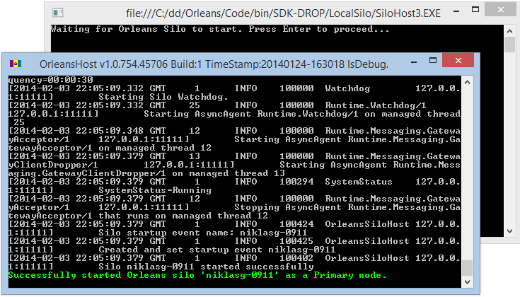
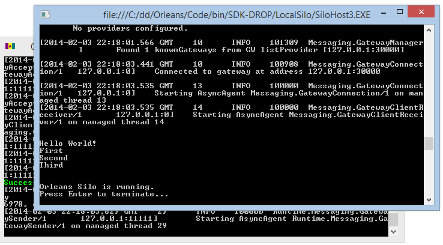
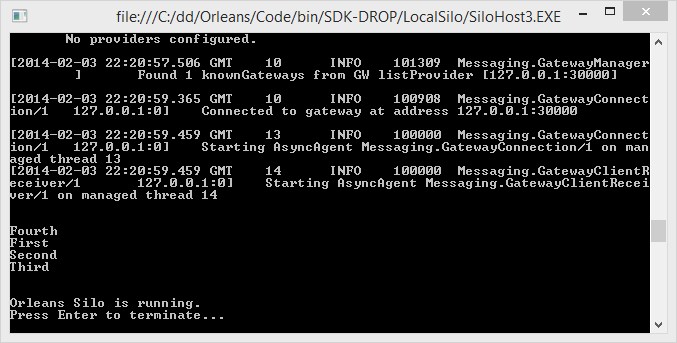




In the [first tutorial](My-First-Orleans-Application), we got a very simple "Hello World!" Orleans application running in the simplest possible environment, a dev/test host where everything is running in one process, which makes starting and stopping it really easy. 
For most of your initial development of grain-based applications and services, that environment will be ideal.

However, one thing that is hard to test in such an environment is what happens when the client and server do not get started and stopped at the same time. 
Often, state is maintained on the server across client sessions, something that is hard to model using the single-process setup.

Therefore, what we're going to do now is modify the solution we finished up with in the first tutorial and make it just a bit more like a production environment, running the server and client code in different processes.

## Getting Started

The first thing we need to do is get the grain code running in a silo that is in a separate process and prevent it from being started by the code in _Program.cs_.

To do the latter, remove the code that starts the silo in its own app domain, as well as the code that shuts it down at the end.

One consequence of not running the silo from the same process is that the client code has to wait for the silo to be ready to accept incoming requests. 
Rather than adding some clever backoff-retry code, here we simply expect you to wait for the silo to start, then hit 'Enter' in the client console window when the silo is advertising its readiness.

 This is the result:

``` csharp
static void Main(string[] args)
{
    Console.WriteLine("Waiting for Orleans Silo to start. Press Enter to proceed...");
    Console.ReadLine();

    Orleans.GrainClient.Initialize("ClientConfiguration.xml");
}
```

Now you should add reference to Microsoft.Orleans.Server NuGet package to your collection project and then in its project properties in Debug tab set the bin/Debug/OrleansHost.exe or bin/Release/OrleansHost.exe file as startup program for your collections class library. You also need to change the client gateway port in the OrleansConfiguration.xml file added to the collection project by Microsoft.Orleans.Server to match the gateway port specified in DevTestClientConfiguration.xml. Open OrleansConfiguration.xml, find the `ProxyingGateway` element inside its Defaults section, and change it to.

```xml
<ProxyingGateway Address="localhost" Port="30000" />
```

OrleansHost.exe is a ready-made host executable intended for running Orleans silo code. It is also useful for development purposes. If you set both the grain collection project and the the host project as startup projects, you will see two windows come up:




This allows us to debug the grains in their own process, while keeping the client code in its own process. 
If you let the client make its request, then terminate it using 'Enter' when asked, you should see only the client process windows disappear. 
The debugging session won't end, because the grains are still being debugged in the _OrleansHost.exe_ process. 
To start the client again, you will have to use the right-button context menu in the Solution Explorer to get it started.

## Keeping Things Around

To demonstrate keeping state around across client sessions, let's modify the `SayHello()` method to take a string argument. 
Then, we will have our grain save each string it is sent and return the last one. 
Only at the first greeting will we see something we didn't send to the grain from the client.

``` csharp
private string text = "Hello World!";

public Task<string> SayHello(string greeting)
{
    var oldText = text;
    text = greeting;
    return Task.FromResult(oldText);
}
```


 We also change the client to send a greeting several times:

``` csharp
var hello = GrainClient.GrainFactory.GetGrain<IGrain1>(0);
Console.WriteLine(hello.SayHello("First").Result);
Console.WriteLine(hello.SayHello("Second").Result);
Console.WriteLine(hello.SayHello("Third").Result);
Console.WriteLine(hello.SayHello("Fourth").Result);
```

What we would expect to see here is four greetings, the first of which is "Hello World!". 
Let's check it out:



Terminate the client (make sure it's just the client, we need the grain host to stay up) and restart it using the context menu. 
There's no reason to wait for the silo now, since it's already running. 
Here's what we get:



Still four greetings, but instead of "Hello World!" the first greeting is the last one from our previous client session. 
In other words, the grain in the silo kept some state around for us.

## Next

So far, we've only seen one single grain type and a single instance of that type. 
It has served to keep things simple for the purpose of explaining how the environment works, but it is not typical of Orleans code. 
In the next tutorial, we will see something more realistic.

[Actor Identity](Actor-Identity)

