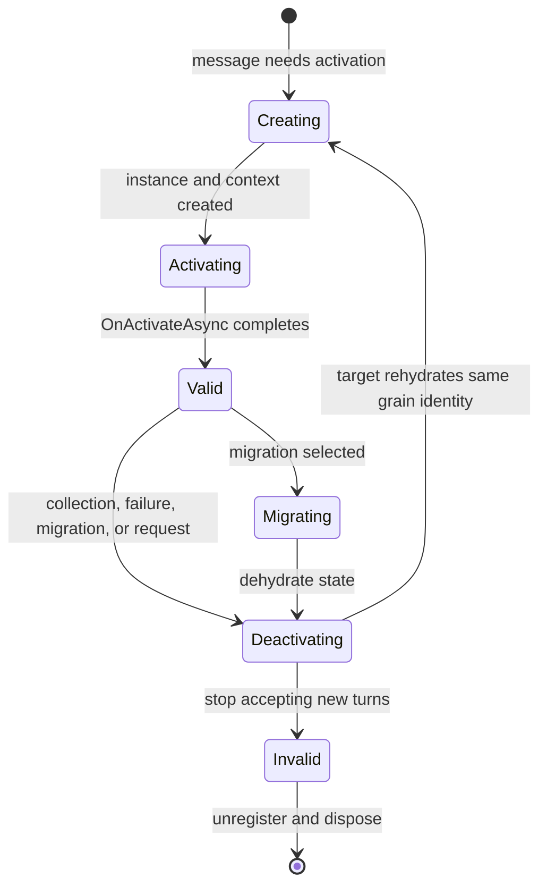
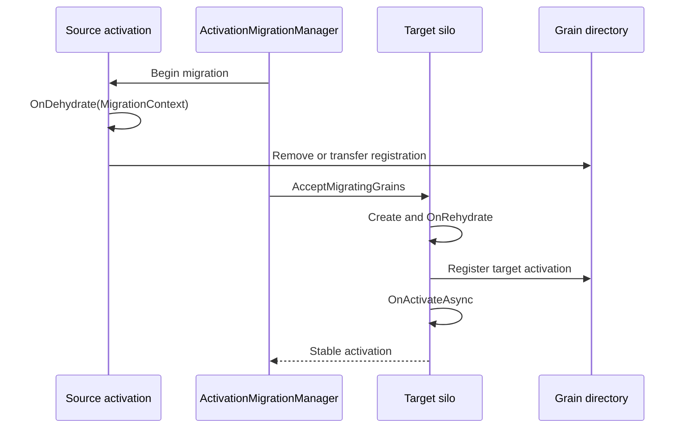

# Activation lifecycle and migration

A grain identity can outlive every process in the cluster. An activation is the temporary, in-memory realization of that identity on one silo. `ActivationData` is the runtime state machine which owns the grain instance, request queues, scheduler, directory registration, lifecycle, and deactivation reason.

## Creation and activation

When routing cannot find a valid activation, the target silo's `Catalog.GetOrCreateActivation` creates or obtains an `ActivationData`. Creation has several distinct steps:

1. Resolve the grain type, implementation, shared type metadata, storage facet, and activation configurators.
1. Create the grain context, per-activation `WorkItemGroup`, and grain instance.
1. Register the local activation and, when required by the grain directory policy, register its address.
1. Notify `IActivationLifecycleObserver.OnCreateActivation`.
1. Run grain lifecycle start and <xref:Orleans.IGrainBase.OnActivateAsync*> on the activation scheduler.
1. Mark the activation valid and release queued requests for turn scheduling.

Activation is asynchronous. Requests which arrive while it is in progress remain queued. If activation fails, the runtime rejects or reroutes requests and tears down the incomplete activation rather than exposing a partially initialized instance.

Source: [`Catalog`](https://github.com/dotnet/orleans/blob/main/src/Orleans.Runtime/Catalog/Catalog.cs) and [`ActivationData`](https://github.com/dotnet/orleans/blob/main/src/Orleans.Runtime/Catalog/ActivationData.cs).

## Working set and collection

`ActivationWorkingSet` tracks activations which recently performed work. `ActivationCollector` schedules collection tickets in time buckets and scans stale buckets. The important invariant is that an activation selected for collection must still be idle when collection begins. New work can cancel or reschedule its ticket.

Collection is not persistence. It releases an idle activation. Durable grain state survives only through a configured storage provider and grain code which writes that state. Operational collection settings belong in [activation collection configuration](../host/configuration-guide/activation-collection.md).

The implementation and its edge cases are covered by [`ActivationCollector`](https://github.com/dotnet/orleans/blob/main/src/Orleans.Runtime/Catalog/ActivationCollector.cs) and [`ActivationCollectorTests`](https://github.com/dotnet/orleans/blob/main/test/Orleans.Runtime.Internal.Tests/ActivationsLifeCycleTests/ActivationCollectorTests.cs).

## Deactivation

Deactivation first prevents new application turns from starting, then drains or rejects pending work according to the reason. It runs <xref:Orleans.IGrainBase.OnDeactivateAsync*> and lifecycle stop on the activation scheduler. Finally, the runtime unregisters the directory address, removes the local activation, disposes resources, and publishes deactivation events.

A deactivation reason distinguishes normal collection, application-requested deactivation, silo shutdown, failure, and migration. Grain code should treat deactivation as best-effort cleanup. Process termination can bypass it, so correctness must not depend on `OnDeactivateAsync` always running.

## Activation migration

Migration moves an activation while preserving its grain identity. `ActivationMigrationManager` starts migration by creating a `MigrationContext`, asking registered migration participants to dehydrate state, and deactivating with the `Migrating` reason. The target creates the activation, rehydrates participants, runs activation, and waits until the activation reaches a stable state.

Migration state is not the same as persisted grain state. <xref:Orleans.Runtime.IGrainMigrationParticipant> is intended for runtime or application components whose in-memory state must accompany a live move. Participants write versionable data to the migration context and must tolerate rehydration on another silo.

Source: [`ActivationMigrationManager`](https://github.com/dotnet/orleans/blob/main/src/Orleans.Runtime/Catalog/ActivationMigrationManager.cs) and [`ActivationDataMigrationTests`](https://github.com/dotnet/orleans/blob/main/test/Orleans.Runtime.Internal.Tests/ActivationsLifeCycleTests/ActivationDataMigrationTests.cs).

## What initiates movement

Migration is a mechanism, not a policy. Policies choose candidates:

- explicit migration APIs can request a move;
- the experimental activation rebalancer moves random activations to reduce resource imbalance;
- the experimental activation repartitioner observes communication edges and moves activations to improve locality.

Both cluster-wide policies are opt-in. See [placement and activation balancing](load-balancing.md) for their protocols and experimental warning identifiers.

## Extension invariants

Components participating in activation creation or migration should preserve these rules:

- never expose a grain instance before activation completes;
- execute grain lifecycle callbacks in the activation scheduling context;
- do not accept new turns after deactivation begins;
- unregister stale addresses even when cleanup fails;
- keep migration payloads backward-compatible across rolling upgrades; and
- assume source or target failure can interrupt migration.

