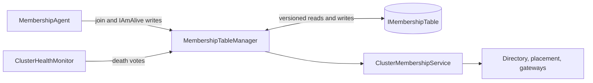
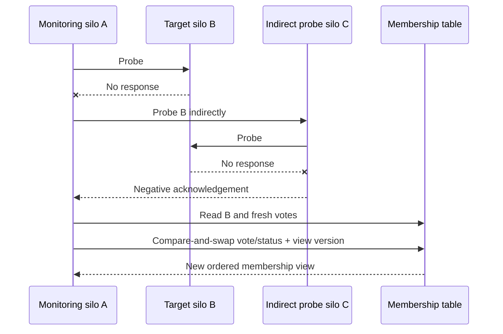

# Cluster membership protocol

Cluster membership answers one question for the rest of the runtime: which silo identities are members of the current view, and what is each member's status? Orleans combines a durable <xref:Orleans.IMembershipTable> with direct peer probes. The table provides coordination and ordered views; probes measure the communication path that Orleans actually uses.

## Identity, status, and views

A silo identity includes its advertised endpoint and a generation value, so a restarted process at the same endpoint is a new identity. Its <xref:Orleans.Runtime.SiloStatus> progresses through `Created`, `Joining`, `Active`, and a terminating status (`ShuttingDown`, `Stopping`, or `Dead`).

Each successful versioned membership-table mutation, such as inserting a row or changing a status, advances the table version. Periodic <xref:Orleans.IMembershipTable.UpdateIAmAlive*> writes leave the version unchanged. `MembershipTableManager` publishes immutable snapshots through `ClusterMembershipService`; consumers ignore older versions. Directory ownership, gateway discovery, and failure recovery therefore observe a monotonically ordered sequence of views even if notifications arrive out of order.

## Consume membership views

Resolve <xref:Orleans.Runtime.IClusterMembershipService> from dependency injection when a silo-hosted service or runtime component needs the cluster view. <xref:Orleans.Runtime.IClusterMembershipService.CurrentSnapshot> returns the current local, immutable <xref:Orleans.Runtime.ClusterMembershipSnapshot> without waiting for storage access.

<xref:Orleans.Runtime.IClusterMembershipService.MembershipUpdates> is an asynchronous sequence which first yields the current local snapshot and then yields snapshots with strictly increasing <xref:Orleans.Runtime.ClusterMembershipSnapshot.Version> values. Consumers can retain and process each snapshot as a complete membership view.

Compare the snapshot version with the required <xref:Orleans.Runtime.MembershipVersion>. When the local view must reach a minimum version, await <xref:Orleans.Runtime.IClusterMembershipService.Refresh*> with that version; it completes after the local snapshot catches up. The [BasicClustering sample](https://github.com/dotnet/orleans/tree/main/samples/BasicClustering) demonstrates a hosted service which consumes membership updates.

## Joining

A starting silo writes its row, becomes `Joining`, and validates two-way connectivity with active members before becoming `Active`. This prevents a partitioned process from silently joining one side of a cluster.

The periodic `IAmAlive` value is not the peer heartbeat. It is a timestamp written to the membership row for diagnostics and startup disaster recovery. A sufficiently stale active row can be ignored during the joining connectivity check, allowing a cluster to recover after all processes were lost without cleanly declaring each other dead.

## Failure detection and death votes 

Active silos monitor peers selected from the membership view. `ClusterHealthMonitor` sends probes over silo-to-silo messaging, tracks consecutive failures, and can use indirect probes to distinguish a failed target from an unhealthy observer. A failed monitor writes a timestamped vote into the target's membership row.

Each observer maintains a [Phi Accrual failure detector](https://paperhub.s3.amazonaws.com/f516fdfa940caa08c679d3946b273128.pdf) for each peer. The detector models successful direct-probe round-trip times and estimates the timeout at which the probability of a later response is sufficiently low. The timeout starts at <xref:Orleans.Configuration.ClusterMembershipOptions.ProbeTimeout?displayProperty=nameWithType> and adapts after enough observations. Failures are excluded because they only show that the response exceeded the current timeout, while indirect results are excluded because they measure a different observer's network path.

The learned timeout also determines probe cadence. Each probe is scheduled relative to the previous probe's start, so a quick response waits for the remainder of the current timeout while a probe which consumes its timeout is followed immediately by the next attempt. Local-health and indirect-hop extensions are applied to the learned timeout before it is clamped between <xref:Orleans.Configuration.ClusterMembershipOptions.MinProbeTimeout?displayProperty=nameWithType> and <xref:Orleans.Configuration.ClusterMembershipOptions.MaxProbeTimeout?displayProperty=nameWithType>. Debugger-specific extensions are applied after the clamp so a paused process is not accused because of the configured production bound.

Declaring a member dead requires enough unexpired votes from distinct observers. The read-modify-write is protected by the membership table's version or ETag. A conflicting update causes the writer to reread and reevaluate; it must not overwrite a newer view.

Once a row is `Dead`, that identity never returns to `Active`. If the process was only partitioned, it terminates when it learns that the cluster declared it dead. Its host can restart it with a new generation.

## Default settings 

The defaults are defined by <xref:Orleans.Configuration.ClusterMembershipOptions>:

| Option | Default | Protocol role |
| --- | ---: | --- |
| <xref:Orleans.Configuration.ClusterMembershipOptions.NumProbedSilos?displayProperty=nameWithType> | 10 | Number of peers monitored by each silo |
| <xref:Orleans.Configuration.ClusterMembershipOptions.ProbeTimeout?displayProperty=nameWithType> | 5 seconds | Initial timeout and probe period before the peer has supplied enough evidence |
| <xref:Orleans.Configuration.ClusterMembershipOptions.MinProbeTimeout?displayProperty=nameWithType> | Half the initial timeout (2.5 seconds by default) | Lower bound for an effective probe timeout |
| <xref:Orleans.Configuration.ClusterMembershipOptions.MaxProbeTimeout?displayProperty=nameWithType> | Four times the initial timeout (20 seconds by default) | Upper bound for an effective probe timeout |
| <xref:Orleans.Configuration.ClusterMembershipOptions.NumMissedProbesLimit?displayProperty=nameWithType> | 3 | Failed probes before a death vote |
| <xref:Orleans.Configuration.ClusterMembershipOptions.NumVotesForDeathDeclaration?displayProperty=nameWithType> | 2 | Fresh votes required to mark a member dead |
| <xref:Orleans.Configuration.ClusterMembershipOptions.DeathVoteExpirationTimeout?displayProperty=nameWithType> | 2 minutes | Lifetime of a death vote |
| <xref:Orleans.Configuration.ClusterMembershipOptions.TableRefreshTimeout?displayProperty=nameWithType> | 1 minute | Fallback membership-table refresh period |
| <xref:Orleans.Configuration.ClusterMembershipOptions.IAmAliveTablePublishTimeout?displayProperty=nameWithType> | 30 seconds | Membership-row liveness timestamp period |

These values are protocol parameters, not independent timers: indirect probing, local health, scheduling delays, and table contention all affect observed detection time. Following [Lifeguard's local-health awareness principle](https://arxiv.org/abs/1707.00788), the runtime increases probe tolerance when `LocalSiloHealthMonitor` detects thread-pool delay, timer delay, or other local distress, reducing false accusations from an unhealthy observer.

## Membership-table contract 

An <xref:Orleans.IMembershipTable> implementation is more than a list of endpoints. It must support:

- insertion of a new silo row;
- optimistic, conditional update of a silo row;
- atomic advancement of the table version with a row mutation;
- reads which return rows and the corresponding version;
- periodic `IAmAlive` updates; and
- durable availability appropriate for cluster coordination.

Table unavailability favors safety over liveness. Existing silos can continue processing calls, but they cannot durably admit a member or declare a failed member dead. A provider must not synthesize successful updates when its backing store is unavailable.

Official providers adapt transactions, ETags, lightweight transactions, or compare-and-swap primitives to this contract. Provider selection and operational setup belong in the [deployment documentation](../deployment/index.md); the extension architecture is covered by [provider authoring](provider-authoring.md).

## Protocol consumers

Membership is deliberately separate from the services which consume it:

- `LocalGrainDirectory` adjusts consistent-hash ownership after view changes.
- the distributed directory runs an explicit range-transfer protocol.
- placement removes unavailable or overloaded candidates.
- clients refresh the gateway list.
- persistent-stream queue balancers redistribute queue responsibility.
- activation balancing protocols stop exchanging work with failed members.

This separation lets those services add stronger invariants without expanding the membership-table transaction.

## Source and tests

- [`IClusterMembershipService`](https://github.com/dotnet/orleans/blob/main/src/Orleans.Runtime/MembershipService/IClusterMembershipService.cs) exposes local snapshots, ordered updates, and minimum-version refresh.
- [`MembershipAgent`](https://github.com/dotnet/orleans/blob/main/src/Orleans.Runtime/MembershipService/MembershipAgent.cs) drives joining and active-state transitions.
- [`MembershipTableManager`](https://github.com/dotnet/orleans/blob/main/src/Orleans.Runtime/MembershipService/MembershipTableManager.cs) coordinates table updates and death declarations.
- [`ClusterHealthMonitor`](https://github.com/dotnet/orleans/blob/main/src/Orleans.Runtime/MembershipService/ClusterHealthMonitor.cs) owns peer monitoring.
- [`ClusterMembershipSnapshotTests`](https://github.com/dotnet/orleans/blob/main/test/Orleans.Runtime.Internal.Tests/ClusterMembershipSnapshotTests.cs) cover snapshot version and membership-change semantics.
- [`MembershipAgentTests`](https://github.com/dotnet/orleans/blob/main/test/Orleans.Core.Tests/Membership/MembershipAgentTests.cs) exercise startup connectivity.
- [`MembershipTableManagerTests`](https://github.com/dotnet/orleans/blob/main/test/Orleans.Core.Tests/Membership/MembershipTableManagerTests.cs) cover vote expiry and status changes.
