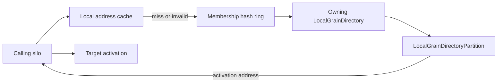
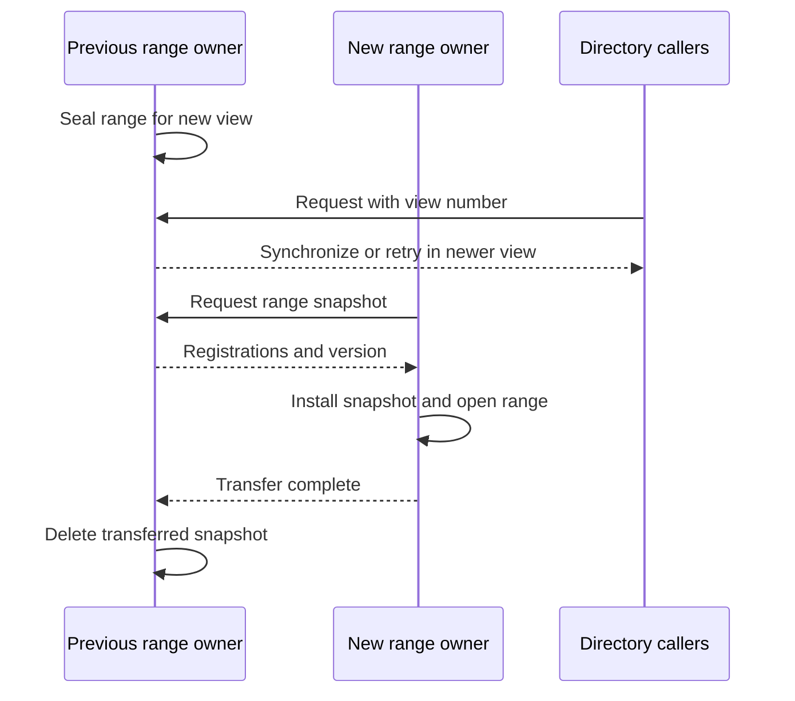

# Grain directory architecture

The grain directory maps a grain identity to an activation address. It is on the critical path when a caller has no usable cached address and when the runtime creates, moves, or removes an activation. Placement chooses a silo; the directory coordinates which activation address is authoritative.

Orleans uses `LocalGrainDirectory` by default. Configure `DistributedGrainDirectory` for versioned range ownership and coordinated membership-view transitions.

## Default: `LocalGrainDirectory` 

`LocalGrainDirectory` partitions registrations over the membership ring. Hashing a grain identity selects the silo whose local `LocalGrainDirectoryPartition` is authoritative for that key. This follows the broad consistent-hashing distributed-hash-table model described by [Chord](https://pdos.csail.mit.edu/papers/chord:sigcomm01/chord_sigcomm.pdf), adapted to Orleans membership and activation semantics. Each silo also keeps non-authoritative cache entries to avoid repeated remote lookups.

The default directory preserves these invariants:

- a directory key is derived from the grain identity, not its current location;
- the membership view determines the authoritative owner;
- local cache entries are hints and can be invalidated;
- registration detects competing single-activation addresses;
- a failed or deactivated silo's addresses are removed or rejected; and
- partition ownership transfers as the membership ring changes.

Message forwarding and invalidation repair stale caches. Forwarding is bounded and is not an application-level retry policy.

Source: [`LocalGrainDirectory`](https://github.com/dotnet/orleans/blob/main/src/Orleans.Runtime/GrainDirectory/LocalGrainDirectory.cs) and [`LocalGrainDirectoryPartition`](https://github.com/dotnet/orleans/blob/main/src/Orleans.Runtime/GrainDirectory/LocalGrainDirectoryPartition.cs).

## Directory selection

The runtime resolves a directory per grain type. The unnamed default resolves to `LocalGrainDirectory` unless the silo has explicitly replaced it. A named implementation of <xref:Orleans.GrainDirectory.IGrainDirectory> can be registered and selected using grain-type metadata.

Custom directories own their consistency, availability, and cleanup behavior. They should define what concurrent registration means, how failed silos are removed, and whether stale reads are possible. The surrounding message router cannot turn an eventually consistent custom directory into a strongly consistent one.

## `DistributedGrainDirectory` 

<xref:Orleans.Hosting.CoreHostingExtensions.AddDistributedGrainDirectory*?displayProperty=nameWithType> configures a view-synchronous directory with versioned range ownership and coordinated membership-view transitions.

The implementation divides the hash ring into configurable ranges, analogous to the virtual-node partitioning described by [Dynamo](https://www.allthingsdistributed.com/files/amazon-dynamo-sosp2007.pdf). <xref:Orleans.Configuration.GrainDirectoryOptions.PartitionsPerSilo?displayProperty=nameWithType> defaults to **1**, not 30. A partition normally serves requests locally. During a membership view change, old and new owners coordinate range locks, snapshots, and ownership transfer. The design applies the [virtually synchronous methodology for dynamic service replication](https://www.microsoft.com/en-us/research/publication/virtually-synchronous-methodology-for-dynamic-service-replication/) and has similarities to [Vertical Paxos and primary-backup replication](https://www.microsoft.com/en-us/research/publication/vertical-paxos-and-primary-backup-replication/).

Requests and responses carry view information. A range cannot serve a request under an incompatible ownership view. If an orderly transfer is impossible, the new owner recovers registrations by querying active silos rather than assuming the failed owner's state.

API: <xref:Orleans.Hosting.CoreHostingExtensions.AddDistributedGrainDirectory*?displayProperty=nameWithType> and <xref:Orleans.Configuration.GrainDirectoryOptions>. Implementation: [hosting registration](https://github.com/dotnet/orleans/blob/main/src/Orleans.Runtime/Hosting/CoreHostingExtensions.cs) and [`DistributedGrainDirectory`](https://github.com/dotnet/orleans/blob/main/src/Orleans.Runtime/GrainDirectory/DistributedGrainDirectory.cs).

## Tradeoffs

| Property | Default `LocalGrainDirectory` | `DistributedGrainDirectory` |
| --- | --- | --- |
| Selection | Runtime default | Configured with <xref:Orleans.Hosting.CoreHostingExtensions.AddDistributedGrainDirectory*?displayProperty=nameWithType> |
| Ownership | Membership consistent-hash ring | Versioned ranges over membership views |
| Normal lookup | Owner partition plus per-silo cache | Owner partition plus view coordination |
| View change | Partition split/merge and cache repair | Sealed ranges and snapshot transfer |
| Recovery emphasis | Duplicate detection and invalidation | Explicit range recovery |
| Configuration | Existing default behavior | <xref:Orleans.Configuration.GrainDirectoryOptions.PartitionsPerSilo?displayProperty=nameWithType>, default 1 |

More partitions can improve ownership granularity but increase transfer and coordination work. Production rollouts should include compatibility, failure, and load testing.
