# Orleans runtime architecture

The implementation track explains how Orleans realizes the virtual actor model for runtime contributors, provider authors, and operators who reason about failure, consistency, scheduling, and extensibility. The conceptual and task-oriented sections provide application programming guidance.

The pages in this track use Orleans source and tests as the specification. Internal type names let readers follow an operation through the repository. Public APIs and explicitly identified extension points carry compatibility contracts.

## A runtime map

An application call enters through generated proxy code, becomes a `Message`, and is routed by the grain directory and placement services. `MessageCenter` delivers it locally or through a `Connection` managed by `ConnectionManager`. The target `Catalog` resolves an activation, where `ActivationData` admits the request and `WorkItemGroup` executes one synchronous turn at a time. Responses travel back through the same messaging and callback pipeline.

The runtime is intentionally layered:

```mermaid
flowchart LR
    Proxy[Generated proxy and invokable] --> Factory[MessageFactory]
    Factory --> Center[MessageCenter]
    Center --> Directory[Grain directory and placement]
    Center --> Network[ConnectionManager and transport]
    Directory --> Activation[Catalog and ActivationData]
    Activation --> Admission[Request admission]
    Admission --> Scheduler[WorkItemGroup]
    Scheduler --> Grain[Grain turn]
    Grain --> Serialization[Generated codecs and wire format]
    Serialization --> Network
```

Use this runtime map and the following topic list to choose the required depth. The [runtime architecture](runtime-architecture.md) page follows the normal call path; the messaging, serialization, reminder, transaction, and version-skew pages explain the boundaries where failure, persistence, and rolling upgrades change the guarantees.

## Runtime core

- [Runtime architecture](runtime-architecture.md) follows a call through client, messaging, placement, directory, activation, and scheduling components.
- [Activation lifecycle and migration](activation-lifecycle.md) explains creation, activation, collection, deactivation, and state transfer.
- [Cluster membership](cluster-management.md) describes the failure detector, membership table, ordered views, and death-vote protocol.
- [Runtime state dissemination](runtime-dissemination.md) explains deterministic broadcast, acknowledged peer state, bounded repair, mixed-version behavior, and integration boundaries.
- [Grain directory](grain-directory.md) distinguishes the default `LocalGrainDirectory` DHT from the experimental distributed directory.
- [Scheduling and turn execution](scheduler.md) explains `WorkItemGroup`, continuations, interleaving, and single-threaded execution.
- [Messaging and delivery semantics](messaging-delivery-guarantees.md) traces requests and explains why a timeout has an unknown outcome.
- [Transport and networking internals](messaging-networking.md) explains connection establishment, framing, backpressure, and shutdown behavior.
- [Placement and activation balancing](load-balancing.md) covers the default resource-optimized policy and the opt-in movement protocols.

## Runtime services and extensibility

- [Lifecycle implementation](orleans-lifecycle.md) describes ordered startup and shutdown.
- [Serialization and code generation](serialization.md) covers generated codecs, proxies, manifests, wire identity, and custom components.
- [Reminders](reminders.md) explains ring ownership, durable reminder rows, refresh, and tick delivery.
- [Transactions](transactions.md) explains transaction agents, managers, participant queues, and recovery decisions.
- [Rolling version skew](rolling-version-skew.md) connects interface version manifests, compatibility directors, selectors, and wire compatibility during mixed-version operation.
- [Persistent streams](streams-implementation/index.md) explains pulling agents, queue ownership, caches, cursors, pub-sub, and recovery.
- [Provider authoring](provider-authoring.md) describes named providers, configuration binding, lifecycle participation, and validation.
- [TestingHost architecture](testing.md) explains the in-process cluster harness and its substitutions for production services.

## Defaults that shape the architecture

| Concern | Default |
| --- | --- |
| Placement | <xref:Orleans.Runtime.ResourceOptimizedPlacement> |
| Grain directory | `LocalGrainDirectory`, using the membership ring |
| Experimental directory | Opt-in with <xref:Orleans.Hosting.CoreHostingExtensions.AddDistributedGrainDirectory*?displayProperty=nameWithType>; warning `ORLEANSEXP003` |
| Experimental directory partitions | <xref:Orleans.Configuration.GrainDirectoryOptions.PartitionsPerSilo?displayProperty=nameWithType> defaults to 1 |
| Membership probe timeout | 5 seconds |
| Death-vote expiry | 2 minutes |
| <xref:Orleans.Configuration.MessagingOptions.ResponseTimeout?displayProperty=nameWithType> | 30 seconds, or 30 minutes while a debugger is attached |
| Automatic call retry after response timeout | None |

Configuration values affect failure detection and resource use. This track explains their role in protocols, while the [hosting configuration guide](../host/configuration-guide/index.md) and [deployment guidance](../deployment/index.md) own operational recommendations.

For the application mental model, start with [Orleans overview](../overview.md). For task-oriented recipes that apply these components, use the [how-to guide index](../how-to/index.md); for public type contracts, use the [C# API reference](https://dotnet.github.io/orleans/docs/api/csharp/).
