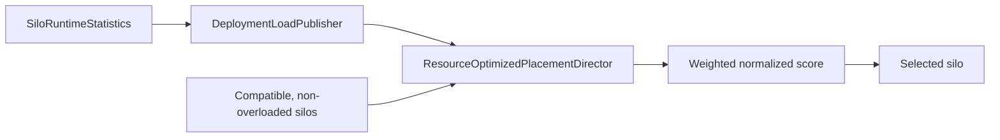

# Placement and activation balancing

Placement chooses a silo when Orleans needs a new activation. Balancing can later move existing activations. Those are separate decisions with different information and costs.

The default placement strategy is <xref:Orleans.Runtime.ResourceOptimizedPlacement>, not random placement.

For the application and operational view of scale-out, scale-in, persistence, and configuration, see [Grain placement and migration](../grains/grain-placement.md).

## Resource-optimized placement

`ResourceOptimizedPlacementDirector` receives cluster-wide <xref:Orleans.Runtime.SiloRuntimeStatistics> from `DeploymentLoadPublisher`. It excludes incompatible and overloaded silos, applies a [power-of-multiple-choices load-balancing strategy](https://www.eecs.harvard.edu/~michaelm/postscripts/handbook2001.pdf) by sampling approximately the square root of the available candidates, normalizes their signals, adds jitter to avoid deterministic herding, and selects the lowest utilization score.

The default relative weights are:

| Signal | Weight |
| --- | ---: |
| <xref:Orleans.Configuration.ResourceOptimizedPlacementOptions.CpuUsageWeight?displayProperty=nameWithType> | 40 |
| <xref:Orleans.Configuration.ResourceOptimizedPlacementOptions.MemoryUsageWeight?displayProperty=nameWithType> | 20 |
| <xref:Orleans.Configuration.ResourceOptimizedPlacementOptions.AvailableMemoryWeight?displayProperty=nameWithType> | 20 |
| <xref:Orleans.Configuration.ResourceOptimizedPlacementOptions.MaxAvailableMemoryWeight?displayProperty=nameWithType> | 5 |
| <xref:Orleans.Configuration.ResourceOptimizedPlacementOptions.ActivationCountWeight?displayProperty=nameWithType> | 15 |

<xref:Orleans.Configuration.ResourceOptimizedPlacementOptions.LocalSiloPreferenceMargin?displayProperty=nameWithType> defaults to 5. If the local silo's score is within that margin of the best candidate, placement can preserve locality. If statistics are not yet available, the director falls back to a random compatible silo.

Public options: <xref:Orleans.Configuration.ResourceOptimizedPlacementOptions>. Implementation: [`ResourceOptimizedPlacementDirector`](https://github.com/dotnet/orleans/blob/main/src/Orleans.Runtime/Placement/ResourceOptimizedPlacementDirector.cs) and the default registration in [`DefaultSiloServices`](https://github.com/dotnet/orleans/blob/main/src/Orleans.Runtime/Hosting/DefaultSiloServices.cs).

The `IsOverloaded` statistic is set only when <xref:Orleans.Configuration.LoadSheddingOptions.LoadSheddingEnabled> is enabled and either its CPU or memory threshold is exceeded. With load shedding disabled, resource-optimized placement still scores the resource measurements but doesn't categorically remove a candidate as overloaded. Load shedding is admission protection, not activation movement.

## Placement resolution and extension

<xref:Orleans.Runtime.Placement.PlacementStrategyResolver> selects a grain-specific strategy when one is declared; otherwise it uses the default. `PlacementService` applies placement filters before calling the strategy's keyed <xref:Orleans.Runtime.Placement.IPlacementDirector>.

A custom strategy consists of:

1. an <xref:Orleans.Runtime.PlacementStrategy> value associated with the grain type;
1. an <xref:Orleans.Runtime.Placement.IPlacementDirector> which chooses from compatible silos; and
1. registration through <xref:Orleans.Hosting.PlacementStrategyExtensions.AddPlacementDirector*?displayProperty=nameWithType>.

Placement filters are orthogonal constraints. They can remove candidates based on metadata or another policy before the director scores them. A director should use the candidates supplied by the placement context instead of reconstructing cluster membership.

API: <xref:Orleans.Runtime.Placement.PlacementStrategyResolver> and <xref:Orleans.Hosting.PlacementStrategyExtensions.AddPlacementDirector*?displayProperty=nameWithType>. Implementation: [`PlacementService`](https://github.com/dotnet/orleans/blob/main/src/Orleans.Runtime/Placement/PlacementService.cs), [strategy resolution](https://github.com/dotnet/orleans/blob/main/src/Orleans.Runtime/Placement/PlacementStrategyResolver.cs), and [registration extensions](https://github.com/dotnet/orleans/blob/main/src/Orleans.Runtime/Hosting/PlacementStrategyExtensions.cs).

## Why initial placement is not enough

Resource-optimized placement only affects new activations. Long-lived activations can become unbalanced after:

- a silo joins or leaves;
- traffic changes while the activation remains alive;
- activation memory use diverges;
- a placement constraint changes the candidate set; or
- communicating grains are spread across silos.

Moving an activation has a cost: dehydrate and rehydrate work, directory updates, cold caches, and a temporary interruption. Orleans therefore exposes opt-in protocols rather than continuously moving every activation.

Membership changes don't invoke placement again for activations which remain valid. A joining silo receives activations through later creation or opt-in migration. During graceful shutdown, ordinary activations on the departing silo are deactivated rather than bulk-migrated; later calls create replacements on remaining compatible silos.

## Experimental activation rebalancer

<xref:Orleans.Hosting.ActivationRebalancerExtensions.AddActivationRebalancer*?displayProperty=nameWithType> enables the resource rebalancer and produces compiler warning **`ORLEANSEXP002`**. A worker observes cluster statistics in sessions, estimates imbalance using entropy, and asks source silos to migrate random activations toward underloaded silos. A monitor can wake or relocate the worker after failure.

The protocol optimizes distribution of activation count and memory use. It does not inspect the communication graph, so a more balanced cluster can still have cross-silo hot paths.

Public options: <xref:Orleans.Configuration.ActivationRebalancerOptions>. Implementation: [`ActivationRebalancerWorker`](https://github.com/dotnet/orleans/blob/main/src/Orleans.Runtime/Placement/Rebalancing/ActivationRebalancerWorker.cs).

## Experimental activation repartitioner

<xref:Orleans.Hosting.ActivationRepartitioningExtensions.AddActivationRepartitioner*?displayProperty=nameWithType> enables communication-aware repartitioning and produces compiler warning **`ORLEANSEXP001`**. The repartitioner samples fully addressed request messages and constructs a weighted graph:

- vertices represent migratable activations;
- edge weights represent observed calls;
- anchored or non-migratable grains constrain possible moves.

Periodically, peer repartitioners exchange graph information and negotiate activation moves which improve locality while respecting an imbalance-tolerance rule. The default `RebalancerCompatibleRule` can incorporate the resource rebalancer's cluster-imbalance report.

Public options: <xref:Orleans.Configuration.ActivationRepartitionerOptions>. Implementation: [`ActivationRepartitioner`](https://github.com/dotnet/orleans/blob/main/src/Orleans.Runtime/Placement/Repartitioning/ActivationRepartitioner.cs) and [`RepartitionerMessageFilter`](https://github.com/dotnet/orleans/blob/main/src/Orleans.Runtime/Placement/Repartitioning/RepartitionerMessageFilter.cs).

## Choosing the mechanism

| Mechanism | When it acts | Primary signal | Movement |
| --- | --- | --- | --- |
| Resource-optimized placement | Activation creation | CPU, memory, capacity, activation count | None |
| Activation rebalancer | Opt-in balancing sessions | Cluster resource imbalance | Random eligible activations |
| Activation repartitioner | Opt-in exchange rounds | Grain call graph and tolerance rule | Communication-aware activations |

The experimental protocols use [activation migration](activation-lifecycle.md). Neither replaces capacity planning, admission control, or deployment health monitoring. Operational guidance belongs in the [deployment section](../deployment/index.md).
