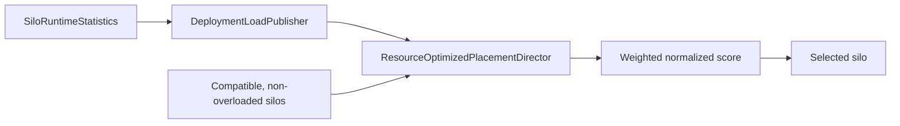

# Placement and activation balancing

Placement chooses a silo when Orleans needs a new activation. Balancing can later move existing activations. Those are separate decisions with different information and costs.

The default placement strategy is <xref:Orleans.Runtime.ResourceOptimizedPlacement>.

For the application and operational view of scale-out, scale-in, persistence, and configuration, see [Grain placement and migration](../grains/grain-placement.md).

## Resource-optimized placement

`ResourceOptimizedPlacementDirector` receives cluster-wide <xref:Orleans.Runtime.SiloRuntimeStatistics> from `DeploymentLoadPublisher`. It excludes incompatible and overloaded silos, applies a [power-of-multiple-choices load-balancing strategy](https://www.eecs.harvard.edu/~michaelm/postscripts/handbook2001.pdf) by sampling approximately the square root of the available candidates, normalizes their signals, adds jitter to avoid deterministic herding, and selects the lowest utilization score.

The default relative weights are:

| Signal | Weight |
| --- | ---: |
| <xref:Orleans.Configuration.ResourceOptimizedPlacementOptions.CpuUsageWeight?displayProperty=nameWithType> | 40 |
| <xref:Orleans.Configuration.ResourceOptimizedPlacementOptions.MemoryUsageWeight?displayProperty=nameWithType> | 20 |
| <xref:Orleans.Configuration.ResourceOptimizedPlacementOptions.AvailableMemoryWeight?displayProperty=nameWithType> | 20 |
| <xref:Orleans.Configuration.ResourceOptimizedPlacementOptions.MaxAvailableMemoryWeight?displayProperty=nameWithType> | 5 |
| <xref:Orleans.Configuration.ResourceOptimizedPlacementOptions.ActivationCountWeight?displayProperty=nameWithType> | 15 |

<xref:Orleans.Configuration.ResourceOptimizedPlacementOptions.LocalSiloPreferenceMargin?displayProperty=nameWithType> defaults to 5. If the local silo's score is within that margin of the best candidate, placement can preserve locality. During statistics startup, the director selects a random compatible silo.

Public options: <xref:Orleans.Configuration.ResourceOptimizedPlacementOptions>. Implementation: [`ResourceOptimizedPlacementDirector`](https://github.com/dotnet/orleans/blob/main/src/Orleans.Runtime/Placement/ResourceOptimizedPlacementDirector.cs) and the default registration in [`DefaultSiloServices`](https://github.com/dotnet/orleans/blob/main/src/Orleans.Runtime/Hosting/DefaultSiloServices.cs).

Enabling <xref:Orleans.Configuration.LoadSheddingOptions.LoadSheddingEnabled> sets the `IsOverloaded` statistic when either its CPU or memory threshold is exceeded. Resource-optimized placement removes overloaded silos from its scored candidate set and continues using CPU, memory, capacity, and activation-count measurements for the remaining candidates.

## Load shedding

Set <xref:Orleans.Configuration.LoadSheddingOptions.LoadSheddingEnabled> to `true` to activate load shedding. <xref:Orleans.Configuration.LoadSheddingOptions.CpuThreshold> defaults to 95 percent and <xref:Orleans.Configuration.LoadSheddingOptions.MemoryThreshold> defaults to 90 percent. Crossing either threshold marks the silo's published runtime statistics as overloaded. The client gateway and stream providers can reject supported work, and resource-optimized placement omits the silo from the scored candidate set.

Use load shedding as one layer of admission control alongside bounded work and deadlines. Use a hosting-platform autoscaler to create capacity, activation rebalancing or repartitioning to move eligible activations, and [memory-based activation shedding](../host/configuration-guide/activation-collection.md#enable-memory-based-activation-shedding) to deactivate activations under memory pressure.

## Placement resolution and extension

<xref:Orleans.Runtime.Placement.PlacementStrategyResolver> selects a grain-specific strategy when one is declared; otherwise it uses the default. `PlacementService` applies placement filters before calling the strategy's keyed <xref:Orleans.Runtime.Placement.IPlacementDirector>.

A custom strategy consists of:

1. an <xref:Orleans.Runtime.PlacementStrategy> value associated with the grain type;
1. an <xref:Orleans.Runtime.Placement.IPlacementDirector> which chooses from compatible silos; and
1. registration through <xref:Orleans.Hosting.PlacementStrategyExtensions.AddPlacementDirector*?displayProperty=nameWithType>.

Placement filters are orthogonal constraints. They can remove candidates based on metadata or another policy before the director scores them. A director should use the candidates supplied by the placement context instead of reconstructing cluster membership.

API: <xref:Orleans.Runtime.Placement.PlacementStrategyResolver> and <xref:Orleans.Hosting.PlacementStrategyExtensions.AddPlacementDirector*?displayProperty=nameWithType>. Implementation: [`PlacementService`](https://github.com/dotnet/orleans/blob/main/src/Orleans.Runtime/Placement/PlacementService.cs), [strategy resolution](https://github.com/dotnet/orleans/blob/main/src/Orleans.Runtime/Placement/PlacementStrategyResolver.cs), and [registration extensions](https://github.com/dotnet/orleans/blob/main/src/Orleans.Runtime/Hosting/PlacementStrategyExtensions.cs).

## Balancing long-lived activations

Resource-optimized placement only affects new activations. Long-lived activations can become unbalanced after:

- a silo joins or leaves;
- traffic changes while the activation remains alive;
- activation memory use diverges;
- a placement constraint changes the candidate set; or
- communicating grains are spread across silos.

Moving an activation has a cost: dehydrate and rehydrate work, directory updates, cold caches, and a temporary interruption. Orleans therefore exposes opt-in protocols rather than continuously moving every activation.

Valid activations continue running on their current silos across membership changes. A joining silo receives activations through later creation or opt-in migration. During graceful shutdown, ordinary activations on the departing silo deactivate; later calls create replacements on remaining compatible silos.

## Experimental activation rebalancer

<xref:Orleans.Hosting.ActivationRebalancerExtensions.AddActivationRebalancer*?displayProperty=nameWithType> enables the resource rebalancer and produces compiler warning **`ORLEANSEXP002`**. A worker observes cluster statistics in sessions, estimates imbalance using entropy, and asks source silos to migrate random activations toward underloaded silos. A monitor can wake or relocate the worker after failure.

The protocol optimizes distribution of activation count and memory use. The activation repartitioner complements it by optimizing the communication graph and cross-silo hot paths.

The most operationally significant <xref:Orleans.Configuration.ActivationRebalancerOptions> are:

| Option | Default | Effect |
| --- | ---: | --- |
| <xref:Orleans.Configuration.ActivationRebalancerOptions.RebalancerDueTime> | 60 seconds | Delay before the first balancing session. |
| <xref:Orleans.Configuration.ActivationRebalancerOptions.SessionCyclePeriod> | 15 seconds | Time between cycles in a session. It must be at least twice the deployment-statistics refresh period. |
| <xref:Orleans.Configuration.ActivationRebalancerOptions.MaxStagnantCycles> | 3 | Stop a session after consecutive cycles whose improvement remains below the entropy quantum. |
| <xref:Orleans.Configuration.ActivationRebalancerOptions.ActivationMigrationCountLimit> | `int.MaxValue` | Maximum requested migrations per cycle. Set a finite initial limit to bound churn while evaluating the feature. |

The entropy quantum, allowed deviation, and cycle and silo weights control convergence and migration rate. Keep their defaults until representative measurements justify a change. Resolve <xref:Orleans.Placement.Rebalancing.IActivationRebalancer> from silo services to suspend or resume sessions, request a <xref:Orleans.Placement.Rebalancing.RebalancingReport>, or subscribe to reports. Reports contain an approximate cluster imbalance and per-silo acquired and dispersed activation counts. Also observe migration rate, activation latency, state-transfer failures, memory, and cross-silo calls.

Implementation: [`ActivationRebalancerWorker`](https://github.com/dotnet/orleans/blob/main/src/Orleans.Runtime/Placement/Rebalancing/ActivationRebalancerWorker.cs).

## Experimental activation repartitioner

<xref:Orleans.Hosting.ActivationRepartitioningExtensions.AddActivationRepartitioner*?displayProperty=nameWithType> enables communication-aware repartitioning and produces compiler warning **`ORLEANSEXP001`**. The repartitioner samples fully addressed request messages and constructs a weighted graph:

- vertices represent migratable activations;
- edge weights represent observed calls;
- anchored or non-migratable grains constrain possible moves.

Periodically, peer repartitioners exchange graph information and negotiate activation moves which improve locality while respecting an imbalance-tolerance rule. The default `RebalancerCompatibleRule` can incorporate the resource rebalancer's cluster-imbalance report.

The most operationally significant <xref:Orleans.Configuration.ActivationRepartitionerOptions> are:

| Option | Default | Effect |
| --- | ---: | --- |
| <xref:Orleans.Configuration.ActivationRepartitionerOptions.MaxEdgeCount> | 10,000 | Bounds the probabilistic top communication edges retained for a round. |
| <xref:Orleans.Configuration.ActivationRepartitionerOptions.MaxUnprocessedEdges> | 100,000 | Bounds the pending edge buffer; the oldest entries are discarded when full. |
| <xref:Orleans.Configuration.ActivationRepartitionerOptions.MinRoundPeriod> / <xref:Orleans.Configuration.ActivationRepartitionerOptions.MaxRoundPeriod> | 1 / 2 minutes | Defines the randomized interval between rounds. |
| <xref:Orleans.Configuration.ActivationRepartitionerOptions.RecoveryPeriod> | 1 minute | Prevents a silo from immediately entering another round. |
| <xref:Orleans.Configuration.ActivationRepartitionerOptions.AnchoringFilterEnabled> | `true` | Reduces graph size by probabilistically collapsing well-partitioned local vertices. |

Larger edge and buffer limits improve the chance of retaining useful communication data but consume more memory. Shorter round and recovery periods react faster but increase coordination and migration churn. For large clusters, allow enough time for round exchanges; the options guidance recommends adding approximately 10 seconds per anticipated silo to the maximum round period. Evaluate effectiveness using cross-silo call volume and latency together with migration rate and repartitioner logs.

Implementation: [`ActivationRepartitioner`](https://github.com/dotnet/orleans/blob/main/src/Orleans.Runtime/Placement/Repartitioning/ActivationRepartitioner.cs) and [`RepartitionerMessageFilter`](https://github.com/dotnet/orleans/blob/main/src/Orleans.Runtime/Placement/Repartitioning/RepartitionerMessageFilter.cs).

## Choosing the mechanism

| Mechanism | When it acts | Primary signal | Effect |
| --- | --- | --- | --- |
| Resource-optimized placement | Activation creation | CPU, memory, capacity, activation count | Places the new activation |
| Activation rebalancer | Opt-in balancing sessions | Cluster resource imbalance | Random eligible activations |
| Activation repartitioner | Opt-in exchange rounds | Grain call graph and tolerance rule | Communication-aware activations |
| Load shedding | CPU or memory threshold exceeded | Local CPU and memory use | Rejects supported work and marks the silo overloaded |

Resource-optimized placement is the default and is usually the first mechanism to tune. Add the activation rebalancer for persistent count or memory skew and the repartitioner for call-locality problems after measuring the workload. Enable load shedding for overload protection. The experimental movement protocols use [activation migration](activation-lifecycle.md). Apply capacity planning, admission control, and deployment health monitoring alongside these runtime mechanisms. Operational guidance belongs in the [deployment section](../deployment/index.md).
