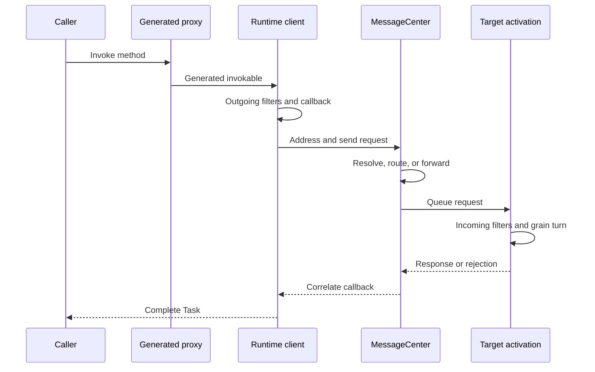

# Messaging pipeline and delivery semantics

An Orleans call is an asynchronous request-response exchange. Generated code, routing, the grain directory, activation scheduling, and callbacks all participate. The API resembles a local method call, but failures retain distributed-system ambiguity.

## Request and response pipeline

The source generator emits a proxy and an invokable request type. `GrainReferenceRuntime` runs outgoing call filters and submits the request through `IRuntimeClient`. `MessageFactory` creates the message and correlation identity. `MessageCenter` resolves the activation address and selects a local dispatch, silo connection, or client gateway. On the target, `InsideRuntimeClient` runs incoming filters and invokes the generated method dispatcher.

Source: [`GrainReferenceRuntime`](https://github.com/dotnet/orleans/blob/main/src/Orleans.Core/Runtime/GrainReferenceRuntime.cs), [`MessageFactory`](https://github.com/dotnet/orleans/blob/main/src/Orleans.Core/Messaging/MessageFactory.cs), [`MessageCenter`](https://github.com/dotnet/orleans/blob/main/src/Orleans.Runtime/Messaging/MessageCenter.cs), and [`InsideRuntimeClient`](https://github.com/dotnet/orleans/blob/main/src/Orleans.Runtime/Core/InsideRuntimeClient.cs).

## Routing repair is not call retry

A message can encounter a stale activation address because an activation deactivated, moved, or its silo failed. The runtime can reject, invalidate, forward, or reroute that same logical request while locating the current activation. Forwarding is bounded by silo messaging options.

This internal address repair must not be confused with retrying an application call after its response timeout. Orleans does **not** automatically resubmit a call because the caller's response timer elapsed.

Transport code can also retry a failed socket send. That repairs a transport attempt using the same message identity; it is not a new application invocation policy.

## Response timeout means unknown outcome

`MessagingOptions.ResponseTimeout` defaults to 30 seconds, or 30 minutes when a debugger is attached. `CallbackData` completes the caller with <xref:System.TimeoutException> when no response reaches the callback in time.

At that point, any of these can be true:

- the request never reached the target;
- the request is queued but has not started;
- the grain method is still running;
- the grain method completed and its response was lost or delayed; or
- a response will arrive after the callback has already been removed.

The timeout therefore reports an **unknown outcome**, not a failed execution. By default, `CancelRequestOnTimeout` is `false`. Enabling cancellation requests cooperative cancellation; it still cannot prove that no side effect occurred.

Source: [`MessagingOptions`](https://github.com/dotnet/orleans/blob/main/src/Orleans.Core/Configuration/Options/MessagingOptions.cs), [`CallbackData`](https://github.com/dotnet/orleans/blob/main/src/Orleans.Core/Runtime/CallbackData.cs), and [`TimeoutTests`](https://github.com/dotnet/orleans/blob/main/test/Orleans.Runtime.Internal.Tests/TimeoutTests.cs).

## Delivery model

Without an application retry, Orleans submits one logical request and does not intentionally invoke it again after a response timeout. This is commonly described as **at-most-once delivery**. It is not a durable exactly-once transaction:

- a caller cannot distinguish non-delivery from completed execution after a timeout;
- a process crash can erase volatile duplicate-tracking and callback state;
- side effects can commit even when the response is not observed; and
- one-way messages provide no completion result.

If application code retries a timed-out call, both attempts can execute. Orleans does not durably deduplicate arbitrary requests. Retried operations should be naturally idempotent or carry an application operation identifier recorded atomically with the side effect.

Repeated retry can approximate at-least-once delivery only while the cluster and target eventually recover. It does not imply exactly once, ordering across retries, or bounded completion time.

## Rejections and expiration

The runtime can return a rejection when it knows that it cannot process a request, for example because of invalid routing or overload. A rejection is stronger evidence than a timeout, but application code must still interpret the rejection type.

Messages have expiration metadata derived from the response timeout. With `DropExpiredMessages = true` (the default), an expired request or response can be dropped instead of consuming work which can no longer complete the original callback.

## Designing callers

Choose semantics at the application boundary:

- use idempotent commands for safe retry;
- include operation IDs when duplicate side effects are unacceptable;
- query durable state after an unknown outcome when possible;
- use transactions or storage compare-and-swap for business invariants; and
- do not use a longer timeout as a substitute for overload handling.

Operational timeout and connection tuning belongs in the [hosting configuration guide](../host/configuration-guide/index.md).
