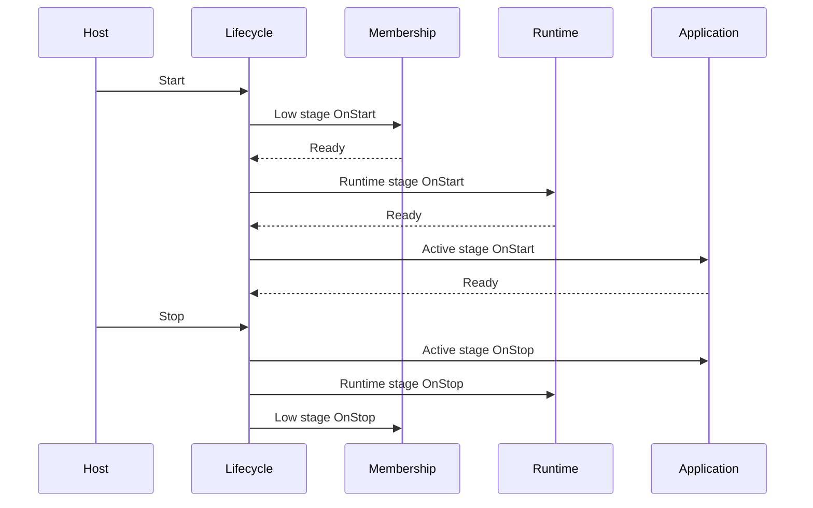

# Lifecycle implementation

Orleans composes many independently registered services into one silo or client. Some services must start only after a dependency is ready and stop before that dependency disappears. The lifecycle abstraction gives those components an ordered protocol without placing every dependency in a central start method.

## Observable and observers 

<xref:Orleans.ILifecycleObservable> accepts subscriptions at integer stages. During startup it visits stages in ascending order; during shutdown it visits them in descending order. Every observer at a stage completes before the lifecycle advances.

<xref:Orleans.ILifecycleObserver> provides asynchronous <xref:Orleans.ILifecycleObserver.OnStart*> and <xref:Orleans.ILifecycleObserver.OnStop*> callbacks. <xref:Orleans.ILifecycleParticipant`1> is the enrollment contract: a participant receives the lifecycle and subscribes itself. Silo and client hosting discover their registered participants through dependency injection; grain-scoped services have an explicit enrollment owner.

The reverse shutdown order is the key invariant. A service can continue using dependencies which started at earlier stages until its own stop callback completes.

## Silo and client lifecycles

<xref:Orleans.Runtime.SiloLifecycleSubject> drives silo startup and shutdown. Membership, messaging, grain directory, activation collection, statistics, providers, and other runtime components participate at named <xref:Orleans.ServiceLifecycleStage> values.

The client uses the same pattern for gateway discovery, connections, stream providers, and the outside runtime client. The generic <xref:Orleans.ILifecycleObservable> also lets providers compose a private lifecycle when the silo-specific interface is unnecessary.

The host-facing stage list and configuration examples are documented in [silo lifecycle](../host/silo-lifecycle.md). This page focuses on the protocol rather than where application startup code should be registered.

## Grain activation composition

<xref:Orleans.Runtime.IConfigureGrainTypeComponents> configures a shared plan for a grain type. A configurator can use <xref:Orleans.Metadata.GrainClassMap> to select implementation classes, then add synchronous actions with <xref:Orleans.Runtime.GrainTypeSharedContext.AddActivationSetup*>. Selection and composition occur when creating the shared context; activations execute the cached actions.

<xref:Orleans.Runtime.GrainTypeSharedContext> seals setup registration after the configurators finish. When constructing an activation, the runtime assigns the fully constructed grain object and records creation before invoking setup actions in addition order. It then enrolls the grain object and starts the lifecycle. This boundary also applies to custom grain activators and to individual stateless workers.

Setup delegates are shared and can run concurrently across activations. Resolve per-activation state through <xref:Orleans.Runtime.IGrainContext.ActivationServices> inside the action. Existing DI registrations retain their explicit enrollment paths. Setup failures follow activation-construction failure handling: subsequent setup and lifecycle startup are skipped, and the assigned grain and scope are disposed.

See [shared activation setup](../grains/grain-lifecycle.md#shared-activation-setup) for a compiled interface-selection example.

## Subscription rules 

A lifecycle participant should:

- subscribe during composition, before lifecycle start;
- use a stable observer name for diagnostics;
- select the latest stage whose prerequisites are guaranteed;
- make <xref:Orleans.ILifecycleObserver.OnStop*> safe after a partial <xref:Orleans.ILifecycleObserver.OnStart*>;
- honor the supplied cancellation token; and
- release dependencies before their lower stage stops.

Avoid creating hidden ordering by resolving and starting another participant manually. Stage dependencies should remain visible in lifecycle subscriptions.

## Failure behavior

Startup does not skip a failed observer and continue to a success-shaped state. The exception aborts lifecycle progress and the host reports startup failure. Shutdown attempts to unwind initialized stages under its cancellation deadline.

Cancellation bounds lifecycle observation; it cannot guarantee instantaneous cleanup of external resources. Provider code should keep shutdown idempotent and should not swallow failures which leave durable ownership ambiguous.

## Source

- <xref:Orleans.LifecycleSubject> implements stage traversal; see its [implementation](https://github.com/dotnet/orleans/blob/main/src/Orleans.Core/Lifecycle/LifecycleSubject.cs).
- <xref:Orleans.Runtime.SiloLifecycleSubject> is the silo lifecycle; see its [implementation](https://github.com/dotnet/orleans/blob/main/src/Orleans.Runtime/Lifecycle/SiloLifecycleSubject.cs).
- [`DefaultSiloServices`](https://github.com/dotnet/orleans/blob/main/src/Orleans.Runtime/Hosting/DefaultSiloServices.cs) shows participant registration.
- <xref:Orleans.Providers.Streams.Common.PersistentStreamProvider> is a named-provider example with separate initialize and active stages; see its [lifecycle participation implementation](https://github.com/dotnet/orleans/blob/main/src/Orleans.Streaming/PersistentStreams/PersistentStreamProvider.cs).
