# Runtime architecture

Orleans presents a location-transparent grain reference, an abstraction introduced in the [Orleans virtual actor research paper](https://www.microsoft.com/en-us/research/publication/orleans-distributed-virtual-actors-for-programmability-and-scalability/), but the runtime implements each call using several independently replaceable or failure-aware subsystems. The central invariant is that a grain identity is stable while its activation location is temporary.

```mermaid
flowchart LR
    App[Application code] --> Proxy[Generated grain proxy]
    Proxy --> GRef[GrainReferenceRuntime]
    GRef --> Client[OutsideRuntimeClient]
    Client --> Gateway[Client gateway]
    Gateway --> MC[MessageCenter]
    MC --> Directory[Grain locator and directory]
    Directory --> Placement[Placement service]
    Placement --> Catalog[Catalog and ActivationData]
    Catalog --> Scheduler[WorkItemGroup scheduler]
    Scheduler --> Grain[Grain method]
    Grain --> MC
    MC --> Client
```

## Host composition

A silo is a [.NET Generic Host](https://learn.microsoft.com/dotnet/core/extensions/generic-host) with Orleans services registered through [.NET dependency injection](https://learn.microsoft.com/dotnet/core/extensions/dependency-injection/overview). `SiloHostedService` starts and stops <xref:Orleans.Runtime.Silo>, which drives the ordered silo lifecycle. The default registration set composes:

- `MessageCenter` for network connections, routing, forwarding, gateways, and dispatch.
- `MembershipTableManager`, `MembershipAgent`, `ClusterHealthMonitor`, and `ClusterMembershipService` for membership.
- `LocalGrainDirectory`, `GrainLocator`, and `CachedGrainLocator` for activation location.
- `PlacementService` and keyed placement directors for new activation selection.
- `ActivationDirectory`, `Catalog`, `ActivationData`, and `ActivationCollector` for local activation ownership.
- `InsideRuntimeClient` for invoking local targets and producing responses.
- `DeploymentLoadPublisher` and environment statistics for placement and overload decisions.

See [`DefaultSiloServices`](https://github.com/dotnet/orleans/blob/main/src/Orleans.Runtime/Hosting/DefaultSiloServices.cs) for the composition root and <xref:Orleans.Runtime.Silo> plus its [implementation](https://github.com/dotnet/orleans/blob/main/src/Orleans.Runtime/Silo/Silo.cs) for lifecycle orchestration.

An external client has no activation catalog or placement service. `ClusterClient` starts an `OutsideRuntimeClient`, discovers gateways, maintains gateway connections, and sends requests through a client `MessageCenter`. A silo also embeds a runtime client, but its `InsideRuntimeClient` can dispatch directly to local activations and system targets.

## A request through the runtime

1. The source generator emits a proxy method and an invokable request type for each grain interface method.
1. The proxy passes the invokable to `GrainReferenceRuntime`. Outgoing call filters can inspect or replace the invocation.
1. The runtime creates a `Message`, assigns its correlation identity and target grain, registers a response callback, and sends it through `MessageCenter`.
1. A client sends through a gateway. A silo can route directly to the target silo when the activation address is known.
1. The receiving `MessageCenter` resolves the activation address. A cache hit can avoid a directory round trip. A stale address can be invalidated and rerouted.
1. If no activation exists, the directory and `PlacementService` coordinate creation on a compatible silo.
1. `Catalog` creates an `ActivationData`; activation runs before queued application requests are dispatched.
1. `ActivationData` places the request on the activation scheduler. Incoming call filters and the generated invoker execute the grain method.
1. `InsideRuntimeClient` creates a response or rejection. The response follows the original correlation identity to the waiting callback.

The relevant implementations are [`GrainReferenceRuntime`](https://github.com/dotnet/orleans/blob/main/src/Orleans.Core/Runtime/GrainReferenceRuntime.cs), [`OutsideRuntimeClient`](https://github.com/dotnet/orleans/blob/main/src/Orleans.Core/Runtime/OutsideRuntimeClient.cs), [`MessageCenter`](https://github.com/dotnet/orleans/blob/main/src/Orleans.Runtime/Messaging/MessageCenter.cs), [`Catalog`](https://github.com/dotnet/orleans/blob/main/src/Orleans.Runtime/Catalog/Catalog.cs), and [`InsideRuntimeClient`](https://github.com/dotnet/orleans/blob/main/src/Orleans.Runtime/Core/InsideRuntimeClient.cs).

## System targets

System targets are addressable runtime components which use Orleans messaging and single-threaded scheduling without virtual activation. The runtime constructs them at explicit silo addresses. Membership services, persistent stream pulling agents, and activation balancing protocols use system targets because they need the messaging and scheduling model but must not be location-transparent virtual actors.

Unlike a grain, a system target:

- has a concrete silo location;
- is created and registered by runtime code;
- is not activated by placement or grain-directory lookup; and
- participates in runtime lifecycle rather than application grain lifecycle.

## Consistency boundaries

Orleans does not implement one global transaction across these subsystems. Each boundary has a narrower contract:

- The membership table serializes membership updates into monotonically ordered views.
- The directory coordinates a grain identity with an activation address and repairs stale registrations.
- The activation scheduler serializes synchronous work items for one activation.
- Messaging correlates a request with a response but cannot infer whether a timed-out request executed.
- Persistence and streams define their own durability and acknowledgement points.

Understanding those boundaries is essential when extending the runtime. A custom directory changes location consistency, not membership. A placement director chooses where a new activation starts, not how calls are scheduled. A stream adapter defines queue acknowledgement, not grain-call exactly-once semantics.

## Public extension surfaces

Prefer supported extension points over replacing internal runtime types:

- <xref:Orleans.Runtime.Placement.IPlacementDirector> and placement filters customize candidate selection.
- <xref:Orleans.GrainDirectory.IGrainDirectory> supplies a named grain directory.
- serializer codecs, copiers, activators, and converters extend wire handling.
- stream queue adapters, mappers, balancers, caches, and failure handlers extend persistent streams.
- <xref:Orleans.Providers.IProviderBuilder`1> integrates configuration-driven providers.
- lifecycle participants order provider startup and shutdown.

Internal names and algorithms are not compatibility guarantees. Public APIs, analyzer warnings, and documented wire identities are the compatibility boundaries.
