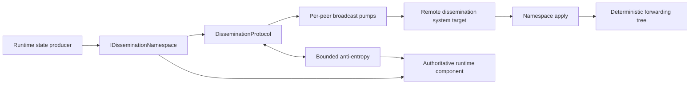

# Runtime state dissemination

Runtime dissemination is an internal silo-to-silo protocol which accelerates convergence of frequently changing runtime state. A deterministic tree carries new versions quickly, acknowledgments record peer knowledge, and bounded anti-entropy repairs loss, reordering, partitions, and membership skew. Each participating runtime component remains authoritative for its own state.

The dissemination protocol currently carries:

- deployment-load statistics among Active silos;
- membership snapshots and diffs among Joining, Active, ShuttingDown, and Stopping silos.

The same change set adds content-addressed peer repair for cluster manifests. The deployment-load publisher, membership manager, and cluster-manifest provider retain independent direct paths and validation rules. A dissemination fault therefore reduces convergence speed while those component-specific paths preserve their contracts.

## Components and responsibilities

`DisseminationProtocol` coordinates routing, peer capability evidence, anti-entropy, and application isolation. `DisseminationBroadcastQueue` owns per-peer scheduling, coalescing, retry, drain, and acknowledged-version ledgers. `DisseminationMembership` projects one membership snapshot into topology-specific member sets. Each `IDisseminationNamespace` owns serialization, current versions, retained history, payload limits, repair construction, and application semantics.

Queue entries contain `(namespace, key)` identities. A pump materializes a repair immediately before transmission, so coalesced notifications carry the latest repairable version without retaining serialized payloads for every peer.

## Version and application invariants

A `DisseminationValue` names one key and a `[FromVersion, ToVersion]` transition:

- a full value starts at version zero and can establish state without a retained baseline;
- a delta starts at the receiver baseline and must form a contiguous version chain;
- acknowledged peer versions advance monotonically from explicit receiver evidence;
- duplicate and obsolete values leave authoritative state unchanged; and
- one rejected value does not prevent later values in the batch from being considered.

The namespace reports whether a repair is current, produced, unavailable, or unable to fit the supplied item and byte budgets. Produced repairs can be complete or a valid prefix. Prefix acknowledgments establish the receiver's new baseline and let the next batch continue the chain.

Membership uses the membership-table version plus a liveness fingerprint in its digest because `IAmAliveTime` can advance without a table-version change. It retains 32 snapshots, prefers a smaller diff when the peer baseline is present, and falls back to a full snapshot when history or capacity makes the diff unsuitable. Apply accepts same-version snapshots only when they advance liveness and preserves newer local liveness when applying a diff.

Deployment-load versions are sample timestamps. Each repair is a full latest value, and terminal removal dominates queued or concurrent updates so an older sample cannot resurrect a departed silo.

## Deterministic topology

Every silo derives routing from the same ordered membership projection. Members are ordered by status, start time, and silo address. Joining, Active, ShuttingDown, and Stopping entries participate.

For fanout `f` and zero-based member index `i`, a forwarding node selects children starting at `f * (i + 1)` and continuing for at most `f` members. An originator sends to the first `f` members, excluding itself, plus its normal forwarding children. Stable ordering makes parent and child selection deterministic for a given membership version and fanout.

Namespaces select a membership scope before topology construction:

| Namespace | Scope | Operational effect |
|---|---|---|
| Deployment load | Active members | Placement data follows serving capacity. |
| Membership | All dissemination members | Joining and graceful-shutdown transitions can propagate. |

Fanout is derived from the target hop count and bounded by the configured minimum and maximum, or selected by the code-configured callback. A membership or fanout change creates a new topology from the next snapshot; acknowledged ledgers and anti-entropy repair convergence across the transition.

## Configuration and defaults

The subsystem is opt-in through <xref:Orleans.Configuration.DisseminationOptions.Enabled>. Defaults bound concurrency, memory retention, payload size, and repair work:

| Option | Default | Effect |
|---|---:|---|
| <xref:Orleans.Configuration.DisseminationOptions.MaxConcurrentSends> | 32 | Process-wide concurrent broadcast sends. |
| <xref:Orleans.Configuration.DisseminationOptions.MaxBatchItems> | 8,192 | Values materialized in one batch. |
| <xref:Orleans.Configuration.DisseminationOptions.MaxBatchBytes> | 1 MiB | Serialized payload bytes in one batch. |
| <xref:Orleans.Configuration.DisseminationOverlayOptions.TargetHopCount> | 2 | Target depth used to derive fanout. |
| <xref:Orleans.Configuration.DisseminationOverlayOptions.MinFanOutFactor> / <xref:Orleans.Configuration.DisseminationOverlayOptions.MaxFanOutFactor> | 4 / 32 | Bounds for derived fanout. |
| <xref:Orleans.Configuration.DisseminationOverlayOptions.AntiEntropyInterval> | 5 seconds | Repair-round cadence and retry-delay ceiling. |
| <xref:Orleans.Configuration.DisseminationOverlayOptions.AntiEntropyPeerCount> | 3 | Maximum peers selected in one repair round. |
| <xref:Orleans.Configuration.DisseminationNamespaceOptions.MaxPendingItemCount> | 1,024 | Distinct retained keys per namespace and peer. |
| <xref:Orleans.Configuration.DisseminationNamespaceOptions.MaxCoalescingDelay> | 100 ms | Normal-priority batching window. |
| <xref:Orleans.Configuration.DisseminationNamespaceOptions.StaleItemTtl> | 30 seconds | Per-hop transport and application lifetime. |
| <xref:Orleans.Configuration.DisseminationNamespaceOptions.ExpectedUpdateCadence> | 10 seconds | Quiet period before a digest is offered for repair. |
| <xref:Orleans.Configuration.DisseminationNamespaceOptions.MaxPayloadBytes> | 1 MiB | Maximum serialized value size for the namespace. |

Each integration has its own <xref:Orleans.Configuration.DisseminationNamespaceOptions>. Operators can enable and tune membership and deployment-load dissemination independently while retaining the global transport bounds.

## Broadcast pumps and backpressure

Each destination has one independent pump. Repeated notifications coalesce by namespace and key, high-priority namespaces bypass the coalescing window, and batches obey global item and byte bounds plus namespace payload bounds. A process-wide semaphore limits concurrent sends without coupling one peer's retry state to another peer.

`MaxPendingItemCount` bounds distinct retained keys per namespace and peer. A notification for an admitted key refreshes its generation at the limit. A new key is rejected until acknowledgment-driven completion, an oversized repair, or membership pruning releases capacity. Oversized repairs retain acknowledged peer versions separately so a later publication can resume from the established baseline. The runtime emits a rejection metric and a diagnostic event without including the key. A rejected tree target makes publication return `false`, allowing the producer's direct path to deliver the update.

A successful RPC is transport completion. The receiver response is the evidence which advances the peer ledger. Missing or prefix acknowledgments retain work for repair. Transport timeout and failure requeue the generation with exponential backoff capped by the anti-entropy interval. A newer notification can replace that schedule with its own urgency.

Unexpected iteration failures retain work and retry. A failure in the recovery path permanently fails the pump and explicitly completes flush and drain waiters with the failure. Shutdown can drain accepted work within the caller's cancellation budget or discard a removed peer's work during membership pruning.

## Bounded anti-entropy

An anti-entropy round rotates through at most `AntiEntropyPeerCount` eligible peers. The broadest participating membership scope provides the global peer budget; each request includes only namespaces for which that peer is eligible.

Digests identify the versions already held by the requester. Recently advanced streams suppress redundant probes until `ExpectedUpdateCadence` elapses. Responses obey item, batch-byte, payload-byte, and hop-lifetime bounds. Persistent per-requester cursors rotate truncated responses so hot early keys cannot starve later candidates. Cursor state for non-members is least-recently-used and bounded to 64 entries.

Repairs from each sender remain ordered. Competing sender chains are ranked before application, and the namespace's monotonic apply contract rejects an obsolete or incompatible chain. A partition therefore creates bounded retry and repair work; after connectivity and membership views recover, rotating peer selection and cursors continue convergence.

## Mixed-version behavior

Peer namespace support is evidence-driven. Inbound traffic, broadcast acknowledgments, and authoritative anti-entropy responses confirm support for one silo generation. An explicit unsupported response revokes it, and membership pruning removes evidence for departed generations.

Deployment-load publication uses dissemination for confirmed peers and the direct system target for unconfirmed peers. If dissemination is disabled, unavailable, rejected, or unable to accept the update within one refresh interval, direct fanout covers all Active peers. Membership direct gossip begins before optional dissemination and keeps the caller's cancellation and shutdown deadline. Manifest repair retains direct manifest retrieval as its authority-preserving fallback.

## Manifest content repair

Manifest summaries identify each silo manifest using SHA-256 over a versioned canonical frame. The frame distinguishes structural boundaries, null and empty values, default and empty identifiers, and sorted entries. Integer fields are big-endian, identifiers contribute raw bytes, and strings contribute UTF-16 code units in big-endian order.

The cluster-manifest provider rotates through a bounded set of Active peers. Fetched content is accepted only after recomputing the expected hash. Valid partial peer results are published immediately while direct fetches continue independently. Hung, stale, invalid, or unsupported peers leave the direct per-silo manifest RPC responsible for completing the manifest.

## Concurrency and lifetime

Protocol dictionaries use focused locks for membership projections, response cursors, value-update timestamps, peer capability evidence, and per-peer pump state. Network calls, namespace application, logging, diagnostic callbacks, and waiter continuations run outside those locks. Waiters use asynchronous continuations.

Caller cancellation owns public operation lifetime and is checked before each received value is applied. Per-hop value TTL bounds broadcast transport and anti-entropy round lifetime. Broadcast pumps enforce their deadline independently of the runtime's cancellation-acknowledgment setting. An outstanding RPC retains its concurrency slot until completion, and semaphore disposal follows the last outstanding RPC after pump shutdown. Late RPC faults are observed and logged. Shutdown cancellation reaches queued send-gate waits, active RPCs, anti-entropy exchanges, pump timers, and drain waiters.

## Observability

The standard `Microsoft.Orleans` meter exposes publication outcomes, broadcast volume, payload bytes, apply outcomes, retries, failures, anti-entropy work, drops, pump failures, and queue admission rejection. Dimensions are bounded to namespace, direction, kind, result, reason, truncation, and pump status. Diagnostic events provide payload-level apply/drop detail and deterministic pump scheduling detail for short-lived investigation.

See [Monitor runtime dissemination](../host/monitoring/runtime-dissemination.md) for instrument semantics, dashboards, alerts, and failure diagnosis.
