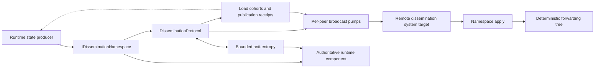

# Runtime state dissemination

Runtime dissemination is an internal silo-to-silo protocol which accelerates convergence of frequently changing runtime state. A deterministic tree carries new versions quickly, acknowledgments record peer knowledge, and bounded anti-entropy repairs loss, reordering, partitions, and membership skew. Each participating runtime component remains authoritative for its own state.

The dissemination protocol currently carries:

- deployment-load statistics among Active silos;
- membership snapshots among Joining, Active, ShuttingDown, and Stopping silos.

The deployment-load publisher and membership manager retain their direct delivery paths and validation rules. Tree broadcast and anti-entropy form one convergence feature: broadcast accelerates new updates, and repair discovers and delivers state missed by the tree.

## Components and responsibilities

`DisseminationProtocol` coordinates routing, peer capability evidence, anti-entropy, and application isolation. `DisseminationRootBatcher` owns the aggregation root's bounded latest-key cohorts, producer contributions, and seal receipts. `DisseminationBroadcastQueue` owns per-peer scheduling, retry, drain, and acknowledged-version ledgers. `DisseminationMembership` projects one membership snapshot into topology-specific member sets. Each `IDisseminationNamespace` owns serialization, current versions, payload limits, repair construction, and application semantics.

Queue entries contain `(namespace, key)` identities. A pump acquires both destination ownership and a global broadcast slot before materializing an update. Membership peer ledgers also retain one immutable comparison snapshot from the last accepted, exactly acknowledged broadcast. Coalesced notifications compare that snapshot with current owner state after admission, preserving cumulative changes and reversions while waiting peers retain shared snapshot references rather than serialized messages.

Single-key publication and received-batch forwarding share one synchronous queue-admission path. A borrowed notification span is consumed under the pump lock before scheduling once, and diagnostic callbacks run after releasing the lock. Peer capability records store confirmed namespace identities for the lifetime of that silo generation; explicit rejection or membership removal retires the confirmation.

Applied state wakes each forwarding child, including same-version membership liveness advances. Duplicate deliveries wake children whose versions are still missing and whose queues contain no equivalent work. This lets a first tree delivery forward state already learned through a direct path while suppressing repeated forwarding cycles between silos with different topology views.

## Version and application invariants

A `DisseminationValue` carries one key's update and version:

- its zero `FromVersion` identifies a full value which can establish state at any receiver baseline;
- a positive `FromVersion` identifies a membership broadcast delta from that canonical view to `ToVersion`;
- acknowledged peer versions advance monotonically from explicit receiver evidence;
- duplicate and obsolete values leave authoritative state unchanged; and
- one rejected value does not prevent later values in the batch from being considered.

Namespaces construct broadcasts separately from full anti-entropy repairs. Each result contains one value; batch assembly reserves an item slot before construction and retains unsent keys for subsequent bounded batches. Deployment-load broadcasts remain full latest samples.

Broadcast senders advertise support for compact acknowledgments. The compact flag requires complete receive admission, accepted or duplicate application results, and exact agreement with each key's transmitted version. Namespace entries retain capability evidence with empty per-key lists. An exact compact acknowledgment also installs the membership comparison snapshot captured when constructing that send. Explicit higher versions and passive peer knowledge advance version evidence; a comparison snapshot is usable only while its version matches that evidence.

Membership broadcasts contain changed entries and removed silo identities, together with base and target canonical view versions. A receiver at the base applies the transition. A receiver already at the target preserves canonical fields and every non-Dead row, merges maximum heartbeat timestamps, and prunes explicitly removed Dead rows. A coalesced delta across versions can span an intervening Dead transition and cleanup. Other receiver versions require full repair. A rejected delta makes the key eligible for the next anti-entropy round, even if its local version advanced recently. Relays construct their own sparse update against each child's comparison snapshot, so an ahead relay can distribute its newer accepted view rather than regress to an older incoming update.

A peer without a usable comparison snapshot receives an empty delta at the sender's current version. A peer already at that version acknowledges the probe; a lagging peer obtains a full snapshot through repair or ordinary membership bootstrap. The retained snapshot establishes a canonical comparison baseline, while initial heartbeat and retained-Dead differences remain repair work.

Membership anti-entropy uses the view version and a liveness/inventory fingerprint. Responses always contain full current snapshots, whose serialized payloads are cached until owner state changes. Same-version repair preserves canonical fields and non-Dead entries, merges maximum heartbeats, and reconciles independently pruned Dead rows without resurrecting them. Application checks the requested effects against resulting owner state before acknowledging acceptance, including when an authority refresh completes concurrently.

Comparison snapshots are shared immutable objects, with one retained reference per existing outbound membership peer/key and constant-size namespace caches. They are pruned with peer and key knowledge. Healthy peers share the same snapshot; lagging peers can retain different snapshots, giving a worst-case memory cost proportional to outbound peers times membership size. Sparse payload caching uses snapshot identity/content, including same-version changes.

Canonical membership versions are monotonic within a cluster lifetime; hosts can skip observed versions. Same-version snapshots can differ in maximum heartbeat progress and retention of Dead rows. Removing any other status requires a canonical view advance. Provider versioned compaction is a stronger storage contract and remains independently applicable. Development clustering's primary table defines that lifetime. Loss of that authority invalidates the continuing cluster, and an observed table rollback requests fatal silo termination. Full repair follows the membership owner's lifetime and validation rules. Deployment-load samples retain their timestamp ordering.

Deployment-load versions are sample timestamps. Each repair is a full latest value. Application runs on the deployment-load publisher's scheduler and accepts samples only for Active silo generations in the membership oracle. Terminal membership transitions remove placement statistics, and the oracle's monotonic membership state rejects later samples for departed generations.

After the owner accepts a load sample, its serialized payload is reused for forwarding and repair. Inventory maintenance enumerates namespace keys directly; membership exposes its single key, and deployment load uses the active-silo oracle. Each broadcast queue retains one reusable scratch inventory; individual pruning calls have exclusive ownership and clear all keys before returning it, including on failure. Version and fingerprint construction is reserved for operations which use that information. Receive batches which fit all item, byte, and namespace limits are processed directly from their existing collections; truncated batches retain bounded cursor selection.

## Deterministic topology

Every silo derives routing from the same ordered membership projection. Members are ordered by status and silo address. Silo addresses order by generation, port, and IP address, providing stable ordering across membership storage providers with different timestamp precision. Joining, Active, ShuttingDown, and Stopping entries participate.

Membership uses the broadcast forest: for fanout `f` and zero-based member index `i`, a forwarding node selects children starting at `f * (i + 1)` and continuing for at most `f` members. An originator sends to the first `f` members, excluding itself, plus its normal forwarding children.

Deployment load uses root aggregation followed by tree distribution. Node `i > 0` has parent `(i - 1) / f`; its children start at `f * i + 1`. Its fanout defaults to eight, independently of the membership forest. Each non-root producer sends its own fresh sample directly to the root through a dedicated aggregation RPC. The root's own sample enters the same cohort locally. A cohort captures its expected Active producer incarnations and retains the latest notification per key. It seals after every expected producer contributes, or after the configured publication period elapses from cohort opening. New arrivals preserve that deadline; duplicate messages and ordinary forwarding hints preserve distinct-producer counting.

Ingress RPCs remain open asynchronously until the cohort seals and its distribution work is admitted. Their receipts carry the remaining delay to the cohort's next publication boundary: `max(0, cohort start + period - receipt time)`. The publisher applies that delay to its sampling timer. Complete, phase-aligned cohorts can seal quickly while preserving approximately one sample per silo per period. A cohort that reaches its deadline schedules its next sample promptly. Local monotonic timing handles these relative delays across machines.

The ingress receipt path has independent local-attempt admission. Membership uses its existing immediate peer pumps while load receipts are held. Each admitted cohort enters child queues through bounded batch admission, and relays forward immediately. Explicit flush and shutdown seal partial cohorts within the caller's cancellation budget. A former root hands pending state to the current root, including when it has left Active membership. Shutdown seals cohorts before waiting for their held protocol admissions, then drains peer queues.

Aggregation ledgers advance on broadcast acknowledgments, after the receiver processes the batch and attempts downstream queue admission. An ingress producer which is also a child receives its own update in the root's distribution batch and forwards it to its descendants. Passive evidence of a peer's local value serves repair; broadcast acknowledgments establish distribution progress. Anti-entropy repairs gaps left by bounded queue admission or changed topology.

At one publication and one fitting cohort per second, root ingress contributes `N - 1` requests and tree distribution contributes another `N - 1`. The healthy steady-state model is `2 * (N - 1)`: 18 load requests per second at 10 silos, 198 at 100 silos, and 3,998 at 2,000 silos. An eight-child relay distributes approximately eight batches per second. Including the default periodic anti-entropy budget, the respective projections are 24, 258, and 5,198 requests per second, plus their replies. Root ingress remains concentrated at the root. These are algorithmic projections; production capacity and tail latency require measurement. Retries, topology transitions, forced drains, fallback, and wire-message splitting add work. Payload delivery includes each recipient's copy of the statistics.

Cohort completeness depends on the slowest expected producer. Healthy aligned arrivals produce a short collection delay; an absent or paused producer makes the cohort use its full deadline. Repeatedly incomplete cohorts can leave samples approaching two publication periods old before replacement. Startup, membership changes, scheduling skew, and synchronized ingress/reply bursts are important latency and capacity cases.

Active members are ordered by silo address. Ingress moves toward a smaller root; distribution moves toward larger children. A former root rejects new contribution requests, allowing the publisher's direct path to preserve delivery while subsequent publications resolve the new root. Already accepted cohort state and ordinary aggregation forwarding hints move toward the current root. Membership repair reconciles differing views.

Namespaces select a membership scope before topology construction:

| Namespace | Scope | Operational effect |
|---|---|---|
| Deployment load | Active members, root aggregation | Producers send to one root; already-aggregated batches traverse the distribution tree immediately. |
| Membership | All dissemination members | Joining and graceful-shutdown transitions can propagate. |

Membership fanout is derived from the target hop count and configured bounds, or selected by the code-configured callback. Aggregation uses its independent fanout setting. At 2,000 silos, fanout eight gives at most four distribution hops. A membership change creates a new topology from the next snapshot; acknowledged ledgers and anti-entropy repair convergence across the transition.

The projection cache tracks its authoritative source snapshot. On a cache miss it re-reads the owner under the cache lock, so a delayed reader follows the current view. Canonical view changes refresh routing and peer selection. Heartbeat-only updates reuse the existing topology, while rebuilt projections retain rotation progress.

## Configuration and defaults

Dissemination is opt-in. Enable <xref:Orleans.Configuration.DisseminationOptions.Enabled> and <xref:Orleans.Configuration.DisseminationNamespaceOptions.Enabled> on each participating integration. The subsystem and namespace flags default to `false`; ordinary runtime delivery remains active. Explicitly enabled cluster and compatibility tests exercise broadcast and repair. Defaults bound concurrency, memory retention, payload size, and repair work:

| Option | Default | Effect |
|---|---:|---|
| <xref:Orleans.Configuration.DisseminationOptions.MaxConcurrentSends> | 32 | Per-silo active local broadcast attempts. |
| <xref:Orleans.Configuration.DisseminationOptions.MaxBatchItems> | 8,192 | Values materialized in an outgoing batch or examined in an incoming batch or repair response. |
| <xref:Orleans.Configuration.DisseminationOptions.MaxBatchBytes> | 1 MiB | Serialized payload bytes in an outgoing batch or admitted from an incoming batch or repair response. |
| <xref:Orleans.Configuration.DisseminationOverlayOptions.TargetHopCount> | 2 | Target depth used to derive fanout. |
| <xref:Orleans.Configuration.DisseminationOverlayOptions.MinFanOutFactor> / <xref:Orleans.Configuration.DisseminationOverlayOptions.MaxFanOutFactor> | 4 / 32 | Bounds for derived fanout. |
| <xref:Orleans.Configuration.DisseminationOverlayOptions.AggregationFanOutFactor> | 8 | Maximum children per load-distribution relay. |
| <xref:Orleans.Configuration.DeploymentLoadPublisherOptions.DeploymentLoadPublisherRefreshTime> | 1 second | Load sampling period, cohort deadline, and receipt-driven next-round target. |
| <xref:Orleans.Configuration.DisseminationOverlayOptions.AntiEntropyInterval> | 5 seconds | Repair-round cadence and retry-delay ceiling. |
| <xref:Orleans.Configuration.DisseminationOverlayOptions.AntiEntropyPeerCount> | 3 | Maximum peers selected in one repair round and independent per-silo active local repair attempt limit. |
| <xref:Orleans.Configuration.DisseminationOverlayOptions.MaxAntiEntropyBatchItems> / <xref:Orleans.Configuration.DisseminationOverlayOptions.MaxAntiEntropyBatchBytes> | 8,192 / 1 MiB | Independent repair limits, capped by the global batch limits and negotiated with the peer. |
| <xref:Orleans.Configuration.DisseminationNamespaceOptions.MaxPendingItemCount> | 1,024; load uses 8,192 | Distinct retained keys per namespace and peer, and in a root's pending set. |
| <xref:Orleans.Configuration.DisseminationNamespaceOptions.StaleItemTtl> | 30 seconds | Independent local transport and application budgets for each hop. |
| <xref:Orleans.Configuration.DisseminationNamespaceOptions.ExpectedUpdateCadence> | 10 seconds | Quiet period before a digest is offered for repair. |
| <xref:Orleans.Configuration.DisseminationNamespaceOptions.MaxPayloadBytes> | 1 MiB | Maximum serialized value size for the namespace. |

Each integration has its own <xref:Orleans.Configuration.DisseminationNamespaceOptions>. Operators can enable and tune membership and deployment-load dissemination independently while retaining the local concurrency and per-message bounds.

Deployment load samples use the configured publication period, with receipt feedback aligning subsequent samples to cohort boundaries. The expected repair-update cadence remains five seconds. Producer ingress and relay forwarding send immediately; root receipts follow cohort sealing. The publication receipt budget is twice the publication period, capped by the platform timer limit: one period for collection and one for transport and scheduling. Ordinary RPC timeouts also apply. Caller cancellation stops the publication; an unavailable or rejecting root, receipt expiry, or a shorter RPC timeout selects the direct delivery path. Membership has fixed high priority. Configure the load pending-key bound to cover the intended active inventory and stalls; each newer notification replaces the retained value for that key rather than adding another sample.

Inventory and peer-ledger maintenance runs on membership changes and bounded one-second maintenance opportunities instead of every received update. Failed passes remain eligible for retry. This keeps full inventory scans out of the normal per-message root path while promptly retiring peers when the routing view changes.

The anti-entropy loop waits without periodic timer wakeups while the subsystem is disabled. An options-change notification wakes the loop when enablement changes; disabling it returns the loop to the dormant wait. Shutdown removes the options subscription and observes the loop's completion.

Enablement requires representative measurements of convergence, RPC volume, serialized bytes, allocation, CPU, and tail latency across stable membership, churn, and partition recovery. Tree delivery can reduce RPC counts while increasing serialized bytes through forwarding and repair. Compare the original runtime, the updated explicitly disabled path, and the enabled path at the intended cluster sizes and publication rates, including skewed peer speeds and rolling upgrades.

### Compatibility and recovery validation

The `Dissemination compatibility` workflow builds the pre-feature runtime and current candidate in isolated checkouts, then starts separate silo processes. Assembly identities, hashes, and paths establish which binary each process actually loaded. Rolling-upgrade and rollback tests exercise old binaries alongside enabled and explicitly disabled current binaries.

Four- and eight-silo partition tests cover all three runtime modes. Healing drains affected connections at both endpoints, including unfinished handshakes, then confirms acknowledged bidirectional control calls before offering one publication round. Convergence requires exact load inventory and values. Recovery diagnostics include connection draining and readiness in elapsed time.

Additional tests isolate anti-entropy from tree delivery, direct gossip, and membership-table reads to establish snapshot and same-version heartbeat repair. Cancellation and partitioned shutdown have explicit completion bounds. Artifacts retain test results, binary manifests, process logs, and failure snapshots for diagnosis. Performance comparisons use separately maintained, explicitly invoked tooling.

## Broadcast pumps and backpressure

Each destination has one independent pump. New notifications schedule it immediately and replace pending notifications for the same namespace and key. Membership values are ordered first within a batch. Batches obey global item and byte bounds plus namespace payload bounds. An owner-wide managed admission gate combines the local broadcast limit with one active local broadcast attempt per destination.

Admission uses an explicit FIFO linked list. Releasing a batch admits the oldest ready destinations, skipping peers with an active local attempt. Backlogged peers rejoin admission for every batch, behind other ready peers. New notifications schedule their destination immediately while retaining its FIFO position. Destination ownership uses the full `SiloAddress`, including generation, and ends with the local attempt.

`MaxPendingItemCount` bounds distinct retained keys per namespace and peer. A notification for an admitted key refreshes its generation at the limit. A new key is rejected until acknowledgment-driven completion, an oversized repair, or membership pruning releases capacity. Oversized repairs retain acknowledged peer versions separately so a later publication can resume from the established baseline. The runtime emits a rejection metric and a diagnostic event without including the key. A rejected tree target makes publication return `false`, allowing the producer's direct path to deliver the update.

The aggregate pending-key bound is topology-dependent: sum `MaxPendingItemCount` over the retained peer/namespace pairs, with identity-only snapshots for active flushes. Acknowledged-version ledgers additionally scale with known namespace keys and retained peers and are pruned against membership and the authoritative key inventory.

With fixed configuration, active local broadcast attempts materialize at most `MaxConcurrentSends` batches, each bounded by `MaxBatchBytes`. Waiting peers retain identities until admission. Namespace-owned current values, identity and acknowledgment metadata, and messaging-layer buffers for pending RPCs are separate memory costs. Broadcast and aggregate repair concurrency limits are captured when the protocol is constructed; tune them before silo startup.

A successful RPC is transport completion. The receiver response is the evidence which advances the peer ledger. Missing or insufficient acknowledgments retain work for repair. Transport timeout and failure requeue the generation with exponential backoff capped by the anti-entropy interval. A newer notification schedules an immediate attempt.

The transport hop lifetime starts after admission. Local completion, timeout, or pump cancellation releases both the broadcast slot and destination ownership. Timeout signals the RPC's cancellation token and requeues the generation with backoff, allowing subsequent attempts and other ready destinations to proceed while the earlier RPC completes under the messaging runtime's lifetime rules. Pump cancellation removes pending admission requests; a concurrent grant is either used by the caller or released exactly once.

Admission retains its FIFO position until capacity is available or the pump stops. An explicit flush caller supplies its own bounded cancellation token to limit its wait for capacity. Cancelling that observer throws cancellation while leaving the shared pump in its FIFO position. Shutdown uses its caller's cancellation budget to stop the pump and remove its pending admission.

Unexpected iteration failures retain work and retry. A failure in the recovery path permanently fails the pump and explicitly completes flush and drain waiters with the failure. Shutdown can drain accepted work within the caller's cancellation budget or discard a removed peer's work during membership pruning.

## Bounded anti-entropy

An anti-entropy round rotates through at most `AntiEntropyPeerCount` eligible peers. Rotation progress persists across membership versions so frequent table updates still allow every eligible peer to participate. The broadest participating membership scope provides the global peer budget; each request includes only namespaces for which that peer is eligible.

Repair has its own admission gate, independent of broadcast slots. Across overlapping rounds, at most `AntiEntropyPeerCount` local repair attempts are active, with at most one per destination. Busy slots and destinations are skipped until future rotating rounds. A round creates its shared digest snapshot and per-peer requests only after acquiring slots. Request digest storage scales with namespace key inventory. Each exchange bounds its local wait using the round's lifetime and cancellation token, and releases admission before the round completes.

Digests identify namespace-owned keys, including missing state at version zero, so repair can discover work rejected during queue admission. Recently advanced streams suppress redundant probes until `ExpectedUpdateCadence` elapses. Responses obey item, batch-byte, payload-byte, and hop-lifetime bounds. Persistent per-requester cursors rotate truncated responses so hot early keys cannot starve later candidates. Cursor state for non-members is least-recently-used and bounded to 64 entries.

Requests advertise the receiver's item and payload-byte limits. Responders use the smaller local and advertised limits, allowing their response cursor to provide fair service even when peers use different batch sizes. Older requests use the responder's own limits. Receivers independently cap incoming broadcasts and repair responses before applying values. Broadcast acknowledgments cover only the admitted keys at their actual local versions. Receive cursors advance through bounded ordered intervals for oversized deliveries. Cursor state is scoped to peer and direction, with at most 64 retained non-member cursors. Request digest inventory remains separate from these response admission budgets.

Each selected full repair value is offered to its namespace. This preserves complementary same-version membership heartbeat advances from different peers; the owner merges them and classifies duplicates or obsolete state. Anti-entropy responses require a zero baseline and a positive destination version; membership deltas are admitted through broadcast instead. Responses which completed successfully within their local attempt are still applied when another peer exceeds the round deadline. Late RPC faults are observed, and subsequent rounds repair responses which missed the application window. During a partition, local attempts remain bounded and retries follow the configured cadence; after connectivity and membership views recover, rotating peer selection and cursors continue convergence.

## Mixed-version behavior

Peer namespace support is evidence-driven. Inbound traffic, broadcast acknowledgments, and authoritative anti-entropy responses confirm support for one silo generation. An explicit unsupported response revokes it and retires the publication generations covered by that flush. Publications admitted during the send remain queued with a fresh peer baseline. Membership pruning removes evidence for departed generations.

Deployment-load publication uses the aggregation tree once all captured Active peers confirm namespace support. During bootstrap or mixed-version operation, direct fanout covers all Active peers so that an unsupported intermediate node cannot separate otherwise capable participants. Direct fanout also applies if dissemination is disabled, unavailable, rejected, or exceeds the publication receipt budget. Membership direct gossip begins before optional dissemination and keeps the caller's cancellation and shutdown deadline.

## Concurrency and lifetime

Protocol dictionaries use focused locks for membership projections, response cursors, value-update timestamps, peer capability evidence, and per-peer pump state. Network calls, namespace application, logging, diagnostic callbacks, and waiter continuations run outside those locks. Waiters use asynchronous continuations.

Caller cancellation owns public operation lifetime and is checked before each received value is applied. Per-hop value TTL bounds the local broadcast RPC wait and anti-entropy exchange lifetime, independently of the runtime's cancellation-acknowledgment setting. Application has a separate local window capped by the receiving namespace's TTL. Broadcast values age from the start of receiver processing, including delays caused by earlier items; completed anti-entropy responses begin their application window after the exchanges finish. These windows use local elapsed time, preserving operation across clock skew. Namespace owners observe cancellation before committing queued or resumed work, including membership application following a pending refresh. A completed namespace result remains authoritative when local expiry races completion; caller cancellation still aborts remaining work. Shared admission waits are pump-cancellable and retain their FIFO position while capacity is unavailable. Explicit flush and drain observers use their caller's cancellation token, with no separate observer TTL; supply a bounded token when waiting indefinitely for admission is unacceptable.

The shared `AdmissionGate` orders protocol operations against shutdown. Stopping closes admission to publications, incoming broadcasts, repair responses, and outgoing repair rounds. New publications return `false` with reason `stopping`, selecting the producer's direct path; new incoming RPCs fail explicitly. Shutdown cancels outgoing repair waits and drains admitted local operations before closing the broadcast queue, so accepted publishers and receivers finish enqueueing their work first. Accepted broadcast work then drains through acknowledgments, including retries with the usual backoff, within the shutdown caller's budget. Cancellation reports an incomplete drain and stops its queued admissions, local RPC waits, and pump timers. Owned loop cancellation completes normal cleanup; a canceled shutdown caller receives cancellation with its own token after cleanup. Each local attempt releases its managed admission lease during cleanup. Once pumps stop, the broadcast gate closes to further admissions. Repair cancellation is explicitly forwarded before disposing the round's linked sources, even when the local wait completes cancellation first.

The protocol admission gate tracks local operation scopes. The separate send gates retain their concurrency limits, one-attempt-per-peer rule, and FIFO scheduling among ready destinations. Namespace application and remote execution retain their existing local budgets and cooperative cancellation contracts.

A stalled destination occupies at most one active local broadcast slot and one independent local repair slot. Hop deadlines release those slots and signal cancellation, allowing queued broadcasts and future repair rounds to continue. Retry backoff, rotating peer selection, per-message budgets, and local admission together bound the pace and size of new attempts.

The messaging runtime owns pending RPC completion. `InsideRuntimeClient` monitors callback expiry using the system-target response timeout, normally <xref:Orleans.Configuration.SiloMessagingOptions.SystemResponseTimeout> unless the method overrides it. Cancellation follows the configured acknowledgment policy, and `CallbackData.OnTimeout` completes and unregisters expired requests. Remote handlers can continue after a local dissemination attempt ends; their execution follows ordinary runtime cancellation and response-timeout behavior.

Dissemination RPC contracts carry required cancellation tokens through their implementations, callers, and scheduler handoffs. Background loops receive their owned shutdown token explicitly. Deployment-load timer callbacks forward the timer's cancellation token through publication and direct statistics RPCs, and disposing the timer cancels an active publication. Fault observers follow late transport completion after a local broadcast or repair attempt ends.

Deployment-load mutation and subscriber delivery run on the publisher's scheduler. Concurrent dictionary reads support namespace digests and repair construction. Direct publications retain their existing equal-timestamp notification behavior; dissemination classifies equal timestamps as duplicates so repair settles without repeated subscriber delivery.

## Observability

The standard `Microsoft.Orleans` meter exposes publication outcomes, broadcast volume, payload bytes, apply outcomes, retries, failures, anti-entropy work, drops, pump failures, and queue admission rejection. Dimensions are bounded to namespace, direction, kind, result, reason, truncation, and pump status. Diagnostic events provide payload-level apply/drop detail and deterministic pump scheduling detail for short-lived investigation.

See [Monitor runtime dissemination](../host/monitoring/runtime-dissemination.md) for instrument semantics, dashboards, alerts, and failure diagnosis.
