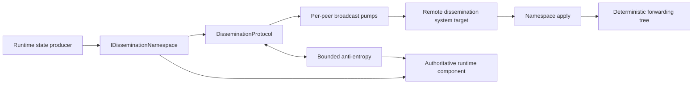

# Runtime state dissemination

Runtime dissemination is an internal silo-to-silo protocol which accelerates convergence of frequently changing runtime state. A deterministic tree carries new versions quickly, acknowledgments record peer knowledge, and bounded anti-entropy repairs loss, reordering, partitions, and membership skew. Each participating runtime component remains authoritative for its own state.

The dissemination protocol currently carries:

- deployment-load statistics among Active silos;
- membership snapshots and diffs among Joining, Active, ShuttingDown, and Stopping silos.

The deployment-load publisher and membership manager retain their direct delivery paths and validation rules. Tree broadcast and anti-entropy form one convergence feature: broadcast accelerates new updates, and repair discovers and delivers state missed by the tree.

## Components and responsibilities

`DisseminationProtocol` coordinates routing, peer capability evidence, anti-entropy, and application isolation. `DisseminationBroadcastQueue` owns per-peer scheduling, coalescing, retry, drain, and acknowledged-version ledgers. `DisseminationMembership` projects one membership snapshot into topology-specific member sets. Each `IDisseminationNamespace` owns serialization, current versions, retained history, payload limits, repair construction, and application semantics.

Queue entries contain `(namespace, key)` identities. A pump acquires both destination ownership and a global broadcast slot before materializing a repair. Coalesced notifications therefore use the latest namespace state and acknowledged baseline after admission, without retaining serialized payloads for waiting peers.

Applied state wakes each forwarding child, including same-version membership liveness advances. Duplicate deliveries wake children whose versions are still missing and whose queues contain no equivalent work. This lets a first tree delivery forward state already learned through a direct path while suppressing repeated forwarding cycles between silos with different topology views.

## Version and application invariants

A `DisseminationValue` names one key and a `[FromVersion, ToVersion]` transition:

- a full value starts at version zero and can establish state without a retained baseline;
- a delta starts at the receiver baseline and must form a contiguous version chain;
- acknowledged peer versions advance monotonically from explicit receiver evidence;
- duplicate and obsolete values leave authoritative state unchanged; and
- one rejected value does not prevent later values in the batch from being considered.

The namespace reports whether a repair is current, produced, unavailable, or unable to fit the supplied item and byte budgets. Produced repairs can be complete or a valid prefix. Prefix acknowledgments establish the receiver's new baseline and let the next batch continue the chain.

Membership uses the membership-table version plus a liveness fingerprint in its digest because `IAmAliveTime` can advance without a table-version change. It retains 32 snapshots, prefers a smaller diff when the peer baseline is present, and falls back to a full snapshot when history or capacity makes the diff unsuitable. Current diffs identify their entries as the complete target inventory, so table cleanup is reflected even when a receiver retained a different same-version baseline. Older partial-diff payloads retain their incremental semantics. Apply accepts same-version snapshots only when they advance liveness. The membership manager merges maximum per-entry liveness when publishing full snapshots, and diff construction preserves newer local liveness before handing state to that same manager.

Deployment-load versions are sample timestamps. Each repair is a full latest value. Application runs on the deployment-load publisher's scheduler and accepts samples only for Active silo generations in the membership oracle. Terminal membership transitions remove placement statistics, and the oracle's monotonic membership state rejects later samples for departed generations.

## Deterministic topology

Every silo derives routing from the same ordered membership projection. Members are ordered by status and silo address. Silo addresses order by generation, port, and IP address, providing stable ordering across membership storage providers with different timestamp precision. Joining, Active, ShuttingDown, and Stopping entries participate.

For fanout `f` and zero-based member index `i`, a forwarding node selects children starting at `f * (i + 1)` and continuing for at most `f` members. An originator sends to the first `f` members, excluding itself, plus its normal forwarding children. Stable ordering makes parent and child selection deterministic for a given membership version and fanout.

Namespaces select a membership scope before topology construction:

| Namespace | Scope | Operational effect |
|---|---|---|
| Deployment load | Active members | Placement data follows serving capacity. |
| Membership | All dissemination members | Joining and graceful-shutdown transitions can propagate. |

Fanout is derived from the target hop count and bounded by the configured minimum and maximum, or selected by the code-configured callback. A membership or fanout change creates a new topology from the next snapshot; acknowledged ledgers and anti-entropy repair convergence across the transition.

## Configuration and defaults

The subsystem and each namespace default to disabled. Enable <xref:Orleans.Configuration.DisseminationOptions.Enabled> together with <xref:Orleans.Configuration.DisseminationNamespaceOptions.Enabled> on the selected integration to activate broadcast and repair. Defaults bound concurrency, memory retention, payload size, and repair work:

| Option | Default | Effect |
|---|---:|---|
| <xref:Orleans.Configuration.DisseminationOptions.MaxConcurrentSends> | 32 | Per-silo active local broadcast attempts. |
| <xref:Orleans.Configuration.DisseminationOptions.MaxBatchItems> | 8,192 | Values materialized in an outgoing batch or examined in an incoming batch or repair response. |
| <xref:Orleans.Configuration.DisseminationOptions.MaxBatchBytes> | 1 MiB | Serialized payload bytes in an outgoing batch or admitted from an incoming batch or repair response. |
| <xref:Orleans.Configuration.DisseminationOverlayOptions.TargetHopCount> | 2 | Target depth used to derive fanout. |
| <xref:Orleans.Configuration.DisseminationOverlayOptions.MinFanOutFactor> / <xref:Orleans.Configuration.DisseminationOverlayOptions.MaxFanOutFactor> | 4 / 32 | Bounds for derived fanout. |
| <xref:Orleans.Configuration.DisseminationOverlayOptions.AntiEntropyInterval> | 5 seconds | Repair-round cadence and retry-delay ceiling. |
| <xref:Orleans.Configuration.DisseminationOverlayOptions.AntiEntropyPeerCount> | 3 | Maximum peers selected in one repair round and independent per-silo active local repair attempt limit. |
| <xref:Orleans.Configuration.DisseminationNamespaceOptions.MaxPendingItemCount> | 1,024 | Distinct retained keys per namespace and peer. |
| <xref:Orleans.Configuration.DisseminationNamespaceOptions.MaxCoalescingDelay> | 100 ms | Normal-priority batching window. |
| <xref:Orleans.Configuration.DisseminationNamespaceOptions.StaleItemTtl> | 30 seconds | Independent local transport and application budgets for each hop. |
| <xref:Orleans.Configuration.DisseminationNamespaceOptions.ExpectedUpdateCadence> | 10 seconds | Quiet period before a digest is offered for repair. |
| <xref:Orleans.Configuration.DisseminationNamespaceOptions.MaxPayloadBytes> | 1 MiB | Maximum serialized value size for the namespace. |

Each integration has its own <xref:Orleans.Configuration.DisseminationNamespaceOptions>. Operators can enable and tune membership and deployment-load dissemination independently while retaining the local concurrency and per-message bounds.

The anti-entropy loop waits without periodic timer wakeups while the subsystem is disabled. An options-change notification wakes the loop when enablement changes; disabling it returns the loop to the dormant wait. Shutdown removes the options subscription and observes the loop's completion.

Enablement requires representative measurements of convergence, RPC volume, serialized bytes, allocation, CPU, and tail latency across stable membership, churn, and partition recovery. Tree delivery can reduce RPC counts while increasing serialized bytes through forwarding and repair. Compare the original runtime, the updated default-off path, and the enabled path at the intended cluster sizes and publication rates, including skewed peer speeds and rolling upgrades.

## Broadcast pumps and backpressure

Each destination has one independent pump. Repeated notifications coalesce by namespace and key, high-priority namespaces bypass the coalescing window, and batches obey global item and byte bounds plus namespace payload bounds. An owner-wide managed admission gate combines the local broadcast limit with one active local broadcast attempt per destination.

Admission uses an explicit FIFO linked list. Releasing a batch admits the oldest ready destinations, skipping peers with an active local attempt. A peer with a backlog or acknowledged repair prefix rejoins admission for every batch, behind other ready peers. Priority changes when a pump becomes ready, rather than allowing it to overtake already-ready peers. Destination ownership uses the full `SiloAddress`, including generation, and ends with the local attempt.

`MaxPendingItemCount` bounds distinct retained keys per namespace and peer. A notification for an admitted key refreshes its generation at the limit. A new key is rejected until acknowledgment-driven completion, an oversized repair, or membership pruning releases capacity. Oversized repairs retain acknowledged peer versions separately so a later publication can resume from the established baseline. The runtime emits a rejection metric and a diagnostic event without including the key. A rejected tree target makes publication return `false`, allowing the producer's direct path to deliver the update.

The aggregate pending-key bound is topology-dependent: sum `MaxPendingItemCount` over the retained peer/namespace pairs, with identity-only snapshots for active flushes. Acknowledged-version ledgers additionally scale with known namespace keys and retained peers and are pruned against membership and the authoritative key inventory.

With fixed configuration, active local broadcast attempts materialize at most `MaxConcurrentSends` batches, each bounded by `MaxBatchBytes`. Waiting peers retain identities until admission. Namespace-owned current values and repair history, identity and acknowledgment metadata, and messaging-layer buffers for pending RPCs are separate memory costs. Broadcast and aggregate repair concurrency limits are captured when the protocol is constructed; tune them before silo startup.

A successful RPC is transport completion. The receiver response is the evidence which advances the peer ledger. Missing or prefix acknowledgments retain work for repair. Transport timeout and failure requeue the generation with exponential backoff capped by the anti-entropy interval. A newer notification can replace that schedule with its own urgency.

The transport hop lifetime starts after admission. Local completion, timeout, or pump cancellation releases both the broadcast slot and destination ownership. Timeout signals the RPC's cancellation token and requeues the generation with backoff, allowing subsequent attempts and other ready destinations to proceed while the earlier RPC completes under the messaging runtime's lifetime rules. Pump cancellation removes pending admission requests; a concurrent grant is either used by the caller or released exactly once.

Admission retains its FIFO position until capacity is available or the pump stops. An explicit flush caller supplies its own bounded cancellation token to limit its wait for capacity. Cancelling that observer throws cancellation while leaving the shared pump in its FIFO position. Shutdown uses its caller's cancellation budget to stop the pump and remove its pending admission.

Unexpected iteration failures retain work and retry. A failure in the recovery path permanently fails the pump and explicitly completes flush and drain waiters with the failure. Shutdown can drain accepted work within the caller's cancellation budget or discard a removed peer's work during membership pruning.

## Bounded anti-entropy

An anti-entropy round rotates through at most `AntiEntropyPeerCount` eligible peers. Rotation progress persists across membership versions so frequent table updates still allow every eligible peer to participate. The broadest participating membership scope provides the global peer budget; each request includes only namespaces for which that peer is eligible.

Repair has its own admission gate, independent of broadcast slots. Across overlapping rounds, at most `AntiEntropyPeerCount` local repair attempts are active, with at most one per destination. Busy slots and destinations are skipped until future rotating rounds. A round creates its shared digest snapshot and per-peer requests only after acquiring slots. Request digest storage scales with namespace key inventory. Each exchange bounds its local wait using the round's lifetime and cancellation token, and releases admission before the round completes.

Digests identify namespace-owned keys, including missing state at version zero, so repair can discover work rejected during queue admission. Recently advanced streams suppress redundant probes until `ExpectedUpdateCadence` elapses. Responses obey item, batch-byte, payload-byte, and hop-lifetime bounds. Persistent per-requester cursors rotate truncated responses so hot early keys cannot starve later candidates. Cursor state for non-members is least-recently-used and bounded to 64 entries.

Requests advertise the receiver's item and payload-byte limits. Responders use the smaller local and advertised limits, allowing their response cursor to provide fair service even when peers use different batch sizes. Older requests use the responder's own limits. Receivers independently cap incoming broadcasts and repair responses before grouping or applying values. Broadcast acknowledgments cover only the admitted keys at their actual local versions. Receive cursors advance through bounded ordered intervals for oversized deliveries while preserving the order of each repair chain. Cursor state is scoped to peer and direction, with at most 64 retained non-member cursors. Request digest inventory remains separate from these response admission budgets.

Repairs from each sender remain ordered. Competing sender chains are ranked before application, and the namespace's monotonic apply contract rejects an obsolete or incompatible chain. Responses which completed successfully within their local attempt are still applied when another peer exceeds the round deadline. Late RPC faults are observed, and subsequent rounds repair responses which missed the application window. During a partition, local attempts remain bounded and retries follow the configured cadence; after connectivity and membership views recover, rotating peer selection and cursors continue convergence.

## Mixed-version behavior

Peer namespace support is evidence-driven. Inbound traffic, broadcast acknowledgments, and authoritative anti-entropy responses confirm support for one silo generation. An explicit unsupported response revokes it and retires the publication generations covered by that flush. Publications admitted during the send remain queued with a fresh peer baseline. Membership pruning removes evidence for departed generations.

Deployment-load publication uses dissemination for confirmed peers and the direct system target for unconfirmed peers. If dissemination is disabled, unavailable, rejected, or unable to accept the update within one refresh interval, direct fanout covers all Active peers. Membership direct gossip begins before optional dissemination and keeps the caller's cancellation and shutdown deadline.

## Concurrency and lifetime

Protocol dictionaries use focused locks for membership projections, response cursors, value-update timestamps, peer capability evidence, and per-peer pump state. Network calls, namespace application, logging, diagnostic callbacks, and waiter continuations run outside those locks. Waiters use asynchronous continuations.

Caller cancellation owns public operation lifetime and is checked before each received value is applied. Per-hop value TTL bounds the local broadcast RPC wait and anti-entropy exchange lifetime, independently of the runtime's cancellation-acknowledgment setting. Application has a separate local window capped by the receiving namespace's TTL. Broadcast values age from the start of receiver processing, including delays caused by earlier items; completed anti-entropy responses begin their application window after the exchanges finish. These windows use local elapsed time, preserving operation across clock skew. Namespace owners observe cancellation before committing queued or resumed work, including membership application following a pending refresh. Shared admission waits are pump-cancellable and retain their FIFO position while capacity is unavailable. Explicit flush and drain observers use their caller's cancellation token, with no separate observer TTL; supply a bounded token when waiting indefinitely for admission is unacceptable.

Stopping rejects new notifications and repair admissions. Accepted broadcast work drains through acknowledgments, including retries with the usual backoff, within the shutdown caller's budget. Cancellation reports an incomplete drain and stops its queued admissions, local RPC waits, and pump timers. Each local attempt releases its managed admission lease during cleanup. Once pumps stop, the broadcast gate closes to further admissions. Repair cancellation is explicitly forwarded before disposing the round's linked sources, even when the local wait completes cancellation first.

A stalled destination occupies at most one active local broadcast slot and one independent local repair slot. Hop deadlines release those slots and signal cancellation, allowing queued broadcasts and future repair rounds to continue. Retry backoff, rotating peer selection, per-message budgets, and local admission together bound the pace and size of new attempts.

The messaging runtime owns pending RPC completion. `InsideRuntimeClient` monitors callback expiry using the system-target response timeout, normally <xref:Orleans.Configuration.SiloMessagingOptions.SystemResponseTimeout> unless the method overrides it. Cancellation follows the configured acknowledgment policy, and `CallbackData.OnTimeout` completes and unregisters expired requests. Remote handlers can continue after a local dissemination attempt ends; their execution follows ordinary runtime cancellation and response-timeout behavior.

Dissemination RPC contracts carry required cancellation tokens through their implementations, callers, and scheduler handoffs. Background loops receive their owned shutdown token explicitly. Deployment-load timer callbacks forward the timer's cancellation token through publication and direct statistics RPCs, and disposing the timer cancels an active publication. Fault observers follow late transport completion after a local broadcast or repair attempt ends.

Deployment-load mutation and subscriber delivery run on the publisher's scheduler. Concurrent dictionary reads support namespace digests and repair construction. Direct publications retain their existing equal-timestamp notification behavior; dissemination classifies equal timestamps as duplicates so repair settles without repeated subscriber delivery.

## Observability

The standard `Microsoft.Orleans` meter exposes publication outcomes, broadcast volume, payload bytes, apply outcomes, retries, failures, anti-entropy work, drops, pump failures, and queue admission rejection. Dimensions are bounded to namespace, direction, kind, result, reason, truncation, and pump status. Diagnostic events provide payload-level apply/drop detail and deterministic pump scheduling detail for short-lived investigation.

See [Monitor runtime dissemination](../host/monitoring/runtime-dissemination.md) for instrument semantics, dashboards, alerts, and failure diagnosis.
