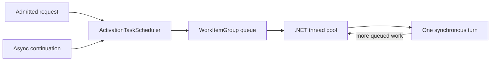

# Scheduling and turn execution

Orleans separates **request scheduling** from **task scheduling**:

- request scheduling decides which incoming calls may make progress for an activation;
- task scheduling executes each synchronous work item one at a time in that activation's context.

This distinction explains how reentrant calls can interleave without two pieces of grain code running in parallel on the same activation.

## `WorkItemGroup` and `ActivationTaskScheduler`

Each activation owns a `WorkItemGroup` and an `ActivationTaskScheduler`, which derives from the .NET <xref:System.Threading.Tasks.TaskScheduler> abstraction. The task scheduler enqueues work into the group. The group implements a small state machine (`Waiting`, `Runnable`, and `Running`) and schedules itself onto the [.NET managed thread pool](https://learn.microsoft.com/dotnet/standard/threading/the-managed-thread-pool).



Only one thread can execute a `WorkItemGroup` at a time. That thread is not permanently assigned: different turns can run on different pool threads. The invariant is exclusive execution of the activation context, not thread affinity.

Source: [`WorkItemGroup`](https://github.com/dotnet/orleans/blob/main/src/Orleans.Runtime/Scheduler/WorkItemGroup.cs) and [`ActivationTaskScheduler`](https://github.com/dotnet/orleans/blob/main/src/Orleans.Runtime/Scheduler/ActivationTaskScheduler.cs).

## Async methods become multiple turns

An async grain method runs synchronously until it awaits incomplete work. Its continuation is later queued back to the same activation scheduler.

```csharp
public async Task UpdateAsync()
{
    ApplyFirstChange();       // turn 1
    await ReadDependency();   // yields
    ApplySecondChange();      // a later turn
}
```

For a non-reentrant activation, other application requests normally wait while this request is incomplete. For reentrant or selectively interleavable calls, another request can run during the await. It still runs as a separate synchronous turn; it does not execute in parallel with `ApplyFirstChange` or `ApplySecondChange`.

Therefore, grain state is protected from parallel access by the scheduler but can still change across an `await` when interleaving is allowed. Code must recheck assumptions after awaits in reentrant grains.

## Request admission

`ActivationData` owns pending and running requests. It applies the grain's concurrency policy, dispatches eligible messages, and signals completion so that another request can progress. Policies include:

- the default non-reentrant model;
- grain-wide reentrancy;
- call-chain reentrancy;
- `[AlwaysInterleave]`; and
- predicate-based `[MayInterleave]`.

The user-facing rules are documented in [request scheduling](../grains/request-scheduling.md). Internally, request admission and task serialization remain separate layers.

## Runtime context and inline execution

`ActivationTaskScheduler.TryExecuteTaskInline` permits inline execution only when the current `RuntimeContext` belongs to the same `WorkItemGroup` and the task was not already queued. Runtime helpers follow the same rule: execute inline in the matching grain context, otherwise enqueue.

This prevents a continuation or runtime callback from bypassing activation isolation simply because it originated on a thread which is already processing Orleans work.

## Blocking and escaping the scheduler

Blocking a turn prevents every queued continuation and admitted request for that activation from progressing. Sync-over-async can deadlock when the awaited completion needs the same activation scheduler.

`Task.Run` executes outside the activation scheduler. It can be useful for isolated CPU work, but code running there must not directly access mutable grain state or assume `RuntimeContext.Current` is the activation. Return immutable results and apply them in a scheduled continuation.

## Fairness and diagnostics

`WorkItemGroup` drains work subject to runtime scheduling limits so one busy activation does not permanently own a thread-pool worker. Long synchronous turns still delay other work and are reported by runtime scheduling diagnostics. The [.NET diagnostics tools](https://learn.microsoft.com/dotnet/core/diagnostics/) provide the underlying runtime traces, counters, and dumps used alongside Orleans telemetry.

Scheduling guarantees are local to an activation. They do not order calls across grains, create a distributed lock, or provide message exactly-once behavior.
