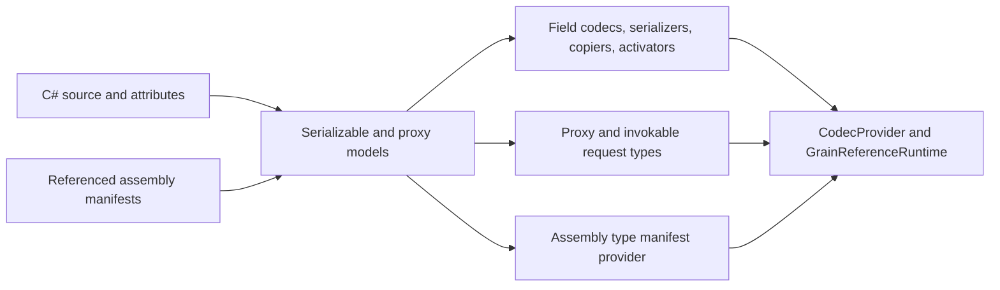

# Serialization and code generation internals

Orleans serialization serves two related pipelines:

- value serialization, deep copying, and activation for message and storage payloads;
- RPC code generation for grain references, request objects, dispatch, and responses.

Most application code uses generated components. Reflection-based discovery is deliberately not the default architecture: generated manifests make the participating types explicit and keep runtime dispatch compatible with trimming and ahead-of-time compilation.

## Incremental generator pipeline

The Orleans source generator is a Roslyn incremental generator. It discovers types marked with <xref:Orleans.GenerateSerializerAttribute> and interfaces marked directly or transitively with <xref:Orleans.GenerateMethodSerializersAttribute>. It also reads metadata emitted by referenced assemblies.



Generated output includes serializers, field codecs, deep copiers, activators, grain proxies, invokable method objects, dispatch metadata, aliases, and a type-manifest provider. Diagnostics reject inaccessible types, ambiguous field identity, unsupported RPC shapes, and missing cross-assembly generation metadata before the application starts.

Source: [`OrleansSourceGenerator`](https://github.com/dotnet/orleans/blob/main/src/Orleans.CodeGenerator/OrleansSourceGenerator.cs) and [`ReferenceAssemblyDataProvider`](https://github.com/dotnet/orleans/blob/main/src/Orleans.CodeGenerator/ReferenceAssemblyDataProvider.cs).

## Field identity is the wire contract

`[Id(n)]` identifies a serialized member within its declaring type. IDs are not field order and must remain stable as source is edited.

```csharp
[GenerateSerializer]
public sealed class AccountSnapshot
{
    [Id(0)]
    public string Owner { get; init; } = "";

    [Id(1)]
    public decimal Balance { get; init; }
}
```

Adding a new ID is compatible with readers which tolerate an omitted field. Reusing or renumbering an existing ID changes the meaning of bytes on the wire and can corrupt rolling upgrades or persisted data.

`GenerateSerializerAttribute.GenerateFieldIds` defaults to `None`. Automatic public-property IDs are available, but explicit IDs make compatibility review visible. Primary constructor parameters are included by default for records and excluded by default for other types.

Aliases provide stable type identity when CLR names move. A type alias must remain unique in the manifest. Generic and compound aliases are resolved through the manifest's alias tree.

## Writer and reader sessions

The wire protocol uses writer and reader sessions to track references and type information across a payload. Reference tracking preserves object identity and cycles. A field codec writes field headers and values; the matching codec reads or skips fields it understands.

Deep copying is a separate operation used when Orleans must preserve isolation without crossing a transport boundary. Immutable values can bypass copying; mutable values require a generated or custom copier. Declaring a mutable type immutable trades safety for speed and must be justified by the type's actual behavior.

## RPC generation

For each grain interface method, generated code captures arguments in an invokable object. The generated proxy submits that object through its proxy base. On the target, generated dispatch metadata invokes the concrete implementation and encodes the response.

The request object is serializable like any other Orleans value. Stable method and interface metadata allow caller and target assemblies to evolve independently within the supported versioning rules. Outgoing and incoming call filters wrap the generated invocation; they do not replace serialization or dispatch.

## Runtime manifest and type safety

Each generated assembly carries a `TypeManifestProviderAttribute`. `ISerializerBuilder.AddAssembly` finds those providers and contributes their components to <xref:Orleans.Serialization.Configuration.TypeManifestOptions>.

The manifest records:

- activators, field codecs, serializers, copiers, and converters;
- RPC interfaces, proxies, and implementations;
- well-known numeric type IDs and aliases; and
- explicitly allowed types and assemblies.

`AllowAllTypes` defaults to `false`. This is a type-resolution boundary: receiving a formatted type name does not make every loadable CLR type valid input.

Source: [`TypeManifestOptions`](https://github.com/dotnet/orleans/blob/main/src/Orleans.Serialization/Configuration/TypeManifestOptions.cs), [`SerializerBuilderExtensions`](https://github.com/dotnet/orleans/blob/main/src/Orleans.Serialization/Hosting/SerializerBuilderExtensions.cs), and [`ServiceCollectionExtensions.AddSerializer`](https://github.com/dotnet/orleans/blob/main/src/Orleans.Serialization/Hosting/ServiceCollectionExtensions.cs).

## Extension points

Use the registration APIs exposed by `ISerializerBuilder` for:

- a field codec when a type needs custom wire encoding;
- a deep copier when generated member-wise copy is unsuitable;
- an activator when construction needs special handling;
- a serializer when the type owns an external format; or
- a converter which maps a type to a supported surrogate.

Keep codec and copier behavior paired. A custom serializer which preserves a graph while its copier loses reference identity can produce different local and remote call behavior.

Configuration examples belong in the [serialization configuration guide](../host/configuration-guide/serialization.md). Implementation behavior is exercised by [`GeneratedSerializerTests`](https://github.com/dotnet/orleans/blob/main/test/Orleans.Serialization.UnitTests/GeneratedSerializerTests.cs) and [`GeneratedSerializerBitwiseCompatibilityTests`](https://github.com/dotnet/orleans/blob/main/test/Orleans.Serialization.UnitTests/GeneratedSerializerBitwiseCompatibilityTests.cs).
