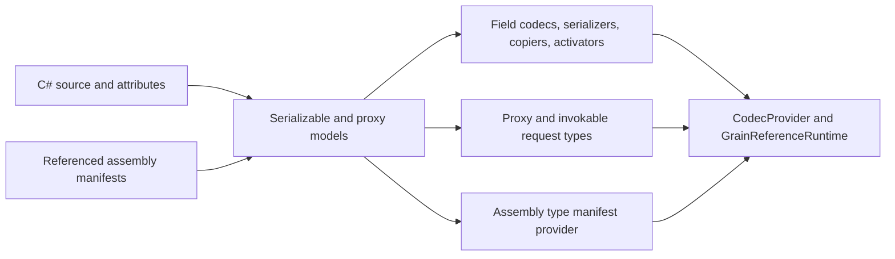
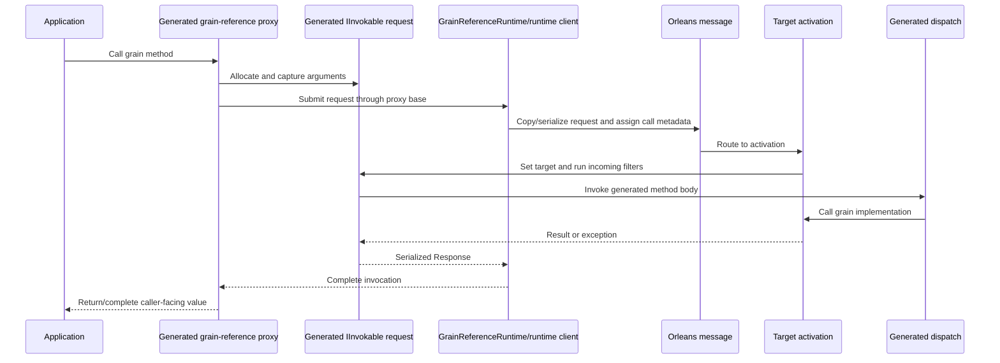

# Serialization and code generation internals

Orleans serialization serves two related pipelines:

- value serialization, deep copying, and activation for message and storage payloads;
- RPC code generation for grain references, request objects, dispatch, and responses.

Most application code uses generated components. Reflection-based discovery is deliberately not the default architecture: generated manifests make the participating types explicit and keep runtime dispatch compatible with [trimming](https://learn.microsoft.com/dotnet/core/deploying/trimming/prepare-libraries-for-trimming) and ahead-of-time compilation.

## Incremental generator pipeline

The Orleans source generator is a [Roslyn source generator](https://learn.microsoft.com/dotnet/csharp/roslyn-sdk/#source-generators) implemented using the incremental generator APIs. It discovers types marked with <xref:Orleans.GenerateSerializerAttribute> and interfaces marked directly or transitively with <xref:Orleans.GenerateMethodSerializersAttribute>. It also reads metadata emitted by referenced assemblies.

Generated output includes serializers, field codecs, deep copiers, activators, grain proxies, invokable method objects, dispatch metadata, aliases, and a type-manifest provider. Diagnostics reject inaccessible types, ambiguous field identity, unsupported RPC shapes, and missing cross-assembly generation metadata before the application starts.

Source: [`OrleansSourceGenerator`](https://github.com/dotnet/orleans/blob/main/src/Orleans.CodeGenerator/OrleansSourceGenerator.cs) and [`ReferenceAssemblyDataProvider`](https://github.com/dotnet/orleans/blob/main/src/Orleans.CodeGenerator/ReferenceAssemblyDataProvider.cs).

## Field identity is the wire contract

<xref:Orleans.IdAttribute> identifies a serialized member within its declaring type. IDs are not field order and must remain stable as source is edited.

For example, `[Id(0)]` and `[Id(1)]` identify two different members. Adding a new ID is compatible with readers which tolerate an omitted field. Reusing or renumbering an existing ID changes the meaning of bytes on the wire and can corrupt rolling upgrades or persisted data.

<xref:Orleans.GenerateSerializerAttribute.GenerateFieldIds?displayProperty=nameWithType> defaults to <xref:Orleans.GenerateFieldIds.None?displayProperty=nameWithType>. Automatic public-property IDs are available, but explicit IDs make compatibility review visible. Primary constructor parameters are included by default for records and excluded by default for other types.

Aliases provide stable type identity when CLR names move. A type alias must remain unique in the manifest. Generic and compound aliases are resolved through the manifest's alias tree.

## Writer and reader sessions

The wire protocol uses writer and reader sessions to track references and type information across a payload. Reference tracking preserves object identity and cycles. A field codec writes field headers and values; the matching codec reads or skips fields it understands.

Deep copying is a separate operation used when Orleans must preserve isolation without crossing a transport boundary. Immutable values can bypass copying; mutable values require a generated or custom copier. Declaring a mutable type immutable trades safety for speed and must be justified by the type's actual behavior.

Field headers carry an ID and wire type, so readers can consume fields in a different source order. Generated readers dispatch known IDs and call `ConsumeUnknownField` for fields introduced by a newer writer. Additive evolution preserves wire types and stable IDs; changing either assigns incompatible meaning to existing payloads.

Reference tracking is scoped to a writer/reader session and preserves repeated references and cycles within one payload. Applications own identity and request deduplication across calls and retries. A deep copier uses a corresponding session so a copied graph has the same aliasing relationships as the serialized graph.

## RPC generation

For each grain interface method, generated code captures arguments in an invokable object. The generated proxy submits that object through its proxy base. On the target, generated dispatch metadata invokes the concrete implementation and encodes the response.

The request object is serializable like any other Orleans value. Stable method and interface metadata allow caller and target assemblies to evolve independently within the supported versioning rules. Outgoing and incoming call filters wrap the generated invocation; they do not replace serialization or dispatch.

The generated request type and response envelope are part of the rolling-upgrade boundary. Old readers skip newly introduced fields, new readers supply compatible defaults for omitted fields, and every compatible interface version uses decodable argument and result types. Method identity and interface version routing remain separate from value wire identity.

### Generated call path

The stages preserve these boundaries:

1. The incremental generator discovers interfaces marked directly or transitively with <xref:Orleans.GenerateMethodSerializersAttribute> and resolves the selected proxy base.
2. It emits a proxy method and a generated request type implementing <xref:Orleans.Serialization.Invocation.IInvokable>. Each argument is a generated field.
3. The request implements `GetArgumentCount`, `GetArgument`, and `SetArgument`. [Call filters](../grains/interceptors.md) and [request scheduling predicates](../grains/request-scheduling.md) use those accessors to inspect or replace arguments before dispatch.
4. The proxy base submits the request through <xref:Orleans.Runtime.GrainReference> and <xref:Orleans.Runtime.IGrainReferenceRuntime>. Outgoing filters run around that submission.
5. The runtime creates a message whose body is the invokable request. The request's compound type identity and the message's interface/version metadata let the receiver resolve the generated type and target contract.
6. The target runtime resolves the activation, installs the target on the request, runs incoming filters, and calls <xref:Orleans.Serialization.Invocation.IInvokable.Invoke*>. Generated `InvokeInner` code dispatches directly to the grain implementation.
7. The invokable base converts completion, result, or exception into a <xref:Orleans.Serialization.Invocation.Response>. The caller runtime completes the waiting operation.

For a return type marked through <xref:Orleans.Invocation.ReturnValueProxyAttribute>, step 4 changes at the proxy boundary: generated code calls the configured initializer on the request and returns its value. The initializer owns request submission or another adapter protocol. The target still receives and dispatches the generated request according to the invokable base contract. See [customize Orleans serialization code generation](../host/configuration-guide/serialization-code-generation-customization.md).

### Generated components and responsibilities

| Component | Responsibility |
| --- | --- |
| Generated grain-reference proxy | Implements the grain interface, rents or creates a request, copies arguments into it, applies method options, and invokes the selected proxy-base method or return-value initializer. |
| Generated request type | Carries serialized arguments, exposes argument inspection and mutation, records interface and method metadata, accepts the target activation, and calls the grain implementation through `InvokeInner`. |
| <xref:Orleans.Serialization.Invocation.IInvokable> | Defines target binding, dispatch, argument access, cancellation hooks, method metadata, response timeout, and disposal. |
| Proxy base | Defines how each return family enters the client runtime. <xref:Orleans.Runtime.GrainReference> provides the built-in task, value-task, void, and async-enumerable mappings. |
| Invokable base | Defines target-side completion and response adaptation. Custom bases can also define a caller-facing adapter through <xref:Orleans.Invocation.ReturnValueProxyAttribute>. |
| Generated metadata | Registers proxy implementations, grain implementations, codecs, activators, and compound request aliases in the assembly manifest. |

Arguments and result values use normal Orleans.Serialization codecs and copiers. Exceptions are represented by exception responses and rethrown by the caller completion source. A grain call with a `CancellationToken` exposes cancellation through the generated request, allowing the runtime to propagate cooperative cancellation. Void methods set the one-way invocation option in their request base, so no response completion source waits for a result.

### Request identity and dispatch

Generated request names are implementation details. Their wire identity is a compound alias containing:

- the `inv` marker;
- the proxy-base identity;
- the grain interface type;
- the declaring interface for extension methods; and
- the method identity.

The method identity uses an explicit <xref:Orleans.IdAttribute> value, an <xref:Orleans.AliasAttribute>, or a deterministic hash of the method signature. When an explicit identity differs from the generated hash, Orleans emits compatibility aliases for both identities. This lets manifest resolution identify the request type independently of its generated CLR name.

The message also carries the grain interface type and version used by version selection. Type identity resolves the serialized request body; interface/version metadata selects compatible dispatch. These are related compatibility boundaries with separate responsibilities.

### Source and referenced assembly metadata

Syntax providers create stable models for source-declared serializable types and proxy interfaces. A separate compilation-dependent stage scans source and referenced assembly metadata for application parts, aliases, compound aliases, serializer registrations, proxy interfaces, implementations, and assembly-level invokable mappings.

The generator combines those models when it prepares proxy output and the type manifest. Equality comparers on normalized models preserve incremental caching when syntax-derived contracts remain unchanged. Compilation-dependent binding stays in the output preparation phase because return mappings, accessibility, generic constraints, constructors, and initializer overload resolution can change when references change.

This split allows an unrelated source edit to reuse proxy models while a referenced adapter or assembly-level mapping correctly invalidates generated proxy output.

## Runtime manifest and type safety

Each generated assembly carries a <xref:Orleans.Serialization.Configuration.TypeManifestProviderAttribute>. <xref:Orleans.Serialization.SerializerBuilderExtensions.AddAssembly*?displayProperty=nameWithType> finds those providers and contributes their components to <xref:Orleans.Serialization.Configuration.TypeManifestOptions>.

The manifest records:

- activators, field codecs, serializers, copiers, and converters;
- RPC interfaces, proxies, and implementations;
- well-known numeric type IDs and aliases; and
- explicitly allowed types and assemblies.

<xref:Orleans.Serialization.Configuration.TypeManifestOptions.AllowAllTypes?displayProperty=nameWithType> defaults to `false`. This is a type-resolution boundary: receiving a formatted type name does not make every loadable CLR type valid input.

API: <xref:Orleans.Serialization.Configuration.TypeManifestOptions>, <xref:Orleans.Serialization.ISerializerBuilder>, and <xref:Orleans.Serialization.SerializerBuilderExtensions.AddAssembly*?displayProperty=nameWithType>. Implementation: [manifest options](https://github.com/dotnet/orleans/blob/main/src/Orleans.Serialization/Configuration/TypeManifestOptions.cs), [serializer builder extensions](https://github.com/dotnet/orleans/blob/main/src/Orleans.Serialization/Hosting/SerializerBuilderExtensions.cs), and [serializer service registration](https://github.com/dotnet/orleans/blob/main/src/Orleans.Serialization/Hosting/ServiceCollectionExtensions.cs).

## Extension points

Use the registration APIs exposed by <xref:Orleans.Serialization.ISerializerBuilder> for:

- a field codec when a type needs custom wire encoding;
- a deep copier when generated member-wise copy is unsuitable;
- an activator when construction needs special handling;
- a serializer when the type owns an external format; or
- a converter which maps a type to a supported surrogate.

Keep codec and copier behavior paired. A custom serializer which preserves a graph while its copier loses reference identity can produce different local and remote call behavior.

RPC code-generation extensions can register custom invokable bases and caller-facing return adapters. See [customize Orleans serialization code generation](../host/configuration-guide/serialization-code-generation-customization.md).

Configuration examples belong in the [serialization configuration guide](../host/configuration-guide/serialization.md). The [source-generation guide](../grains/code-generation.md) covers application-facing generation rules. Runtime call behavior is described in [messaging and delivery semantics](messaging-delivery-guarantees.md). Implementation behavior is exercised by [`GeneratedSerializerTests`](https://github.com/dotnet/orleans/blob/main/test/Orleans.Serialization.UnitTests/GeneratedSerializerTests.cs), [`GeneratedSerializerBitwiseCompatibilityTests`](https://github.com/dotnet/orleans/blob/main/test/Orleans.Serialization.UnitTests/GeneratedSerializerBitwiseCompatibilityTests.cs), and [`CustomReturnTypeTests`](https://github.com/dotnet/orleans/blob/main/test/Orleans.CodeGenerator.Tests/CustomReturnTypeTests.cs).
