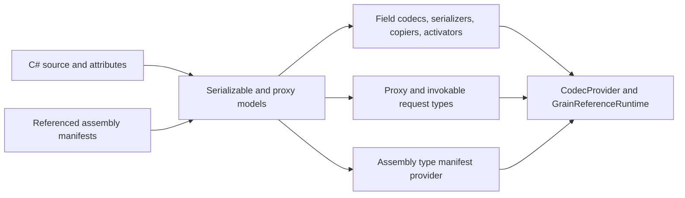
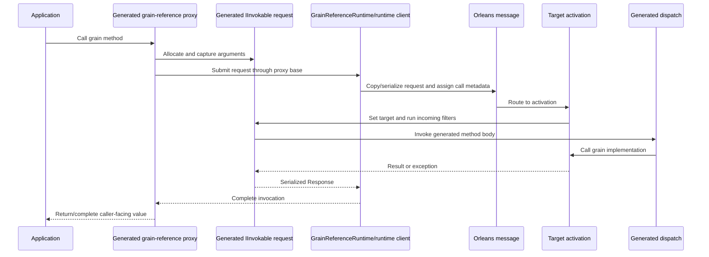

# Serialization and code generation internals

Orleans serialization serves two related pipelines:

- value serialization, deep copying, and activation for message and storage payloads;
- RPC code generation for grain references, request objects, dispatch, and responses.

Most application code uses generated components. Reflection-based discovery is deliberately not the default architecture: generated manifests make the participating types explicit and keep runtime dispatch compatible with [trimming](https://learn.microsoft.com/dotnet/core/deploying/trimming/prepare-libraries-for-trimming) and ahead-of-time compilation.

## Incremental generator pipeline

The Orleans source generator is a [Roslyn source generator](https://learn.microsoft.com/dotnet/csharp/roslyn-sdk/#source-generators) implemented using the incremental generator APIs. It discovers types marked with <xref:Orleans.GenerateSerializerAttribute> and interfaces marked directly or transitively with <xref:Orleans.GenerateMethodSerializersAttribute>. It also reads metadata emitted by referenced assemblies.

```mermaid
flowchart LR
    Source[C# source and attributes]
    Refs[Referenced assembly manifests]
    Models[Serializable and proxy models]
    Codecs[Field codecs, serializers, copiers, activators]
    RPC[Proxy and invokable request types]
    Manifest[Assembly type manifest provider]
    Runtime[CodecProvider and GrainReferenceRuntime]

    Source --> Models
    Refs --> Models
    Models --> Codecs
    Models --> RPC
    Models --> Manifest
    Codecs --> Runtime
    RPC --> Runtime
    Manifest --> Runtime
```

Generated output includes serializers, field codecs, deep copiers, activators, grain proxies, invokable method objects, dispatch metadata, aliases, and a type-manifest provider. Diagnostics reject inaccessible types, ambiguous field identity, unsupported RPC shapes, and missing cross-assembly generation metadata before the application starts.

Source: [`OrleansSourceGenerator`](https://github.com/dotnet/orleans/blob/main/src/Orleans.CodeGenerator/OrleansSourceGenerator.cs) and [`ReferenceAssemblyDataProvider`](https://github.com/dotnet/orleans/blob/main/src/Orleans.CodeGenerator/ReferenceAssemblyDataProvider.cs).

## Field identity is the wire contract

<xref:Orleans.IdAttribute> identifies a serialized member within its declaring type. IDs are not field order and must remain stable as source is edited.

For example, `[Id(0)]` and `[Id(1)]` identify two different members. Adding a new ID is compatible with readers which tolerate an omitted field. Reusing or renumbering an existing ID changes the meaning of bytes on the wire and can corrupt rolling upgrades or persisted data.

<xref:Orleans.GenerateSerializerAttribute.GenerateFieldIds?displayProperty=nameWithType> defaults to <xref:Orleans.GenerateFieldIds.None?displayProperty=nameWithType>. Automatic public-property IDs are available, but explicit IDs make compatibility review visible. Primary constructor parameters are included by default for records and excluded by default for other types.

Aliases provide stable type identity when CLR names move. A type alias must remain unique in the manifest. Generic and compound aliases are resolved through the manifest's alias tree.

## Writer and reader sessions

The wire protocol uses writer and reader sessions to track references and type information across a payload. Reference tracking preserves object identity and cycles. A field codec writes field headers and values; the matching codec reads or skips fields it understands.

Deep copying is a separate operation used when Orleans must preserve isolation without crossing a transport boundary. Immutable values can bypass copying; mutable values require a generated or custom copier. Declaring a mutable type immutable trades safety for speed and must be justified by the type's actual behavior.

Field headers carry an ID and wire type, so readers can consume fields in a different source order. Generated readers dispatch known IDs and call `ConsumeUnknownField` for fields introduced by a newer writer. Additive evolution preserves wire types and stable IDs; changing either assigns incompatible meaning to existing payloads.

Reference tracking is scoped to a writer/reader session and preserves repeated references and cycles within one payload. Applications own identity and request deduplication across calls and retries. A deep copier uses a corresponding session so a copied graph has the same aliasing relationships as the serialized graph.

### Serialization constructor initialization

For <xref:System.Runtime.Serialization.ISerializable> reference types, deserialization allocates an uninitialized object and records it in the reader session before reading its fields. The serialization constructor initializes that same object, so references read from the payload resolve to the final instance, including cycles. `OnDeserializing` runs before constructor initialization; `OnDeserialized` and <xref:System.Runtime.Serialization.IDeserializationCallback.OnDeserialization*> run afterward.

Orleans caches constructor delegates by owner type and delegate shape and uses the same existing-instance initialization path on managed runtimes and NativeAOT. The base <xref:System.Exception> serialization constructor uses a statically bound accessor on .NET 8 and later, including the fallback for exception subtypes which inherit the base serialization contract. Runtime-selected serialization constructors use reflection to initialize the existing object; the .NET Standard asset also uses reflection for the base exception constructor. Preserve public and non-public constructors on those types so native compilation retains the constructor metadata and implementation. Reflection invokes constructors with `BindingFlags.DoNotWrapExceptions`, preserving the original exception's identity and constructor stack, including constructor-thrown <xref:System.Reflection.TargetInvocationException>.

Boxed value-type delegates initialize the existing box. Statically closed value-type constructor delegates box the caller's `ref` value, initialize that box, and copy it back in a `finally` block, including mutations performed before a constructor throws. Runtime-created generic value-type serializers and attributed callback delegates have additional runtime code-generation requirements. NativeAOT constructor support targets .NET 10 and later; native application support also depends on type manifests, codec factories, and callback paths used by the application.

## RPC generation

Grain-reference construction resolves the generated proxy from the registered type manifest and invokes its `(GrainReferenceShared, IdSpan)` constructor. The activator caches the constructor delegate and shares the runtime, interface version, invocation options, and serialization services across references for the same grain type and interface. Each reference retains its own grain key. JIT runtimes use an emitted constructor delegate; NativeAOT uses a cached reflection constructor invoker. Generated `AddInterfaceProxy` registrations preserve the public proxy constructor during trimming.

For each grain interface method, generated code captures arguments in an invokable object. The generated proxy submits that object through its proxy base. On the target, generated dispatch metadata invokes the concrete implementation and encodes the response.

The request object is serializable like any other Orleans value. Stable method and interface metadata allow caller and target assemblies to evolve independently within the supported versioning rules. Outgoing and incoming call filters wrap the generated invocation; they do not replace serialization or dispatch.

The generated request type and response envelope are part of the rolling-upgrade boundary. Old readers skip newly introduced fields, new readers supply compatible defaults for omitted fields, and every compatible interface version uses decodable argument and result types. Method identity and interface version routing remain separate from value wire identity.

### Generated call path

```mermaid
sequenceDiagram
    participant App as Application
    participant Proxy as Generated grain-reference proxy
    participant Request as Generated IInvokable request
    participant Client as GrainReferenceRuntime/runtime client
    participant Message as Orleans message
    participant Target as Target activation
    participant Dispatch as Generated dispatch

    App->>Proxy: Call grain method
    Proxy->>Request: Allocate and capture arguments
    Proxy->>Client: Submit request through proxy base
    Client->>Message: Copy/serialize request and assign call metadata
    Message->>Target: Route to activation
    Target->>Request: Set target and run incoming filters
    Request->>Dispatch: Invoke generated method body
    Dispatch->>Target: Call grain implementation
    Target-->>Request: Result or exception
    Request-->>Client: Serialized Response
    Client-->>Proxy: Complete invocation
    Proxy-->>App: Return/complete caller-facing value
```

The stages preserve these boundaries:

1. The incremental generator discovers interfaces marked directly or transitively with <xref:Orleans.GenerateMethodSerializersAttribute> and resolves the selected proxy base.
2. It emits a proxy method and a generated request type implementing <xref:Orleans.Serialization.Invocation.IInvokable>. Each argument is a generated field.
3. The request implements `GetArgumentCount`, `GetArgument`, and `SetArgument`. [Call filters](../grains/interceptors.md) and [request scheduling predicates](../grains/request-scheduling.md) use those accessors to inspect or replace arguments before dispatch.
4. The proxy base submits the request through <xref:Orleans.Runtime.GrainReference> and <xref:Orleans.Runtime.IGrainReferenceRuntime>. Outgoing filters run around that submission.
5. The runtime creates a message whose body is the invokable request. The request's compound type identity and the message's interface/version metadata let the receiver resolve the generated type and target contract.
6. The target runtime resolves the activation, installs the target on the request, runs incoming filters, and calls <xref:Orleans.Serialization.Invocation.IInvokable.Invoke*>. Generated `InvokeInner` code dispatches directly to the grain implementation.
7. The invokable base converts completion, result, or exception into a <xref:Orleans.Serialization.Invocation.Response>. The caller runtime completes the waiting operation.

For a return type marked through <xref:Orleans.Invocation.ReturnValueProxyAttribute>, step 4 changes at the proxy boundary: generated code calls the configured initializer on the request and returns its value. The initializer owns request submission or another adapter protocol. The target still receives and dispatches the generated request according to the invokable base contract. See [customize Orleans serialization code generation](../grains/code-generation-customization.md).

### Generated components and responsibilities

| Component | Responsibility |
| --- | --- |
| Generated grain-reference proxy | Implements the grain interface, rents or creates a request, copies arguments into it, applies method options, and invokes the selected proxy-base method or return-value initializer. |
| Generated request type | Carries serialized arguments, exposes argument inspection and mutation, records interface and method metadata, accepts the target activation, and calls the grain implementation through `InvokeInner`. |
| <xref:Orleans.Serialization.Invocation.IInvokable> | Defines target binding, dispatch, argument access, cancellation hooks, method metadata, response timeout, and disposal. |
| Proxy base | Defines how each return family enters the client runtime. <xref:Orleans.Runtime.GrainReference> provides the built-in task, value-task, void, and async-enumerable mappings. |
| Invokable base | Defines target-side completion and response adaptation. Custom bases can also define a caller-facing adapter through <xref:Orleans.Invocation.ReturnValueProxyAttribute>. |
| Generated metadata | Registers proxy implementations, grain implementations, codecs, activators, and compound request aliases in the assembly manifest. |

Arguments and result values use normal Orleans.Serialization codecs and copiers. Exceptions are represented by exception responses and rethrown by the caller completion source. A grain call with a `CancellationToken` exposes cancellation through the generated request, allowing the runtime to propagate cooperative cancellation. Void methods set the one-way invocation option in their request base, so no response completion source waits for a result.

### Closed RPC response factories

For supported non-generic methods using the built-in task and value-task request bases, generated invokables also implement <xref:Orleans.Serialization.Invocation.IResponseInvokable>. The runtime selects this contract in the ordinary, incoming-filter, and observer paths. The invokable binds the selected serialization dependencies and rents a concrete, non-generic response holder after copying a mutable result. Immutable results retain their existing copy semantics. Isolation completes before incoming filters resume, and this path creates one pooled envelope for the successful result.

Incoming filters receive an isolated result and can transform its envelope or nested payload references. The invocation context retains each superseded response until completion, allowing filters to restore an earlier selection and releasing every unselected wrapper exactly once. After the filter chain completes, the runtime copies the selected result for delivery, preserving isolation for both local callers and deferred message serialization. Calls with no incoming filters transfer their invocation-time copy directly to the messaging pipeline. Expired and one-way requests release their owned response without an outgoing copy.

Generated holders implement <xref:Orleans.Serialization.Invocation.IRawResponseWriter>. The message serializer selects their direct writer before runtime-type codec lookup. Primitive holders call the existing static primitive codecs; reference holders use their bound concrete result codec and the message's serialization session. The wire representation retains the result-type header, field zero, end marker, null behavior, cycles, and shared references. Returning a holder to its pool clears both its result and its provider-owned factory binding.

Successful remote write completion releases each response envelope and clears the message's reference to it after recording the send. Serialization and transport-write failures retain the envelope for retry or rerouting, preserving its payload until the successful write completes.

The receiving message serializer first consults <xref:Orleans.Serialization.Serializers.CodecProvider.TryGetRawResponseReader*> using the result type from the wire header. Generated <xref:Orleans.Serialization.Invocation.IRawResponseReader> registrations reconstruct a bound holder directly. Compatibility paths retain ordinary response codecs for custom response/payload implementations, custom invokable bases, and unresolved generic contracts. Generated direct factories activate only when the selected result and response codecs/copiers match the canonical implementations, so explicit application behavior retains precedence.

For concrete `Task<TResult>` and `ValueTask<TResult>` method results, the generator emits identical invocation code and closed response registrations for JIT and NativeAOT execution. Provider registration precedence selects the services in both execution modes. The graph uses the concrete result implementations in <xref:Orleans.Serialization.Invocation.PooledResponseCodec`2> and <xref:Orleans.Serialization.Invocation.PooledResponseCopier`2>. Recursive result dependencies resolve with a construction caller after the response implementation has been allocated. Reference payload codecs and copiers preserve payload cycles and shared references, and the pooled response envelope retains the existing field and raw-message encoding.

The graph also registers polymorphic codec and copier dispatch for the non-generic <xref:Orleans.Serialization.Invocation.Response> boundary used by the runtime client. That dispatch selects the closed implementation for the actual response type and preserves the identity of immutable completed and exception responses. The native smoke uses <xref:Orleans.Serialization.DeepCopier`1> with `Response`, matching the runtime's response-copy boundary.

Completed response transport uses the existing generated codec and its canonical singleton activator, restoring <xref:Orleans.Serialization.Invocation.CompletedResponse.Instance> after a round-trip. Interfaces containing only non-generic `Task` or `ValueTask` methods also generate this shared response/completion graph.

The finite response graph supplies successful typed results and completed-response transport, plus immutable exception-envelope copying. Exception transport uses the selected <xref:Orleans.Serialization.Invocation.ExceptionResponse> codec and the exception and `Data` value dependencies. Closed factories provide statically compiled implementations; registered metadata and the existing exception codecs provide the remaining supported serialization contracts.

The generator prepares one response plan for holder naming, graph admission, and factory emission. Complete, partial, and referenced graphs share constructor-service descriptions and a registration emitter, so each dependency edge identifies the service consumed by its factory. Generated graphs register closed generic-argument metadata through <xref:Orleans.Serialization.Configuration.TypeManifestOptions.AddGenericArgumentMetadata*>. Candidate selection validates bound generic constraints before choosing an implementation, using the same validation for inferred defaults and ordinary lookup. Managed lookup retains runtime constraint validation for application-selected types whose metadata is supplied at runtime.

Generated invocation fallbacks and runtime delivery boundaries share envelope copy-and-dispose ownership logic. The selected copier retains its typed or runtime-type dispatch behavior, including immutable exception envelopes and custom copiers that return their input. Raw response transport resolves one reader per result type; <xref:Orleans.Serialization.Invocation.ResponseCodec> adapts compatibility codecs to <xref:Orleans.Serialization.Invocation.IRawResponseReader>, and supported generated readers retain precedence.

These supplemental registrations are emitted unconditionally and are defaults: explicit closed factory registrations take precedence in either configuration order. Inferred parent factories preserve each child's selected service: replacing a child contract selects parent construction through that contract, while parents consuming the explicit contract directly remain eligible. This applies throughout the dependency graph, including concrete canonical services and their codec, copier, and activator aliases. Generated factories and registered metadata use one resolution pipeline, with closed services selected first. Direct-holder factories and raw-reader registrations bind the selected provider implementations in both JIT and native execution. Custom application codec/copier selection uses the compatibility invocation and serialization path.

Generated metadata also supplies static response factories for closed generated result models. These factories construct the model's canonical generated codec and copier using their actual constructor signatures, including closed generic generated activators and available generated activators from referenced assemblies. Source-known arrays, tuples, collections, and surrogate value serializers contribute their closed construction services. Interface contracts retain registered metadata dispatch and propagate their dependency requirements. Reference-assembly construction uses the producer's available constructor contracts and explicitly identified members.

Inferred defaults participate when their complete construction graph uses closed service factories and provider-owned services. Admission compares matching metadata implementation identities, and the closed factories supply the executable services. Automatic metadata construction retains ordinary dependency-injection resolution throughout its call chain. Closed default roots start their own construction transactions, and explicit factories participate in the declared transaction. Constructor dependencies supplied by ordinary dependency-injection registrations select canonical metadata activation before the provider starts a serialization construction transaction. <xref:Orleans.Serialization.Configuration.TypeManifestOptions.AddDefaultSerializerService*> carries these dependency edges, preserving explicit registration priority, canonical service identity, and graph rollback. Default activation uses the existing reference- or value-type activator implementation, and custom activation retains its declared contract. Serializer contexts contribute their complete finite dependency graphs and validate each declared member shape.

The same collector closes source-known argument construction dependencies selected by generated proxy constructors. Reference and value tuples use their existing closed codec and copier implementations with their declared element services. Parameter-only one-way contracts register the required construction services while completion and result contracts also register their response graphs.

`OrleansValidateRpcResponseFactories` enables compile-time validation of the response graph and defaults to the executable project's `PublishAot` setting. Diagnostic `ORLEANS0116` identifies an unresolved generic result, a custom return adapter requiring an explicit response contract, or a result dependency outside the supported finite graph. Applications with runtime-selected generic results register every permitted closed <xref:Orleans.Serialization.Invocation.Response`1> graph explicitly through <xref:Orleans.Serialization.Configuration.TypeManifestOptions.AddSerializer*> and <xref:Orleans.Serialization.Configuration.TypeManifestOptions.AddSerializerService*> in a <xref:Orleans.Serialization.SerializerContext>, and set `OrleansValidateRpcResponseFactories=false` for the project supplying that contract. A missing native response registration reports the closed response type and requested serialization service at lookup.

The combined inferred response graph supports up to 1,024 closed executable types. RPC admission counts the codec/copier construction graph; explicit serializer contexts also validate their separate metadata traversal limits. A larger union produces `ORLEANS0116` in both managed and native builds, even when each method's graph fits individually. The generator retains response holder declarations so the size diagnostic identifies the admission failure directly. Argument admission failures use an argument-specific `ORLEANS0116` message directing the application to register the argument's closed codec, copier, and serialization service dependencies, including for one-way methods.

Dictionary results and dictionary members require an explicit closed registration which preserves the application's comparer contract. A dictionary's comparer is selected per value, so the method's declared result type alone supplies the key/value shape while the registration supplies comparer serialization and copying.

The focused .NET 10 NativeAOT smoke exercises the generated response graph for boolean, integer, and reference results, including recursive factory dependencies and payload identity. Full silo startup and RPC execution additionally require the native support for activation, request serialization, grain references, and runtime metadata. Managed .NET 8 tests exercise JIT compatibility and compiled-reference contracts.

Source: [RPC response factory generation](https://github.com/dotnet/orleans/blob/main/src/Orleans.CodeGenerator/RpcResponseGenerator.cs), [closed serializer factory graphs](https://github.com/dotnet/orleans/blob/main/src/Orleans.CodeGenerator/SerializerFactoryGenerator.cs), and [native response smoke](https://github.com/dotnet/orleans/blob/main/test/Orleans.NativeAotSmoke/RpcResponses.Contracts.cs).

### Request identity and dispatch

Generated request names are implementation details. Their wire identity is a compound alias containing:

- the `inv` marker;
- the proxy-base identity;
- the grain interface type;
- the declaring interface for extension methods; and
- the method identity.

The method identity uses an explicit <xref:Orleans.IdAttribute> value, an <xref:Orleans.AliasAttribute>, or a deterministic hash of the method signature. When an explicit identity differs from the generated hash, Orleans emits compatibility aliases for both identities. This lets manifest resolution identify the request type independently of its generated CLR name.

The message also carries the grain interface type and version used by version selection. Type identity resolves the serialized request body; interface/version metadata selects compatible dispatch. These are related compatibility boundaries with separate responsibilities.

### Source and referenced assembly metadata

Syntax providers create stable models for source-declared serializable types and proxy interfaces. A separate compilation-dependent stage scans source and referenced assembly metadata for application parts, aliases, compound aliases, serializer registrations, proxy interfaces, implementations, and assembly-level invokable mappings.

The generator combines those models when it prepares proxy output and the type manifest. Equality comparers on normalized models preserve incremental caching when syntax-derived contracts remain unchanged. Compilation-dependent binding stays in the output preparation phase because return mappings, accessibility, generic constraints, constructors, and initializer overload resolution can change when references change.

This split allows an unrelated source edit to reuse proxy models while a referenced adapter or assembly-level mapping correctly invalidates generated proxy output.

## Runtime manifest and type safety

Each generated assembly carries a <xref:Orleans.Serialization.Configuration.TypeManifestProviderAttribute>. <xref:Orleans.Serialization.SerializerBuilderExtensions.AddAssembly*?displayProperty=nameWithType> finds those providers and contributes their components to <xref:Orleans.Serialization.Configuration.TypeManifestOptions>.

The manifest records:

- activators, field codecs, serializers, copiers, and converters;
- RPC interfaces, proxies, and implementations;
- well-known numeric type IDs and aliases; and
- explicitly allowed types and assemblies.

<xref:Orleans.Serialization.Configuration.TypeManifestOptions.AllowAllTypes?displayProperty=nameWithType> defaults to `false`. This is a type-resolution boundary: receiving a formatted type name does not make every loadable CLR type valid input.

API: <xref:Orleans.Serialization.Configuration.TypeManifestOptions>, <xref:Orleans.Serialization.ISerializerBuilder>, and <xref:Orleans.Serialization.SerializerBuilderExtensions.AddAssembly*?displayProperty=nameWithType>. Implementation: [manifest options](https://github.com/dotnet/orleans/blob/main/src/Orleans.Serialization/Configuration/TypeManifestOptions.cs), [serializer builder extensions](https://github.com/dotnet/orleans/blob/main/src/Orleans.Serialization/Hosting/SerializerBuilderExtensions.cs), and [serializer service registration](https://github.com/dotnet/orleans/blob/main/src/Orleans.Serialization/Hosting/ServiceCollectionExtensions.cs).

### Default object activation

The default serializer activator invokes a public parameterless constructor, including an explicit parameterless value-type constructor, for each new instance. For types with no public parameterless constructor, it allocates an uninitialized instance with zero-initialized fields. A registered custom activator controls construction for its target type.

The default activator caches whether the type has a public parameterless constructor and uses generic construction through <xref:System.Activator.CreateInstance*> on both managed runtimes and NativeAOT. The runtime supplies the constructor and allocator implementation. Generic construction wraps constructor failures in <xref:System.Reflection.TargetInvocationException>; the activator removes that outer wrapper and propagates the original constructor exception, preserving its identity, inner exception, and stack trace. Closed default activator types carry the constructor-preservation annotations required by constructor lookup and uninitialized allocation.

## Extension points

Use the registration APIs exposed by <xref:Orleans.Serialization.ISerializerBuilder> for:

- a field codec when a type needs custom wire encoding;
- a deep copier when generated member-wise copy is unsuitable;
- an activator when construction needs special handling;
- a serializer when the type owns an external format; or
- a converter which maps a type to a supported surrogate.

Keep codec and copier behavior paired. A custom serializer which preserves a graph while its copier loses reference identity can produce different local and remote call behavior.

A custom <xref:Orleans.Serialization.Cloning.IDeepCopier`1> accepts null input for reference types. It returns null for null input and a non-null copy for non-null input. Hand-written implementations with nullable analysis enabled must use nullable input and return types and annotate the return with <xref:System.Diagnostics.CodeAnalysis.NotNullIfNotNullAttribute>. Existing implementations with non-nullable input report CS8767 for implicit implementations or CS8769 for explicit implementations, which becomes a build error when nullable warnings are treated as errors.

RPC code-generation extensions can register custom invokable bases and caller-facing return adapters. See [customize Orleans serialization code generation](../grains/code-generation-customization.md).

Configuration examples belong in the [serialization configuration guide](../host/configuration-guide/serialization.md). The [source-generation guide](../grains/code-generation.md) covers application-facing generation rules. Runtime call behavior is described in [messaging and delivery semantics](messaging-delivery-guarantees.md). Implementation behavior is exercised by [`GeneratedSerializerTests`](https://github.com/dotnet/orleans/blob/main/test/Orleans.Serialization.UnitTests/GeneratedSerializerTests.cs), [`GeneratedSerializerBitwiseCompatibilityTests`](https://github.com/dotnet/orleans/blob/main/test/Orleans.Serialization.UnitTests/GeneratedSerializerBitwiseCompatibilityTests.cs), and [`CustomReturnTypeTests`](https://github.com/dotnet/orleans/blob/main/test/Orleans.CodeGenerator.Tests/CustomReturnTypeTests.cs).
