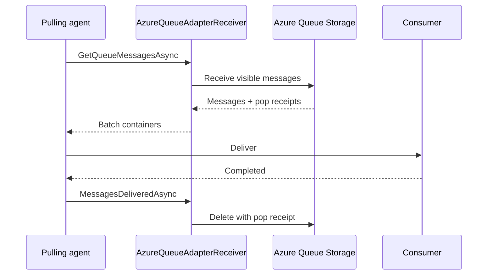

# Azure Queue stream implementation

The [`Microsoft.Orleans.Streaming.AzureStorage`](https://www.nuget.org/packages/Microsoft.Orleans.Streaming.AzureStorage/) package implements a persistent stream adapter over Azure Queue Storage. It uses the common [persistent stream pulling architecture](index.md) and supplies Azure-specific queue mapping, encoding, receive, delete, and configuration behavior.

## Registration APIs 

Silo and client builders expose <xref:Orleans.Hosting.SiloBuilderExtensions.AddAzureQueueStreams*?displayProperty=nameWithType> and <xref:Orleans.Hosting.ClientBuilderExtensions.AddAzureQueueStreams*?displayProperty=nameWithType>, respectively. The concise overload configures named <xref:Orleans.Configuration.AzureQueueOptions>. Both configurator types can replace the queue data adapter; only the silo configurator exposes the cache and pulling-agent components which run on silos.

Applications can instead supply a keyed <xref:Azure.Storage.Queues.QueueServiceClient> through configuration-driven provider registration. Configuration supports a service key, connection name, connection string, or queue-service URI. The <xref:Orleans.Configuration.AzureQueueOptions.ConfigureQueueServiceClient*> overloads and <xref:Orleans.Configuration.AzureQueueOptions.ClientOptions?displayProperty=nameWithType> property are obsolete and should not be used in new code.

API: <xref:Orleans.Hosting.SiloBuilderExtensions.AddAzureQueueStreams*?displayProperty=nameWithType>, <xref:Orleans.Hosting.ClientBuilderExtensions.AddAzureQueueStreams*?displayProperty=nameWithType>, <xref:Orleans.Hosting.AzureQueueStreamProviderBuilder>, and <xref:Orleans.Configuration.AzureQueueOptions>. Implementation: [silo registration](https://github.com/dotnet/orleans/blob/main/src/Azure/Orleans.Streaming.AzureStorage/Hosting/SiloBuilderExtensions.cs), [configuration-driven registration](https://github.com/dotnet/orleans/blob/main/src/Azure/Orleans.Streaming.AzureStorage/Hosting/AzureQueueStreamProviderBuilder.cs), and [queue options](https://github.com/dotnet/orleans/blob/main/src/Azure/Orleans.Streaming.AzureStorage/Providers/Streams/AzureQueue/AzureQueueStreamOptions.cs).

## Adapter behavior

`AzureQueueAdapter` is read-write and not rewindable. A producer encodes the stream identity, payload, and request context using an <xref:Orleans.Streams.IQueueDataAdapter`2>, then sends an Azure Queue message to the mapped queue. The receiver assigns the local sequence token used for delivery and acknowledgement.

Because Azure Queue Storage does not expose a durable arbitrary stream offset, a non-null rewind token is rejected. <xref:Orleans.Providers.Streams.AzureQueue.AzureQueueDataAdapterV2> is the default encoding. Version 1 remains for compatibility with existing messages, not as the preferred format for new providers.

Source: [`AzureQueueAdapter`](https://github.com/dotnet/orleans/blob/main/src/Azure/Orleans.Streaming.AzureStorage/Providers/Streams/AzureQueue/AzureQueueAdapter.cs) and [`IAzureQueueDataAdapter`](https://github.com/dotnet/orleans/blob/main/src/Azure/Orleans.Streaming.AzureStorage/Providers/Streams/AzureQueue/IAzureQueueDataAdapter.cs).

## Receive and acknowledgement

`AzureQueueAdapterReceiver` asks Azure Queue Storage for up to 32 visible messages at a time. Azure Queue Storage's [Get Messages operation](https://learn.microsoft.com/rest/api/storageservices/get-messages) makes a received message temporarily invisible; it does not delete it. The pulling agent decodes and delivers the batch through its cache and cursors. Only messages reported as delivered are removed using the [Delete Message operation](https://learn.microsoft.com/rest/api/storageservices/delete-message2).

If the receiver, agent, or silo fails before delete, the visibility timeout eventually expires and Azure can return the message again. Consumers must tolerate redelivery. If visibility expires while a message is still being processed, delete can fail because the pop receipt is no longer current.

Source: [`AzureQueueAdapterReceiver`](https://github.com/dotnet/orleans/blob/main/src/Azure/Orleans.Streaming.AzureStorage/Providers/Streams/AzureQueue/AzureQueueAdapterReceiver.cs).

## Queue mapping and defaults

When <xref:Orleans.Configuration.AzureQueueOptions.QueueNames?displayProperty=nameWithType> is not supplied, provider configuration generates names from the Orleans service ID and provider name. The hash-ring queue mapper defaults to eight queues. Each owned queue has one pulling agent and one queue cache on its current silo.

Common persistent-stream defaults used by this provider are:

| Setting | Default |
| --- | ---: |
| <xref:Orleans.Configuration.HashRingStreamQueueMapperOptions.TotalQueueCount?displayProperty=nameWithType> | 8 |
| <xref:Orleans.Configuration.StreamPullingAgentOptions.GetQueueMsgsTimerPeriod?displayProperty=nameWithType> | 100 ms |
| <xref:Orleans.Configuration.SimpleQueueCacheOptions.CacheSize?displayProperty=nameWithType> | 4,096 batch containers |
| <xref:Orleans.Configuration.StreamPullingAgentOptions.MaxEventDeliveryTime?displayProperty=nameWithType> | 1 minute |
| <xref:Orleans.Configuration.StreamPullingAgentOptions.StreamInactivityPeriod?displayProperty=nameWithType> | 30 minutes |

The number of queues bounds pulling parallelism and ownership granularity. Changing queue names changes the physical partition set and must be treated as a data migration, not routine tuning.

## Visibility and cache progress 

Azure visibility and Orleans cache retention are different clocks:

- visibility controls when an undeleted Azure message can be received again;
- the queue cache controls how long the pulling agent retains a batch for active subscription cursors.

A <xref:Orleans.Configuration.AzureQueueOptions.MessageVisibilityTimeout?displayProperty=nameWithType> value which is shorter than worst-case delivery increases duplicate receive and stale pop-receipt risk. An excessively long timeout delays recovery after agent failure. Choose values from measured delivery latency and failure objectives; operational tuning belongs with the [stream provider guidance](../../streaming/stream-providers.md).

## Extension and compatibility points

A custom <xref:Orleans.Streams.IQueueDataAdapter`2> changes payload encoding while retaining the Azure transport. It preserves stream identity, the request-context values defined by the wire contract, and the sequence information used by consumers. Follow [Customize persistent-stream data formats](../../streaming/data-adapters.md) for a compiling implementation and versioned rollout guidance.

Configuration binding behavior is tested by [`AzureQueueStreamProviderBuilderTests`](https://github.com/dotnet/orleans/blob/main/test/Extensions/Orleans.Azure.Tests/Streaming/AzureQueueStreamProviderBuilderTests.cs). Adapter acknowledgement and cursor behavior are covered by [`AzureQueueAdapterTests`](https://github.com/dotnet/orleans/blob/main/test/Extensions/Orleans.Azure.Tests/Streaming/AzureQueueAdapterTests.cs).
