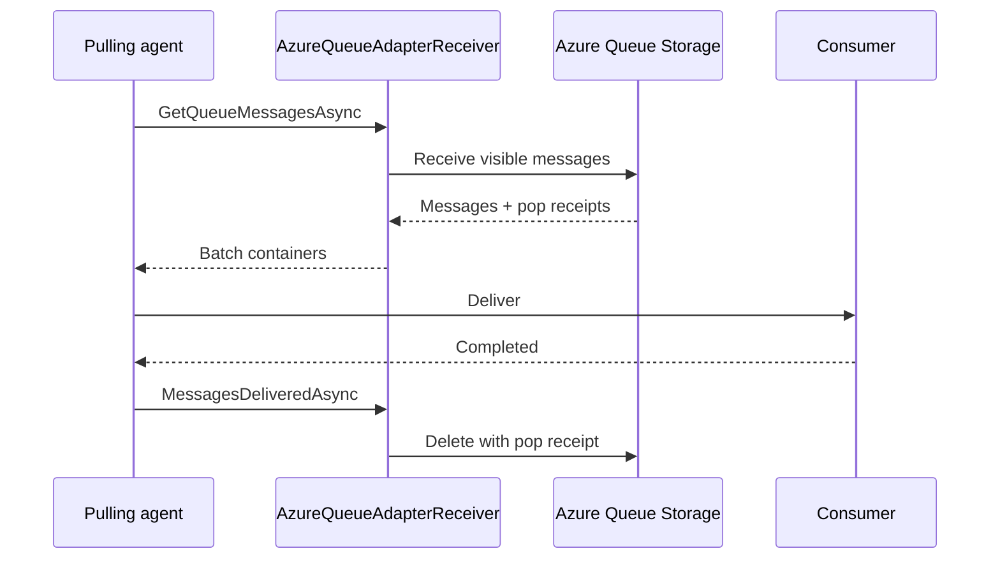

# Azure Queue stream implementation

The `Microsoft.Orleans.Streaming.AzureStorage` package implements a persistent stream adapter over Azure Queue Storage. It uses the common [persistent stream pulling architecture](index.md) and supplies Azure-specific queue mapping, encoding, receive, delete, and configuration behavior.

## Current registration APIs

Both silo and client builders expose `AddAzureQueueStreams`. The concise overload configures named `AzureQueueOptions`. Both configurator types can replace the queue data adapter; only the silo configurator exposes the cache and pulling-agent components which run on silos.

```csharp
using Azure.Storage.Queues;
using Orleans.Configuration;

siloBuilder.AddAzureQueueStreams(
    "orders",
    options => options.Configure(providerOptions =>
    {
        providerOptions.QueueServiceClient =
            new QueueServiceClient("UseDevelopmentStorage=true");
        providerOptions.QueueNames =
        [
            "orders-0",
            "orders-1"
        ];
    }));
```

Applications can instead supply a keyed `QueueServiceClient` through configuration-driven provider registration. Current configuration supports a service key, connection name, connection string, or queue-service URI. Older `ConfigureQueueServiceClient*` methods and the `ClientOptions` property are obsolete and should not be used in new code.

Source: [`SiloBuilderExtensions`](https://github.com/dotnet/orleans/blob/main/src/Azure/Orleans.Streaming.AzureStorage/Hosting/SiloBuilderExtensions.cs), [`AzureQueueStreamProviderBuilder`](https://github.com/dotnet/orleans/blob/main/src/Azure/Orleans.Streaming.AzureStorage/Hosting/AzureQueueStreamProviderBuilder.cs), and [`AzureQueueOptions`](https://github.com/dotnet/orleans/blob/main/src/Azure/Orleans.Streaming.AzureStorage/Providers/Streams/AzureQueue/AzureQueueStreamOptions.cs).

## Adapter behavior

`AzureQueueAdapter` is read-write and not rewindable. A producer encodes the stream identity, payload, request context, and sequence metadata using an `IAzureQueueDataAdapter`, then sends an Azure Queue message to the mapped queue.

Because Azure Queue Storage does not expose a durable arbitrary stream offset, a non-null rewind token is rejected. The default `AzureQueueDataAdapterV2` is the current encoding. Version 1 remains for compatibility with existing messages, not as the preferred format for new providers.

Source: [`AzureQueueAdapter`](https://github.com/dotnet/orleans/blob/main/src/Azure/Orleans.Streaming.AzureStorage/Providers/Streams/AzureQueue/AzureQueueAdapter.cs) and [`IAzureQueueDataAdapter`](https://github.com/dotnet/orleans/blob/main/src/Azure/Orleans.Streaming.AzureStorage/Providers/Streams/AzureQueue/IAzureQueueDataAdapter.cs).

## Receive and acknowledgement

`AzureQueueAdapterReceiver` asks Azure Queue Storage for up to 32 visible messages at a time. Receiving makes a message temporarily invisible; it does not delete it. The pulling agent decodes and delivers the batch through its cache and cursors. Only messages reported as delivered are deleted.



If the receiver, agent, or silo fails before delete, the visibility timeout eventually expires and Azure can return the message again. Consumers must tolerate redelivery. If visibility expires while a message is still being processed, delete can fail because the pop receipt is no longer current.

Source: [`AzureQueueAdapterReceiver`](https://github.com/dotnet/orleans/blob/main/src/Azure/Orleans.Streaming.AzureStorage/Providers/Streams/AzureQueue/AzureQueueAdapterReceiver.cs).

## Queue mapping and defaults

When queue names are not supplied, provider configuration generates names from the Orleans service ID and provider name. The hash-ring queue mapper defaults to eight queues. Each owned queue has one pulling agent and one queue cache on its current silo.

Common persistent-stream defaults used by this provider are:

| Setting | Default |
| --- | ---: |
| Hash-ring queues | 8 |
| Empty-poll period | 100 ms |
| Simple cache capacity | 4,096 batch containers |
| Maximum event delivery time | 1 minute |
| Stream inactivity period | 30 minutes |

The number of queues bounds pulling parallelism and ownership granularity. Changing queue names changes the physical partition set and must be treated as a data migration, not routine tuning.

## Visibility and cache progress

Azure visibility and Orleans cache retention are different clocks:

- visibility controls when an undeleted Azure message can be received again;
- the queue cache controls how long the pulling agent retains a batch for active subscription cursors.

A visibility timeout which is shorter than worst-case delivery increases duplicate receive and stale pop-receipt risk. An excessively long timeout delays recovery after agent failure. Choose values from measured delivery latency and failure objectives; operational tuning belongs with the [stream provider guidance](../../streaming/stream-providers.md).

## Extension and compatibility points

A custom `IAzureQueueDataAdapter` can change payload encoding while retaining the Azure transport. It must preserve stream identity, request context, and any sequence information needed by consumers. Encoding changes should be versioned so a rolling cluster can read messages produced by both versions.

Configuration binding behavior is tested by [`AzureQueueStreamProviderBuilderTests`](https://github.com/dotnet/orleans/blob/main/test/Extensions/Orleans.Azure.Tests/Streaming/AzureQueueStreamProviderBuilderTests.cs). Adapter acknowledgement and cursor behavior are covered by [`AzureQueueAdapterTests`](https://github.com/dotnet/orleans/blob/main/test/Extensions/Orleans.Azure.Tests/Streaming/AzureQueueAdapterTests.cs).
