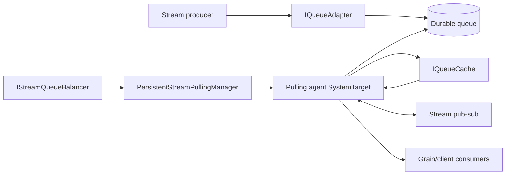
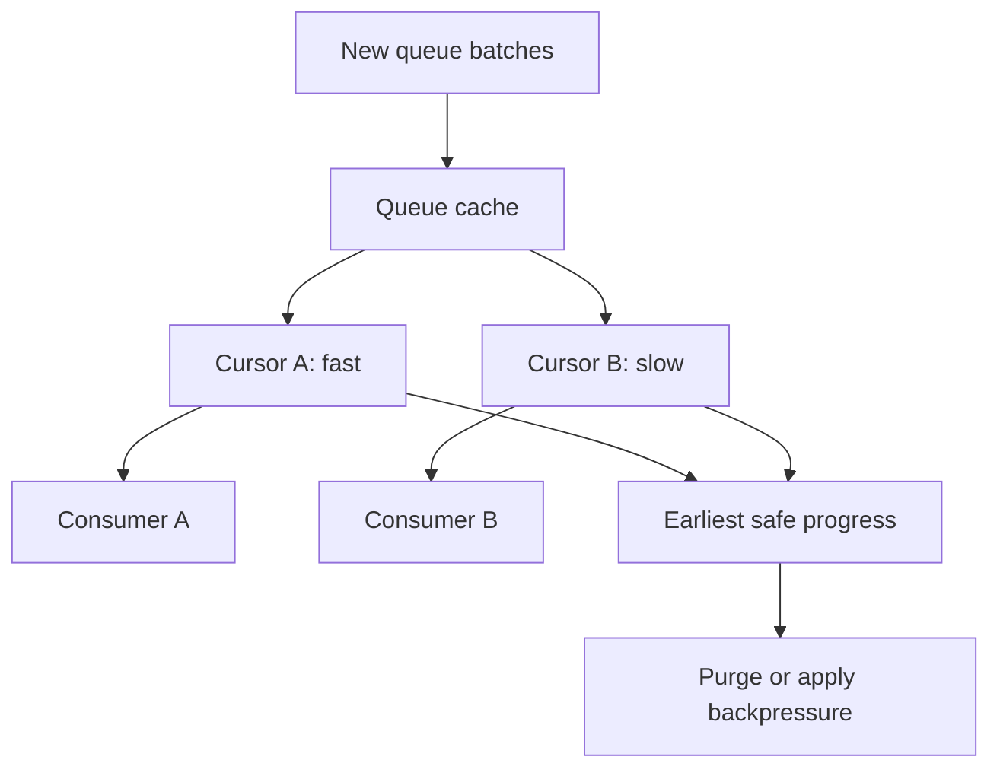

# Persistent stream pulling architecture

A persistent stream provider connects Orleans streams to a durable queue technology. Producers enqueue through an adapter. Pulling agents read queue partitions, cache batches, discover subscriptions, and deliver events through ordinary Orleans calls. Providers select silo-local system-target hosting or grain hosting through <xref:Orleans.Configuration.StreamPullingAgentOptions.HostingMode>.

This page describes the runtime mechanism. For stream APIs and provider selection, see the [streaming documentation](../../streaming/index.md).

## Provider composition and lifecycle 

<xref:Orleans.Providers.Streams.Common.PersistentStreamProvider> is the common implementation. A provider-specific <xref:Orleans.Streams.IQueueAdapterFactory> creates:

- an <xref:Orleans.Streams.IQueueAdapter> for enqueue and receive semantics;
- an <xref:Orleans.Streams.IStreamQueueMapper> for stream-to-queue mapping;
- an <xref:Orleans.Streams.IStreamQueueBalancer> for silo ownership;
- an <xref:Orleans.Streams.IQueueAdapterCache> for per-agent caches; and
- optional failure handlers, filters, and backoff providers.

During lifecycle initialization the provider resolves its named adapter factory and creates the adapter. At the active stage it initializes the pulling manager and starts agents. Shutdown stops agents before the provider closes.

By default, pulling agents start automatically. Explicit grain-based and implicit subscriptions are both enabled.

API: <xref:Orleans.Providers.Streams.Common.PersistentStreamProvider>. Implementation: [provider lifecycle](https://github.com/dotnet/orleans/blob/main/src/Orleans.Streaming/PersistentStreams/PersistentStreamProvider.cs) and [provider options](https://github.com/dotnet/orleans/blob/main/src/Orleans.Streaming/PersistentStreams/Options/PersistentStreamProviderOptions.cs).

## Queue mapping and ownership 

The queue mapper deterministically assigns a stream identity to a queue. All producers and consumers for a provider must use compatible mapping or events can be written to queues which no intended agent reads.

The queue balancer assigns queues to silos and publishes ownership changes. With the default system-target hosting, `PersistentStreamPullingManager` serializes those notifications, ignores stale sequences, and starts or stops one silo-local agent per assigned queue.

With <xref:Orleans.Configuration.StreamPullingAgentHostingMode.Grain>, a supervisor invokes one stable grain identity per provider/queue pair. The identity preserves the provider name, queue prefix, numeric queue ID, and uniform hash. The grain directory resolves that identity and arbitrates activation registration. The balancer supplies desired placement; the supervisor requests ordinary activation migration toward the assigned host.

Placement considers grain-type compatibility, the named provider's availability, its running state, and its current queue assignment. Every 30 seconds, each running supervisor refreshes its assignments and invokes the corresponding grains. This reconciles placement after a failed migration attempt and recreates a failed activation even when external partition traffic supplies no grain calls. Membership-driven balancing also triggers reconciliation. A keep-alive grain timer sustains active polling, and each timer invocation performs at most 16 queue reads so a busy partition regularly reaches the runtime's migration boundary.

### Grain-hosted handoff

The successful migration path orders these operations:

1. The source activation stops admitting queue work and cancels outstanding grain-hosted subscription and delivery waits.
1. Local asynchronous work completes. The final watermark includes acknowledged progress; interrupted registration preserves the prior checkpoint.
1. Receiver shutdown flushes the safe checkpoint and releases activation-local resources.
1. The runtime transfers the activation and conditionally registers its successor.
1. The destination initializes its receiver and cache, loads the durable checkpoint, and starts polling.

Receiver, cache, cursor, and SDK-client objects belong to their host. The destination reconstructs subscriptions from pub/sub and consumer handshakes. Event Hubs retains its existing checkpoint storage identity and inclusive restart boundary.

The producer's stable grain ID remains registered across runtime migration and recovery. Pub/sub callbacks route to the successor. Administrative stop unregisters the hosted producer while the activation can still serve interleaved subscription callbacks, then leaves polling stopped until the provider is started.

Receiver initialization and final-flush failures propagate to the grain lifecycle. Failed deactivation, lifecycle cancellation, and process failure recover using the last durable checkpoint, with at-least-once replay. The selected grain directory supplies activation-registration and failure-recovery guarantees.

Grain hosting uses assignment-based balancing. The built-in lease-based balancer uses system-target hosting so its lease-release obligations stay with the current host lifecycle. See [streaming operations](../../streaming/streaming-operations.md#change-pulling-agent-hosting-mode) for the provider-scoped rollout boundary.

Source: [`PersistentStreamPullingManager`](https://github.com/dotnet/orleans/blob/main/src/Orleans.Streaming/PersistentStreams/PersistentStreamPullingManager.cs).

## Pulling-agent loop 

Both hosts use the same `PersistentStreamPullingAgent` processing implementation with single-threaded Orleans scheduling. Its loop:

1. asks the adapter receiver for a batch;
1. adds batch containers to its queue cache;
1. groups cached items by stream;
1. resolves and caches pub-sub registrations;
1. advances each subscription's cursor independently;
1. sends events through Orleans messaging;
1. records delivery progress and failure; and
1. purges only data which the cache says is safe to remove.

The default maximum adapter batch-container batch size is 1 and the empty-poll period is 100 ms. These defaults are runtime behavior, not a universal throughput recommendation.

## Cache and cursor invariants 

An <xref:Orleans.Streams.IQueueCache> decouples queue reads from consumer delivery. Each subscription has an <xref:Orleans.Streams.IQueueCacheCursor>, so a slow consumer does not directly block a fast consumer at a later cursor.

The cache tracks the earliest delivery progress across active subscriptions. Purging must not remove an item still needed by any cursor. <xref:Orleans.Providers.Streams.Common.SimpleQueueCache> uses pressure buckets to stop or slow reads as lag grows instead of discarding undelivered events. Its default capacity is 4,096 batch containers.

Cache capacity is not durability. The queue remains the durable boundary, subject to the adapter's acknowledgement contract.

## Pub-sub handshake

The agent registers as a producer for each stream and obtains subscription records from stream pub-sub. It holds a pin cursor while subscription handshakes complete so cache cleanup cannot pass the requested start token. New subscription notifications update the agent's local pub-sub cache.

Sequence tokens allow a rewindable adapter to start from a supported historical position. An adapter whose <xref:Orleans.Streams.IQueueAdapter.IsRewindable?displayProperty=nameWithType> property is `false` must reject unsupported tokens rather than pretending to honor them.

## Delivery and failure semantics

The agent normally awaits delivery before advancing a subscription cursor, creating per-subscription backpressure. When delivery fails, it invokes the configured <xref:Orleans.Streams.IStreamFailureHandler>. Depending on provider policy, an explicit subscription can be faulted and removed.

Persistent streams are not universally exactly once. Semantics depend on:

- when the external queue considers a message acknowledged;
- whether the adapter can redeliver after receiver or silo failure;
- cache checkpoint behavior;
- consumer idempotency; and
- provider-specific sequence tokens.

A queue message can be delivered again after ownership change or failure. Consumers which perform durable side effects should be idempotent.

## Extension contracts

Provider authors should keep these responsibilities separate:

- <xref:Orleans.Streams.IQueueAdapter> defines external queue reads/writes and rewindability.
- <xref:Orleans.Streams.IQueueAdapterReceiver> defines receive, acknowledgement, and shutdown.
- <xref:Orleans.Streams.IStreamQueueMapper> defines stable partition mapping.
- <xref:Orleans.Streams.IStreamQueueBalancer> defines cluster ownership.
- <xref:Orleans.Streams.IQueueCache> and its cursors define buffering and safe purge.
- <xref:Orleans.Streams.IStreamFailureHandler> defines delivery failure policy.

See [provider authoring](../provider-authoring.md) for hosting and validation patterns and [Azure Queue streams](azure-queue-streams.md) for a concrete adapter.
