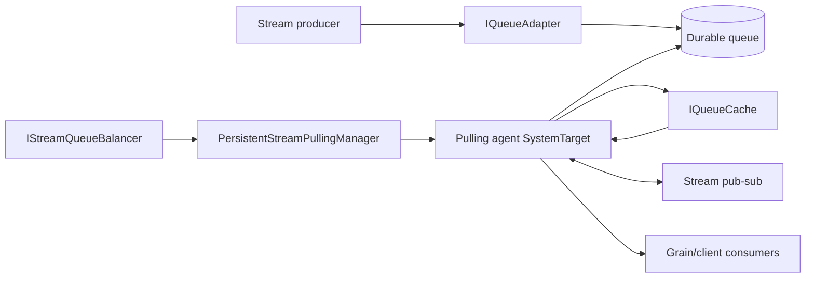
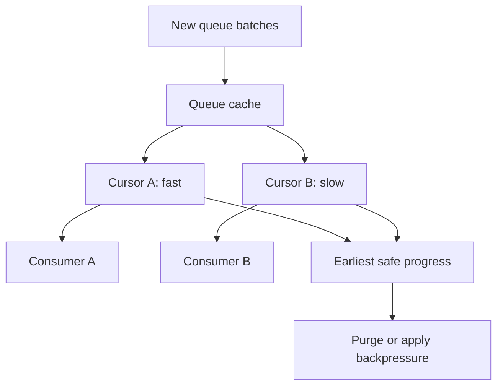

# Persistent stream pulling architecture

A persistent stream provider connects Orleans streams to a durable queue technology. Producers enqueue through an adapter. Silo-local pulling agents own queue partitions, read batches, cache them, discover subscriptions, and deliver events through ordinary Orleans calls.

This page describes the runtime mechanism. For stream APIs and provider selection, see the [streaming documentation](../../streaming/index.md).

## Provider composition and lifecycle 

<xref:Orleans.Providers.Streams.Common.PersistentStreamProvider> is the common implementation. A provider-specific <xref:Orleans.Streams.IQueueAdapterFactory> creates:

- an <xref:Orleans.Streams.IQueueAdapter> for enqueue and receive semantics;
- an <xref:Orleans.Streams.IStreamQueueMapper> for stream-to-queue mapping;
- an <xref:Orleans.Streams.IStreamQueueBalancer> for silo ownership;
- an <xref:Orleans.Streams.IQueueAdapterCache> for per-agent caches; and
- optional failure handlers, filters, and backoff providers.

During lifecycle initialization the provider resolves its named adapter factory and creates the adapter. At the active stage it initializes the pulling manager and starts agents. Shutdown stops agents before the provider closes.

By default, pulling agents start automatically. Explicit grain-based and implicit subscriptions are both enabled.

API: <xref:Orleans.Providers.Streams.Common.PersistentStreamProvider>. Implementation: [provider lifecycle](https://github.com/dotnet/orleans/blob/main/src/Orleans.Streaming/PersistentStreams/PersistentStreamProvider.cs) and [provider options](https://github.com/dotnet/orleans/blob/main/src/Orleans.Streaming/PersistentStreams/Options/PersistentStreamProviderOptions.cs).

## Queue mapping and ownership 

The queue mapper deterministically assigns a stream identity to a queue. All producers and consumers for a provider must use compatible mapping or events can be written to queues which no intended agent reads.

The queue balancer assigns queues to silos and publishes sequenced ownership changes. `PersistentStreamPullingManager` is a silo-local system target which serializes those notifications, ignores stale sequences, and starts or stops one pulling agent per owned queue. When membership changes, queues move among managers; agents themselves are not virtual and do not migrate.

Source: [`PersistentStreamPullingManager`](https://github.com/dotnet/orleans/blob/main/src/Orleans.Streaming/PersistentStreams/PersistentStreamPullingManager.cs).

## Pulling-agent loop 

Each `PersistentStreamPullingAgent` is a system target with single-threaded Orleans scheduling. Its loop:

1. asks the adapter receiver for a batch;
1. adds batch containers to its queue cache;
1. groups cached items by stream;
1. resolves and caches pub-sub registrations;
1. advances each subscription's cursor independently;
1. sends events through Orleans messaging;
1. records delivery progress and failure; and
1. purges only data which the cache says is safe to remove.

The default maximum adapter batch-container batch size is 1 and the empty-poll period is 100 ms. These defaults are runtime behavior, not a universal throughput recommendation.

### Shutdown and queue handoff

When an agent stops, it closes admission for new background work and stops its polling timer. It waits for receiver initialization, the active queue pump, and accepted producer registrations, subscription handshakes, and deliveries to finish. Accepted work completes its token bookkeeping and releases registration pins and batch protection while the cache and receiver remain available. Outstanding calls retain their existing messaging timeouts and retry limits while accepted work drains.

The agent then reports final delivery progress to the cache, disposes subscription cursors, and shuts down the receiver so provider-specific checkpoint flushing observes the completed progress. Registrations pending when shutdown starts keep the existing checkpoint, since their subscriber positions are still uncertain. Producer unregistration follows receiver cleanup. When the manager reuses an agent for a reassigned queue, initialization waits for that full cleanup and opens admission for the new run.

Explicit subscription notifications receive an immediate acknowledgement while the agent tracks their asynchronous handshake through completion. This lets the subscribing consumer finish its current call and respond to the handshake.

A completed handshake establishes the subscription's current cursor and replay position. The latest requested handshake owns reconciliation; responses from superseded requests preserve that ownership. Delivery completions and error handling from an older handshake generation release their work while preserving the replacement position, so final checkpoint progress reflects the accepted rewind.

A handshake which keeps the same certified cursor also keeps its unsettled selection. When the older delivery finishes, the agent rewinds that selection for a new attempt under the current handshake. Removing the last unresolved subscriber releases the stream's registration pin once producer registration and the remaining handshakes have settled.

A failed re-handshake leaves the subscription's position uncertain even when it was previously registered. The agent retains the stream entry across idle cleanup and keeps the existing checkpoint until a successful handshake reconciles that position.

Subscription removal revokes in-flight handshake and delivery ownership. A terminal pub-sub action issued under valid ownership completes cleanup for that subscription identity, including when a cursor reconciliation overlaps its persistence.

## Cache and cursor invariants 

An <xref:Orleans.Streams.IQueueCache> decouples queue reads from consumer delivery. Each subscription has an <xref:Orleans.Streams.IQueueCacheCursor>, so a slow consumer does not directly block a fast consumer at a later cursor.

The cache tracks the earliest delivery progress across active subscriptions. Purging must not remove an item still needed by any cursor. <xref:Orleans.Providers.Streams.Common.SimpleQueueCache> uses pressure buckets to stop or slow reads as lag grows instead of discarding undelivered events. Its default capacity is 4,096 batch containers.

The built-in Event Hubs transport, cache, data adapter, and chronological eviction strategy use an internal certified-checkpoint protocol. Custom or derived provider components retain their existing subscription-progress callbacks and failure policies. The provider selects its behavior during initialization and keeps it for the run.

The agent enables certified cursor tracking before advancing checkpoint-capable cursors, including handshake replay. Ordinary receipt cursors keep their position, batch protection, and failed-receipt disposition, while certified cursors additionally track safe prefixes and pending replay ranges. An unchanged safe-token reference preserves the existing watermark without another token comparison.

Certified checkpointing uses each subscription's contiguous safe partition prefix. Scanning a record for another stream advances that prefix immediately. A matching record and the records scanned after it remain pending until the selected batch is acknowledged, filtered, or explicitly skipped by the configured delivery-failure policy. The pulling agent reports the minimum certified prefix across subscriptions through the existing cache progress callback, bounded by the last fully accounted queue read. Pending registrations, handshakes, read recovery, and unknown subscription progress defer the report. With no subscriptions, the fully accounted read boundary supplies the certificate.

The agent retries unresolved cursor work on each queue-pump tick and reports certified progress before every read-loop capacity check. Continuous ingestion therefore publishes fresh checkpoint and purge authority as deliveries complete. Cursors already certified through the fully accounted read boundary remain idle until new data or a handshake changes their position. Mutation-safe traversals borrow snapshot storage for their synchronous work and clear its references when returning it to the pool. Idle streams therefore progress through unrelated records, and a full cache can reclaim completed work without another queue read. After a transient cursor failure, the cursor retains its position and pending delivery. By default, an exhausted delivery attempt resolves the selected batch as skipped after consumer and failure-handler notification. Setting <xref:Orleans.Configuration.StreamPullingAgentOptions.RetryFailedDeliveries> to `true` retains the batch for retry on a later pump tick using the existing delivery retry budget. A skip applies to the selected batch only while the same cursor and handshake generation still own it. Pending handshakes defer the decision; a replacement cursor keeps its replay position. A cache miss identifies an unresolved replay obligation. The consumer and failure handler receive the error even when the rewind also encounters that retained miss; recovery accounts for the missing range before progress resumes.

For certified processing, a successfully returned queue read stays owned by the agent until atomic cache admission and registration accounting complete. Failed registrations retain their cache pin and retry. The cache's internal recovery capability delegates to its receiver, which reconciles failed reads using its own same-run source position and staged records, including records admitted internally whose notifications have not reached the agent. Successful read recovery resolves only that read's continuity; subscription delivery and handshake obligations retain their own ownership.

Event Hubs stages fetched records through packing and notification handoff. Its transport retries from the last successful raw-read position and preserves the initial `StartFromNow` boundary across failures. Checkpoint progress also bounds cache eviction: the certificate applies during the progress callback, and both time-based and pressure-based eviction preserve records beyond that boundary. The receiver updates the checkpointer from certified delivery progress, while eviction handles metadata and buffer reclamation.

Certified Event Hubs admission reserves one possible new raw-data buffer per requested record against the cache's `defaultMaxAddCount` buffer budget. Admission accounts for owned buffers and staged allocation notifications, so a pinned subscription pauses new reception even when average delivery pressure remains low. Packing failures release staged buffers, and purge cleanup returns completed buffers even when an observer throws. The receiver finishes already-staged read handoffs independently of new-read capacity. The [operations guide](../../streaming/streaming-operations.md) describes the native budget and deployment sizing.

Cache capacity is not durability. The queue remains the durable boundary, subject to the adapter's acknowledgement contract.

## Pub-sub handshake

The agent registers as a producer for each stream and obtains subscription records from stream pub-sub. It holds a pin cursor while subscription handshakes complete so cache cleanup cannot pass the requested start token. New subscription notifications update the agent's local pub-sub cache.

Sequence tokens allow a rewindable adapter to start from a supported historical position. An adapter whose <xref:Orleans.Streams.IQueueAdapter.IsRewindable?displayProperty=nameWithType> property is `false` must reject unsupported tokens rather than pretending to honor them.

## Delivery and failure semantics

The agent normally awaits delivery before advancing a subscription cursor, creating per-subscription backpressure. When delivery fails, it invokes the configured <xref:Orleans.Streams.IStreamFailureHandler>. Depending on provider policy, an explicit subscription can be faulted and removed.

Persistent streams are not universally exactly once. Semantics depend on:

- when the external queue considers a message acknowledged;
- whether the adapter can redeliver after receiver or silo failure;
- cache checkpoint behavior;
- consumer idempotency; and
- provider-specific sequence tokens.

A queue message can be delivered again after ownership change or failure. Consumers which perform durable side effects should be idempotent.

## Extension contracts

Provider authors should keep these responsibilities separate:

- <xref:Orleans.Streams.IQueueAdapter> defines external queue reads/writes and rewindability.
- <xref:Orleans.Streams.IQueueAdapterReceiver> defines receive, acknowledgement, and shutdown.
- <xref:Orleans.Streams.IStreamQueueMapper> defines stable partition mapping.
- <xref:Orleans.Streams.IStreamQueueBalancer> defines cluster ownership.
- <xref:Orleans.Streams.IQueueCache> and its cursors define buffering and safe purge.
- <xref:Orleans.Streams.IStreamFailureHandler> defines delivery failure policy.

See [provider authoring](../provider-authoring.md) for hosting and validation patterns and [Azure Queue streams](azure-queue-streams.md) for a concrete adapter.
