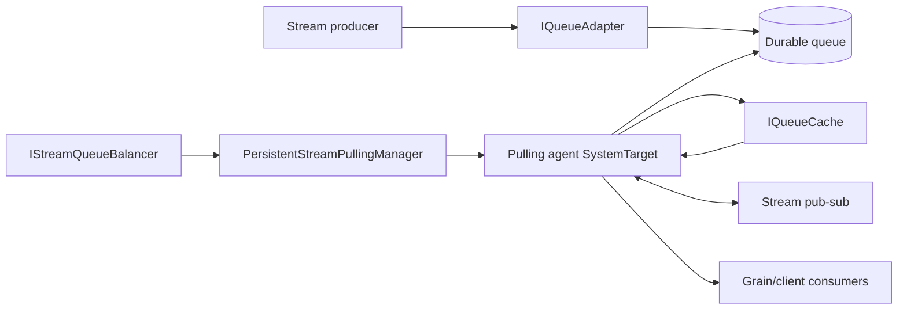
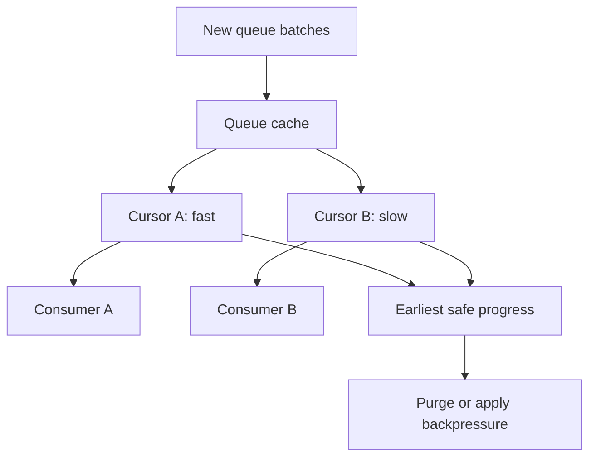

# Persistent stream pulling architecture

A persistent stream provider connects Orleans streams to a durable queue technology. Producers enqueue through an adapter. Silo-local pulling agents own queue partitions, read batches, cache them, discover subscriptions, and deliver events through ordinary Orleans calls.

This page describes the runtime mechanism. For stream APIs and provider selection, see the [streaming documentation](../../streaming/index.md).

## Provider composition and lifecycle 

<xref:Orleans.Providers.Streams.Common.PersistentStreamProvider> is the common implementation. A provider-specific <xref:Orleans.Streams.IQueueAdapterFactory> creates:

- an <xref:Orleans.Streams.IQueueAdapter> for enqueue and receive semantics;
- an <xref:Orleans.Streams.IStreamQueueMapper> for stream-to-queue mapping;
- an <xref:Orleans.Streams.IStreamQueueBalancer> for silo ownership;
- an <xref:Orleans.Streams.IQueueAdapterCache> for per-agent caches; and
- optional failure handlers, filters, and backoff providers.

During lifecycle initialization the provider resolves its named adapter factory and creates the adapter. At the active stage it initializes the pulling manager and starts agents. Shutdown stops agents before the provider closes.

By default, pulling agents start automatically. Explicit grain-based and implicit subscriptions are both enabled.

API: <xref:Orleans.Providers.Streams.Common.PersistentStreamProvider>. Implementation: [provider lifecycle](https://github.com/dotnet/orleans/blob/main/src/Orleans.Streaming/PersistentStreams/PersistentStreamProvider.cs) and [provider options](https://github.com/dotnet/orleans/blob/main/src/Orleans.Streaming/PersistentStreams/Options/PersistentStreamProviderOptions.cs).

## Queue mapping and ownership 

The queue mapper deterministically assigns a stream identity to a queue. All producers and consumers for a provider must use compatible mapping or events can be written to queues which no intended agent reads.

The queue balancer assigns queues to silos and publishes sequenced ownership changes. `PersistentStreamPullingManager` is a silo-local system target which serializes those notifications, ignores stale sequences, and starts or stops one pulling agent per owned queue. When membership changes, queues move among managers; agents themselves are not virtual and do not migrate.

Source: [`PersistentStreamPullingManager`](https://github.com/dotnet/orleans/blob/main/src/Orleans.Streaming/PersistentStreams/PersistentStreamPullingManager.cs).

## Pulling-agent loop 

Each `PersistentStreamPullingAgent` is a system target with single-threaded Orleans scheduling. Its loop:

1. asks the adapter receiver for a batch;
1. adds batch containers to its queue cache;
1. groups cached items by stream;
1. resolves and caches pub-sub registrations;
1. advances each subscription's cursor independently;
1. sends events through Orleans messaging;
1. records delivery progress and failure; and
1. purges only data which the cache says is safe to remove.

The default maximum adapter batch-container batch size is 1 and the empty-poll period is 100 ms. These defaults are runtime behavior, not a universal throughput recommendation.

## Cache and cursor invariants 

An <xref:Orleans.Streams.IQueueCache> decouples queue reads from consumer delivery. Each subscription has an <xref:Orleans.Streams.IQueueCacheCursor>, so a slow consumer does not directly block a fast consumer at a later cursor.

The cache tracks the earliest contiguous partition position which is safe across active subscriptions. A matching record becomes safe after delivery or intentional filtering. A cursor also advances safely across records for other streams when no earlier matching delivery is pending, so a quiet stream does not pin an otherwise busy partition. Purging must not remove an item still needed by any cursor. <xref:Orleans.Providers.Streams.Common.SimpleQueueCache> uses pressure buckets to stop or slow reads as lag grows instead of discarding undelivered events. Its default capacity is 4,096 batch containers.

Cache capacity is not durability. The queue remains the durable boundary, subject to the adapter's acknowledgement contract.

Recoverable partitioned stream providers can compose a stream partition pipeline from <xref:Orleans.Providers.Streams.Common.RecoverableStreamReceiver%601>, a partition source, and a data adapter. The pipeline admits immutable stream records into pooled storage, reconstructs batches lazily, reconciles the earliest safe subscription scan/delivery watermark, and persists a checkpoint which resumes strictly after that position.

## Retained-history replay pipeline

Kinesis and ADO.NET supply an <xref:Orleans.Providers.Streams.Common.IRecoverableStreamReplaySourceFactory%601> to the recoverable receiver. A token outside the live cache creates an asynchronous replay cursor and follows this state machine:

1. Normalize and validate the provider token.
1. Attach to a compatible existing replay fragment, start an independent reader within `MaxConcurrentReaders`, or enter the bounded pending-admission list.
1. Read physical partition records into a fragment cache. Multiple compatible subscription cursors can share that cache, and its earliest safe cursor progress controls reclamation.
1. Record the oldest live-cache position as the handoff boundary and prevent live purge from crossing it.
1. Scan historical records in partition order. Records for other streams advance safe scan progress without being delivered to the target observer.
1. Create and seed the live cursor at the boundary before detaching the historical cursor.
1. Dispose the fragment and provider reader after its final cursor leaves.

`CacheSize` is a raw-record item limit for each fragment. When the cache has no add capacity, the asynchronous cursor returns a temporary-tail transition after the configured delay; the pulling agent keeps the subscription active and retries. Pending admission has no independent timeout: cancellation, cursor disposal, receiver shutdown, available reader capacity, or the configured queue limit resolves the wait.

The replay manager owns per-queue reader admission and fragment record capacity, while the pulling agent owns delivery retries and consumer handshakes. A transient replay failure causes the pulling agent to reconstruct from the last safe partition token. An unavailable or invalid retained position remains a `DataNotAvailableException` until the application selects an available position.

The replay cursor and the live receiver use separate progress:

- replay-fragment safe progress reclaims fragment memory and, for ADO.NET, advances the provider-visible lease watermark;
- subscription delivery progress controls what one observer has accepted;
- the earliest safe live subscription progress updates the durable queue checkpoint.

This separation preserves a contiguous replay-to-live scan with at-least-once delivery. See [Replay retained persistent-stream history](../../streaming/retained-history-replay.md) for public behavior and operational sizing.

## Pub-sub handshake

The agent registers as a producer for each stream and obtains subscription records from stream pub-sub. It holds a pin cursor while subscription handshakes complete so cache cleanup cannot pass the requested start token. New subscription notifications update the agent's local pub-sub cache.

Sequence tokens allow a rewindable adapter to start from a supported historical position. A start token is inclusive and remains unsafe until its record is delivered or intentionally filtered. A delivery handshake token confirms that its position was already processed. Exact `EventSequenceToken` and `EventSequenceTokenV2` values interoperate for legacy compatibility. Derived tokens compare only with the same concrete type unless the provider overrides equality, ordering, and hashing together. An adapter whose <xref:Orleans.Streams.IQueueAdapter.IsRewindable?displayProperty=nameWithType> property is `false` must reject unsupported tokens rather than pretending to honor them.

## Delivery and failure semantics

The agent normally awaits delivery before advancing a subscription cursor, creating per-subscription backpressure. When delivery fails, it invokes the configured <xref:Orleans.Streams.IStreamFailureHandler>. Depending on provider policy, an explicit subscription can be faulted and removed.

Persistent streams are not universally exactly once. Semantics depend on:

- when the external queue considers a message acknowledged;
- whether the adapter can redeliver after receiver or silo failure;
- cache checkpoint behavior;
- consumer idempotency; and
- provider-specific sequence tokens.

A queue message can be delivered again after ownership change or failure. Consumers which perform durable side effects should be idempotent.

## Extension contracts

Provider authors should keep these responsibilities separate:

- <xref:Orleans.Streams.IQueueAdapter> defines external queue reads/writes and rewindability.
- <xref:Orleans.Streams.IQueueAdapterReceiver> defines receive, acknowledgement, and shutdown.
- <xref:Orleans.Streams.IStreamQueueMapper> defines stable partition mapping.
- <xref:Orleans.Streams.IStreamQueueBalancer> defines cluster ownership.
- <xref:Orleans.Streams.IQueueCache> and its cursors define buffering and safe purge.
- <xref:Orleans.Streams.IStreamFailureHandler> defines delivery failure policy.

See [provider authoring](../provider-authoring.md) for hosting and validation patterns and [Azure Queue streams](azure-queue-streams.md) for a concrete adapter.
