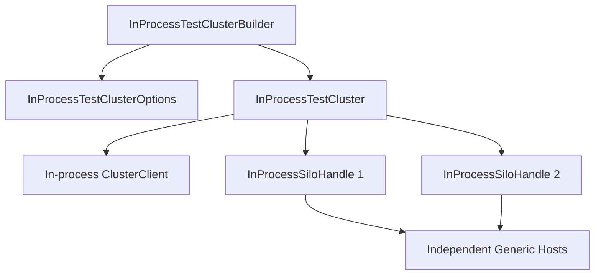

# TestingHost architecture

`Microsoft.Orleans.TestingHost` composes real silo and client hosts with test-oriented discovery, transport, statistics, directory, and lifecycle controls. It is an integration harness, not a mock grain runtime. Grain activation, scheduling, serialization, messaging, placement, and most provider behavior execute through the same runtime components as a hosted cluster.

This page describes the harness internals. Test-fixture patterns and basic unit-testing guidance belong in task-oriented testing documentation.

## Cluster object model

`InProcessTestClusterBuilder` accumulates host, silo, and client delegates. `Build` passes its options to an `InProcessTestCluster`; the cluster retains that mutable options object. `DeployAsync` starts the configured silo hosts and initializes the client when requested. With client initialization enabled, it performs a best-effort initial membership-view check but can continue after warning that views have not stabilized. Each `InProcessSiloHandle` owns one Generic Host and exposes its service provider for test inspection.

The processes are shared, but the hosts and dependency-injection containers are not. Static process state can still leak between silos, which is one reason production code should not use static mutable state for silo-local behavior.

Source: [`InProcessTestClusterBuilder`](https://github.com/dotnet/orleans/blob/main/src/Orleans.TestingHost/InProcTestClusterBuilder.cs), [`InProcessTestCluster`](https://github.com/dotnet/orleans/blob/main/src/Orleans.TestingHost/InProcTestCluster.cs), and [`InProcessSiloHandle`](https://github.com/dotnet/orleans/blob/main/src/Orleans.TestingHost/InProcessSiloHandle.cs).

## Defaults

`InProcessTestClusterBuilder` defaults to:

| Setting | Default |
| --- | --- |
| Initial silos | 2 |
| Cluster ID | Newly generated |
| Service ID | Newly generated GUID |
| Client initialization on deploy | `true` |
| Test-cluster membership | `true` |
| Test-cluster grain directory | `true` |
| Gateway per silo | `true` |
| Real environment statistics | `false` |
| Connection transport | In-memory |

Simulated environment statistics make resource-based tests deterministic, but they do not reproduce operating-system CPU or memory pressure. Opt into real statistics only when the test specifically needs those signals.

These defaults are defined in [`InProcTestClusterBuilder`](https://github.com/dotnet/orleans/blob/main/src/Orleans.TestingHost/InProcTestClusterBuilder.cs) and [`InProcTestClusterOptions`](https://github.com/dotnet/orleans/blob/main/src/Orleans.TestingHost/InProcTestClusterOptions.cs).

## Configuration layers

The builder separates three scopes:

- `ConfigureHost` applies to both silo and client Generic Hosts and is useful for shared configuration or keyed SDK clients.
- `ConfigureSilo` receives per-silo options and an `ISiloBuilder`.
- `ConfigureClient` configures the cluster client.

Delegates run for each relevant host. A singleton registered by a silo delegate is singleton within that silo's container, not across the cluster. A concrete instance captured by a delegate is shared because the test supplied the same object.

## Dynamic topology

`StartAdditionalSiloAsync()` and `StartSilosAsync(int)` create new hosts using the cluster's current options and configuration delegates. `StopSiloAsync`, `StopSilosAsync`, `StopAllSilosAsync`, `WaitForLivenessToStabilizeAsync`, and `WaitForClusterManifestToStabilizeAsync` coordinate membership and manifest transitions for failure and elasticity tests.

The overloads which take `startAdditionalSiloOnNewPort` are obsolete. Tests should use the parameterless `StartAdditionalSilo` methods or `StartSilosAsync(int)`. Lower-level `StartSiloAsync` overloads remain available when a test must supply an instance number or configuration overrides.

Stopping a host gracefully exercises shutdown. Disposing or terminating a handle without graceful membership update is a different failure mode and should be chosen deliberately when testing failure detection.

## `TestCluster` and custom silo creation

`TestClusterBuilder` is the class-configurator-based harness. It defaults to two silos, in-memory transport, generated cluster identity, test membership, client initialization, file logging, and homogeneous-silo assumptions. It also installs `ConfigureDistributedGrainDirectory`, so its silos opt into the experimental distributed grain directory instead of the production runtime's default `LocalGrainDirectory`.

`ISiloConfigurator`, `IHostConfigurator`, and `IClientBuilderConfigurator` types are serializable configuration identities which can be applied to every host. Supplying a custom `CreateSiloAsync` switches the connection transport to TCP because the custom path cannot use the harness's in-memory transport.

`TestCluster` supports suites built around `SiloHandle` and configurator types. It does not use separate application domains; its hosts run in-process unless a custom silo creation path provides different isolation.

Source: [`TestClusterBuilder`](https://github.com/dotnet/orleans/blob/main/src/Orleans.TestingHost/TestClusterBuilder.cs), [`TestCluster`](https://github.com/dotnet/orleans/blob/main/src/Orleans.TestingHost/TestCluster.cs), and [`TestClusterOptions`](https://github.com/dotnet/orleans/blob/main/src/Orleans.TestingHost/TestClusterOptions.cs).

## Fidelity boundaries

TestingHost deliberately substitutes infrastructure. Tests must account for those boundaries:

- in-memory transport does not reproduce sockets, TLS, packet loss, or network buffers;
- test membership does not prove a production membership provider's transaction behavior;
- the test grain directory can bypass production directory edge cases;
- simulated statistics do not reproduce load shedding;
- one process shares thread-pool and static state; and
- graceful stop does not model abrupt process or machine loss.

Use the smallest substitution which keeps the invariant under test real. Directory, membership, transport, and provider contract tests often need their production component explicitly enabled.

## Test architecture in the repository

Repository fixtures such as `BaseInProcessTestClusterFixture` wrap cluster setup and disposal, while specialized suites configure the component being exercised. For example, [`AQStreamingTests`](https://github.com/dotnet/orleans/blob/main/test/Extensions/Orleans.Azure.Tests/Streaming/AQStreamingTests.cs) uses `ConfigureHost`, `ConfigureSilo`, and `ConfigureClient` to combine real Azure Queue adapters with an in-process Orleans cluster.
