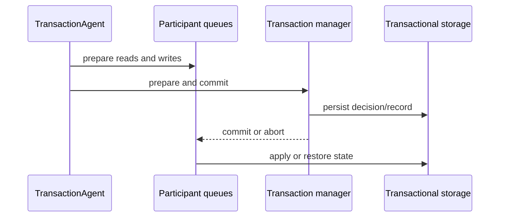

# Transaction implementation

Orleans transactions coordinate transactional state across grains. The runtime uses a transaction agent to collect participants and choose a commit path, a transaction manager to make the durable decision, and a `TransactionQueue` at each participant to serialize versions and apply or restore state.

## Coordination model

`TransactionAgent.StartTransaction` creates a transaction ID and causal timestamp, rejecting new work when the overload detector reports that the silo cannot safely admit more transactions. As grain calls access transactional resources, the transaction context records read and write counters and identifies a manager. Read-only transactions can contact resources directly. Read-write transactions send prepare messages to other resources and ask the manager to prepare and commit.

The manager is selected from the participants, with an explicit priority manager taking precedence. The agent sends one-way prepare notifications to non-manager resources, then waits for the manager's result. This reduces coordination round trips while keeping one authoritative decision for write transactions.

## Participant queues and isolation

`TransactionQueue` keeps pending transaction records, commit records, and a stable sequence for a transactional state. It uses access counters to determine whether a transaction read or wrote a resource, holds the required locks while a transaction is unresolved, and applies the committed state in order. A participant can therefore reject a conflicting access before the manager has committed.

Transactional storage is not just ordinary grain persistence with a transaction ID attached. The provider wrapper must support the queue's load, commit, restore, and recovery operations. A storage failure can leave a transaction in a prepared or uncertain state, which is why the queue persists enough information to recover after activation or process restart.

## Decisions and failure behavior

The agent distinguishes a successful decision, a participant response timeout, a transaction-manager response timeout, and a presumed abort. A timeout does not mean that no participant changed: the manager may have durably committed while its response was lost. When the result is definitely aborted and the manager has not taken ownership of notifications, the agent sends cancel messages to release participant locks.

The manager's durable local commit completes the caller's transaction promise. It then schedules the confirmation worker to notify and collect the remaining participants. Recovery replays pending commit confirmations and aborts from manager or participant queue records, so participant notification can continue after the caller receives a successful result.

Disabled transactions use a separate agent which rejects transactional operations instead of silently providing weaker semantics. Overload throttling is also explicit: callers receive a transaction-start failure rather than an unbounded queue.

## Trade-offs and boundaries

The protocol favors serializable state transitions and recovery over low latency. Read-only work avoids the manager's write path, while write transactions pay for coordination and durable records. Transaction atomicity applies to registered transactional resources; unrelated side effects such as an external HTTP call are not rolled back.

Application guidance belongs in [transactions](../grains/transactions.md). Provider implementations and fault-injection tests are useful source authorities when evaluating a storage provider's recovery behavior.

Source: [`TransactionAgent`](https://github.com/dotnet/orleans/blob/main/src/Orleans.Transactions/DistributedTM/TransactionAgent.cs), [`TransactionManager`](https://github.com/dotnet/orleans/blob/main/src/Orleans.Transactions/State/TransactionManager.cs), and [`TransactionQueue`](https://github.com/dotnet/orleans/blob/main/src/Orleans.Transactions/State/TransactionQueue.cs).
