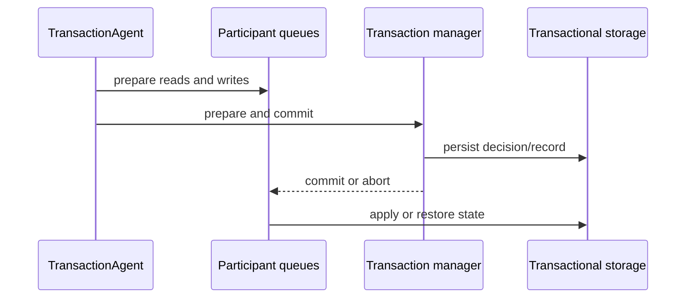

# Transaction implementation

Orleans transactions coordinate transactional state across grains. The runtime uses a transaction agent to collect participants and choose a commit path, a transaction manager to make the durable decision, and a `TransactionQueue` at each participant to serialize versions and apply or restore state.

## Coordination model

`TransactionAgent.StartTransaction` creates a transaction ID and causal timestamp. The overload detector admits a new transaction when the silo has safe transactional capacity and returns a start failure under overload. As grain calls access transactional resources, the transaction context records read and write counters and identifies a manager. Read-only transactions can contact resources directly. Read-write transactions send prepare messages to other resources and ask the manager to prepare and commit.

The manager is selected from the participants, with an explicit priority manager taking precedence. The agent sends one-way prepare notifications to non-manager resources, then waits for the manager's result. This reduces coordination round trips while keeping one authoritative decision for write transactions.

## Participant queues and isolation

`TransactionQueue` keeps pending transaction records, commit records, and a stable sequence for a transactional state. It uses access counters to determine whether a transaction read or wrote a resource, holds the required locks while a transaction is unresolved, and applies the committed state in order. A participant can therefore reject a conflicting access before the manager has committed.

Transactional storage extends grain persistence with queue load, commit, restore, and recovery operations. A storage failure can leave a transaction in a prepared or uncertain state, so the queue persists enough information to recover after activation or process restart.

## Decisions and failure behavior

The agent distinguishes a successful decision, a participant response timeout, a transaction-manager response timeout, and a presumed abort. A timeout leaves participant outcome uncertain because the manager might have committed durably before losing its response. For definite aborts where the agent retains notification ownership, it sends cancellation messages to release participant locks.

The manager's durable local commit completes the caller's transaction promise. It then schedules the confirmation worker to notify and collect the remaining participants. Recovery replays pending commit confirmations and aborts from manager or participant queue records, so participant notification can continue after the caller receives a successful result.

The disabled agent explicitly rejects transactional operations. Overload throttling returns transaction-start failures while bounding queued work.

## Activation shutdown

Normal grain deactivation waits for active requests to finish. Transaction queues also run background storage cycles which can continue after a protocol request returns. During lifecycle shutdown, each queue signals cancellation to stop new lock, storage, confirmation, and collection cycles, then waits for its storage worker to finish.

The storage wait covers the active cycle's persistence outcome, state updates, recovery, and batch follow-up callbacks. Its budget comes from the lifecycle cancellation token, which reflects host cancellation and the configured grain deactivation timeout. Cancellation ends the wait while an already-started storage operation retains its outcome-processing path.

Confirmation and collection stop through the queue's shutdown signal. Durable commit and prepare records let subsequent activations resume unresolved protocol work. The queue participates in both state setup cleanup and the final lifecycle stage so normal shutdown and partially completed activation both stop background processing.

## Trade-offs and boundaries

The protocol favors serializable state transitions and recovery over low latency. Read-only work uses a direct resource path, while write transactions pay for coordination and durable records. Transaction atomicity covers registered transactional resources; applications coordinate or compensate external side effects separately.

Application guidance belongs in [transactions](../grains/transactions.md). Provider implementations and fault-injection tests are useful source authorities when evaluating a storage provider's recovery behavior.

Source: [`TransactionAgent`](https://github.com/dotnet/orleans/blob/main/src/Orleans.Transactions/DistributedTM/TransactionAgent.cs), [`TransactionManager`](https://github.com/dotnet/orleans/blob/main/src/Orleans.Transactions/State/TransactionManager.cs), and [`TransactionQueue`](https://github.com/dotnet/orleans/blob/main/src/Orleans.Transactions/State/TransactionQueue.cs).
