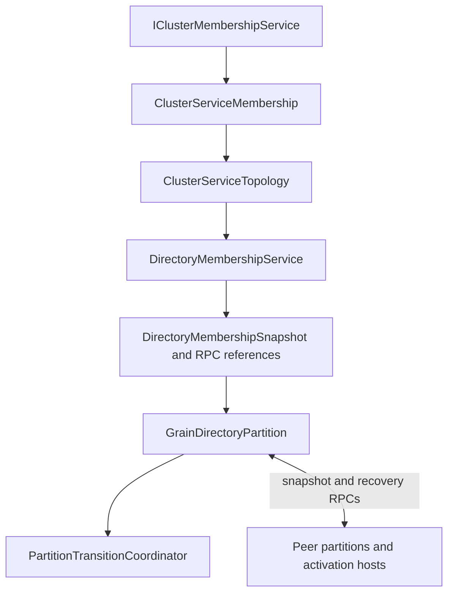
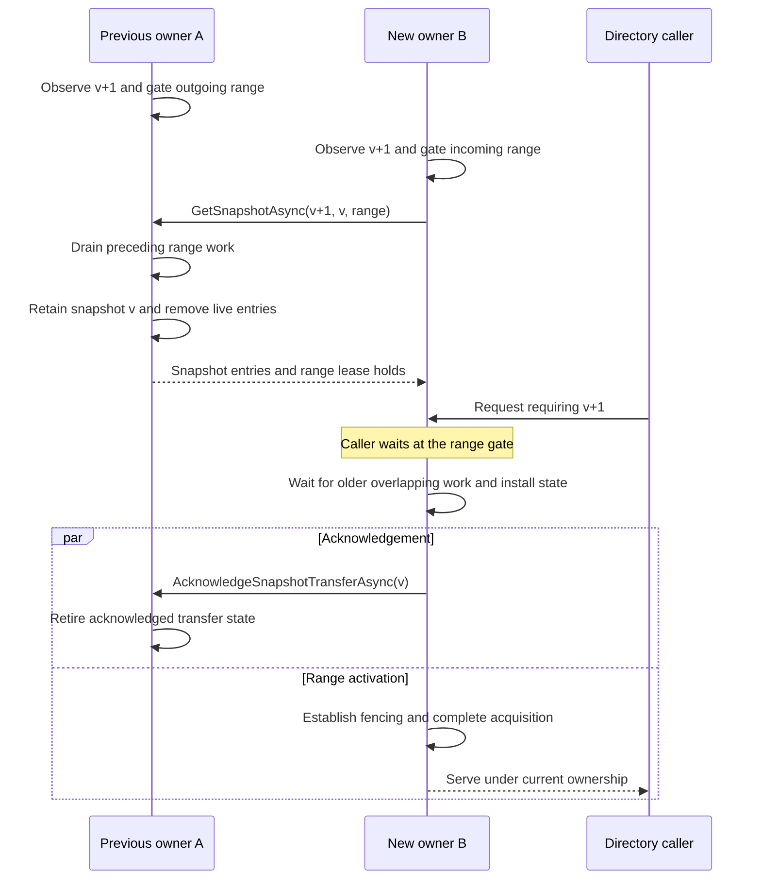

# View-synchronous cluster services

A view-synchronous cluster service ties partition ownership to an ordered membership view. An owner serves requests under that view; when ownership changes, the affected range passes through a transition which drains preceding work, obtains state, establishes fencing, and admits work under the new ownership.

The runtime implements this discipline through internal types in `Orleans.Runtime.ClusterServices`. The experimental `DistributedGrainDirectory` is the concrete integration described here. This page explains the protocol boundaries and their reasoning for runtime contributors and service implementers. [Cluster membership](cluster-management.md), [scheduling](scheduler.md), and [grain directory architecture](grain-directory.md) provide the surrounding context.

## Theory and its application here

The design separates an inexpensive steady-state path from an explicitly coordinated reconfiguration path. The important connection between them is **state continuity**: work admitted by a predecessor must be accounted for before its successor becomes authoritative.

| Source | Relevant idea | Application in Orleans |
| --- | --- | --- |
| [Exploiting Virtual Synchrony in Distributed Systems](https://doi.org/10.1145/41457.37515) (SOSP 1987; [publication listing](https://www.cs.cornell.edu/projects/quicksilver/pubs.html)) | The foundational virtual-synchrony model coordinates process-group membership changes with message delivery, providing consistent observations across group views. | Motivates treating a view change as a coordinated boundary for ongoing work. Orleans applies this discipline to partition ownership and state continuity. |
| [Virtually Synchronous Methodology for Dynamic Service Replication](https://www.microsoft.com/en-us/research/publication/virtually-synchronous-methodology-for-dynamic-service-replication/) (2010) | Integrating normal operation with reconfiguration; establishing boundaries, or wedges, around an old configuration before carrying its state forward. | Versioned range gates prevent a successor from serving partially transferred state. Overlapping transitions wait for preceding work on the same range. |
| [Vertical Paxos and Primary-Backup Replication](https://www.microsoft.com/en-us/research/publication/vertical-paxos-and-primary-backup-replication/) (2009) | Separating configuration authority from the protocol which preserves state across configurations. | Cluster membership supplies the ordered configuration input. Directory partitions perform the state transfer or recovery needed to activate that configuration locally. |
| [Dynamo: Amazon's Highly Available Key-value Store](https://www.allthingsdistributed.com/files/amazon-dynamo-sosp2007.pdf) (SOSP 2007; [Dynamo background and HTML version](https://www.allthingsdistributed.com/2007/10/amazons_dynamo.html)) | Consistent hashing and virtual nodes for incremental partition assignment. | Each active silo contributes ring boundaries. Membership changes grow or shrink the affected partitions. |
| [The Chubby Lock Service for Loosely-Coupled Distributed Systems](https://research.google/pubs/the-chubby-lock-service-for-loosely-coupled-distributed-systems/) (OSDI 2006) | Advisory ownership, leases, and sequencers used by recipients to reject stale holders. | Fencing is an explicit responsibility at ownership activation. An integration with external state must establish authority at the component which accepts its writes or effects. |

These connections identify particular mechanisms. Orleans implements membership-ordered, per-range primary ownership with service-specific recovery. The directory reconstructs registrations from surviving activation hosts; the adopted [Dynamo](https://www.allthingsdistributed.com/files/amazon-dynamo-sosp2007.pdf) mechanism is partition assignment. The [Vertical Paxos](https://www.microsoft.com/en-us/research/publication/vertical-paxos-and-primary-backup-replication/) comparison concerns configuration authority and state continuity, while the runtime's actual membership and recovery contracts determine its guarantees.

Start with [Exploiting Virtual Synchrony in Distributed Systems](https://doi.org/10.1145/41457.37515) for the original model, then [the virtual-synchrony methodology paper](https://www.microsoft.com/en-us/research/publication/virtually-synchronous-methodology-for-dynamic-service-replication/) for the transition discipline. Read [Vertical Paxos](https://www.microsoft.com/en-us/research/publication/vertical-paxos-and-primary-backup-replication/) for the separation of authorities and [Dynamo](https://www.allthingsdistributed.com/files/amazon-dynamo-sosp2007.pdf) for the partitioning model. The fencing discussion below connects those ideas to process pauses and external effects.

## Authoritative views and deterministic assignment

The current assignment rule is a deterministic function of fixed service configuration and a complete cluster membership snapshot:

`assignment = F(configuration, membership snapshot)`

`ClusterServiceConfiguration` contains the logical service identifier, protocol version, partitions per silo, and assignment-strategy identifier. It computes a SHA-256 fingerprint over a deterministic encoding of those values. Every participating silo must associate the strategy identifier with the same boundary-generation algorithm.

`ClusterServiceViewId` combines:

- the cluster `MembershipVersion`;
- the protocol version; and
- the configuration fingerprint.

Within the configured service and cluster, one membership version denotes one canonical membership snapshot. Equal or regressive versions are suppressed by the projection. Canonical membership content is therefore a guarantee supplied by the membership layer.

A view is a direct successor only when its protocol and configuration fingerprint match and its membership version is exactly the preceding version plus one. A gap selects the recovery path because intermediate ownership changes may have occurred.

Silo identity includes its endpoint and generation. A restarted process uses a new identity. A terminating incarnation progresses toward `Dead`; replacement ownership is expressed using a new incarnation rather than reviving the old one.

### Ring topology

`ClusterServiceTopology` selects `Active` members, sorts their silo identities, and obtains the configured number of boundaries for each member. Each boundary owns the clockwise interval `(start, nextStart]`, including wraparound through zero. A single remaining boundary owns the full ring.

Boundaries are sorted by hash, then partition index, then sorted member index. Hash collisions are resolved deterministically; losing partitions have empty ranges. The partition identity used by the directory is the silo identity plus partition index.

Owner lookup uses binary search over the sorted boundaries. Per-member range collections are derived from the same assignment. <xref:Orleans.Configuration.GrainDirectoryOptions.PartitionsPerSilo?displayProperty=nameWithType> controls directory partition granularity and defaults to one.

## Components and responsibility boundaries

| Component | Responsibility |
| --- | --- |
| `ClusterServiceConfiguration` and `ClusterServiceViewId` | Configuration identity and view succession. |
| `ClusterServiceTopology` | Deterministic range assignment and owner lookup. |
| `ClusterServiceMembership` | Project cluster snapshots into service views; publish increasing views; refresh to a minimum version; coordinate cancellation and disposal. |
| `PartitionTransitionCoordinator` and `PartitionTransition` | Track versioned range gates and enforce legal local transition stages. |
| `ClusterServiceOperationResult<T>` | Describe execution certainty and whether retry requires deduplication. |
| `DirectoryMembershipService` and `DirectoryMembershipSnapshot` | Adapt service views into directory routing snapshots and partition references. |
| `GrainDirectoryPartition` | Execute directory admission, snapshot transfer, recovery, and lease checks on its system-target scheduler. |

Projection and partition installation are separate asynchronous steps. The latest cluster snapshot, the directory routing snapshot, and an individual partition's observed view can temporarily differ. Request processing synchronizes the required layers before using local state.

`RefreshViewAsync` returns an already sufficient view immediately. A refresh which requires work awaits the underlying membership refresh and then the local projection. Failures propagate; shutdown or projection termination cancels unsatisfied waits. Completion of an update stream is distinct from satisfying a requested version.

## Scheduling, admission, and versioned gates

Each directory partition is a system target. Its scheduler serializes synchronous turns which access the directory map, retained snapshots, and current range. Asynchronous transfer and recovery yield that scheduler so newer views and other requests can be processed.

The crucial admission rule is to **install the affected range gate synchronously before the transition's first asynchronous suspension**. Observing a new owner in a routing snapshot can therefore lead a caller to a partition whose acquisition is still pending; the gate keeps that request waiting.

A transition blocks an intersecting request when its target membership version is less than or equal to the version that the request must wait for. Ordinary lookup, registration, and deregistration wait for the maximum of the caller's version and the partition's current version. After the wait, they re-read the view and establish ownership before accessing the map.

Internal transition work deliberately waits using a predecessor version. For example, releasing a range in view `v3` waits for its acquisition in `v2`, while the `v3` release gate remains installed. This permits the predecessor to finish without waiting on its own successor.

The directory's final map operations are synchronous within a turn. That property, together with predecessor gates, supplies its draining boundary. A service which awaits external work inside an admitted operation must define how that work is drained or fenced before handoff.

Canceling one caller cancels its wait, while the shared transition continues. Transition completions run continuations asynchronously, keeping waiter code outside the coordinator's collection lock.

## Transition state machine

Each transition records its range, previous view, target view, direction, stage, completion task, and any failure or fencing information.

| Direction | Successful progression | Completion obligation |
| --- | --- | --- |
| Inbound | `Blocking` -> `StateInstalled` -> `Fenced` -> `Completed` | State installation and the service's fencing conditions are established. |
| Outbound with handoff | `Blocking` -> `Drained` -> `StateRetained` -> `Completed` | Preceding work is drained and the state needed by transfer partners is retained. |
| Outbound without a retained handoff | `Blocking` -> `Drained` -> `Completed` | Draining completes; the directory uses this path when continuity is unavailable or there are no transfer partners. |
| Barrier | `Blocking` -> `Completed` | The protected operation finishes. Directory integrity probes use this form. |

Overlapping active transitions with the same target view are rejected. Different target views can overlap; their predecessor waits establish the ordering.

`Fail` records the exception, cancels the completion task to wake waiters, and retains the gate in `Failed`. `Complete` accepts only the required stages. In the directory integration, an exception takes precedence over a completion-eligible stage, and the transition task is observed by the silo's fatal-error handler.

`Abort` removes the gate and cancels its completion. The directory uses this during shutdown, after its stopped token has closed request admission. A new integration must establish the corresponding admission boundary before abandoning a transition.

## Contiguous directory handoff

For a direct successor view, the directory pulls state from the previous owners of the acquired range. The request identifies both the target membership version and the predecessor snapshot version.

Acknowledgement is initiated by each transfer helper after copying its state. Its asynchronous completion can interleave with acquisition completion and caller processing. When several predecessors contribute state, range activation waits for all transfer results and the required fencing conditions.

An outgoing snapshot tracks the predecessor version and its transfer partners, identified by silo incarnation and partition index. Acknowledgements retire the corresponding partner. The snapshot is released when its partners are finished, are declared dead through membership processing, or abandon transfer in favor of recovery.

A receiver can obtain state from several previous partitions. It waits for older overlapping local transitions before incorporating each transfer. Large ranges are divided into smaller subrange requests to reduce response sizes; registration density also matters when sizing these responses.

### Why overlapping views need predecessor waits

Suppose B is acquiring a range in `v2` while its snapshot response is delayed. Before that response arrives, B observes `v3` and must give part of the range to C. B's `v3` release waits for its `v2` acquisition. Otherwise B could hand C an empty snapshot and later install the delayed entries after giving up ownership.

The converse also matters: B can shrink in one view and grow again in a later view while an earlier acquisition is still pending. A newer snapshot must wait for the older acquisition and intervening release. Installing it early can expose partial state or let a delayed older snapshot replace newer registrations.

These dependencies are range-specific. Unrelated ranges can make progress while one handoff is blocked.

## Recovery after a missed view or failed transfer

A skipped view makes the observed predecessor insufficient to establish the complete ownership history. The acquiring partition performs recovery instead of relying on a single predecessor snapshot. An unavailable predecessor or unsuccessful transfer also leads to recovery.

`RecoverPartitionRange` asks eligible activation hosts for registrations in the acquired range. Hosts in `Active`, `Joining`, and `ShuttingDown` states can participate, since activation hosting and directory ownership have different lifecycle boundaries. Each host enumerates its actual activation directory and filters entries by range, directory implementation, and registration/lifecycle state.

Recovery reconstructs the registrations reported by surviving hosts. Entries for lost activations are handled according to membership and lease rules; persistent grain state remains the responsibility of its storage provider.

### Registration versus recovery

The recovery scan must account for a registration which is concurrently completing against an old owner. `DistributedGrainDirectory` uses a silo-wide `_recoveryMembershipVersion` watermark:

1. A host begins a directory operation using an earlier view and captures its recovery watermark.
2. A recovery request for a newer view reaches that host. Before enumerating activations, the host advances the watermark.
3. When the earlier directory operation completes, the caller detects a changed watermark and reissues the operation with sufficiently recent membership.
4. The registration is consequently accounted for by the recovery scan or by registration against the newer owner before it is exposed as completed to its caller.

The watermark applies across ranges on the activation host. This is a conservative barrier which keeps the registration/recovery race explicit.

`RecoverEntry` retains the newer registration membership version when reconciling conflicting records. This is especially relevant during coexistence with `LocalGrainDirectory`, whose recovery participation differs. Equal-version records retain the existing processing-order tie behavior.

## Fencing and the failure model

The protocol relies on canonical membership views, correct participant behavior, and handling of crashes, pauses, and communication loss. Declaring a silo `Dead` is a membership decision. A paused process can resume afterward; Orleans terminates that incarnation when it learns that it has been declared dead.

`ClusterServiceFence` records the fencing mode and token associated with an inbound transition. `MarkFenced` records the integrating service's established fencing condition and advances the local stage. The integrating service supplies the mechanism which makes that assertion true.

| Mode | Directory or integration responsibility |
| --- | --- |
| `MembershipView` | The directory coordinates view-aware admission, predecessor transfer or recovery, and membership-based owner validity. |
| `TimedSafetyLease` | The directory installs range lease holds during qualifying failure recovery, carrying their expirations through snapshot transfer. New registrations can receive a retry delay while the holds are active. |
| `External` | A service establishes an authoritative fence at its storage or effect boundary, such as a recipient-enforced ownership epoch. |

The directory computes a post-detection hold as `max(0, configured range lease duration - configured failure-detection timeout)`, using <xref:Orleans.Configuration.GrainDirectoryOptions.RangeLeaseDuration?displayProperty=nameWithType> and membership configuration. Peer-declared death and missing previous-owner information can require holds; orderly departure follows the graceful path.

An acquisition can finish recovery and open its transition gate while a range lease still defers new registrations. Lookup, existing-activation refresh, conditional registration, and deregistration follow their own lease checks. Transition completion and lease expiration are separate boundaries.

Timing-based protection must be understood together with the membership detector, shutdown behavior, and configured timing assumptions. [How to do distributed locking](https://martin.kleppmann.com/2016/02/08/how-to-do-distributed-locking.html) explains how long pauses and delayed requests affect lease users. [The Chubby lock service](https://research.google/pubs/the-chubby-lock-service-for-loosely-coupled-distributed-systems/) describes sequencers as a concrete example of fencing at the recipient. For external state, an epoch must be enforced where writes or effects are accepted so that a resumed stale owner cannot commit under superseded authority.

## Execution certainty and retry

`ClusterServiceOperationResult<T>` separates execution certainty from reasons for retry:

| Disposition | Caller interpretation |
| --- | --- |
| `RejectedBeforeExecution` | The operation was rejected before execution; retry is permitted without deduplicating an earlier execution. |
| `Executed` | Interpret the returned result according to the operation contract. |
| `OutcomeUnknown` | Resolve or deduplicate the earlier attempt before a correctness-sensitive retry. This is the default disposition, including when a serialized disposition field is absent. |

Reasons such as wrong view, partition readiness, safety delay, or member unavailability explain the next action. A timeout or lost response alone supplies no proof that execution was rejected. See [messaging and delivery semantics](messaging-delivery-guarantees.md) for the surrounding call contract.

The current directory RPCs continue to use `DirectoryResult<T>`, `MembershipVersion`, and the existing snapshot payloads. The new cluster-service result and fencing types remain internal coordination building blocks. Successful directory responses echo the request version; ownership redirects report the partition's current version, and lease responses carry a retry delay.

## Failure handling and observability

| Observation | Runtime response |
| --- | --- |
| Request needs a newer view | Refresh membership/projection, wait for the relevant range, and re-evaluate ownership. |
| Request has stale ownership | Return newer-view information so the caller can resolve the current owner. |
| Transient transfer RPC failure | Refresh and retry while the target remains eligible; failed transfer can select recovery. |
| Caller cancels | End that caller's wait while shared transition work continues. |
| Unexpected range-transition exception | Keep the range failed and gated, report the original exception through fatal-error handling, and let membership-driven replacement recover the owner. |
| Silo shutdown | Cancel request admission and pending waits, then dispose the projection and runtime resources. |

For a stalled transition, correlate the latest cluster view, projected directory view, partition view, blocking range/version, and transfer partner status. Progress after stabilization depends on delivery to eligible peers and availability of the required membership/recovery inputs.

`GrainDirectoryEvents` exposes membership observations, range-operation start/completion, lease holds, and registration delays. `IntegrityViolation` supplies explicit evidence from integrity probes, including the grain, silo, partition, view, range, and original exception.

`RangeOperationCompleted` describes the end of an operation. Interpret it alongside failure diagnostics and the actual readiness gate: its `Canceled` field records shutdown cancellation, and a failed transition retains its gate. Correlation by silo incarnation, partition, version, and range is essential when operations overlap.

Range-lock duration, snapshot-transfer count/duration, and recovery count/duration help distinguish slow handoff from repeated recovery. Retained snapshots and pending transitions also represent memory and shutdown obligations. More partitions improve assignment granularity while increasing references, transition work, and transfer fan-out.

## Responsibilities of another service integration

A new integration should make the following contracts explicit:

- The partition key space, deterministic assignment inputs, and configuration identity.
- The point where admission is gated and the work which must drain before state is retained.
- The state needed by a successor and the reconstruction source when continuity or a predecessor is lost.
- The authority which fences old owners, including any external writes and in-flight effects.
- Execution certainty, retry/deduplication behavior, cancellation, and shutdown ordering.
- The relationship between observable transition completion and actual readiness to serve.

The implemented provider derives assignment from fixed configuration and cluster membership. [The extensible view-source proposal](https://github.com/dotnet/orleans/issues/11156) discusses service-specific participant groups and consistent-register mappings as a separate evolution of that authority contract.

## Source map and executable protocol scenarios

The following links pin the implementation revision described by this page:

- [Cluster-service primitives](https://github.com/dotnet/orleans/tree/19c8de3ebbdf599de84f177887ccfd671ed0cfd8/src/Orleans.Runtime/ClusterServices): view identity, topology projection, transition stages, and execution dispositions.
- [`DistributedGrainDirectory`](https://github.com/dotnet/orleans/blob/19c8de3ebbdf599de84f177887ccfd671ed0cfd8/src/Orleans.Runtime/GrainDirectory/DistributedGrainDirectory.cs): membership dispatch, recovery watermark, routing, and fatal-error observation.
- [`GrainDirectoryPartition`](https://github.com/dotnet/orleans/blob/19c8de3ebbdf599de84f177887ccfd671ed0cfd8/src/Orleans.Runtime/GrainDirectory/GrainDirectoryPartition.cs) and [request admission](https://github.com/dotnet/orleans/blob/19c8de3ebbdf599de84f177887ccfd671ed0cfd8/src/Orleans.Runtime/GrainDirectory/GrainDirectoryPartition.Interface.cs): gates, snapshots, recovery, and lease enforcement.
- [Controlled protocol scenarios](https://github.com/dotnet/orleans/blob/19c8de3ebbdf599de84f177887ccfd671ed0cfd8/test/Orleans.Runtime.Internal.Tests/ClusterServices/ControlledGrainDirectoryProtocolTests.cs): real partition schedulers, delayed replies, overlapping views, cancellation, incarnation changes, and independent registration/ownership oracles.
- [Real-process version and pause scenarios](https://github.com/dotnet/orleans/blob/19c8de3ebbdf599de84f177887ccfd671ed0cfd8/test/Orleans.GrainDirectory.Tests/Compatibility/GrainDirectoryProcessCompatibilityTests.cs): cross-version handoff, authoritative activation identity, and resumed-owner self-fencing.
- [Suite guide and mutation guardrails](https://github.com/dotnet/orleans/blob/19c8de3ebbdf599de84f177887ccfd671ed0cfd8/test/Orleans.GrainDirectory.Tests/README.md): commands, evidence boundaries, failure attribution, and the assertions protecting key protocol dependencies.

The local state-machine cases, controlled interleavings, real processes, lease scenarios, and sustained churn provide different kinds of evidence. The [virtual-synchrony model](https://doi.org/10.1145/41457.37515) and [reconfiguration methodology](https://www.microsoft.com/en-us/research/publication/virtually-synchronous-methodology-for-dynamic-service-replication/) explain the reasoning obligations; the executable scenarios above show how the implementation enforces them.
