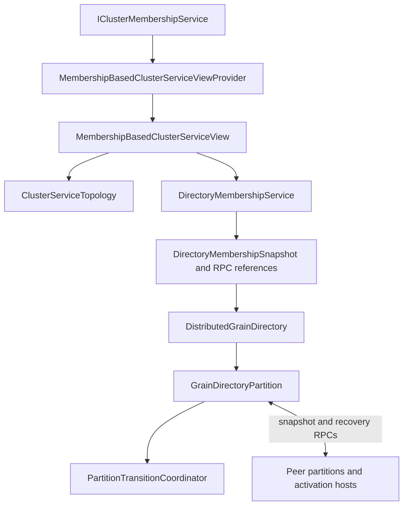
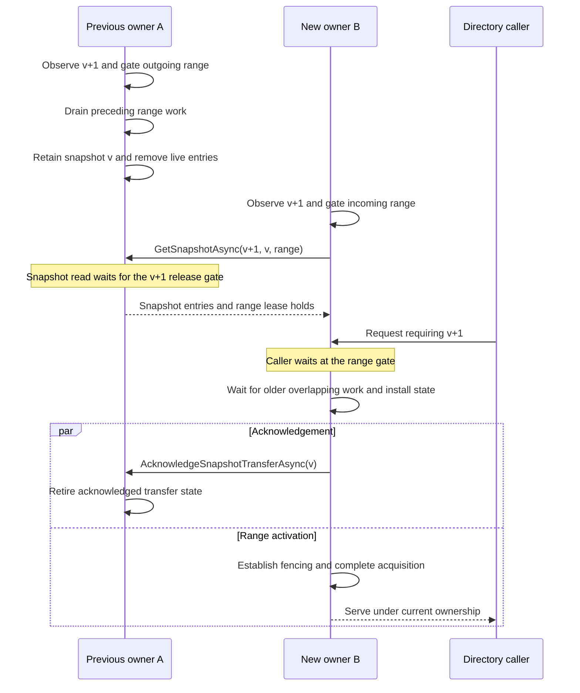

# View-synchronous cluster services

Orleans cluster services use the [Virtual Synchrony approach](https://doi.org/10.1145/41457.37515): normal operation runs within a membership view, and a view-change protocol carries work and state into the next view. Before a new owner starts serving, the runtime accounts for preceding work, transfers or recovers state, and establishes fencing. Requests wait at the affected range's gate while that transition is underway.

Orleans uses range-based partitioning for elastic scaling. A hash ring with a configurable number of virtual nodes per silo determines where each key belongs. View synchrony coordinates when a new owner can start serving it.

The implementation lives in `Orleans.Runtime.ClusterServices`. `DistributedGrainDirectory` uses these helpers to manage grain registrations. This guide follows its ownership-transition protocol: admission, draining, handoff, recovery, and fencing. See [cluster membership](cluster-management.md), [scheduling](scheduler.md), and [grain directory architecture](grain-directory.md) for the surrounding runtime components.

## Virtual Synchrony and elastic scaling

State continuity connects normal operation and view changes: the new owner must account for work accepted by the previous owner before taking over.

The same approach works for an unpartitioned service with a single leader owning the entire key space. A leadership change transfers or recovers the service's state before the successor starts serving. Orleans uses range partitioning to spread work across silos as the cluster grows or shrinks. The protocol runs for the ranges whose owners change, while unrelated ranges keep serving requests.

These papers explain the models behind the implementation:

| Source | Relevant idea | Application in Orleans |
| --- | --- | --- |
| [Exploiting Virtual Synchrony in Distributed Systems](https://doi.org/10.1145/41457.37515) (SOSP 1987; [publication listing](https://www.cs.cornell.edu/projects/quicksilver/pubs.html)) | The foundational virtual-synchrony model coordinates process-group membership changes with message delivery, providing consistent observations across group views. | A view change coordinates the completion of old-view work with ownership and state transfer. |
| [Virtually Synchronous Methodology for Dynamic Service Replication](https://www.microsoft.com/en-us/research/publication/virtually-synchronous-methodology-for-dynamic-service-replication/) (2010) | Integrating normal operation with reconfiguration; establishing boundaries, or wedges, around an old configuration before carrying its state forward. | Versioned range gates prevent a successor from serving partially transferred state. Overlapping transitions wait for preceding work on the same range. |
| [Vertical Paxos and Primary-Backup Replication](https://www.microsoft.com/en-us/research/publication/vertical-paxos-and-primary-backup-replication/) (2009) | Separating configuration authority from the protocol which preserves state across configurations. | A service's view provider supplies ordered views. Partitions transfer or recover the state needed to serve each view. |
| [Dynamo: Amazon's Highly Available Key-value Store](https://www.allthingsdistributed.com/files/amazon-dynamo-sosp2007.pdf) (SOSP 2007; [Dynamo background and HTML version](https://www.allthingsdistributed.com/2007/10/amazons_dynamo.html)) | Consistent hashing and virtual nodes for incremental partition assignment. | Orleans uses a hash ring with configurable virtual nodes per silo. Each virtual node owns a range, which grows or shrinks as membership changes. |
| [The Chubby Lock Service for Loosely-Coupled Distributed Systems](https://research.google/pubs/the-chubby-lock-service-for-loosely-coupled-distributed-systems/) (OSDI 2006) | Advisory ownership, leases, and sequencers used by recipients to reject stale holders. | Fencing is an explicit responsibility at ownership activation. An integration with external state must establish authority at the component which accepts its writes or effects. |

## Service views and their authority

`ClusterServiceViewId` has two parts:

- `ProviderEpoch` identifies a coordinated generation of the service's view authority.
- `Version`, a `ClusterServiceViewVersion`, is the ordered revision supplied by that authority.

IDs are compared by provider epoch first, then revision. For example, `(epoch 2, revision 1)` follows `(epoch 1, revision 500)`. The counters belong to different authorities, so the second provider can start with a smaller revision.

This gives a future rolling provider change a distinct identity. Activating a new epoch is a coordinated operation: participants must agree on the new authority and fence the old one. Epochs are scoped to a logical service and cluster, and are separate from software versions or local configuration fingerprints.

`ClusterServiceView` holds the ID, topology, and an optional `PreviousViewId`. Derived views carry their service-specific configuration and metadata. One ID identifies one canonical view, including that payload. Configuration changes are represented by publishing a new view, rather than by independently changing fields in its identity.

`PreviousViewId` identifies the authoritative predecessor, not the last view a particular reader happened to observe. A view is a direct successor when that ID matches the installed view. This can express continuity across nonconsecutive revisions or a coordinated provider change. Missing or skipped continuity selects recovery.

The implemented `MembershipBasedClusterServiceViewProvider` uses cluster membership revisions within its configured epoch. Its `MembershipBasedClusterServiceView` carries the cluster membership snapshot and fixed `ClusterServiceConfiguration`. Membership revisions are consecutive, so this provider identifies the predecessor as the preceding membership revision. It ignores repeated and older snapshots and relies on the membership layer to give each revision a canonical meaning.

Silo identity includes its endpoint and generation. A restart at the same endpoint gets a new generation. Messages and snapshot acknowledgements from the previous process still refer to its old identity.

### From assignment to a ready owner

Knowing who owns a range and having the state needed to serve it are separate steps. Consider a directory handoff:

1. In view `v10`, A owns range R. It holds a registration for grain G, whose activation is running on another silo, H.
2. View `v11` assigns R to B. Once B sees that view, it can compute its new responsibility, but the state transfer may still be in progress. Its range gate holds incoming requests.
3. After B installs the transferred or recovered state and establishes fencing, it opens the gate. A lookup for G returns the existing activation on H.

An early lookup during step 2 could report G as missing and lead to a second activation. The view-change protocol closes that gap: it coordinates the change in ownership with the work needed to preserve the range's state. Computing the same assignment on every silo is one part of the handoff; making the new owner ready is the other.

### Hash-ring partitioning

The simple membership-derived provider computes responsibility as a pure function of service configuration and membership:

`assignment = F(configuration, membership snapshot)`

Given the same inputs, every silo computes the same assignment. `ClusterServiceConfiguration` supplies the service identifier, virtual-node count, and assignment-strategy identifier. Hosts must agree on these inputs and on the algorithm named by that identifier. This is an operational requirement of the simple provider; a local fingerprint would not establish agreement between hosts.

The membership-derived view selects `Active` silos, then builds `ClusterServiceTopology` from that participant set. Each silo contributes the configured number of virtual nodes, each with a position on the ring. A virtual node owns the clockwise interval `(start, nextStart]`, including wraparound through zero. If there is just one virtual node, it owns the full ring.

Ring positions are sorted by hash, then partition index, then sorted member index. Hash collisions are resolved deterministically; losing partitions have empty ranges. The directory creates one `GrainDirectoryPartition` system target per configured virtual node, identified by silo identity and partition index.

Owner lookup uses binary search over the sorted boundaries. Per-member range collections are derived from the same assignment. <xref:Orleans.Configuration.GrainDirectoryOptions.PartitionsPerSilo?displayProperty=nameWithType> controls directory partition granularity and defaults to one.

Membership-derived assignment is a design choice. The [register-backed configuration proposal](https://github.com/dotnet/orleans/issues/11156) would publish assignment, service configuration, and metadata atomically in a shared consistent register. Its revision would identify that whole record, and its views could carry typed configuration alongside topology. Draining, state transfer or recovery, and fencing would still govern ownership changes.

### Selecting a provider per service

`IClusterServiceViewProvider` supplies the current view, an asynchronous stream of newer views, and minimum-view refresh. Providers are keyed singleton services, using the logical service identifier as the key. Different services can select different providers without changing each other's assignment policy or authority.

<xref:Orleans.Hosting.CoreHostingExtensions.AddDistributedGrainDirectory*?displayProperty=nameWithType> registers the membership-derived provider under `orleans-grain-directory` when that key has no provider registration. A service-specific registration can replace that selection. The DI container owns the provider's lifetime; the directory adapter owns its local projection. Direct construction of the directory adapter creates and owns a private provider.

The directory's existing RPCs carry `MembershipVersion`. Its adapter therefore requires the membership-derived provider in epoch zero and explicitly converts between wire membership versions and service-view IDs. Using a different authority for the directory also requires a coordinated wire/protocol migration. The current increment supplies per-service selection and the simple provider; register-backed configuration and live authority migration remain follow-up work.

The simple provider rejects a refresh request for an epoch it does not serve. A host can then report an authority mismatch explicitly instead of trying to repair it by refreshing an unrelated membership counter.

### Configuration changes within a view stream

A service view can carry more than an assignment. A derived view can include operating settings, state-format information, or administrative metadata, all identified by the same view ID.

The service decides what a new payload requires. A metadata-only change can leave topology unchanged. A change to execution or state semantics may need a barrier even when ownership stays the same. The provider publishes the authoritative view; the service and transition coordinator establish readiness to use it.

## Components

| Component | Responsibility |
| --- | --- |
| `ClusterServiceViewId` and `ClusterServiceViewVersion` | Provider-scoped identity and consistent ordering for comparisons and gates. |
| `ClusterServiceView` | Canonical topology and source-backed predecessor identity; derived views carry typed configuration and metadata. |
| `ClusterServiceConfiguration` | Fixed assignment inputs for the simple membership-derived provider. |
| `ClusterServiceTopology` | Deterministic range assignment and owner lookup. |
| `IClusterServiceViewProvider` | Per-service contract for current views, view updates, refresh, and lifecycle. |
| `MembershipBasedClusterServiceViewProvider` | Project membership into service views within a configured provider epoch. |
| `PartitionTransitionCoordinator` and `PartitionTransition` | Track versioned range gates and enforce legal local transition stages. |
| `ClusterServiceOperationResult<T>` | Describe execution certainty and whether retry requires deduplication. |
| `DirectoryMembershipService` and `DirectoryMembershipSnapshot` | Adapt service views into directory routing snapshots and partition references. |
| `DistributedGrainDirectory` | Route client operations, dispatch membership changes to partitions, coordinate the recovery watermark and activation enumeration, and report fatal transition errors. |
| `GrainDirectoryPartition` | Execute directory admission, snapshot transfer, recovery, and lease checks on its system-target scheduler. |

Membership projection and partition updates run asynchronously. A routing snapshot can therefore be ahead of a partition's local view. Request processing waits for the view and range it needs before using local state.

`RefreshViewAsync` returns immediately when the local view satisfies the requested ID in the provider's epoch. A null minimum forces a refresh. The simple provider awaits membership refresh and then its local projection. Refresh errors propagate to the caller. If shutdown or stream termination interrupts the wait, the caller receives cancellation.

## Scheduling, admission, and versioned gates

Each directory partition is a system target. Its scheduler serializes synchronous turns which access the directory map, retained snapshots, and current range. Asynchronous transfer and recovery yield that scheduler so newer views and other requests can be processed.

The partition **installs the range gate synchronously, before the transition's first `await`**. A caller can already see the new owner in its routing snapshot while that owner is still acquiring the range. The gate keeps the request waiting until the range is ready.

A transition blocks an intersecting request when its target view ID is less than or equal to the ID that the request must wait for. Both the provider epoch and revision participate in this comparison. The directory maps wire membership versions into epoch-zero IDs. Strict lookup, registration, and deregistration wait for the maximum of the caller's version and the partition's current version. An opted-in request can also use the immediately preceding membership view when the partition proves continued ownership. Both paths pass the local range gate, re-read the view after waiting, and establish ownership before accessing the map.

Acquisition, release, and recovery wait for preceding local transitions using the predecessor version. For example, releasing a range in view `v3` waits for its acquisition in `v2`, while the `v3` release gate remains installed. The earlier acquisition can then finish without waiting on the later release. Snapshot reads instead wait on the target version: `GetSnapshotAsync(v3, v2, range)` waits for the `v3` release gate before reading the retained `v2` snapshot.

Once a directory request has passed its gate, its map operation runs synchronously within the turn. Together with the predecessor gates, this gives the directory a clear draining boundary. A service which awaits external work inside an admitted operation needs to drain or fence that work before handoff.

Canceling one caller cancels its wait, while the shared transition continues. Transition completions run continuations asynchronously, keeping waiter code outside the coordinator's collection lock.

## Serving requests one view behind

During a rolling upgrade, hosts usually leave and join while the cluster remains approximately the same size. Each membership revision can change the ring, but most keys keep the same owner. A caller which has learned the newest view can therefore get ahead of a still-correct owner. Requiring that owner to catch up to the caller's exact revision introduces a barrier even for those unchanged keys.

The caller sends its routing snapshot's version and an `allowPreviousVersion` permission bit. A partition at `v` receiving an opted-in request for `v+1` has a simple proof of continuous ownership: the caller routed to this partition in `v+1`, and the partition verifies its own ownership in `v`. Canonical membership versions are consecutive, so these two views cover the entire interval. Identity includes both the silo incarnation and the partition index.

For example, a caller at `v21` routes key K to partition A. A is ready at `v20` and owns K there, so it can serve the request immediately. This works even if the caller learned `v21` after skipping `v20`: the receiver supplies the predecessor's ownership check. A partition which gains K in `v21` first refreshes and completes its acquisition.

A receiver more than one view behind refreshes to the requested view. With A in `v20`, B in `v21`, and A again in `v22`, checking only the endpoint owners would miss the intervening transfer. The one-successor rule gives a bounded proof using the two participants' existing snapshots. Routing continues to use the canonical topology lookup.

The directory uses this arithmetic proof within its epoch-zero membership authority. A provider with sparse revisions would establish adjacency through authoritative predecessor identities. Provider changes establish their authority boundary as part of the service's migration protocol.

### Readiness and operation requirements

| Condition | Admission |
| --- | --- |
| Exactly one view behind, same owner, operation permits the previous view | Pass the current range gate, recheck the view, and execute. |
| More than one view behind, or a lagging receiver lacking ownership or active membership for the mutation host | Refresh to the requested view and establish readiness there. |
| Receiver at or ahead of the requested view | Pass the current range gate and serve if this partition still owns the key; otherwise return its view for rerouting. |
| Strict request | Apply the existing minimum-view and range-gate requirements. |

A ready current owner can be arbitrarily far ahead of the caller; the one-revision limit applies to receivers which are behind.

An acquisition still holds requests until state installation and fencing complete. If an await allows the partition view to change, admission runs again. Accepted map operations execute synchronously on the partition scheduler. Normal membership propagation continues bringing an owner toward the newest view while already-valid requests use its installed state.

Ownership is one part of validity. The caller permits the previous view only when it satisfies the captured recovery watermark and any minimum established by an earlier attempt. If recovery advances during the RPC, the existing recovery-driven retry applies before caller completion.

Registration and deregistration additionally require their activation host to be active in the caller's routing snapshot and the receiver's admitted snapshot before using the fast path. A registration on a newly joined host therefore waits for a view which includes that host. A deregistration for a host whose death the caller has observed uses strict admission, incorporating the corresponding safety lease.

Opted-in operations evaluate activation liveness using the admitted partition membership. This aligns the decision with installed lease and cleanup state: a newer directory projection can learn about a death before the partition has processed it. If lookup or registration returns an activation whose death the caller knows about, the caller retries with a strict minimum covering that death observation. The owner can then apply the appropriate lease or cleanup action.

### Replies and deployment

The existing `DirectoryResult<T>` contract applies to both paths: success echoes the request version, an ownership redirect reports the receiver's view, and a lease hold supplies a retry delay. The receiver stamps a newly stored registration with its execution version. A valid predecessor-view response completes immediately. The requested version remains a minimum-view requirement with a narrowly permitted relaxation; a ready owner in a newer view can serve the operation using the established directory behavior.

<xref:Orleans.Configuration.GrainDirectoryOptions.EnablePreviousViewRequests?displayProperty=nameWithType> defaults to `false`. Receiver support can be deployed first, followed by controlled enablement of the fast path. Turning the option off returns callers to strict admission while normal ownership transitions continue.

Lookup, registration, and deregistration append the permission bit after the existing cancellation-token parameter. Existing aliases, argument field IDs, and cancellation-token positions remain stable. The absent bit defaults to `false`, preserving older callers' minimum-version guarantee. Older receivers ignore the added field and enforce the supplied version. Both versions use the same response fields and interpretation.

Snapshot, acknowledgement, and recovery RPCs continue to carry their exact protocol-dependency versions.

## Transition state machine

Each transition records its range, previous view, target view, direction, stage, completion task, and any failure or fencing information.

| Direction | Successful progression | What must be finished |
| --- | --- | --- |
| Inbound | `Blocking` -> `StateInstalled` -> `Fenced` -> `Completed` | State installation and the service's fencing conditions are established. |
| Outbound with handoff | `Blocking` -> `Drained` -> `StateRetained` -> `Completed` | Preceding work is drained and the state needed by transfer partners is retained. |
| Outbound without a retained handoff | `Blocking` -> `Drained` -> `Completed` | Draining completes; the directory uses this path when continuity is unavailable or there are no transfer partners. |
| Barrier | `Blocking` -> `Completed` | The protected operation finishes. Directory integrity probes use this form. |

Overlapping active transitions with the same target view are rejected. Different target views can overlap; their predecessor waits establish the ordering.

`Fail` records the exception, cancels the completion task to wake waiters, and retains the gate in `Failed`. `Complete` accepts only the required stages. In the directory integration, an exception takes precedence over a completion-eligible stage, and the transition task is observed by the silo's fatal-error handler.

`Abort` removes the gate and cancels its completion. The directory uses this during shutdown, after its stopped token has closed request admission. A new integration must establish the corresponding admission boundary before abandoning a transition.

## Contiguous directory handoff

For a direct successor view, the directory pulls state from the previous owners of the acquired range. The request identifies both the target membership version and the predecessor snapshot version.

Either owner can observe the new view first. The membership update starts the release; a snapshot request arriving at a lagging owner prompts a refresh and waits for that release before reading the retained state.

Acknowledgement is initiated by each transfer helper after copying its state. Its asynchronous completion can interleave with acquisition completion and caller processing. When several predecessors contribute state, range activation waits for all transfer results and the required fencing conditions.

An outgoing snapshot tracks the predecessor version and its transfer partners, identified by silo incarnation and partition index. Acknowledgements retire the corresponding partner. The snapshot is released when its partners are finished, are declared dead through membership processing, or abandon transfer in favor of recovery.

A receiver can obtain state from several previous partitions. It waits for older overlapping local transitions before incorporating each transfer. Large ranges are divided into smaller subrange requests based on ring coverage. Response size still depends on the number of registrations in each subrange.

### Why overlapping views need predecessor waits

Suppose B is acquiring a range in `v2` while its snapshot response is delayed. Before that response arrives, B observes `v3` and must give part of the range to C. B's `v3` release waits for its `v2` acquisition. Otherwise B could hand C an empty snapshot and later install the delayed entries after giving up ownership.

The converse also matters: B can shrink in one view and grow again in a later view while an earlier acquisition is still pending. A newer snapshot must wait for the older acquisition and intervening release. Installing it early can expose partial state or let a delayed older snapshot replace newer registrations.

These dependencies are range-specific. Unrelated ranges can make progress while one handoff is blocked.

## Recovery after a missed view or failed transfer

When a silo skips a view, the acquiring partition rebuilds the range through recovery. The same path handles an unavailable predecessor or a failed transfer.

`RecoverPartitionRange` asks eligible activation hosts for registrations in the acquired range. Hosts in `Active`, `Joining`, and `ShuttingDown` states can participate, since activation hosting and directory ownership have different lifecycle boundaries. Each host enumerates its actual activation directory and filters entries by range, directory implementation, and registration/lifecycle state.

Recovery rebuilds the acquired directory range from these responses. Membership and lease checks handle entries whose activation hosts have failed.

### Registration versus recovery

The recovery scan must account for a registration which is concurrently completing against an old owner. `DistributedGrainDirectory` uses a silo-wide `_recoveryMembershipVersion` watermark:

1. An activation host begins a directory operation, captures its current recovery watermark, and resolves an owner using a view at least as recent as that watermark.
2. A recovery request for a newer view reaches the host and advances the watermark before enumerating registered activations.
3. When the remote call returns, the host checks the watermark again. If it changed, the host refreshes and retries at or above the new watermark before completing the operation to its caller.
4. The completed registration is then accounted for by the recovery scan or by registration under the newer view.

The watermark is silo-wide: recovery of any range raises the minimum view used for directory operations from that activation host.

`RecoverEntry` retains the newer registration membership version when reconciling conflicting records. This is especially relevant during coexistence with `LocalGrainDirectory`, whose recovery participation differs. Equal-version records retain the existing processing-order tie behavior.

## Fencing and the failure model

Membership gives every view a consistent meaning, but a declaration of death and a process exit are separate events. A paused silo can resume after the cluster has declared it `Dead`. When it learns of that decision, Orleans terminates the old incarnation.

Service code establishes the fence, then calls `MarkFenced` to record it and advance the inbound transition. `ClusterServiceFence` holds the mode and token; the service owns the underlying fencing mechanism.

| Mode | Directory or integration responsibility |
| --- | --- |
| `MembershipView` | The directory coordinates view-aware admission, predecessor transfer or recovery, and membership-based owner validity. |
| `TimedSafetyLease` | The directory installs range lease holds during qualifying failure recovery, carrying their expirations through snapshot transfer. New registrations can receive a retry delay while the holds are active. |
| `External` | A service establishes an authoritative fence at its storage or effect boundary, such as a recipient-enforced ownership epoch. |

The directory computes a post-detection hold as `max(0, range lease duration - failure-detection budget)`, using <xref:Orleans.Configuration.GrainDirectoryOptions.RangeLeaseDuration?displayProperty=nameWithType>. The detection budget is <xref:Orleans.Configuration.ClusterMembershipOptions.MaxProbeTimeout?displayProperty=nameWithType> multiplied by <xref:Orleans.Configuration.ClusterMembershipOptions.NumMissedProbesLimit?displayProperty=nameWithType>. Peer-declared death and missing previous-owner information can require holds; orderly departure follows the graceful path.

An acquisition can finish recovery and open its transition gate while a range lease still defers new registrations. Transition completion and lease expiration are separate boundaries.

A registration whose proposed address matches its supplied current registration skips the range hold. A silo hold can still require a retry unless the supplied registration matches the stored entry. Lookup filters dead-silo entries and does not wait for range holds. Deregistration returns false while a silo hold is active for the stored entry.

The safety window depends on the membership detector's timing bounds and the old owner's shutdown behavior. [How to do distributed locking](https://martin.kleppmann.com/2016/02/08/how-to-do-distributed-locking.html) explains what happens when process pauses or delayed requests outlast a lease. [The Chubby lock service](https://research.google/pubs/the-chubby-lock-service-for-loosely-coupled-distributed-systems/) describes sequencers that let the recipient reject stale holders. For external state, enforce the ownership epoch where writes or effects are accepted.

## Execution certainty and retry

`ClusterServiceOperationResult<T>` separates execution certainty from reasons for retry:

| Disposition | Caller interpretation |
| --- | --- |
| `RejectedBeforeExecution` | The operation was rejected before execution; retry is permitted without deduplicating an earlier execution. |
| `Executed` | Interpret the returned result according to the operation contract. |
| `OutcomeUnknown` | Resolve or deduplicate the earlier attempt before a correctness-sensitive retry. This is the default disposition, including when a serialized disposition field is absent. |

Reasons such as wrong view, partition readiness, safety delay, or member unavailability explain the next action. A timed-out call has an unknown outcome: it may have started or completed before the response was lost. See [messaging and delivery semantics](messaging-delivery-guarantees.md) for the call contract.

The directory records `ClusterServiceFence` locally during acquisition. Its RPCs use `DirectoryResult<T>`, `MembershipVersion`, and the existing snapshot payloads. `ClusterServiceOperationResult<T>` is available to internal service integrations. Successful directory responses echo the request version; ownership redirects report the partition's current version, and lease responses carry a retry delay.

## Failure handling and observability

| Observation | Runtime response |
| --- | --- |
| Request needs a newer view | Refresh membership/projection, wait for the relevant range, and re-evaluate ownership. |
| Request has stale ownership | Return newer-view information so the caller can resolve the current owner. |
| Transient transfer RPC failure | Refresh and retry while the target remains eligible; failed transfer can select recovery. |
| Caller cancels | End that caller's wait while shared transition work continues. |
| Unexpected range-transition exception | Keep the range failed and gated, report the original exception through fatal-error handling, and let membership-driven replacement recover the owner. |
| Silo shutdown | Cancel request admission and pending waits, then dispose the projection and runtime resources. |

For a stalled transition, correlate the latest cluster view, projected directory view, partition view, blocking range/version, and transfer partner status. Progress after stabilization depends on delivery to eligible peers and availability of the required membership/recovery inputs.

`GrainDirectoryEvents` exposes membership observations, range-operation start/completion, lease holds, and registration delays. `IntegrityViolation` supplies explicit evidence from integrity probes, including the grain, silo, partition, view, range, and original exception.

`PreviousViewAdmission` records the requested view, the receiver's installed view, and its decision: refresh, local range-gate evaluation, or admission. Correlate range-gate events with the existing range-operation events to identify pending acquisition or fencing.

`RangeOperationCompleted` describes the end of an operation. Interpret it alongside failure diagnostics and the actual readiness gate: its `Canceled` field records shutdown cancellation, and a failed transition retains its gate. Correlation by silo incarnation, partition, version, and range is essential when operations overlap.

Range-lock duration, snapshot-transfer count/duration, and recovery count/duration help distinguish slow handoff from repeated recovery. Retained snapshots and pending transitions also represent memory and shutdown obligations. More partitions improve assignment granularity while increasing references, transition work, and transfer fan-out.

## Adapting another runtime service

These helpers are internal runtime code. Another service using them needs to define:

- The partition key space, deterministic assignment inputs, and configuration identity.
- The point where admission is gated and the work which must drain before state is retained.
- The state needed by a successor and the reconstruction source when continuity or a predecessor is lost.
- The authority which fences old owners, including any external writes and in-flight effects.
- Execution certainty, retry/deduplication behavior, cancellation, and shutdown ordering.
- The relationship between observable transition completion and actual readiness to serve.

The provider interface and per-service selection are implemented. [The register-backed configuration proposal](https://github.com/dotnet/orleans/issues/11156) covers shared configuration records, service-specific participant groups, and coordinated authority migration.

## Source map and executable protocol scenarios

The provider contract and directory integration are developed in [the cluster-service implementation PR](https://github.com/dotnet/orleans/pull/10969/files). Start with these files:

- `ClusterServices\IClusterServiceViewProvider.cs`, `ClusterServiceView.cs`, `ClusterServiceViewId.cs`, and `MembershipBasedClusterServiceViewProvider.cs`: provider selection, canonical view payload, identity, and the simple provider.
- `ClusterServices\ClusterServiceTopology.cs` and `PartitionTransitionCoordinator.cs`: assignment lookup, transition stages, and versioned gates.
- `GrainDirectory\DirectoryMembershipService.cs` and `DirectoryMembershipSnapshot.cs`: the membership-version wire adapter and provider lifetime boundary.
- `GrainDirectory\DistributedGrainDirectory.cs`, `GrainDirectoryPartition.cs`, and `GrainDirectoryPartition.Interface.cs`: invocation, recovery watermark, state transfer, admission, and fencing.

The following links retain the original protocol-scenario baseline:
- [Controlled protocol scenarios](https://github.com/dotnet/orleans/blob/19c8de3ebbdf599de84f177887ccfd671ed0cfd8/test/Orleans.Runtime.Internal.Tests/ClusterServices/ControlledGrainDirectoryProtocolTests.cs): real partition schedulers, delayed replies, overlapping views, cancellation, incarnation changes, and independent registration/ownership oracles.
- [Real-process version and pause scenarios](https://github.com/dotnet/orleans/blob/19c8de3ebbdf599de84f177887ccfd671ed0cfd8/test/Orleans.GrainDirectory.Tests/Compatibility/GrainDirectoryProcessCompatibilityTests.cs): cross-version handoff, authoritative activation identity, and resumed-owner self-fencing.
- [Suite guide and mutation guardrails](https://github.com/dotnet/orleans/blob/19c8de3ebbdf599de84f177887ccfd671ed0cfd8/test/Orleans.GrainDirectory.Tests/README.md): commands, evidence boundaries, failure attribution, and the assertions protecting key protocol dependencies.

These suites cover local state-machine rules, controlled RPC interleavings, real-process behavior, and sustained churn. Read them alongside the protocol description when changing admission, handoff, or recovery.
