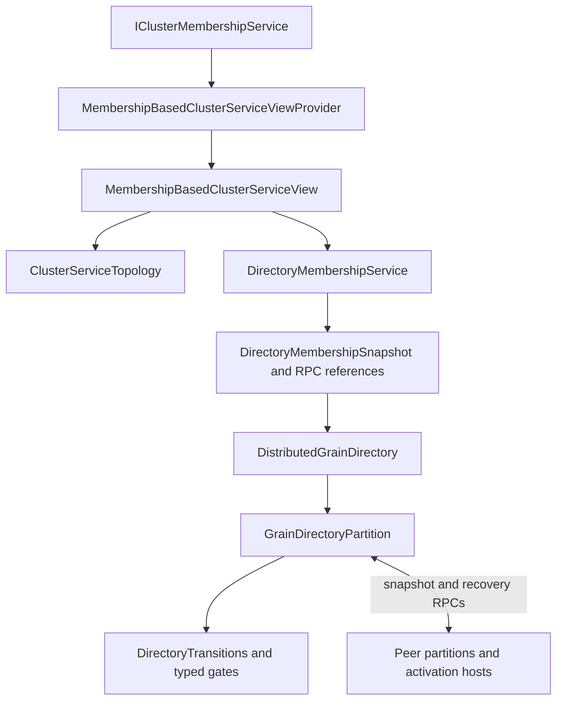
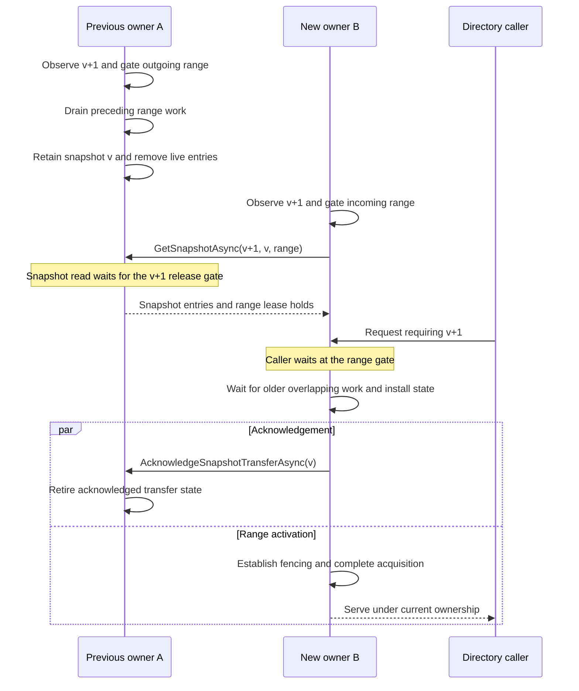

# View-synchronous cluster services

Orleans cluster services use the [Virtual Synchrony approach](https://doi.org/10.1145/41457.37515): normal operation runs within an authoritative service view, and a view-change protocol carries work and state into the next view. Before a new owner starts serving, the runtime accounts for preceding work, transfers or recovers state, and establishes fencing. Requests wait at the affected resource's gate while that transition is underway.

Orleans uses range-based partitioning for elastic scaling. A hash ring with a configurable number of virtual nodes per silo determines where each key belongs. View synchrony coordinates when a new owner can start serving it.

The implementation lives in `Orleans.Runtime.ClusterServices`. `DistributedGrainDirectory` uses these helpers to manage grain registrations. This guide follows its ownership-transition protocol: admission, draining, handoff, recovery, and fencing. See [cluster membership](cluster-management.md), [scheduling](scheduler.md), and [grain directory architecture](grain-directory.md) for the surrounding runtime components.

## Virtual Synchrony and elastic scaling

State continuity connects normal operation and view changes: the new owner must account for work accepted by the previous owner before taking over.

The same approach works for an unpartitioned service with a single leader owning the entire key space. A leadership change transfers or recovers the service's state before the successor starts serving. Orleans uses range partitioning to spread work across silos as the cluster grows or shrinks. The protocol runs for the ranges whose owners change, while unrelated ranges keep serving requests.

These papers explain the models behind the implementation:

| Source | Relevant idea | Application in Orleans |
| --- | --- | --- |
| [Exploiting Virtual Synchrony in Distributed Systems](https://doi.org/10.1145/41457.37515) (SOSP 1987; [publication listing](https://www.cs.cornell.edu/projects/quicksilver/pubs.html)) | The foundational virtual-synchrony model coordinates process-group membership changes with message delivery, providing consistent observations across group views. | A view change coordinates the completion of old-view work with ownership and state transfer. |
| [Virtually Synchronous Methodology for Dynamic Service Replication](https://www.microsoft.com/en-us/research/publication/virtually-synchronous-methodology-for-dynamic-service-replication/) (2010) | Integrating normal operation with reconfiguration; establishing boundaries, or wedges, around an old configuration before carrying its state forward. | Versioned range gates prevent a successor from serving partially transferred state. Overlapping transitions wait for preceding work on the same range. |
| [Vertical Paxos and Primary-Backup Replication](https://www.microsoft.com/en-us/research/publication/vertical-paxos-and-primary-backup-replication/) (2009) | Separating configuration authority from the protocol which preserves state across configurations. | A service's view provider supplies ordered views. Partitions transfer or recover the state needed to serve each view. |
| [Dynamo: Amazon's Highly Available Key-value Store](https://www.allthingsdistributed.com/files/amazon-dynamo-sosp2007.pdf) (SOSP 2007; [Dynamo background and HTML version](https://www.allthingsdistributed.com/2007/10/amazons_dynamo.html)) | Consistent hashing and virtual nodes for incremental partition assignment. | Orleans uses a hash ring with configurable virtual nodes per silo. Each virtual node owns a range, which grows or shrinks as membership changes. |
| [The Chubby Lock Service for Loosely-Coupled Distributed Systems](https://research.google/pubs/the-chubby-lock-service-for-loosely-coupled-distributed-systems/) (OSDI 2006) | Advisory ownership, leases, and sequencers used by recipients to reject stale holders. | Fencing is an explicit responsibility at ownership activation. An integration with external state must establish authority at the component which accepts its writes or effects. |

## Service views and their authority

`IClusterServiceView<TViewId>` supplies a canonical identity and an authoritative predecessor. Each provider chooses its identity type, and each concrete view carries its own assignment and service metadata. Resource-set and ring services share the same gate contracts.

The membership-derived `ClusterServiceViewId` has two parts:

- `ProviderEpoch` identifies a coordinated generation of the service's view authority.
- `Version`, a `ClusterServiceViewVersion`, is the ordered revision supplied by that authority.

Revisions are comparable within the configured authority. Comparing different epochs reports an authority mismatch. Activating a replacement authority requires an explicit bootstrap policy which establishes agreement and fences the previous authority.

Epochs are scoped to a logical service and cluster. Service-view revision, cluster-membership watermark, and external fencing token each describe a separate boundary: placement, liveness knowledge, and authority to perform effects.

One ID identifies one immutable, canonical view, including its participant set, silo incarnations, assignment, and compatibility-relevant configuration. An authority publishes those inputs atomically. Configuration changes enter the stream through new authoritative snapshots.

`TryGetPredecessor` supplies the predecessor recorded by the authority. A view is a direct successor when that ID matches the installed view and the service's configuration is compatible. This supports authorities with nonconsecutive revisions. Missing or skipped continuity selects recovery, including an A -> B -> A assignment whose final local resource set matches the initial set.

The implemented `MembershipBasedClusterServiceViewProvider` uses cluster membership revisions within its configured epoch. Its `MembershipBasedClusterServiceView` carries the cluster membership snapshot and fixed `ClusterServiceConfiguration`. Membership revisions are consecutive, so this provider identifies the predecessor as the preceding membership revision. It ignores repeated and older snapshots and relies on the membership layer to give each revision a canonical meaning.

Silo identity includes its endpoint and generation. A restart at the same endpoint gets a new generation. Messages and snapshot acknowledgements from the previous process still refer to its old identity.

### From assignment to a ready owner

Knowing who owns a range and having the state needed to serve it are separate steps. Consider a directory handoff:

1. In view `v10`, A owns range R. It holds a registration for grain G, whose activation is running on another silo, H.
2. View `v11` assigns R to B. Once B sees that view, it can compute its new responsibility, but the state transfer may still be in progress. Its range gate holds incoming requests.
3. After B installs the transferred or recovered state and establishes fencing, it opens the gate. A lookup for G returns the existing activation on H.

An early lookup during step 2 could report G as missing and lead to a second activation. The view-change protocol closes that gap: it coordinates the change in ownership with the work needed to preserve the range's state. Computing the same assignment on every silo is one part of the handoff; making the new owner ready is the other.

### Hash-ring partitioning

The simple membership-derived provider computes responsibility as a pure function of service configuration and membership:

`assignment = F(configuration, membership snapshot)`

Given the same inputs, every silo computes the same assignment. `ClusterServiceConfiguration` supplies the service identifier, virtual-node count, and assignment-strategy identifier. Hosts must agree on these inputs and on the algorithm named by that identifier. This is an operational requirement of the simple provider; a local fingerprint would not establish agreement between hosts.

The membership-derived view selects `Active` silos, then builds `ClusterServiceTopology` from that participant set. Each silo contributes the configured number of virtual nodes, each with a position on the ring. A virtual node owns the clockwise interval `(start, nextStart]`, including wraparound through zero. If there is just one virtual node, it owns the full ring.

Ring positions are sorted by hash, then partition index, then sorted member index. Hash collisions are resolved deterministically; losing partitions have empty ranges. The directory creates one `GrainDirectoryPartition` system target per configured virtual node, identified by silo identity and partition index.

Owner lookup uses binary search over the sorted boundaries. `VisitRangeOwners` searches for `Start + 1` using unsigned wrap, then walks the intersecting owners in ring order. It reports each partner's full range once, including when a wrapping query begins and ends inside the same owner's range. A partial query costs `O(log P + K)` for `P` ring partitions and `K` output partners. Per-member range collections are derived from the same assignment. <xref:Orleans.Configuration.GrainDirectoryOptions.PartitionsPerSilo?displayProperty=nameWithType> controls directory partition granularity and defaults to one.

The topology also indexes explicitly published ring assignments. Its source boundary validates participant eligibility, partition identity, full coverage, and nonoverlap before building the lookup index. The directory continues to compute local range differences and discovers transfer partners through the ordered index. Each partner receives one transfer/acknowledgement unit; that unit batches intersections and retires source state after installation of all required data.

### Selecting a provider per service

`IClusterServiceViewProvider<TViewId, TView>` supplies `TryGetCurrentView`, an asynchronous stream of newer views, `RefreshAsync`, and `RefreshAtLeastAsync`. The concrete view type flows through the contract. Providers are scoped to a logical service and authority; keyed registrations use the service identifier.

<xref:Orleans.Hosting.CoreHostingExtensions.AddDistributedGrainDirectory*?displayProperty=nameWithType> registers the membership-derived provider under `orleans-grain-directory` when that key has no provider registration. A service-specific registration can replace that selection. The DI container owns the provider's lifetime; the directory adapter owns its local projection. Direct construction of the directory adapter creates and owns a private provider.

The directory's existing RPCs carry `MembershipVersion`. Its adapter requires the membership-derived provider in epoch zero and explicitly converts between wire membership versions and service-view IDs. It retains the empty startup baseline, deterministic ring, system-target addressing, RPC aliases, and serialized field meanings. An alternate directory authority requires a coordinated wire/protocol migration.

The simple provider rejects a refresh request for an epoch it does not serve. A host can then report an authority mismatch explicitly instead of trying to repair it by refreshing an unrelated membership counter.

### Atomic register-backed views

`RegisteredClusterServiceViewProvider` supports explicit placement changes while cluster membership stays fixed. Its `RegisteredServiceViewId` identifies the logical service, authority namespace, and revision. `RegisteredClusterServiceView` publishes configuration, eligible silo incarnations, resources, ownership, and the membership watermark together. Ordinal resource identities and sorted participants give independent observers the same canonical representation. Forward ownership and frozen per-owner resource sets are constructed together.

Ring-backed resources retain their service-scoped resource identity across owner changes. `ResourceRanges` binds each identity to its geometry, while `ResourcePartitions` resolves it to the current silo and partition slot. Construction verifies that these indexes and the complete ring assignment agree. `TryGetRingResource` combines ordered point lookup with the immutable slot-to-resource index. A change to a resource's geometry selects recovery before the replacement receiver becomes ready.

`AzureBlobClusterServiceViewRegister` provides the concrete authority. One blob on an Azure Storage primary endpoint contains the complete snapshot. A single content download returns both that snapshot and its ETag. Initial publication uses `If-None-Match: *`; replacement uses `If-Match` with the observed ETag. Concurrent proposals against the same token have one winner. The ETag governs conditional publication, the service revision orders placement, and an external fence governs resource effects.

The host provisions a container and a distinct blob for each service authority, supplies primary-endpoint authentication, and constructs the provider with that service's membership source and participation policy. Dynamic opt-in and opt-out enter the published participant set. Writers validate participants against the required membership observation before committing a proposal; readers install the published mapping atomically.

Each successful proposal records the actual register predecessor. The write response supplies the committed ETag, which the provider installs atomically with the published view. This preserves the publication's identity even when another writer advances the register before the response arrives. Polling readers can skip revisions and still distinguish an ordinary handoff from recovery. Repeated identical observations preserve the installed view. A conflicting definition for an existing identity, regressed revision, removed initialized register, or changed authority terminates that provider with an explicit error. Recreating an authority requires a new namespace and a coordinated bootstrap/fencing policy.

`RefreshLivenessAsync` advances membership knowledge independently of placement. A newly dead owner becomes unavailable in the installed mapping; assigning its resources to a replacement requires another conditional publication. Refresh waits for an adequate authoritative view, and cancellation belongs to the individual waiter. Provider failure and disposal release pending waits with the corresponding terminal outcome.

### Reference resource ownership

`ResourceOwnershipConsumer` drives the typed gates for a finite set of service resources. Its caller feeds installed provider views into `InstallViewAsync`. The consumer validates the provider's service and authority namespace before initial installation and after asynchronous boundaries. It compares local owned sets, synchronously registers transitions, and then exposes the new local assignment. A service implements `IResourceOwnershipProtocol` for checkpoint/replay, peer transport, and recipient-enforced external fencing.

A continuous move requests the predecessor's retained state after its release has drained. Advancing the local view retires retained entries for superseded handoff targets; an active release holds its own state reference until it finishes. Missing continuity, including skipped A -> B -> A placement, selects recovery. The destination installs state and acquires an external fence before opening admission. Requests and snapshot replies are tied to a receiver identity and view, and the consumer rechecks those identities after waits. A delayed response therefore cannot populate a replacement receiver.

Each receiver serializes state transformations. Canceling a queued caller leaves the executing transformation and shared acquisition intact. Consumer shutdown cancels queued and active cooperative operations, closes gates, and waits for their cleanup. A terminal provider failure cancels active authority reads and queued publication work, preserving the original failure for pending refreshes and subscribers.

The reference consumer makes the service-specific recovery and effect boundary explicit. Its protocol implementation supplies the durable recovery source and enforces fencing at the recipient of writes or other effects. Checkpoints carry the previous ownership view, and the recipient uses its ownership fence to preserve the current owner's durable state when a superseded receiver retires. For example, if A misses B's ownership view, A's delayed checkpoint preserves B's newer checkpoint and A recovers that newer state. Transition failures retain their original fault and keep the resource gated through terminal shutdown.

### Configuration changes within a view stream

A concrete service view can include operating settings, state-format information, or administrative metadata, all identified by the same view ID.

The service decides what a new payload requires. A metadata-only change can leave topology unchanged. A change to execution or state semantics may need a barrier even when ownership stays the same. The provider publishes the authoritative view; the service and transition coordinator establish readiness to use it.

Admission policy belongs to the service's operation contract. Another service could use an ownership-continuity proof to serve a request under an older installed view when its state, configuration, and fencing requirements remain satisfied. Adjacent authoritative views with the same ready owner are one possible basis for that optimization. The grain directory uses minimum-view admission to coordinate registration, membership changes, recovery, and leases.

## Components

| Component | Responsibility |
| --- | --- |
| `ClusterServiceViewId` and `ClusterServiceViewVersion` | Provider-scoped identity and consistent ordering for comparisons and gates. |
| `IClusterServiceView<TViewId>` | Canonical identity and authoritative predecessor; concrete views define their assignment and metadata. |
| `ClusterServiceConfiguration` | Fixed assignment inputs for the simple membership-derived provider. |
| `ClusterServiceTopology` | Deterministic range assignment and owner lookup. |
| `IClusterServiceViewProvider<TViewId, TView>` | Per-service contract for current views, view updates, refresh, and lifecycle. |
| `MembershipBasedClusterServiceViewProvider` | Project membership into service views within a configured provider epoch. |
| `RegisteredClusterServiceViewProvider` and `RegisteredClusterServiceView` | Publish and observe explicit canonical placement with authoritative lineage and independent membership liveness. |
| `AzureBlobClusterServiceViewRegister` | Read atomic primary-blob snapshots and conditionally publish their replacements. |
| `ResourceOwnershipConsumer` | Apply local finite-resource differences, drain receivers, transfer or recover state, and establish external fencing. |
| `TransitionGate<TViewId>` and its acquisition, release, and barrier types | Own atomic transition progress, readiness, failure, and shutdown. |
| `ResourceTransitionGateMap<TResourceId, TViewId>` and `RangeTransitionGateMap<TViewId>` | Associate resource identities or ring ranges with relevant blocking gates. |
| `DirectoryAcquisition`, `DirectoryRelease`, `DirectoryBarrier`, and `DirectoryTransitions` | Bind typed ownership coordination to the directory's scheduler and lifecycle. |
| `ClusterServiceOperationResult<T>` | Describe execution certainty and whether retry requires deduplication. |
| `DirectoryMembershipService` and `DirectoryMembershipSnapshot` | Adapt service views into directory routing snapshots and partition references. |
| `DistributedGrainDirectory` | Route client operations, dispatch membership changes to partitions, coordinate the recovery watermark and activation enumeration, and report fatal transition errors. |
| `GrainDirectoryPartition` | Execute directory admission, snapshot transfer, recovery, and lease checks on its system-target scheduler. |

Membership projection and partition updates run asynchronously. A routing snapshot can therefore be ahead of a partition's local view. Request processing waits for the view and range it needs before using local state.

`RefreshAtLeastAsync` returns an adequate view within the configured authority, or reports cancellation, failure, or unavailability. `RefreshAsync` requests a fresh observation. The membership provider awaits membership refresh and its local projection; the directory adapter then waits for its own projection of that returned view. Stream failures propagate the original exception to readers and pending refreshes. Normal stream termination and shutdown cancel pending requests, including requests whose minimum has not been installed.

## Scheduling, admission, and versioned gates

Each directory partition is a system target. Its scheduler serializes synchronous turns which access the directory map, retained snapshots, and current range. Asynchronous transfer and recovery yield that scheduler so newer views and other requests can be processed.

The partition **installs the range gate synchronously, before the transition's first `await`**. A caller can already see the new owner in its routing snapshot while that owner is still acquiring the range. The gate keeps the request waiting until the range is ready.

A transition blocks a relevant request when its target view ID is at or before the required view within the same authority. The directory maps wire membership versions into epoch-zero IDs. Lookup, registration, and deregistration wait for the maximum of the caller's version and the partition's current version. They pass the local range gate, re-read the view after waiting, and establish ownership before accessing the map.

A ready current owner can serve a caller whose view is arbitrarily older. A receiver behind the caller refreshes to at least the requested view before serving, even when it already owns the key.

Map operations evaluate activation liveness using the admitted partition membership, keeping those decisions aligned with installed lease and cleanup state. Before a mutation, the caller also brings its routing snapshot up to date with known changes to that activation host. `CachedGrainLocator` validates returned addresses against the client's membership view: a dead-host lookup is cleaned up, and a dead-host registration result is conditionally replaced.

Acquisition, release, and recovery wait for preceding local transitions using the predecessor version. For example, releasing a range in view `v3` waits for its acquisition in `v2`, while the `v3` release gate remains installed. The earlier acquisition can then finish without waiting on the later release. Snapshot reads instead wait on the target version: `GetSnapshotAsync(v3, v2, range)` waits for the `v3` release gate before reading the retained `v2` snapshot.

Once a directory request has passed its gate, its map operation runs synchronously within the turn. Together with the predecessor gates, this gives the directory a clear draining boundary. A service which awaits external work inside an admitted operation needs to drain or fence that work before handoff.

Canceling one caller cancels its wait, while the shared transition continues. Waiters re-query the map after each completed gate. Lookup is read-only and single-pass; registration and finish/shutdown paths prune released gates. A current directory partition with no blocker returns `ValueTask.CompletedTask` directly from `WaitForRange`.

## Transition state machine

The abstract `TransitionGate<TViewId>` owns the target view, completion task, lifecycle status, and failure/shutdown handling. Concrete role types expose their valid progress operations and completion method. Acquisitions and releases also carry the previous view. Named sealed directory subclasses bind these roles to ranges.

| Gate type | Successful progression while pending | Completion requirement |
| --- | --- | --- |
| `OwnershipAcquisition<TViewId>` | `AwaitingState` -> `StateInstalled` -> `Fenced` | State installation and the service's fencing conditions are established. |
| `OwnershipRelease<TViewId>` | `Blocking` -> `Drained` -> optionally `StateRetained` | Preceding work is drained; handoff retains the state needed by transfer partners. |
| `ViewBarrier<TViewId>` | Pending until the protected operation finishes | Directory integrity probes complete this gate in their finish path. |

Overlapping active transitions with the same target view are rejected. Different target views can overlap; their predecessor waits establish the ordering.

Lifecycle status is `Pending`, `Completed`, `Failed`, or `Aborted`. Pending and failed gates block admission. Phase changes, readiness validation, completion, failure, and abort share a per-gate synchronization boundary. Role-specific completion-validation overrides are sealed. The gate's completion task is its sole exception store: `Fail` faults it with the original exception and retains the blocking gate. That exception survives a later shutdown abort.

Directory-owned typed finish helpers centralize completion, failure, and pruning. A readiness-validation exception faults a still-pending gate and enters fatal-error handling. An operation exception takes precedence over a completion-eligible phase. Terminal shutdown closes request admission, aborts remaining gates, and prunes their associations. Successful completion and abort release their associations; failed completions remain discoverable until shutdown.

## Contiguous directory handoff

For a direct successor view, the directory pulls state from the previous owners of the acquired range. The request identifies both the target membership version and the predecessor snapshot version.

Either owner can observe the new view first. The membership update starts the release; a snapshot request arriving at a lagging owner prompts a refresh and waits for that release before reading the retained state.

Acknowledgement is initiated by each transfer helper after copying its state. Its asynchronous completion can interleave with acquisition completion and caller processing. When several predecessors contribute state, range activation waits for all transfer results and the required fencing conditions.

An outgoing snapshot tracks the predecessor version and its transfer partners, identified by silo incarnation and partition index. Acknowledgements retire the corresponding partner. The snapshot is released when its partners are finished, are declared dead through membership processing, or abandon transfer in favor of recovery.

A receiver can obtain state from several previous partitions. It waits for older overlapping local transitions before incorporating each transfer. Large ranges are divided into smaller subrange requests based on ring coverage. Response size still depends on the number of registrations in each subrange.

### Why overlapping views need predecessor waits

Suppose B is acquiring a range in `v2` while its snapshot response is delayed. Before that response arrives, B observes `v3` and must give part of the range to C. B's `v3` release waits for its `v2` acquisition. Otherwise B could hand C an empty snapshot and later install the delayed entries after giving up ownership.

The converse also matters: B can shrink in one view and grow again in a later view while an earlier acquisition is still pending. A newer snapshot must wait for the older acquisition and intervening release. Installing it early can expose partial state or let a delayed older snapshot replace newer registrations.

These dependencies are range-specific. Unrelated ranges can make progress while one handoff is blocked.

## Recovery after a missed view or failed transfer

When a silo skips a view, the acquiring partition rebuilds the range through recovery. The same path handles an unavailable predecessor or a failed transfer.

`RecoverPartitionRange` asks eligible activation hosts for registrations in the acquired range. Hosts in `Active`, `Joining`, and `ShuttingDown` states can participate, since activation hosting and directory ownership have different lifecycle boundaries. Each host enumerates its actual activation directory and filters entries by range, directory implementation, and registration/lifecycle state.

Recovery rebuilds the acquired directory range from these responses. Membership and lease checks handle entries whose activation hosts have failed.

### Registration versus recovery

The recovery scan must account for a registration which is concurrently completing against an old owner. `DistributedGrainDirectory` uses a silo-wide `_recoveryMembershipVersion` watermark:

1. An activation host begins a directory operation, captures its current recovery watermark, and resolves an owner using a view at least as recent as that watermark.
2. A recovery request for a newer view reaches the host and advances the watermark before enumerating registered activations.
3. When the remote call returns, the host checks the watermark again. If it changed, the host refreshes and retries at or above the new watermark before completing the operation to its caller.
4. The completed registration is then accounted for by the recovery scan or by registration under the newer view.

The watermark is silo-wide: recovery of any range raises the minimum view used for directory operations from that activation host.

`RecoverEntry` retains the newer registration membership version when reconciling conflicting records. This is especially relevant during coexistence with `LocalGrainDirectory`, whose recovery participation differs. Equal-version records retain the existing processing-order tie behavior.

## Fencing and the failure model

Membership gives every view a consistent meaning, but a declaration of death and a process exit are separate events. A paused silo can resume after the cluster has declared it `Dead`. When it learns of that decision, Orleans terminates the old incarnation.

Service code establishes the fence, then calls `MarkFenced` to record it and advance the inbound transition. `ClusterServiceFence` holds the mode and token; the service owns the underlying fencing mechanism.

| Mode | Directory or integration responsibility |
| --- | --- |
| `MembershipView` | The directory coordinates view-aware admission, predecessor transfer or recovery, and membership-based owner validity. |
| `TimedSafetyLease` | The directory installs range lease holds during qualifying failure recovery, carrying their expirations through snapshot transfer. New registrations can receive a retry delay while the holds are active. |
| `External` | A service establishes an authoritative fence at its storage or effect boundary, such as a recipient-enforced ownership epoch. |

The directory computes a post-detection hold as `max(0, range lease duration - failure-detection budget)`, using <xref:Orleans.Configuration.GrainDirectoryOptions.RangeLeaseDuration?displayProperty=nameWithType>. The detection budget is <xref:Orleans.Configuration.ClusterMembershipOptions.MaxProbeTimeout?displayProperty=nameWithType> multiplied by <xref:Orleans.Configuration.ClusterMembershipOptions.NumMissedProbesLimit?displayProperty=nameWithType>. Peer-declared death and missing previous-owner information can require holds; orderly departure follows the graceful path.

An acquisition can finish recovery and open its transition gate while a range lease still defers new registrations. Transition completion and lease expiration are separate boundaries.

A registration whose proposed address matches its supplied current registration skips the range hold. A silo hold can still require a retry unless the supplied registration matches the stored entry. Lookup filters dead-silo entries and does not wait for range holds. Deregistration returns false while a silo hold is active for the stored entry.

The safety window depends on the membership detector's timing bounds and the old owner's shutdown behavior. [How to do distributed locking](https://martin.kleppmann.com/2016/02/08/how-to-do-distributed-locking.html) explains what happens when process pauses or delayed requests outlast a lease. [The Chubby lock service](https://research.google/pubs/the-chubby-lock-service-for-loosely-coupled-distributed-systems/) describes sequencers that let the recipient reject stale holders. For external state, enforce the ownership epoch where writes or effects are accepted.

## Execution certainty and retry

`ClusterServiceOperationResult<T>` separates execution certainty from reasons for retry:

| Disposition | Caller interpretation |
| --- | --- |
| `RejectedBeforeExecution` | The operation was rejected before execution; retry is permitted without deduplicating an earlier execution. |
| `Executed` | Interpret the returned result according to the operation contract. |
| `OutcomeUnknown` | Resolve or deduplicate the earlier attempt before a correctness-sensitive retry. This is the default disposition, including when a serialized disposition field is absent. |

Reasons such as wrong view, partition readiness, safety delay, or member unavailability explain the next action. A timed-out call has an unknown outcome: it may have started or completed before the response was lost. See [messaging and delivery semantics](messaging-delivery-guarantees.md) for the call contract.

The directory records `ClusterServiceFence` locally during acquisition. Its RPCs use `DirectoryResult<T>`, `MembershipVersion`, and the existing snapshot payloads. `ClusterServiceOperationResult<T>` is available to internal service integrations. Successful directory responses echo the request version; ownership redirects report the partition's current version, and lease responses carry a retry delay.

## Failure handling and observability

| Observation | Runtime response |
| --- | --- |
| Request needs a newer view | Refresh membership/projection, wait for the relevant range, and re-evaluate ownership. |
| Request has stale ownership | Return newer-view information so the caller can resolve the current owner. |
| Transient transfer RPC failure | Refresh and retry while the target remains eligible; failed transfer can select recovery. |
| Caller cancels | End that caller's wait while shared transition work continues. |
| Unexpected range-transition exception | Keep the range failed and gated, report the original exception through fatal-error handling, and let membership-driven replacement recover the owner. |
| Silo shutdown | Cancel request admission and pending waits, then dispose the projection and runtime resources. |

For a stalled transition, correlate the latest cluster view, projected directory view, partition view, blocking range/version, and transfer partner status. Progress after stabilization depends on delivery to eligible peers and availability of the required membership/recovery inputs.

`GrainDirectoryEvents` exposes membership observations, range-operation start/completion, lease holds, and registration delays. `IntegrityViolation` supplies explicit evidence from integrity probes, including the grain, silo, partition, view, range, and original exception.

`RangeOperationCompleted` describes the end of an operation. Interpret it alongside failure diagnostics and the actual readiness gate: its `Canceled` field records shutdown cancellation, and a failed transition retains its gate. Correlation by silo incarnation, partition, version, and range is essential when operations overlap.

Range-lock duration, snapshot-transfer count/duration, and recovery count/duration help distinguish slow handoff from repeated recovery. Retained snapshots and pending transitions also represent memory and shutdown obligations. More partitions improve assignment granularity while increasing references, transition work, and transfer fan-out.

## Adapting another runtime service

These helpers are internal runtime code. Another service using them needs to define:

- The partition key space, deterministic assignment inputs, and configuration identity.
- The point where admission is gated and the work which must drain before state is retained.
- The state needed by a successor and the reconstruction source when continuity or a predecessor is lost.
- The authority which fences old owners, including any external writes and in-flight effects.
- Execution certainty, retry/deduplication behavior, cancellation, and shutdown ordering.
- The relationship between observable transition completion and actual readiness to serve.

For a finite resource set, a view publishes the resource-to-owner map together with immutable owner-to-resource sets. The local adapter compares its previous and current owned sets: resources removed from the set begin release, and resources added to it begin acquisition. Expected local comparison work is `O(|oldOwned| + |newOwned|)`. Constructing both immutable indexes is view-production work and traverses the full assignment separately.

## Measured coordination costs

A bounded comparison used the original extraction at commit `232a96ca0353281e2e29e5361cb2e1447b093ce3` and the typed-gate implementation, compiled in Release with BenchmarkDotNet 0.15.6 on .NET 10.0.12, x64, on a shared Windows virtual machine. The old coordinator and topology bodies were compiled unchanged apart from namespace isolation. Short runs used three warmups and three measurement iterations.

| Measured operation | Original | Typed-gate implementation | Allocated bytes, original -> current |
| --- | ---: | ---: | ---: |
| Version check, unblocked range selection, completed `ValueTask` | 20.02 ns | 20.50 ns | 0 -> 0 |
| Blocked range selection, last of 16 gates | 80.99 ns | 79.61 ns | 0 -> 0 |
| Acquisition creation, registration, state/fence progression, completion and maintenance | 123.60 ns | 151.62 ns | 240 -> 224 |
| Owner query over 1,024 partitions, one output partner | 5,390 ns | 121 ns | 0 -> 0 |
| Ring construction, 128 silos and eight partitions per silo | 26.90 microseconds | 27.25 microseconds | 68,920 -> 68,920 |

One million unblocked calls per implementation completed synchronously and allocated zero bytes. These measurements cover coordination selection and completion; request dispatch, grain runtime-context checks, asynchronous wakeups, and transport remain outside the measured operation. The small unblocked timing difference supports an allocation/completion comparison, rather than a production throughput claim.

An additional audit invoked the built production partition on its real `ActivationTaskScheduler`, using the controlled protocol fixture for membership and transport. Each case performed 20,000 warmups and 100,000 measured calls in one scheduler turn. All calls completed synchronously, returned the seeded registration, and retained the same scheduler and thread:

| Actual production operation | Uncancelable caller | Cancellable caller |
| --- | ---: | ---: |
| `WaitForRange` | 0 bytes/call | 0 bytes/call |
| `LookupAsync` | 64 bytes/call | 80 bytes/call |
| `RegisterAsync`, existing registration | 64 bytes/call | 80 bytes/call |

Lookup and registration include the existing linked cancellation-source allocation. Their implementation and `WaitForOwnershipViewAsync` match the baseline source exactly; `WaitForRange` matches after the coordinator-field rename. Together with the exact-baseline gate/map comparison, the actual scheduler audit supports allocation- and scheduler-hop-neutral admission changes. The numerical before/after measurements apply to the primitives in the first table; the full partition audit measures the current implementation.

The same audit suspended and resumed 64 lookups and 64 registrations behind an actual directory barrier, then completed a two-to-one membership change while preserving the registration. Blocked initiation allocated approximately 1,313 bytes per lookup and 1,376 bytes per registration, including async waiters and conversion to tasks. The membership interval allocated approximately 156 KB and took 175 milliseconds, including fixture publication, diagnostics, controlled transport, and scheduling. These current-only, fixture-inclusive observations distinguish exercised transition work from the primitive lifecycle measurements above.

The complete acquisition ownership graph grows from three objects / 200 bytes to four objects / 224 bytes. The additional monitor is 24 bytes per gate. Isolated monitor allocation measured 5.06 ns and uncontended enter/exit measured 19.94 ns. Role progression pays this synchronization cost on the transition path. Optimized, warmed construction allocates 224 bytes; a cold-tier audit observed 288 bytes, consistent with transient boxing in generic struct argument checks before optimization. Object counts describe the retained ownership graph; the cold-path explanation remains an attribution rather than a measured allocation-event count.

The narrow ring query counted nine binary-search probes and one owner callback, compared with 1,024 baseline candidates. Full-ring queries emit every owner. This measures partner discovery; registration extraction from the directory's entry store has its own cost.

For a registered view with 1,024 resources, 64 participants, and 16 locally owned resources, local set comparison visited 32 entries, found one release and one acquisition, and allocated zero bytes at approximately 408 ns. Constructing the complete immutable view and its indexes allocated 493,272 bytes at approximately 467 microseconds. This includes construction of the ring-resource index containers even when the optional ring mapping is omitted. The resource timings had wide confidence intervals on the shared machine and indicate scale rather than latency guarantees. Publication work and local comparison are accounted for separately.

## Source map and executable protocol scenarios

The provider contract and directory integration are developed in [the cluster-service implementation PR](https://github.com/dotnet/orleans/pull/10969/files). Start with these files:

- `ClusterServices\IClusterServiceViewProvider.cs`, `ClusterServiceView.cs`, `ClusterServiceViewId.cs`, and `MembershipBasedClusterServiceViewProvider.cs`: generic contracts, membership view payload, authority-scoped identity, and membership projection.
- `ClusterServices\ClusterServiceTopology.cs`, `TransitionGate.cs`, `ResourceTransitionGateMap.cs`, and `RangeTransitionGateMap.cs`: assignment lookup, typed progress, and resource-to-gate associations.
- `ClusterServices\RegisteredClusterServiceView.cs`, `RegisteredClusterServiceViewProvider.cs`, `IClusterServiceViewRegister.cs`, and `ResourceOwnershipConsumer.cs`: authoritative publication, immutable resource indexes, provider lifecycle, and the reference state-transition consumer.
- `Azure\Orleans.Persistence.AzureStorage\AzureBlobClusterServiceViewRegister.cs`: primary-blob snapshot encoding and conditional publication.
- `GrainDirectory\DirectoryTransitions.cs`: sealed directory gate bindings.
- `GrainDirectory\DirectoryMembershipService.cs` and `DirectoryMembershipSnapshot.cs`: the membership-version wire adapter and provider lifetime boundary.
- `GrainDirectory\DistributedGrainDirectory.cs`, `GrainDirectoryPartition.cs`, and `GrainDirectoryPartition.Interface.cs`: invocation, recovery watermark, state transfer, admission, and fencing.

The following links retain the original protocol-scenario baseline:
- [Controlled protocol scenarios](https://github.com/dotnet/orleans/blob/19c8de3ebbdf599de84f177887ccfd671ed0cfd8/test/Orleans.Runtime.Internal.Tests/ClusterServices/ControlledGrainDirectoryProtocolTests.cs): real partition schedulers, delayed replies, overlapping views, cancellation, incarnation changes, and independent registration/ownership oracles.
- [Real-process version and pause scenarios](https://github.com/dotnet/orleans/blob/19c8de3ebbdf599de84f177887ccfd671ed0cfd8/test/Orleans.GrainDirectory.Tests/Compatibility/GrainDirectoryProcessCompatibilityTests.cs): cross-version handoff, authoritative activation identity, and resumed-owner self-fencing.
- [Suite guide and mutation guardrails](https://github.com/dotnet/orleans/blob/19c8de3ebbdf599de84f177887ccfd671ed0cfd8/test/Orleans.GrainDirectory.Tests/README.md): commands, evidence boundaries, failure attribution, and the assertions protecting key protocol dependencies.

These suites cover local state-machine rules, controlled RPC interleavings, real-process behavior, and sustained churn. Read them alongside the protocol description when changing admission, handoff, or recovery.
