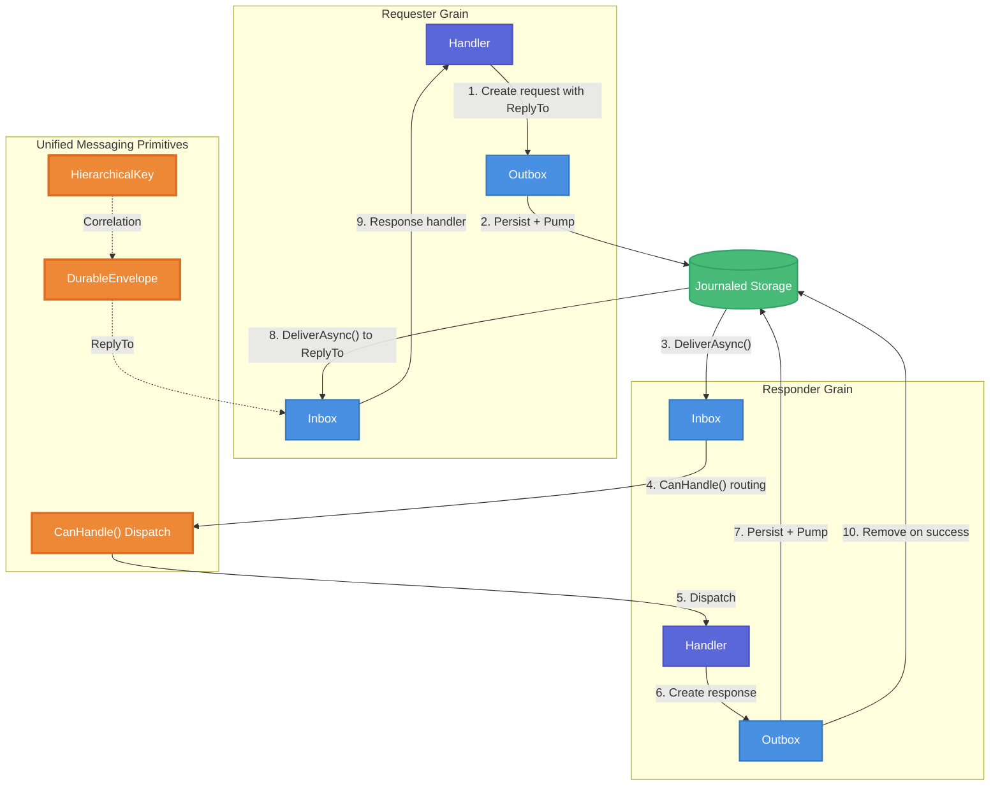

# Unified Durable Messaging System - Technical Design Document / RFC

| Document Metadata      | Details                                                      |
| ---------------------- | ------------------------------------------------------------ |
| Author(s)              | Reuben Bond                                                  |
| Status                 | Draft (WIP)                                                  |
| Team / Owner           | Orleans Core Team                                            |
| Created / Last Updated | 2026-01-17                                                   |
| Branch                 | feature/durabletask/6                                        |
| Research Doc           | [2026-01-17-durable-messaging-system-consolidation.md](./2026-01-17-durable-messaging-system-consolidation.md) |

---

## 1. Executive Summary

This RFC proposes consolidating Orleans.Journaling's inbox/outbox messaging system with Orleans.DurableTask's observer pattern into a **unified durable messaging system**. Currently, durable response delivery uses two overlapping mechanisms: `ReplyTo`-based routing in the messaging layer and `IDurableTaskObserver` callbacks in the task layer. This duplication creates inconsistent patterns, duplicate code, and two nearly-identical hierarchical key types (`CorrelationKey` vs `HierarchicalKey`).

The proposed solution unifies these into a single messaging primitive with capability-based handler dispatch, a single `HierarchicalKey` type for correlation, and standardized response routing via `ReplyTo`. This enables Orleans.DurableTask replatforming atop Orleans.Journaling with cleaner layering and reduced complexity.

**Impact**: Reduced code duplication, simplified handler APIs, unified correlation tracking, and a foundation for building higher-level durable execution patterns.

---

## 2. Context and Motivation

### 2.1 Current State

The Orleans durable messaging infrastructure consists of four overlapping systems:

```
┌─────────────────────────────────────────────────────────────────┐
│                    Application Layer                             │
│  (User grains implementing IDurableJobHandler, IInboxHandler)   │
└─────────────────────────────────────────────────────────────────┘
                              │
┌─────────────────────────────┴───────────────────────────────────┐
│                Orleans.DurableTask Layer                         │
│  ┌──────────────────┐  ┌──────────────────┐  ┌────────────────┐ │
│  │ DurableTask-     │  │ DurableTask-     │  │ DurableTask-   │ │
│  │ GrainRuntime     │  │ GrainStorage     │  │ Request        │ │
│  │ (Execution)      │  │ (Journaled)      │  │ (Remote Calls) │ │
│  └──────────────────┘  └──────────────────┘  └────────────────┘ │
│  Uses: IDurableTaskObserver, TaskId (HierarchicalKey)            │
└─────────────────────────────────────────────────────────────────┘
                              │
┌─────────────────────────────┴───────────────────────────────────┐
│              Orleans.Journaling Messaging Layer                  │
│  ┌──────────────────┐  ┌──────────────────┐  ┌────────────────┐ │
│  │ DurableInbox     │  │ DurableOutbox    │  │ DurableEnvelope│ │
│  │ + Extension      │  │ + DeliveryPump   │  │ + Builder      │ │
│  └──────────────────┘  └──────────────────┘  └────────────────┘ │
│  Uses: ReplyTo, CorrelationKey, Dictionary<route, handler>       │
└─────────────────────────────────────────────────────────────────┘
                              │
┌─────────────────────────────┴───────────────────────────────────┐
│             Orleans.Journaling Foundation Layer                  │
│  ┌──────────────────┐  ┌──────────────────┐  ┌────────────────┐ │
│  │ StateMachine-    │  │ Durable-         │  │ LogExtent +    │ │
│  │ Manager          │  │ Dictionary/List  │  │ Storage        │ │
│  └──────────────────┘  └──────────────────┘  └────────────────┘ │
└─────────────────────────────────────────────────────────────────┘
```

**Key limitations:**

1. **Two hierarchical key types**: `CorrelationKey` (Journaling) and `HierarchicalKey` (DurableTask) are nearly identical implementations (~766 and ~601 lines respectively) with the same segment separator (`/`), escape character (`\`), and parent/child relationship methods.
   - Reference: Research doc, Section 3 "Correlation and Addressing"

2. **Two response delivery patterns**:
   - Journaling uses `ReplyTo` field with outbox-based delivery
   - DurableTask uses `IDurableTaskObserver.OnResponseAsync()` callbacks
   - Reference: Research doc, Section 4 "Orleans.DurableTask Architecture"

3. **Redundant handler API**: `IInboxHandler.HandleAsync(envelope, context, ct)` passes the envelope separately when it's already available via `context.Envelope`
   - Reference: Research doc, Section 1 "Proposed change: capability-based handler selection"

4. **Inflexible route registration**: Per-route dictionary lookup (`Dictionary<string, IInboxHandler>`) requires knowing all route keys upfront, preventing prefix-based routing
   - Reference: `DurableInbox.cs:16` - `_handlers: Dictionary<string, IInboxHandler>`

### 2.2 The Problem

- **Developer Experience**: Two different patterns for the same concept (durable response delivery) creates confusion and inconsistent code
- **Code Duplication**: `CorrelationKey` and `HierarchicalKey` are ~90% identical implementations
- **Integration Friction**: Replatforming DurableTask atop Journaling requires bridging these two patterns
- **API Ergonomics**: Route registration requires explicit registration of every route key; prefix-based families (e.g., all `rpc/*` messages) aren't supported

---

## 3. Goals and Non-Goals

### 3.1 Functional Goals

- [x] **G1**: Unify `CorrelationKey` and `HierarchicalKey` into a single `HierarchicalKey` type in `Orleans.Core.Abstractions`
- [x] **G2**: Simplify `IInboxHandler` API by removing redundant `envelope` parameter
- [x] **G3**: Add capability-based handler dispatch via `CanHandle()` method
- [x] **G4**: Support prefix-based routing (e.g., `rpc/`, `durabletask/`)
- [x] **G5**: Standardize response routing using `ReplyTo` as the primary mechanism
- [x] **G6**: Implement response cleanup when `DeliverAsync()` returns successfully
- [x] **G7**: Provide helper base classes for common routing patterns

### 3.2 Non-Goals (Out of Scope)

- [ ] We will NOT implement long-polling in the outbox pump (grains use `ReplyTo`)
- [ ] We will NOT change the storage format or journaling primitives
- [ ] We will NOT modify the DurableJobs scheduling system
- [ ] We will NOT implement complex message routing (e.g., pub/sub patterns)
- [ ] We will NOT add new persistence providers

---

## 4. Proposed Solution (High-Level Design)

### 4.1 System Architecture Diagram



### 4.2 Architectural Pattern

We are adopting a **Capability-Based Handler Dispatch** pattern where:

1. Handlers implement `CanHandle(context)` to declare which messages they can process
2. The inbox iterates handlers in registration order, selecting the first match
3. Responses are delivered via the same inbox/outbox mechanism using `ReplyTo`
4. A single `HierarchicalKey` type provides correlation across all layers

### 4.3 Key Components

| Component | Responsibility | Technology Stack | Justification |
|-----------|----------------|------------------|---------------|
| `HierarchicalKey` | Unified hierarchical correlation | `Orleans.Core.Abstractions` | Replaces both `CorrelationKey` and `TaskId` |
| `IInboxHandler` | Message handling with capability dispatch | `Orleans.Journaling.Messaging` | Simplified API with `CanHandle()` |
| `RouteKeyHandler` | Exact route key matching | `Orleans.Journaling.Messaging` | Helper for common pattern |
| `RoutePrefixHandler` | Prefix-based route matching | `Orleans.Journaling.Messaging` | Enables route families like `rpc/*` |
| `CorrelationHandler` | Correlation-based matching | `Orleans.Journaling.Messaging` | Enables response matching by key |

---

## 5. Detailed Design

### 5.1 HierarchicalKey Unification

**Decision**: Replace both `CorrelationKey` and `TaskId` with a unified `HierarchicalKey` type.

#### Current State

| Type | Location | Lines | Purpose |
|------|----------|-------|---------|
| `CorrelationKey` | `src/Orleans.Journaling/Messaging/CorrelationKey.cs` | 766 | Message correlation |
| `HierarchicalKey` | `src/System.Distributed.DurableTasks/HierarchicalKey.cs` | 601 | Task identification |

Both types share identical design:
- Segment separator: `/`
- Escape character: `\`
- Methods: `IsParentOf()`, `IsChildOf()`, `IsAncestorOf()`, `CreateChildKey()`
- Reference: Research doc, Section 3

#### API Changes

**New location**: `src/Orleans.Core.Abstractions/HierarchicalKey.cs`

```csharp
namespace Orleans;

/// <summary>
/// Represents a hierarchical key for distributed correlation and identification.
/// Uses '/' as segment separator and '\' as escape character.
/// </summary>
[GenerateSerializer, Immutable]
public sealed class HierarchicalKey : ISpanFormattable, IEquatable<HierarchicalKey>,
    IParsable<HierarchicalKey>, ISpanParsable<HierarchicalKey>
{
    public const char EscapeCharacter = '\\';
    public const char SegmentSeparator = '/';

    // Factory methods
    public static HierarchicalKey Create(string value);
    public static HierarchicalKey Create(HierarchicalKey? parent, string value);

    // Hierarchy navigation
    public HierarchicalKey? GetParent();
    public HierarchicalKey CreateChildKey(string value);
    public HierarchicalKey CreateEscapedChildKey(string value);

    // Relationship queries
    public bool IsParentOf(HierarchicalKey? other);
    public bool IsChildOf(HierarchicalKey? other);
    public bool IsAncestorOf(HierarchicalKey? other);

    // Properties
    public int Length { get; }
}
```

**DurableEnvelope update**:

```csharp
// Before (src/Orleans.Journaling/Messaging/DurableEnvelope.cs:148-149)
[Id(4)]
public CorrelationKey? CorrelationKey { get; init; }

// After
[Id(4)]
public HierarchicalKey? CorrelationKey { get; init; }
```

**Deprecation wrapper** (backward compatibility):

```csharp
namespace Orleans.Journaling.Messaging;

[Obsolete("Use Orleans.HierarchicalKey instead. This type will be removed in a future version.")]
public sealed class CorrelationKey
{
    private readonly HierarchicalKey _inner;

    public static implicit operator HierarchicalKey(CorrelationKey key) => key._inner;
    public static implicit operator CorrelationKey(HierarchicalKey key) => new(key);

    // Delegate all methods to _inner...
}
```

**TaskId update** (System.Distributed.DurableTasks):

```csharp
public readonly struct TaskId : IEquatable<TaskId>
{
    private readonly HierarchicalKey? _key;

    public static implicit operator HierarchicalKey?(TaskId id) => id._key;
    public static implicit operator TaskId(HierarchicalKey key) => new(key);

    // Existing methods delegate to _key...
}
```

#### Files to Modify

| File | Change |
|------|--------|
| `src/Orleans.Core.Abstractions/HierarchicalKey.cs` | **New file** - moved from System.Distributed.DurableTasks |
| `src/Orleans.Journaling/Messaging/CorrelationKey.cs` | Deprecate, wrap HierarchicalKey |
| `src/Orleans.Journaling/Messaging/DurableEnvelope.cs` | Change property type |
| `src/Orleans.Journaling/Messaging/DurableEnvelopeBuilder.cs` | Update method signatures |
| `src/System.Distributed.DurableTasks/HierarchicalKey.cs` | Remove or type-forward |
| `src/System.Distributed.DurableTasks/TaskId.cs` | Update to wrap HierarchicalKey |

---

### 5.2 IInboxHandler API Changes

**Decision**: Remove redundant `envelope` parameter and add `CanHandle()` for capability-based dispatch.

#### Current API

```csharp
// src/Orleans.Journaling/Messaging/IInboxHandler.cs:47-62
public interface IInboxHandler
{
    ValueTask HandleAsync(DurableEnvelope envelope, IInboxHandlerContext context, CancellationToken cancellationToken);
}
```

**Issues** (Reference: Research doc, Section 1):
1. `envelope` is redundant - already available via `context.Envelope`
2. Route-based registration requires pre-registration of every route
3. No support for prefix-based route families

#### New API

```csharp
namespace Orleans.Journaling.Messaging;

/// <summary>
/// Handler for durable inbox messages with capability-based dispatch.
/// </summary>
public interface IInboxHandler
{
    /// <summary>
    /// Determines whether this handler can process the message.
    /// Should perform fast, metadata-only checks (avoid body deserialization).
    /// </summary>
    /// <param name="context">Handler context with envelope metadata.</param>
    /// <returns>True if this handler can process the message.</returns>
    bool CanHandle(IInboxHandlerContext context);

    /// <summary>
    /// Handles a message from the inbox.
    /// </summary>
    /// <param name="context">Handler context for accessing envelope and sending responses.</param>
    /// <param name="cancellationToken">Cancellation token.</param>
    ValueTask HandleAsync(IInboxHandlerContext context, CancellationToken cancellationToken);
}

/// <summary>
/// Typed handler with automatic deserialization.
/// </summary>
public interface IInboxHandler<TMessage> : IInboxHandler
{
    /// <summary>
    /// Handles a typed message.
    /// </summary>
    ValueTask HandleAsync(TMessage message, IInboxHandlerContext context, CancellationToken cancellationToken);

    /// <summary>
    /// Default implementation: deserialize and delegate.
    /// </summary>
    ValueTask IInboxHandler.HandleAsync(IInboxHandlerContext context, CancellationToken cancellationToken)
    {
        if (context.Envelope.Data.TryGetBody<TMessage>(out var message))
        {
            return HandleAsync(message, context, cancellationToken);
        }
        throw new InvalidOperationException($"Failed to deserialize message body as {typeof(TMessage).Name}");
    }
}
```

#### Handler Registration Changes

```csharp
public interface IDurableInbox
{
    /// <summary>
    /// Registers a handler. Handlers are evaluated in registration order.
    /// </summary>
    void RegisterHandler(IInboxHandler handler);

    /// <summary>
    /// Finds the first handler that can process the message.
    /// </summary>
    bool TryFindHandler(IInboxHandlerContext context, [NotNullWhen(true)] out IInboxHandler? handler);

    // Backward compatibility
    [Obsolete("Use RegisterHandler(IInboxHandler) with CanHandle() instead.")]
    void RegisterHandler(string routeKey, IInboxHandler handler);
}
```

#### Helper Base Classes

```csharp
/// <summary>
/// Base class for handlers that match exact route keys.
/// </summary>
public abstract class RouteKeyHandler : IInboxHandler
{
    private readonly string _routeKey;

    protected RouteKeyHandler(string routeKey)
    {
        ArgumentException.ThrowIfNullOrWhiteSpace(routeKey);
        _routeKey = routeKey;
    }

    public bool CanHandle(IInboxHandlerContext context)
        => context.Envelope.RouteKey == _routeKey;

    public abstract ValueTask HandleAsync(IInboxHandlerContext context, CancellationToken cancellationToken);
}

/// <summary>
/// Base class for handlers that match route key prefixes.
/// Example: "rpc/" matches "rpc/request", "rpc/reply", etc.
/// </summary>
public abstract class RoutePrefixHandler : IInboxHandler
{
    private readonly string _prefix;

    protected RoutePrefixHandler(string prefix)
    {
        ArgumentException.ThrowIfNullOrWhiteSpace(prefix);
        _prefix = prefix.EndsWith('/') ? prefix : prefix + '/';
    }

    /// <summary>
    /// Gets the route suffix after the prefix.
    /// </summary>
    protected string GetRouteSuffix(IInboxHandlerContext context)
        => context.Envelope.RouteKey[_prefix.Length..];

    public bool CanHandle(IInboxHandlerContext context)
        => context.Envelope.RouteKey.StartsWith(_prefix, StringComparison.Ordinal);

    public abstract ValueTask HandleAsync(IInboxHandlerContext context, CancellationToken cancellationToken);
}

/// <summary>
/// Base class for handlers that match correlation key relationships.
/// Matches messages where CorrelationKey equals or is a child of the target key.
/// </summary>
public abstract class CorrelationHandler : IInboxHandler
{
    private readonly HierarchicalKey _correlationKey;

    protected CorrelationHandler(HierarchicalKey correlationKey)
    {
        ArgumentNullException.ThrowIfNull(correlationKey);
        _correlationKey = correlationKey;
    }

    public bool CanHandle(IInboxHandlerContext context)
        => context.Envelope.CorrelationKey?.IsChildOf(_correlationKey) == true
           || context.Envelope.CorrelationKey?.Equals(_correlationKey) == true;

    public abstract ValueTask HandleAsync(IInboxHandlerContext context, CancellationToken cancellationToken);
}
```

#### DurableInbox Implementation Changes

```csharp
internal sealed class DurableInbox : IDurableInbox
{
    // Before: Dictionary<string, IInboxHandler> _handlers
    // After: List<IInboxHandler> _handlers (ordered)
    private readonly List<IInboxHandler> _handlers = new();

    // Optional: Cache for performance
    private readonly ConcurrentDictionary<string, IInboxHandler?> _routeCache = new();

    public void RegisterHandler(IInboxHandler handler)
    {
        ArgumentNullException.ThrowIfNull(handler);
        _handlers.Add(handler);
        _routeCache.Clear(); // Invalidate cache
    }

    public bool TryFindHandler(IInboxHandlerContext context, [NotNullWhen(true)] out IInboxHandler? handler)
    {
        // Check cache first
        var routeKey = context.Envelope.RouteKey;
        if (_routeCache.TryGetValue(routeKey, out handler) && handler is not null)
        {
            return true;
        }

        // Linear scan through handlers
        foreach (var h in _handlers)
        {
            if (h.CanHandle(context))
            {
                _routeCache[routeKey] = h;
                handler = h;
                return true;
            }
        }

        _routeCache[routeKey] = null;
        handler = null;
        return false;
    }

    // Backward compatibility wrapper
    [Obsolete]
    public void RegisterHandler(string routeKey, IInboxHandler handler)
    {
        RegisterHandler(new LegacyRouteKeyHandlerWrapper(routeKey, handler));
    }
}
```

#### Files to Modify

| File | Change |
|------|--------|
| `src/Orleans.Journaling/Messaging/IInboxHandler.cs` | New API with CanHandle |
| `src/Orleans.Journaling/Messaging/IDurableInbox.cs` | New registration API |
| `src/Orleans.Journaling/Messaging/DurableInbox.cs` | List-based handlers with caching |
| `src/Orleans.Journaling/Messaging/RouteKeyHandler.cs` | **New file** |
| `src/Orleans.Journaling/Messaging/RoutePrefixHandler.cs` | **New file** |
| `src/Orleans.Journaling/Messaging/CorrelationHandler.cs` | **New file** |
| `src/Orleans.Journaling/Messaging/InboxProcessingPump.cs` | Use TryFindHandler |
| `src/Orleans.Journaling/Messaging/DurableInboxExtension.cs` | Update route validation |

---

### 5.3 Response Routing and Delivery Semantics

**Decision**: Use `ReplyTo` as the primary response routing mechanism. Responses are removed from the outbox when `DeliverAsync()` returns successfully.

#### Response Flow Diagram

```
┌──────────────────┐                         ┌──────────────────┐
│   Requester      │                         │   Responder      │
│   Grain          │                         │   Grain          │
└──────────────────┘                         └──────────────────┘
        │                                            │
        │ 1. Create request with ReplyTo             │
        │    envelope.ReplyTo = this.GrainId         │
        │    envelope.CorrelationKey = "req-123"     │
        │                                            │
        │ 2. Add to outbox                           │
        ├────────────────────────────────────────────▶
        │                                            │
        │ 3. WriteStateAsync() persists outbox       │
        │                                            │
        │ 4. Outbox pump: DeliverAsync()             │
        │    Returns: Accepted                       │
        │                                            │
        │ 5. Outbox pump removes message             │
        │                                            │
        │                                            │ 6. Handler processes
        │                                            │
        │                                            │ 7. Handler creates response
        │                                            │    .To(envelope.ReplyTo, "rpc/reply")
        │                                            │    .WithCorrelationKey(envelope.CorrelationKey)
        │                                            │
        │                                            │ 8. Add response to outbox
        │                                            │
        │ 9. Response DeliverAsync()                 │
        ◀────────────────────────────────────────────┤
        │    Returns: Accepted                       │
        │                                            │
        │ 10. Response handler invoked               │
        │                                            │
        │                                            │ 11. Outbox pump removes response
```

#### Delivery Semantics

The existing `DeliverAsync()` API already provides durable acknowledgment:

```csharp
// src/Orleans.Journaling/Messaging/DurableOutbox.cs:216-317
public async ValueTask<DeliveryStatus> DeliverMessageAsync(DurableEnvelope envelope, CancellationToken cancellationToken)
{
    var result = await targetInbox.DeliverAsync(envelope, options, cancellationToken);

    switch (result.Status)
    {
        case DeliveryStatus.Accepted:
        case DeliveryStatus.Duplicate:
            // Message successfully delivered - remove from outbox
            Remove(envelope.MessageId);
            break;

        case DeliveryStatus.Backpressured:
            // Target at capacity - retry with backoff
            break;
    }
}
```

**Key insight**: When `DeliverAsync()` returns `Accepted`, the message is durably stored in the recipient's inbox. No separate acknowledgment message is needed.

Reference: Research doc, Open Question 3 and 6

---

### 5.4 Error Handling and Failure Responses

**Decision**: Permanent failures are delivered as failure responses through the outbox using the same route as success responses.

#### Error Response Structure

```csharp
/// <summary>
/// Represents an error response from a durable operation.
/// </summary>
[GenerateSerializer]
public sealed class DurableErrorResponse
{
    /// <summary>Error code for categorization.</summary>
    [Id(0)]
    public required string ErrorCode { get; init; }

    /// <summary>Human-readable error message.</summary>
    [Id(1)]
    public required string Message { get; init; }

    /// <summary>Optional exception details (for debugging).</summary>
    [Id(2)]
    public string? ExceptionDetails { get; init; }

    /// <summary>Whether the error is retriable.</summary>
    [Id(3)]
    public bool IsRetriable { get; init; }
}
```

#### Standard Error Codes

| Code | Description |
|------|-------------|
| `HANDLER_NOT_FOUND` | No handler registered for route key |
| `DESERIALIZATION_FAILED` | Failed to deserialize message body |
| `HANDLER_EXCEPTION` | Handler threw an unhandled exception |
| `CANCELLED` | Operation was cancelled |
| `TIMEOUT` | Operation timed out |

#### Handler Context Extension

```csharp
public interface IInboxHandlerContext
{
    // Existing members...

    /// <summary>
    /// Sends a failure reply to the ReplyTo address (if set).
    /// </summary>
    void SendError(string errorCode, string message, bool isRetriable = false);

    /// <summary>
    /// Sends an error response from an exception.
    /// </summary>
    void SendError(Exception exception, bool isRetriable = false);
}
```

Reference: Research doc, Open Question 7

---

### 5.5 Route Key Conventions

| Prefix | Purpose | Example |
|--------|---------|---------|
| `rpc/request` | Durable RPC requests | `rpc/request` |
| `rpc/reply` | Durable RPC responses (success or failure) | `rpc/reply` |
| `durabletask/` | DurableTask transport messages | `durabletask/schedule` |
| `job/` | DurableJob scheduling | `job/trigger` |

Success and failure responses use the same route (`rpc/reply`), with status encoded in metadata or payload.

Reference: Research doc, Section 2 "Response Routing Patterns"

---

### 5.6 External Caller Support

**Decision**: Grains use `ReplyTo`; external callers without stable addresses use polling.

External callers (HTTP endpoints, non-grain clients) cannot receive inbox messages. For these cases, existing long-polling is retained:

```csharp
// External caller pattern (src/Orleans.Journaling/Messaging/DurableInboxExtension.cs:270-304)
var result = await targetGrain.AsReference<IDurableInboxExtension>()
    .DeliverAsync(envelope, new DeliveryOptions { PollTimeout = TimeSpan.FromSeconds(30) });

switch (result.Status)
{
    case DeliveryStatus.Processed:
        var response = result.Response; // Synchronous response
        break;
    case DeliveryStatus.Pending:
        // Poll for completion
        break;
}
```

Reference: Research doc, Open Question 5

---

## 6. Alternatives Considered

| Option | Pros | Cons | Reason for Rejection |
|--------|------|------|---------------------|
| **Keep separate key types** | No migration needed | Continued duplication, inconsistent APIs | Goal is unification for DurableTask replatforming |
| **Use $ack messages for acknowledgment** | Explicit acknowledgment | Unnecessary overhead; DeliverAsync already provides durable ack | Simpler to use existing success status |
| **Longest-prefix-wins for handler precedence** | Deterministic by route structure | Complex to reason about; registration order is simpler | Registration order is explicit and predictable |
| **Keep envelope parameter in HandleAsync** | Backward compatibility | Redundant with context.Envelope; expands API surface | Simplification goal; deprecation provides migration path |

---

## 7. Cross-Cutting Concerns

### 7.1 Security and Privacy

- **No changes to authentication/authorization**: Existing grain-level security applies
- **Data handling**: Message bodies use existing serialization; no new data exposure

### 7.2 Observability Strategy

- **Existing metrics**: Inbox/outbox already have observability (added in recent commits)
- **Correlation tracking**: `HierarchicalKey` enables distributed tracing across operations
- **Logging**: Handler dispatch logging uses existing infrastructure

### 7.3 Scalability and Capacity Planning

- **Handler lookup**: O(n) linear scan mitigated by route-key caching
- **Cache invalidation**: Only on handler registration (rare operation)
- **Memory**: Minimal increase from List vs Dictionary storage

---

## 8. Migration, Rollout, and Testing

### 8.1 Deployment Strategy (4 Phases)

#### Phase 1: Add New APIs (Non-Breaking)

- [x] Add `HierarchicalKey` to `Orleans.Core.Abstractions`
- [x] Add `CanHandle()` to `IInboxHandler` with default implementation returning `true`
- [x] Add `RegisterHandler(IInboxHandler)` overload
- [x] Add helper base classes

#### Phase 2: Update Internal Usage

- [ ] Update Orleans.DurableTask to use `HierarchicalKey`
- [ ] Update Orleans.Journaling handlers to use `CanHandle()` pattern
- [ ] Add error response handling

#### Phase 3: Deprecate Old APIs

- [ ] Mark `CorrelationKey` as `[Obsolete]`
- [ ] Mark `RegisterHandler(string, IInboxHandler)` as `[Obsolete]`
- [ ] Mark `IInboxHandler.HandleAsync(DurableEnvelope, ...)` as `[Obsolete]`

#### Phase 4: Remove Deprecated APIs (Future Major Version)

- [ ] Remove `CorrelationKey` type
- [ ] Remove old registration methods
- [ ] Remove old handler signatures

### 8.2 Test Plan

#### Unit Tests

| Test Area | File | Category |
|-----------|------|----------|
| HierarchicalKey parsing and hierarchy | `test/NonSilo.Tests/HierarchicalKeyTests.cs` | BVT |
| CanHandle routing logic | `test/NonSilo.Tests/InboxHandlerRoutingTests.cs` | BVT |
| Error response serialization | `test/NonSilo.Tests/DurableErrorResponseTests.cs` | BVT |
| Handler caching | `test/NonSilo.Tests/HandlerCacheTests.cs` | BVT |

#### Integration Tests

| Test Area | File | Category |
|-----------|------|----------|
| End-to-end request/response | `test/DefaultCluster.Tests/DurableRpcIntegrationTests.cs` | Functional |
| Handler precedence ordering | `test/DefaultCluster.Tests/HandlerPrecedenceTests.cs` | Functional |
| Migration compatibility | `test/DefaultCluster.Tests/CorrelationKeyMigrationTests.cs` | Functional |
| Error propagation | `test/DefaultCluster.Tests/DurableErrorResponseTests.cs` | Functional |

---

## 9. Open Questions / Unresolved Issues

- [x] ~~**Handler Caching**: Should we cache route-to-handler resolutions?~~
  - **Resolution**: No

- [x] ~~**Backward Compatibility Duration**: How long to maintain deprecated APIs?~~
  - **Resolution**: No backward compatibility necessary - none of this has shipped yet.

- [x] **Handler Registration Ordering**: Should we support priority-based ordering in addition to registration order?
  - **Resolution**: No priority ordering, it's fine.

---

## Appendix: Code References

### Current Implementation

| Component | File | Lines |
|-----------|------|-------|
| IInboxHandler | `src/Orleans.Journaling/Messaging/IInboxHandler.cs` | 47-143 |
| IInboxHandlerContext | `src/Orleans.Journaling/Messaging/IInboxHandlerContext.cs` | 58-215 |
| DurableEnvelope | `src/Orleans.Journaling/Messaging/DurableEnvelope.cs` | 40-261 |
| DurableInbox | `src/Orleans.Journaling/Messaging/DurableInbox.cs` | 12-149 |
| CorrelationKey | `src/Orleans.Journaling/Messaging/CorrelationKey.cs` | 28-765 |
| HierarchicalKey | `src/System.Distributed.DurableTasks/HierarchicalKey.cs` | 8-599 |
| InboxProcessingPump | `src/Orleans.Journaling/Messaging/InboxProcessingPump.cs` | 36-346 |
| OutboxDeliveryPump | `src/Orleans.Journaling/Messaging/OutboxDeliveryPump.cs` | 37-326 |
| DurableInboxExtension | `src/Orleans.Journaling/Messaging/DurableInboxExtension.cs` | 140-582 |

### DurableTask Integration Points

| Component | File | Purpose |
|-----------|------|---------|
| IDurableTaskObserver | `src/Orleans.Core.Abstractions/DurableTasks/IDurableTaskGrainRuntime.cs:12-20` | Observer callback (to be unified) |
| DurableTaskGrainRuntime | `src/Orleans.Runtime/DurableTasks/DurableTaskGrainRuntime.cs` | Task execution runtime |
| TaskId | `src/System.Distributed.DurableTasks/TaskId.cs` | Wraps HierarchicalKey |
| NotifyClientsAndCleanupTask | `src/Orleans.Runtime/DurableTasks/DurableTaskGrainRuntime.cs:272-322` | Observer notification loop |

### Research Documents

| Document | Location |
|----------|----------|
| Durable Messaging System Consolidation | `research/docs/2026-01-17-durable-messaging-system-consolidation.md` |
