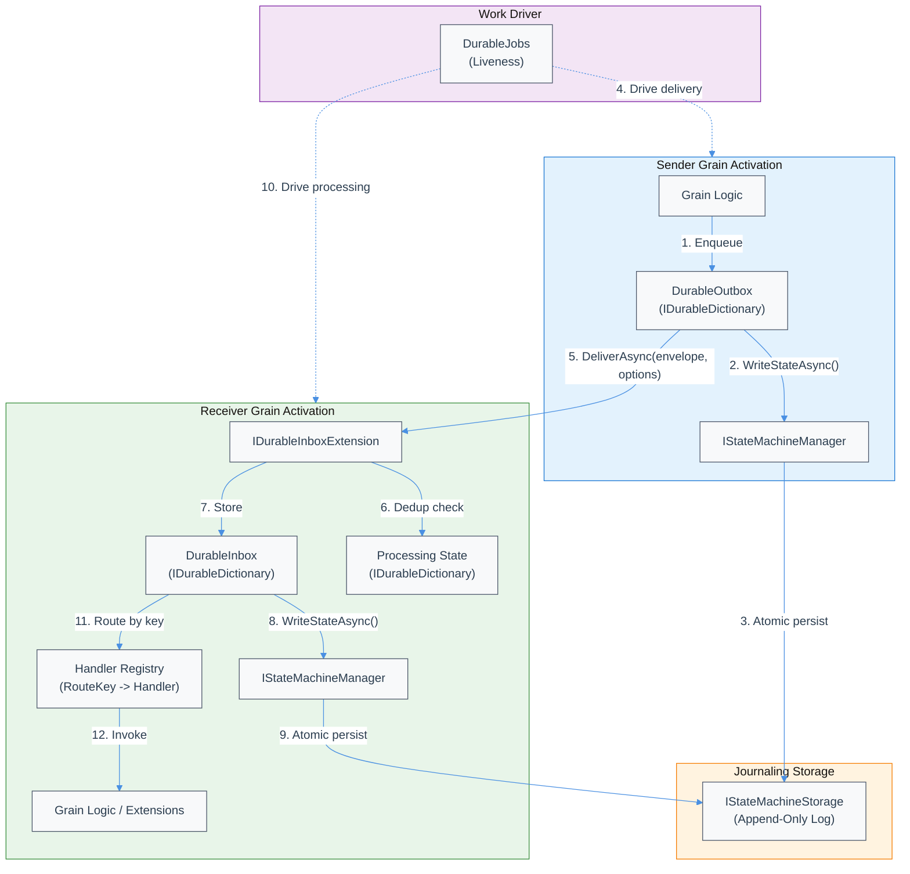

# Orleans Durable Inbox/Outbox Technical Design Document / RFC

| Document Metadata      | Details                                                                |
| ---------------------- | ---------------------------------------------------------------------- |
| Author(s)              | Reuben Bond                                                            |
| Status                 | In Review (RFC) - Core Types Implemented                               |
| Team / Owner           | Orleans Core Team                                                      |
| Created / Last Updated | 2026-01-16 / 2026-01-15                                                |

## 1. Executive Summary

This RFC proposes a **polymorphic, non-generic durable inbox/outbox** system for Orleans grains that enables **durable RPC** (request/response) semantics. The design builds directly on existing Orleans patterns: `Orleans.Journaling` for atomic state persistence, `DurableTasks` for durable request/response, and non-generic extension multiplexing (streaming, transactions, broadcast channels).

**Problem:** Orleans lacks a first-class, durable message passing primitive that supports exactly-once delivery, backpressure, and request/response correlation—all while persisting atomically with grain state.

**Solution:** Introduce `IDurableInboxExtension` with `DeliverAsync(DurableEnvelope, DeliveryOptions)` supporting long-polling, using a polymorphic envelope with **opaque `ArcBuffer`-based body and request context** (deferred deserialization to prevent serialization errors from crashing grains). Messages persist atomically via `IStateMachineManager.WriteStateAsync()` before processing.

**Impact:** Enables reliable grain-to-grain messaging with exactly-once semantics, unlocks durable workflow patterns, and provides a foundation for integrating with `Orleans.DurableJobs` as a durable liveness driver.

## 2. Context and Motivation

### 2.1 Current State

Orleans provides several mechanisms for grain communication, but none offer durable, exactly-once message delivery with atomic state persistence:

| Mechanism | Durability | Exactly-Once | Atomic w/ State | Request/Response |
|-----------|------------|--------------|-----------------|------------------|
| Grain calls | No | No (at-most-once) | N/A | Yes |
| Streams | No (volatile) | No | No | No |
| Reminders | Yes | No (at-least-once) | No | No |
| DurableTasks | Yes | Yes | Yes | Yes |
| DurableJobs | Yes | No (at-least-once) | No | No |

**Architecture:** Currently, durable request/response is only available through `DurableTasks`, which is tightly coupled to its specific execution model (`DurableTask<T>` async method builders). There is no general-purpose durable messaging primitive.

**Existing Patterns (from research):**
- `DurableTasks` already implements durable RPC via `IDurableTaskRequest` envelope + `IDurableTaskGrainExtension` non-generic extension ([research/docs/2026-01-16-durable-inbox-outbox-rpc.md](../docs/2026-01-16-durable-inbox-outbox-rpc.md))
- Non-generic extension multiplexing is established: streaming uses `subscriptionId`, transactions use `resourceId`, broadcast channels use `streamId` ([research/docs/2026-01-16-durable-inbox-outbox-rpc.md](../docs/2026-01-16-durable-inbox-outbox-rpc.md))
- Experimental `DurableChannel.cs` demonstrates polymorphic `object MessageBody` envelope with `InboxMessage`/`OutboxMessage` ([research/docs/2026-01-15-durable-tasks-journaling-architecture.md](../docs/2026-01-15-durable-tasks-journaling-architecture.md))
- `MigrationContext` demonstrates deferred serialization via keyed `(offset, length)` indices into a shared `PooledBuffer` ([src/Orleans.Core/Lifecycle/MigrationContext.cs](../../src/Orleans.Core/Lifecycle/MigrationContext.cs))
- `ArcBuffer` / `ArcBufferWriter` provide zero-copy buffer slicing for high-performance serialization ([src/Orleans.Serialization/Buffers/ArcBufferWriter.cs](../../src/Orleans.Serialization/Buffers/ArcBufferWriter.cs))
- `SubscribeOrPollAsync` in DurableTasks demonstrates long-polling pattern with `PollingOptions` ([src/Orleans.Core.Abstractions/DurableTasks/IDurableTaskGrainRuntime.cs](../../src/Orleans.Core.Abstractions/DurableTasks/IDurableTaskGrainRuntime.cs))

### 2.2 The Problem

- **No durable messaging primitive:** Grains cannot reliably send messages that survive crashes without using `DurableTasks` (which is specialized for workflow execution).
- **Serialization fragility:** Using `object Body` directly means deserialization errors can crash grains during recovery or message processing.
- **No backpressure:** Grain calls can overload targets with no mechanism for flow control.
- **Generic extension proliferation:** Early designs proposed `IDurableInbox<T>`/`IDurableOutbox<T>` generic extensions, but this doesn't align with Orleans patterns and limits composability ([research/docs/2026-01-15-inbox-outbox-api-design.md](../docs/2026-01-15-inbox-outbox-api-design.md)).

## 3. Goals and Non-Goals

### 3.1 Functional Goals

- [ ] **Non-generic envelope:** Single `DurableEnvelope` type with **opaque `ArcBuffer`-based body** (deferred deserialization)
- [ ] **Non-generic extension interface:** `IDurableInboxExtension.DeliverAsync(DurableEnvelope, DeliveryOptions)` with long-polling support
- [ ] **Atomic persistence:** Inbox/outbox state persists atomically with grain state via `IStateMachineManager.WriteStateAsync()`
- [ ] **Exactly-once processing:** Idempotency via `(SenderId, MessageId)` composite key tracking
- [ ] **Durable RPC (request/response):** Correlation via hierarchical `CorrelationKey` (UTF-8 string, like DurableTask's `TaskId`) + optional `ReplyTo` GrainId (not observer reference)
- [ ] **Backpressure signaling:** Return `DeliveryResult` **struct** (extensible) with status code
- [ ] **Dictionary-based storage:** Inbox/outbox use `IDurableDictionary` (no ordering guarantees; helps with deduplication)
- [ ] **Route-based multiplexing:** Messages routed internally by `RouteKey` (string) to registered handlers

### 3.2 Non-Goals (Out of Scope)

- [ ] **Generic extension interfaces:** We will NOT use `IDurableInbox<T>` or generic extension methods
- [ ] **Distributed transactions:** We will NOT support ambient/distributed transactions spanning grains
- [ ] **Same-silo optimization:** Outbox messages will NOT bypass persistence even for local targets (correctness over micro-optimization)
- [ ] **Dead-letter queues:** Not in initial version (backoff + visibility is baseline)
- [ ] **Stream interop:** We will NOT integrate with Orleans Streams in this version
- [ ] **Ordering guarantees:** Inbox/outbox do NOT guarantee FIFO ordering

## 4. Proposed Solution (High-Level Design)

### 4.1 System Architecture Diagram



### 4.2 Architectural Pattern

We adopt a **polymorphic envelope + non-generic extension + route-based dispatch** pattern, directly modeled on existing Orleans precedents:

| Precedent | Envelope | Extension | Routing |
|-----------|----------|-----------|---------|
| DurableTasks | `IDurableTaskRequest` | `IDurableTaskGrainExtension` | `TaskId` |
| Streaming | `object item` | `IStreamConsumerExtension` | `subscriptionId` |
| Transactions | operation | `ITransactionalResourceExtension` | `resourceId` |
| **This design** | `DurableEnvelope` | `IDurableInboxExtension` | `RouteKey` |

### 4.3 Key Components

| Component | Responsibility | Technology | Justification |
|-----------|----------------|------------|---------------|
| `DurableEnvelope` | Polymorphic message wrapper with opaque body | `ArcBuffer` + keyed slices | Matches `MigrationContext` pattern for deferred deserialization |
| `IDurableInboxExtension` | Non-generic delivery surface with long-polling | Grain extension | Matches `IDurableTaskGrainExtension` + `SubscribeOrPollAsync` patterns |
| `DurableInbox` | Inbox storage + dedup state | `IDurableDictionary` | Dictionary enables deduplication; no ordering needed |
| `DurableOutbox` | Outbox storage | `IDurableDictionary` | Dictionary enables deduplication; no ordering needed |
| `IInboxHandler` | Route-specific message handler | Interface + registry | Matches streaming subscription handler pattern |

## 5. Detailed Design

### 5.1 Core Types

#### 5.1.1 DurableEnvelopeData (Opaque Storage)

The envelope body and request context are stored as opaque `ArcBuffer` slices, modeled after `MigrationContext`'s keyed data pattern with `(offset, length)` indices into a shared buffer. This allows:
1. **Deferred deserialization:** Body and context values are only deserialized when accessed, preventing serialization errors during recovery
2. **Zero-copy slicing:** Body and all context values share the same underlying `ArcBuffer`
3. **Error isolation:** Deserialization failures don't crash the grain; they can be handled gracefully
4. **Per-key context access:** Individual context values can be retrieved independently without deserializing the entire context

```csharp
namespace Orleans.Journaling.Messaging;

/// <summary>
/// Opaque data storage for envelope body and request context.
/// Modeled after MigrationContext's deferred serialization pattern with keyed indices.
/// Body and all RequestContext values share the same underlying ArcBuffer.
/// </summary>
[GenerateSerializer]
public sealed class DurableEnvelopeData : IDisposable
{
    [NonSerialized]
    private readonly SerializerSessionPool? _sessionPool;

    /// <summary>
    /// Shared buffer containing body and all request context values.
    /// </summary>
    [Id(0), Immutable]
    private ArcBuffer _buffer;

    /// <summary>
    /// Offset and length of the body within the buffer.
    /// </summary>
    [Id(1)]
    private (int Offset, int Length) _bodySlice;

    /// <summary>
    /// Keyed indices for request context values within the buffer.
    /// Each key maps to its own (Offset, Length) slice, allowing independent deserialization.
    /// </summary>
    [Id(2), Immutable]
    private Dictionary<string, (int Offset, int Length)>? _contextIndices;

    [GeneratedActivatorConstructor]
    public DurableEnvelopeData(SerializerSessionPool sessionPool)
    {
        _sessionPool = sessionPool;
    }

    /// <summary>
    /// Gets the keys of all stored request context values.
    /// </summary>
    public IEnumerable<string> ContextKeys => _contextIndices?.Keys ?? [];

    /// <summary>
    /// Returns true if a request context value exists for the specified key.
    /// </summary>
    public bool HasContextKey(string key) => _contextIndices?.ContainsKey(key) ?? false;

    /// <summary>
    /// Attempts to deserialize the body as the specified type.
    /// Returns false if deserialization fails (type mismatch, corruption, etc.).
    /// </summary>
    public bool TryGetBody<T>([MaybeNullWhen(false)] out T value)
    {
        if (_sessionPool is null || _bodySlice.Length == 0)
        {
            value = default;
            return false;
        }

        try
        {
            var slice = _buffer.Slice(_bodySlice.Offset, _bodySlice.Length);
            using var session = _sessionPool.GetSession();
            var reader = Reader.Create(slice.AsReadOnlySequence(), session);
            var field = reader.ReadFieldHeader();
            value = _sessionPool.CodecProvider.GetCodec<T>().ReadValue(ref reader, field);
            return value is not null;
        }
        catch
        {
            value = default;
            return false;
        }
    }

    /// <summary>
    /// Attempts to deserialize a specific request context value.
    /// Returns false if the key doesn't exist or deserialization fails.
    /// </summary>
    public bool TryGetContextValue<T>(string key, [MaybeNullWhen(false)] out T value)
    {
        if (_sessionPool is null || _contextIndices is null || !_contextIndices.TryGetValue(key, out var slice))
        {
            value = default;
            return false;
        }

        try
        {
            var buffer = _buffer.Slice(slice.Offset, slice.Length);
            using var session = _sessionPool.GetSession();
            var reader = Reader.Create(buffer.AsReadOnlySequence(), session);
            var field = reader.ReadFieldHeader();
            value = _sessionPool.CodecProvider.GetCodec<T>().ReadValue(ref reader, field);
            return value is not null;
        }
        catch
        {
            value = default;
            return false;
        }
    }

    /// <summary>
    /// Gets the raw body bytes for forwarding without deserialization.
    /// </summary>
    public ReadOnlySequence<byte> GetBodyBytes()
        => _buffer.Slice(_bodySlice.Offset, _bodySlice.Length).AsReadOnlySequence();

    /// <summary>
    /// Gets the raw bytes for a specific context key for forwarding without deserialization.
    /// </summary>
    public bool TryGetContextBytes(string key, out ReadOnlySequence<byte> value)
    {
        if (_contextIndices is not null && _contextIndices.TryGetValue(key, out var slice))
        {
            value = _buffer.Slice(slice.Offset, slice.Length).AsReadOnlySequence();
            return true;
        }

        value = default;
        return false;
    }

    public void Dispose() => _buffer.Dispose();
}
```
```

#### 5.1.2 CorrelationKey (Hierarchical UTF-8 String)

Modeled after `HierarchicalKey` from `System.Distributed.DurableTasks`, `CorrelationKey` provides a hierarchical, human-readable correlation identifier for request/response tracking. Unlike a GUID, hierarchical keys support:

1. **Parent/child relationships:** Enables correlated sub-requests (e.g., `transfer-123/debit`, `transfer-123/credit`)
2. **Debugging visibility:** Human-readable correlation IDs in logs and traces
3. **Segment enumeration:** Iterate over path segments for routing or filtering
4. **Escape support:** Segment separators (`/`) can be escaped with `\`

```csharp
namespace Orleans.Journaling.Messaging;

/// <summary>
/// Hierarchical correlation key for durable RPC request/response tracking.
/// Modeled after HierarchicalKey from System.Distributed.DurableTasks.
/// Uses '/' as segment separator and '\' as escape character.
/// </summary>
/// <remarks>
/// Examples:
/// - Simple: "order-12345"
/// - Hierarchical: "transfer-abc/debit", "transfer-abc/credit"
/// - With parent: parent.CreateChildKey("step-1") -> "workflow-xyz/step-1"
/// - Escaped: "user\\/data/request" (segment is "user/data", not two segments)
/// </remarks>
[GenerateSerializer]
public sealed class CorrelationKey : ISpanFormattable, IEquatable<CorrelationKey>, IParsable<CorrelationKey>, ISpanParsable<CorrelationKey>
{
    public const char EscapeCharacter = '\\';
    public const char SegmentSeparator = '/';

    [Id(0)]
    private readonly CorrelationKey? _parent;

    [Id(1)]
    private readonly string _value;

    private CorrelationKey(string value)
    {
        _value = value;
    }

    private CorrelationKey(CorrelationKey? parent, string value) : this(value)
    {
        _parent = parent;
    }

    /// <summary>
    /// Creates a new correlation key from a string value.
    /// </summary>
    /// <param name="value">The key value. Must not be empty or contain empty segments.</param>
    /// <exception cref="ArgumentException">Thrown if value is empty or contains empty segments.</exception>
    public static CorrelationKey Create(string value)
    {
        ArgumentException.ThrowIfNullOrEmpty(value);
        if (!IsSegmentationValid(value))
        {
            throw new ArgumentException("Value must not contain empty segments.", nameof(value));
        }

        return new(value);
    }

    /// <summary>
    /// Creates a new correlation key with a parent.
    /// </summary>
    public static CorrelationKey Create(CorrelationKey? parent, string value) => new(parent, value);

    /// <summary>
    /// Gets the parent key, or null if this is a root key.
    /// </summary>
    public CorrelationKey? GetParent() => WithoutLastSegment(_value) switch
    {
        { Length: > 0 } value => new(_parent, value),
        _ => _parent,
    };

    /// <summary>
    /// Creates a child key with the specified value.
    /// </summary>
    /// <param name="value">The child segment value.</param>
    public CorrelationKey CreateChildKey(string value) => new(this, value);

    /// <summary>
    /// Creates a child key, escaping any segment separators in the value.
    /// </summary>
    /// <param name="value">The child segment value (will be escaped if needed).</param>
    public CorrelationKey CreateEscapedChildKey(string value) => CreateEscaped(this, value);

    /// <summary>
    /// Returns true if this key is a direct child of the specified key.
    /// </summary>
    public bool IsChildOf(CorrelationKey? other) => other is not null && other.IsParentOf(this);

    /// <summary>
    /// Returns true if this key is a direct parent of the specified key.
    /// </summary>
    public bool IsParentOf(CorrelationKey? other) { /* ... implementation matches HierarchicalKey ... */ }

    /// <summary>
    /// Returns true if this key is an ancestor (parent or earlier) of the specified key.
    /// </summary>
    public bool IsAncestorOf(CorrelationKey? other) { /* ... implementation matches HierarchicalKey ... */ }

    /// <summary>
    /// Gets the total character length of the key.
    /// </summary>
    public int Length { get; }

    // Static factory methods
    public static CorrelationKey Parse(string s, IFormatProvider? provider) => Create(s);
    public static bool TryParse(string? s, IFormatProvider? provider, out CorrelationKey? result) { /* ... */ }
    public static CorrelationKey Parse(ReadOnlySpan<char> s, IFormatProvider? provider) { /* ... */ }
    public static bool TryParse(ReadOnlySpan<char> s, IFormatProvider? provider, out CorrelationKey? result) { /* ... */ }

    // Escaping support
    public static CorrelationKey CreateEscaped(string value) => CreateEscaped(null, value);
    private static CorrelationKey CreateEscaped(CorrelationKey? parent, string value) { /* ... */ }

    // Validation
    private static bool IsSegmentationValid(ReadOnlySpan<char> value) { /* ... matches HierarchicalKey ... */ }
    private static string WithoutLastSegment(string value) { /* ... */ }

    // IEquatable, ISpanFormattable implementation
    public override string ToString() => $"{this}";
    public override bool Equals(object? obj) => obj is CorrelationKey other && Equals(other);
    public bool Equals(CorrelationKey? other) { /* ... segment-by-segment comparison ... */ }
    public override int GetHashCode() { /* ... */ }
    public bool TryFormat(Span<char> destination, out int charsWritten, ReadOnlySpan<char> format, IFormatProvider? provider) { /* ... */ }
    public string ToString(string? format, IFormatProvider? formatProvider) => ToString();

    // Segment enumeration
    public SegmentEnumerator GetEnumerator() => new(this);

    public ref struct SegmentEnumerator(CorrelationKey key)
    {
        public ReadOnlySpan<char> Current { get; }
        public bool MoveNext() { /* ... */ }
    }
}
```

**Design Rationale:**

| Aspect | GUID | CorrelationKey | Chosen |
|--------|------|----------------|--------|
| Human readability | Poor (opaque hex) | Good (descriptive strings) | **CorrelationKey** |
| Debugging | Hard to trace | Easy to trace in logs | **CorrelationKey** |
| Hierarchical relationships | None | Native support | **CorrelationKey** |
| Storage size | Fixed 16 bytes | Variable (typically larger) | GUID wins |
| Collision risk | Essentially zero | User-managed | GUID wins |
| Consistency with DurableTask | Different pattern | Same pattern as `TaskId` | **CorrelationKey** |

The benefits of human-readable, hierarchical correlation keys outweigh the modest storage overhead, especially for debugging complex distributed workflows.

#### 5.1.3 DurableEnvelope

```csharp
namespace Orleans.Journaling.Messaging;

/// <summary>
/// Envelope for durable inbox/outbox messages.
/// Body and RequestContext are stored as opaque ArcBuffer slices for deferred deserialization.
/// </summary>
[GenerateSerializer, Immutable]
public readonly struct DurableEnvelope
{
    /// <summary>
    /// Unique identifier for this message instance, used for deduplication.
    /// </summary>
    [Id(0)]
    public required Guid MessageId { get; init; }

    /// <summary>
    /// Identity of the sending grain.
    /// </summary>
    [Id(1)]
    public required GrainId SenderId { get; init; }

    /// <summary>
    /// Identity of the target grain.
    /// </summary>
    [Id(2)]
    public required GrainId ReceiverId { get; init; }

    /// <summary>
    /// Routing key for handler dispatch. Analogous to subscriptionId/resourceId in other extensions.
    /// </summary>
    [Id(3)]
    public required string RouteKey { get; init; }

    /// <summary>
    /// Optional hierarchical correlation key for request/response pairing.
    /// Supports parent/child relationships for correlated sub-requests.
    /// </summary>
    [Id(4)]
    public CorrelationKey? CorrelationKey { get; init; }

    /// <summary>
    /// Optional reply-to grain ID for durable RPC callbacks.
    /// A reference can be created from this GrainId as needed.
    /// </summary>
    [Id(5)]
    public GrainId? ReplyTo { get; init; }

    /// <summary>
    /// Opaque data containing the serialized body and request context.
    /// Uses deferred deserialization to prevent serialization errors from crashing grains.
    /// </summary>
    [Id(6)]
    public required DurableEnvelopeData Data { get; init; }

    /// <summary>
    /// Timestamp when the message was created.
    /// </summary>
    [Id(7)]
    public DateTimeOffset CreatedAt { get; init; }
}
```

#### 5.1.3 DeliveryResult (Struct for Extensibility)

```csharp
namespace Orleans.Journaling.Messaging;

/// <summary>
/// Result of attempting to deliver a message to an inbox.
/// Struct for future extensibility (can add fields without breaking changes).
/// </summary>
[GenerateSerializer, Immutable]
public readonly struct DeliveryResult
{
    /// <summary>
    /// The status of the delivery attempt.
    /// </summary>
    [Id(0)]
    public DeliveryStatus Status { get; init; }

    /// <summary>
    /// For Processed status, contains the response envelope if a reply was sent.
    /// </summary>
    [Id(1)]
    public DurableEnvelope? Response { get; init; }

    /// <summary>
    /// Optional diagnostic message (e.g., reason for rejection).
    /// </summary>
    [Id(2)]
    public string? Message { get; init; }

    // Factory methods for common results
    public static DeliveryResult Accepted() => new() { Status = DeliveryStatus.Accepted };
    public static DeliveryResult Duplicate() => new() { Status = DeliveryStatus.Duplicate };
    public static DeliveryResult Backpressured() => new() { Status = DeliveryStatus.Backpressured };
    public static DeliveryResult RouteNotFound(string routeKey) => new() { Status = DeliveryStatus.RouteNotFound, Message = $"No handler for route '{routeKey}'" };
    public static DeliveryResult Pending() => new() { Status = DeliveryStatus.Pending };
    public static DeliveryResult Processed(DurableEnvelope? response = null) => new() { Status = DeliveryStatus.Processed, Response = response };
}

/// <summary>
/// Status codes for delivery attempts.
/// </summary>
public enum DeliveryStatus
{
    /// <summary>
    /// Message was accepted and persisted to inbox.
    /// </summary>
    Accepted,

    /// <summary>
    /// Message was a duplicate (already processed or in inbox).
    /// </summary>
    Duplicate,

    /// <summary>
    /// Inbox is at capacity; sender should retry later.
    /// </summary>
    Backpressured,

    /// <summary>
    /// No handler registered for the specified RouteKey.
    /// </summary>
    RouteNotFound,

    /// <summary>
    /// Message is pending processing (long-poll did not complete within timeout).
    /// </summary>
    Pending,

    /// <summary>
    /// Message was processed. Response may be included.
    /// </summary>
    Processed
}
```

#### 5.1.4 DeliveryOptions (Long-Polling Support)

Modeled after `SubscribeOrPollOptions` in DurableTasks:

```csharp
namespace Orleans.Journaling.Messaging;

/// <summary>
/// Options for delivery, including long-polling configuration.
/// Modeled after SubscribeOrPollOptions in DurableTasks.
/// </summary>
[GenerateSerializer, Immutable]
public readonly struct DeliveryOptions()
{
    /// <summary>
    /// How long to wait for the message to be processed before returning Pending.
    /// Zero means return immediately after accepting/persisting.
    /// </summary>
    [Id(0)]
    public TimeSpan PollTimeout { get; init; } = TimeSpan.Zero;

    /// <summary>
    /// Optional observer to notify when processing completes (alternative to polling).
    /// </summary>
    [Id(1)]
    public GrainId? Observer { get; init; }
}
```

### 5.2 Extension Interface

```csharp
namespace Orleans.Journaling.Messaging;

/// <summary>
/// Non-generic grain extension for durable inbox message delivery.
/// Supports long-polling via DeliveryOptions, similar to DurableTasks' SubscribeOrPollAsync.
/// </summary>
[Alias("IDurableInboxExtension")]
public interface IDurableInboxExtension : IGrainExtension
{
    /// <summary>
    /// Delivers a message to this grain's durable inbox.
    /// Supports long-polling: if PollTimeout > 0, waits for processing before returning.
    /// </summary>
    /// <param name="envelope">The message envelope.</param>
    /// <param name="options">Delivery options including poll timeout.</param>
    /// <param name="cancellationToken">Cancellation token.</param>
    /// <returns>Result indicating delivery/processing status.</returns>
    [Alias("DeliverAsync"), AlwaysInterleave]
    ValueTask<DeliveryResult> DeliverAsync(DurableEnvelope envelope, DeliveryOptions options, CancellationToken cancellationToken = default);
}

/// <summary>
/// Observer interface for durable RPC reply callbacks.
/// Returns DeliveryResult to allow backpressure on reply delivery.
/// </summary>
[Alias("IDurableInboxObserver")]
public interface IDurableInboxObserver : IGrainExtension
{
    /// <summary>
    /// Called when a response is available for a correlated request.
    /// Returns DeliveryResult to allow backpressure signaling.
    /// </summary>
    /// <param name="correlationKey">The correlation key matching the original request.</param>
    /// <param name="response">The response envelope.</param>
    /// <param name="options">Delivery options (supports long-polling for chained responses).</param>
    /// <param name="cancellationToken">Cancellation token.</param>
    [Alias("OnResponse"), AlwaysInterleave]
    ValueTask<DeliveryResult> OnResponseAsync(CorrelationKey correlationKey, DurableEnvelope response, DeliveryOptions options, CancellationToken cancellationToken = default);
}
```

### 5.3 Handler Interface and Registration

```csharp
namespace Orleans.Journaling.Messaging;

/// <summary>
/// Handler for messages delivered to a specific route.
/// </summary>
public interface IInboxHandler
{
    /// <summary>
    /// Handles a message from the inbox.
    /// </summary>
    /// <param name="envelope">The full message envelope (exposed for metadata access).</param>
    /// <param name="context">Handler context for creating and sending envelopes.</param>
    /// <param name="cancellationToken">Cancellation token.</param>
    ValueTask HandleAsync(DurableEnvelope envelope, IInboxHandlerContext context, CancellationToken cancellationToken);
}

/// <summary>
/// Context available during inbox message handling.
/// Non-generic interface using builder pattern for envelope creation.
/// </summary>
public interface IInboxHandlerContext
{
    /// <summary>
    /// The envelope being processed.
    /// </summary>
    DurableEnvelope Envelope { get; }

    /// <summary>
    /// Gets the current grain's grain ID.
    /// </summary>
    GrainId GrainId { get; }

    /// <summary>
    /// Creates a new envelope builder for sending messages.
    /// The builder's WithBody&lt;T&gt;() method handles serialization.
    /// </summary>
    /// <returns>A new envelope builder.</returns>
    DurableEnvelopeBuilder CreateEnvelope();

    /// <summary>
    /// Sends a message via the outbox (non-generic).
    /// The envelope must be fully built via CreateEnvelope().
    /// </summary>
    /// <param name="envelope">The envelope to send.</param>
    void Send(DurableEnvelope envelope);

    /// <summary>
    /// Gets the current grain's outbox for advanced scenarios.
    /// </summary>
    IDurableOutbox Outbox { get; }
}

/// <summary>
/// Builder for creating durable envelopes with fluent configuration.
/// Use WithBody&lt;T&gt;() to set the message body, then Build() to create the envelope.
/// Context values are serialized independently (MigrationContext pattern) for per-key access.
/// </summary>
public sealed class DurableEnvelopeBuilder : IBufferWriter<byte>
{
    // Internal: injected by context implementation
    internal SerializerSessionPool SessionPool { get; init; }
    internal GrainId SenderId { get; init; }

    private GrainId _receiverId;
    private string _routeKey = string.Empty;
    private CorrelationKey? _correlationKey;
    private GrainId? _replyTo;

    // MigrationContext-style keyed context storage
    private Dictionary<string, (int Offset, int Length)>? _contextIndices;
    private ArcBufferWriter _buffer = new();
    private (int Offset, int Length) _bodySlice;
    private bool _bodyWritten;

    /// <summary>
    /// Sets the target grain and route key for this envelope.
    /// </summary>
    public DurableEnvelopeBuilder To(GrainId target, string routeKey)
    {
        _receiverId = target;
        _routeKey = routeKey;
        return this;
    }

    /// <summary>
    /// Sets the message body. This serializes the body immediately into the shared buffer.
    /// Can be called before or after WithContextValue() - order doesn't matter.
    /// </summary>
    public DurableEnvelopeBuilder WithBody<T>(T body)
    {
        if (_bodyWritten)
        {
            throw new InvalidOperationException("Body has already been set.");
        }

        var startOffset = _buffer.Length;
        using var session = SessionPool.GetSession();
        var writer = Writer.Create((IBufferWriter<byte>)this, session);
        SessionPool.CodecProvider.GetCodec<T>().WriteField(ref writer, 0, typeof(T), body);
        writer.Commit();
        _bodySlice = (startOffset, _buffer.Length - startOffset);
        _bodyWritten = true;

        return this;
    }

    /// <summary>
    /// Sets the hierarchical correlation key for request/response tracking.
    /// </summary>
    public DurableEnvelopeBuilder WithCorrelationKey(CorrelationKey correlationKey)
    {
        _correlationKey = correlationKey;
        return this;
    }

    /// <summary>
    /// Sets the hierarchical correlation key for request/response tracking (string convenience overload).
    /// </summary>
    public DurableEnvelopeBuilder WithCorrelationKey(string correlationKey)
    {
        _correlationKey = CorrelationKey.Create(correlationKey);
        return this;
    }

    /// <summary>
    /// Sets the reply-to grain for callbacks.
    /// </summary>
    public DurableEnvelopeBuilder WithReplyTo(GrainId replyTo)
    {
        _replyTo = replyTo;
        return this;
    }

    /// <summary>
    /// Adds a typed request context value. Each value is serialized independently
    /// into the shared buffer (MigrationContext pattern), allowing per-key retrieval.
    /// Can be called before or after WithBody() - order doesn't matter.
    /// </summary>
    public DurableEnvelopeBuilder WithContextValue<T>(string key, T value)
    {
        _contextIndices ??= new(StringComparer.Ordinal);

        if (_contextIndices.ContainsKey(key))
        {
            throw new InvalidOperationException($"Context key '{key}' has already been set.");
        }

        var startOffset = _buffer.Length;
        using var session = SessionPool.GetSession();
        var writer = Writer.Create((IBufferWriter<byte>)this, session);
        SessionPool.CodecProvider.GetCodec<T>().WriteField(ref writer, 0, typeof(T), value);
        writer.Commit();
        _contextIndices[key] = (startOffset, _buffer.Length - startOffset);

        return this;
    }

    /// <summary>
    /// Builds the durable envelope from the configured values.
    /// </summary>
    public DurableEnvelope Build()
    {
        if (!_bodyWritten)
            throw new InvalidOperationException("Message body must be set via WithBody<T>().");
        if (string.IsNullOrEmpty(_routeKey))
            throw new InvalidOperationException("Target and route key must be set via To().");

        // Create the envelope data from the accumulated buffer
        var data = new DurableEnvelopeData(SessionPool)
        {
            Buffer = _buffer.ConsumeSlice(_buffer.Length),
            BodySlice = _bodySlice,
            ContextIndices = _contextIndices
        };

        return new DurableEnvelope
        {
            MessageId = Guid.NewGuid(),
            SenderId = SenderId,
            ReceiverId = _receiverId,
            RouteKey = _routeKey,
            CorrelationKey = _correlationKey,
            ReplyTo = _replyTo,
            Data = data,
            CreatedAt = DateTimeOffset.UtcNow
        };
    }

    /// <summary>
    /// Resets the builder for reuse.
    /// </summary>
    internal void Reset()
    {
        _receiverId = default;
        _routeKey = string.Empty;
        _correlationKey = null;
        _replyTo = null;
        _contextIndices = null;
        _buffer.Reset();
        _bodySlice = default;
        _bodyWritten = false;
    }

    // IBufferWriter<byte> implementation for serialization
    void IBufferWriter<byte>.Advance(int count) => _buffer.Advance(count);
    Memory<byte> IBufferWriter<byte>.GetMemory(int sizeHint) => _buffer.GetMemory(sizeHint);
    Span<byte> IBufferWriter<byte>.GetSpan(int sizeHint) => _buffer.GetSpan(sizeHint);
}

/// <summary>
/// Typed handler adapter for strongly-typed message handling.
/// </summary>
public interface IInboxHandler<TMessage> : IInboxHandler
{
    /// <summary>
    /// Handles a typed message.
    /// </summary>
    ValueTask HandleAsync(TMessage message, IInboxHandlerContext context, CancellationToken cancellationToken);

    // Default implementation with type check and deferred deserialization
    ValueTask IInboxHandler.HandleAsync(DurableEnvelope envelope, IInboxHandlerContext context, CancellationToken cancellationToken)
    {
        if (envelope.Data.TryGetBody<TMessage>(out var typed))
        {
            return HandleAsync(typed, context, cancellationToken);
        }
        throw new InvalidOperationException($"Failed to deserialize message body as {typeof(TMessage).Name}");
    }
}
```

### 5.4 Inbox/Outbox Interfaces (Dictionary-Based)

Since ordering is not guaranteed and not important, we use `IDurableDictionary` instead of `IDurableQueue`:

```csharp
namespace Orleans.Journaling.Messaging;

/// <summary>
/// Durable inbox for receiving and processing messages.
/// Uses dictionary storage (no ordering guarantees) which aids deduplication.
/// </summary>
public interface IDurableInbox
{
    /// <summary>
    /// Number of unprocessed messages.
    /// </summary>
    int Count { get; }

    /// <summary>
    /// Maximum capacity. When reached, DeliverAsync returns Backpressured.
    /// </summary>
    int Capacity { get; }

    /// <summary>
    /// Gets all pending messages (no ordering guarantee).
    /// </summary>
    IEnumerable<DurableEnvelope> Messages { get; }

    /// <summary>
    /// Tries to get a specific message by its key.
    /// </summary>
    bool TryGetMessage(GrainId senderId, Guid messageId, [MaybeNullWhen(false)] out DurableEnvelope envelope);

    /// <summary>
    /// Removes a message after processing.
    /// </summary>
    bool RemoveMessage(GrainId senderId, Guid messageId);

    /// <summary>
    /// Checks if a message exists or has been processed.
    /// </summary>
    bool ContainsOrProcessed(GrainId senderId, Guid messageId);

    /// <summary>
    /// Marks a message as processed (for deduplication tracking).
    /// </summary>
    void MarkProcessed(GrainId senderId, Guid messageId);

    /// <summary>
    /// Registers a handler for a specific route.
    /// </summary>
    void RegisterHandler(string routeKey, IInboxHandler handler);

    /// <summary>
    /// Checks if a route has a registered handler.
    /// </summary>
    bool HasHandler(string routeKey);
}

/// <summary>
/// Durable outbox for sending messages.
/// Uses dictionary storage (no ordering guarantees).
/// Non-generic interface - use DurableEnvelopeBuilder to create envelopes.
/// </summary>
public interface IDurableOutbox
{
    /// <summary>
    /// Number of pending outbound messages.
    /// </summary>
    int Count { get; }

    /// <summary>
    /// Gets all pending outbound messages.
    /// </summary>
    IEnumerable<DurableEnvelope> Messages { get; }

    /// <summary>
    /// Enqueues a fully-built envelope for delivery (non-generic).
    /// Use DurableEnvelopeBuilder to create the envelope.
    /// </summary>
    /// <param name="envelope">The envelope to send.</param>
    void Send(DurableEnvelope envelope);

    /// <summary>
    /// Removes a message after successful delivery.
    /// </summary>
    bool RemoveMessage(Guid messageId);

    /// <summary>
    /// Tries to get a specific outbox message.
    /// </summary>
    bool TryGetMessage(Guid messageId, [MaybeNullWhen(false)] out DurableEnvelope envelope);
}
```

### 5.5 Extension Implementation (Sketch)

```csharp
namespace Orleans.Journaling.Messaging;

internal sealed class DurableInboxExtension : IDurableInboxExtension, ILifecycleParticipant<IGrainLifecycle>
{
    private readonly IGrainContext _grainContext;
    private readonly IStateMachineManager _stateMachineManager;
    private readonly IDurableDictionary<(GrainId, Guid), DurableEnvelope> _inbox;
    private readonly IDurableDictionary<(GrainId, Guid), DateTimeOffset> _processedMessages;
    private readonly Dictionary<string, IInboxHandler> _handlers = new();
    private readonly Dictionary<Guid, TaskCompletionSource<DeliveryResult>> _pendingDeliveries = new();
    private readonly DurableInboxOptions _options;

    public DurableInboxExtension(
        IGrainContext grainContext,
        IStateMachineManager stateMachineManager,
        [FromKeyedServices("inbox")] IDurableDictionary<(GrainId, Guid), DurableEnvelope> inbox,
        [FromKeyedServices("inbox-processed")] IDurableDictionary<(GrainId, Guid), DateTimeOffset> processedMessages,
        IOptions<DurableInboxOptions> options)
    {
        _grainContext = grainContext;
        _stateMachineManager = stateMachineManager;
        _inbox = inbox;
        _processedMessages = processedMessages;
        _options = options.Value;
    }

    public async ValueTask<DeliveryResult> DeliverAsync(DurableEnvelope envelope, DeliveryOptions options, CancellationToken cancellationToken)
    {
        // 1. Route validation
        if (!_handlers.TryGetValue(envelope.RouteKey, out var handler))
        {
            return DeliveryResult.RouteNotFound(envelope.RouteKey);
        }

        // 2. Deduplication check
        var key = (envelope.SenderId, envelope.MessageId);
        if (_inbox.ContainsKey(key) || _processedMessages.ContainsKey(key))
        {
            return DeliveryResult.Duplicate();
        }

        // 3. Backpressure check
        if (_inbox.Count >= _options.MaxCapacity)
        {
            return DeliveryResult.Backpressured();
        }

        // 4. Store and persist atomically
        _inbox[key] = envelope;
        await _stateMachineManager.WriteStateAsync(cancellationToken);

        // 5. If no long-polling, return immediately
        if (options.PollTimeout <= TimeSpan.Zero)
        {
            return DeliveryResult.Accepted();
        }

        // 6. Long-polling: wait for processing to complete
        var tcs = new TaskCompletionSource<DeliveryResult>(TaskCreationOptions.RunContinuationsAsynchronously);
        _pendingDeliveries[envelope.MessageId] = tcs;

        try
        {
            var completed = await tcs.Task.WaitAsync(options.PollTimeout, cancellationToken)
                .ConfigureAwait(ConfigureAwaitOptions.SuppressThrowing);

            if (tcs.Task.IsCompleted)
            {
                return await tcs.Task;
            }

            return DeliveryResult.Pending();
        }
        finally
        {
            _pendingDeliveries.Remove(envelope.MessageId);
        }
    }

    // Called by processing pump when message handling completes
    internal void CompleteDelivery(Guid messageId, DeliveryResult result)
    {
        if (_pendingDeliveries.TryGetValue(messageId, out var tcs))
        {
            tcs.TrySetResult(result);
        }
    }

    // ... lifecycle, handler registration, processing pump implementation
}
```

### 5.6 Durable RPC Flow

The request/response flow mirrors `DurableTasks` with long-polling support:

```
Caller Grain                          Target Grain
     |                                      |
     |  1. Create envelope with             |
     |     CorrelationKey + ReplyTo GrainId |
     |                                      |
     |  2. Store in outbox                  |
     |  3. WriteStateAsync() [atomic]       |
     |                                      |
     |  4. DeliverAsync(envelope, options) ->|
     |     [PollTimeout > 0 for long-poll]  |
     |                                      |  5. Dedup check
     |                                      |  6. Store in inbox dictionary
     |                                      |  7. WriteStateAsync() [atomic]
     |                                      |
     |                                      |  8. Process message
     |                                      |  9. Handler calls context.Send() with reply
     |                                      | 10. WriteStateAsync() [atomic]
     |                                      |
     |<-- DeliveryResult.Processed(resp) ---|  11a. Long-poll returns with response
     |                                      |       OR
     |<-- OnResponseAsync(corrKey, resp) ---|  11b. Observer callback (if registered)
     |                                      |
     | 12. Handle response                  |
```

## 6. Alternatives Considered

| Option | Pros | Cons | Reason for Rejection |
|--------|------|------|---------------------|
| **A: Generic `IDurableInbox<T>`** | Strong typing, IDE support | Proliferates extension interfaces; doesn't match Orleans patterns | Orleans uses non-generic extensions with routing keys (streaming, transactions) |
| **B: `object Body` directly** | Simple | Deserialization errors can crash grains during recovery | Need deferred deserialization like `MigrationContext` |
| **C: Queue-based inbox/outbox** | FIFO ordering | Ordering not needed; dictionary aids deduplication | Dictionary is simpler and more appropriate |
| **D: Observer reference for ReplyTo** | Direct callback | Observer references have lifecycle issues; GrainId is more stable | Store GrainId, create reference when needed |
| **E: Enum for DeliveryResult** | Simple | Not extensible without breaking changes | **Struct chosen** for future extensibility |
| **F: GUID for CorrelationId** | Fixed 16-byte size, zero collision risk | Opaque, hard to debug, no hierarchy | **CorrelationKey chosen** for debuggability, hierarchy, consistency with DurableTask's `TaskId` |
| **G: `Dictionary<string, object?>` for RequestContext** | Simple API | All-or-nothing deserialization, type erasure | **Keyed indices (MigrationContext pattern) chosen** for per-key typed access and failure isolation |

## 7. Cross-Cutting Concerns

### 7.1 Deliverability

Deliverability is ensured through three checks ([research/docs/2026-01-16-durable-inbox-outbox-rpc.md](../docs/2026-01-16-durable-inbox-outbox-rpc.md#5-message-type-deliverability)):

1. **Extension resolution:** `IDurableInboxExtension` auto-installs via keyed DI registration
2. **Serialization:** Body stored as opaque `ArcBuffer`; deserialization deferred until handler access
3. **Route acceptance:** `DeliverAsync` returns `RouteNotFound` if no handler for `RouteKey`

### 7.2 Observability

- **Metrics:**
  - `orleans_inbox_messages_received_total` (Counter, labels: grain_type, route_key, status)
  - `orleans_inbox_messages_processed_total` (Counter, labels: grain_type, route_key)
  - `orleans_inbox_depth` (Gauge, labels: grain_type)
  - `orleans_outbox_depth` (Gauge, labels: grain_type)
  - `orleans_inbox_processing_duration_seconds` (Histogram, labels: grain_type, route_key)

- **Tracing:** Propagate `RequestContext` from envelope (deferred deserialization); integrate with Orleans distributed tracing

- **Logging:** Structured logs for delivery, processing, backpressure, deserialization errors

### 7.3 Backpressure

Backpressure is expressed via `DeliveryResult.Backpressured()`:

- **Inbox capacity:** Configurable `MaxCapacity` per inbox (default: 1000)
- **Sender behavior:** On `Backpressured`, sender retains message in outbox; retry with exponential backoff
- **Long-polling:** If `PollTimeout > 0` and processing doesn't complete, returns `Pending`

### 7.4 Idempotency

- **Deduplication key:** `(GrainId SenderId, Guid MessageId)` stored in `IDurableDictionary`
- **Deduplication window:** Configurable retention (default: 7 days)
- **Cleanup:** Grain timer or snapshot compaction removes expired entries from `_processedMessages`

### 7.5 Error Handling (Deferred Deserialization)

Because body is stored as opaque `ArcBuffer`:
- **Recovery safety:** Grain can recover even if body type is no longer available
- **Graceful degradation:** `TryGetBody<T>()` returns `false` on deserialization failure
- **Handler control:** Handlers can choose to skip, dead-letter, or retry failed messages

## 8. Migration, Rollout, and Testing

### 8.1 Deployment Strategy

1. **Phase 1:** Ship inbox/outbox primitives in `Orleans.Journaling.Messaging` (experimental)
2. **Phase 2:** Integrate with `DurableGrain` base class for seamless opt-in
3. **Phase 3:** Integrate `DurableJobs` as the per-grain driver for inbox/outbox delivery/processing
4. **Phase 4:** Promote to stable API after production validation

### 8.2 Migration Path

- **DurableJobs:** Use a per-grain driver job to ensure grains with pending inbox/outbox work are activated and drain their backlogs
- **Existing grains:** Opt-in via DI registration; no breaking changes to existing code

### 8.3 Test Plan

- **Unit Tests:**
  - `DurableEnvelopeData` serialization round-trip
  - Deferred deserialization success/failure cases
  - `ArcBuffer` lifecycle (no leaks)
  - Deduplication logic
  - Backpressure threshold behavior
  - Handler routing
  - Long-polling timeout behavior

- **Integration Tests:**
  - End-to-end durable RPC (request/response)
  - Recovery after grain deactivation with pending messages
  - Cluster restart with pending inbox/outbox
  - Multi-silo delivery
  - Deserialization failure handling (type removed)

- **End-to-End Tests:**
  - Bank transfer workflow (canonical inbox/outbox example)
  - High-throughput backpressure scenarios

## 9. Implementation Status

### 9.1 Spec vs Implementation Status

The spec has been updated with the following design changes that are **not yet reflected** in the implementation files:

| Spec Change | Description | Implementation Status |
|-------------|-------------|----------------------|
| `CorrelationKey` | Hierarchical UTF-8 string (like DurableTask's `TaskId`) replaces `Guid CorrelationId` | **Not implemented** - files still use `Guid? CorrelationId` |
| `DurableEnvelopeData` keyed context | MigrationContext-style `Dictionary<string, (int, int)>` indices for per-key context access | **Not implemented** - files still use `Dictionary<string, object?>` |
| `DurableEnvelopeBuilder` | New builder with `WithCorrelationKey()`, `WithContextValue<T>()`, implements `IBufferWriter<byte>` | **Not implemented** - files still have `OutgoingEnvelopeBuilder` with old design |
| `IInboxHandlerContext` | Builder pattern with `CreateEnvelope()` + non-generic `Send()` | **Not implemented** - files still have generic `Send<TBody>()` and `Reply<TBody>()` |
| `IDurableOutbox` | Non-generic `Send(DurableEnvelope)` | **Not implemented** - files still have generic `Send<TBody>(...)` |

### 9.2 Implemented Types (Pending Update)

The following core types exist in `src/Orleans.Journaling/Messaging/` but need updates to match the spec:

| File | Type | Spec Status | Notes |
|------|------|-------------|-------|
| `DeliveryStatus.cs` | `DeliveryStatus` enum | **Up to date** | Accepted, Duplicate, Backpressured, RouteNotFound, Pending, Processed |
| `DeliveryResult.cs` | `DeliveryResult` struct | **Up to date** | Status, Response, Message + factory methods |
| `DeliveryOptions.cs` | `DeliveryOptions` struct | **Up to date** | PollTimeout, Observer for long-polling |
| `DurableEnvelopeData.cs` | `DurableEnvelopeData` class | **Needs update** | Change to keyed context indices (MigrationContext pattern) |
| `DurableEnvelope.cs` | `DurableEnvelope` struct | **Needs update** | Change `Guid? CorrelationId` to `CorrelationKey? CorrelationKey` |
| `IDurableInboxExtension.cs` | `IDurableInboxExtension` | **Up to date** | `DeliverAsync()` with `[AlwaysInterleave]` |
| `IDurableInboxExtension.cs` | `IDurableInboxObserver` | **Needs update** | Change `Guid correlationId` to `CorrelationKey correlationKey` |
| `IInboxHandler.cs` | `IInboxHandler` | **Up to date** | Base handler interface |
| `IInboxHandler.cs` | `IInboxHandler<TMessage>` | **Up to date** | Typed handler with default implementation |
| `IInboxHandlerContext.cs` | `IInboxHandlerContext` | **Needs update** | Change to builder pattern (`CreateEnvelope()` + non-generic `Send()`) |
| `OutgoingEnvelopeBuilder.cs` | `OutgoingEnvelopeBuilder` | **Replace** | Replace with `DurableEnvelopeBuilder` |
| `IDurableInbox.cs` | `IDurableInbox` | **Up to date** | Inbox interface with handler registration |
| `IDurableOutbox.cs` | `IDurableOutbox` | **Needs update** | Change to non-generic `Send(DurableEnvelope)` |
| (new) | `CorrelationKey` | **Not created** | New type modeled after `HierarchicalKey` |
| `DurableChannel.cs` | (legacy) | **Disabled** | Old prototype; superseded by new design |

### 9.3 Remaining Implementation Work

| Component | Priority | Status | Notes |
|-----------|----------|--------|-------|
| `CorrelationKey` | High | **Not Started** | New type modeled after `HierarchicalKey` |
| Update `DurableEnvelope` | High | **Not Started** | Change `CorrelationId` to `CorrelationKey` |
| Update `DurableEnvelopeData` | High | **Not Started** | Change to keyed context indices (MigrationContext pattern) |
| Create `DurableEnvelopeBuilder` | High | **Not Started** | Replace `OutgoingEnvelopeBuilder` with new builder |
| Update `IInboxHandlerContext` | High | **Not Started** | Change to builder pattern |
| Update `IDurableOutbox` | High | **Not Started** | Change to non-generic `Send()` |
| Update `IDurableInboxObserver` | Medium | **Not Started** | Change to `CorrelationKey` parameter |
| `DurableInboxExtension` | High | **Not Started** | Runtime implementation of `IDurableInboxExtension` |
| `DurableInbox` | High | **Not Started** | Implementation backed by `IDurableDictionary` |
| `DurableOutbox` | High | **Not Started** | Implementation backed by `IDurableDictionary` |
| `InboxHandlerContext` | Medium | **Not Started** | Implementation of `IInboxHandlerContext` |
| `DurableInboxOptions` | Medium | **Not Started** | Configuration (MaxCapacity, dedup window, etc.) |
| DI Registration | Medium | **Not Started** | Keyed services registration for inbox/outbox |
| Outbox delivery pump | Medium | **Not Started** | Integration with DurableJobs or SystemTarget |
| Unit tests | High | **Not Started** | Serialization round-trip, dedup, backpressure, CorrelationKey |
| Integration tests | Medium | **Not Started** | End-to-end durable RPC, recovery scenarios |

### 9.4 Build Status

**Not yet verified** - Build deferred pending review of core type implementations.

## 10. Open Questions / Unresolved Issues

- [ ] **Handler registration timing:** Should handlers be registered in grain constructor, `OnActivateAsync`, or via attribute scanning?
- [ ] **Outbox delivery scheduling:** Should we use `DurableJobs` as the driver, or a silo-level `SystemTarget` pump?
- [ ] **ArcBuffer lifecycle:** How to ensure `DurableEnvelopeData` buffers are properly disposed when messages are removed?
- [ ] **Multi-route handlers:** Can a single handler implementation serve multiple `RouteKey` values?
- [ ] **Compaction policy:** How should `_processedMessages` be compacted during journaling snapshots?

## 11. References

### Research Documents
- [research/docs/2026-01-15-durable-tasks-journaling-architecture.md](../docs/2026-01-15-durable-tasks-journaling-architecture.md) - Journaling atomicity, DurableChannel prototype
- [research/docs/2026-01-15-inbox-outbox-api-design.md](../docs/2026-01-15-inbox-outbox-api-design.md) - External framework survey, initial API design
- [research/docs/2026-01-16-durable-inbox-outbox-rpc.md](../docs/2026-01-16-durable-inbox-outbox-rpc.md) - DurableTask RPC patterns, non-generic extension precedents

### Code References

#### Pattern References
- `src/Orleans.Core/Lifecycle/MigrationContext.cs` - Deferred serialization pattern with keyed buffer slices
- `src/Orleans.Serialization/Buffers/ArcBufferWriter.cs` - `ArcBuffer` / `ArcBufferWriter` types
- `src/System.Distributed.DurableTasks/HierarchicalKey.cs` - Hierarchical UTF-8 key pattern (model for `CorrelationKey`)
- `src/Orleans.Core.Abstractions/DurableTasks/IDurableTaskGrainRuntime.cs:39-47` - `SubscribeOrPollOptions` long-polling pattern
- `src/Orleans.Runtime/DurableTasks/DurableTaskGrainRuntime.TaskHandle.cs:28-41` - `PollAsync` implementation
- `src/Orleans.Core.Abstractions/DurableTasks/DurableTaskRequest.cs:19` - `IDurableTaskRequest` interface
- `src/Orleans.Runtime/DurableTasks/DurableTaskGrainRuntime.cs:104-160` - Durable RPC scheduling
- `src/Orleans.Journaling/IStateMachineManager.cs:8-44` - Atomic persistence manager

#### Implementation (This Feature)
- `src/Orleans.Journaling/Messaging/DeliveryStatus.cs` - Delivery status enum
- `src/Orleans.Journaling/Messaging/DeliveryResult.cs` - Delivery result struct with factory methods
- `src/Orleans.Journaling/Messaging/DeliveryOptions.cs` - Long-polling options struct
- `src/Orleans.Journaling/Messaging/DurableEnvelopeData.cs` - Opaque ArcBuffer storage with deferred deserialization
- `src/Orleans.Journaling/Messaging/DurableEnvelope.cs` - Envelope struct
- `src/Orleans.Journaling/Messaging/IDurableInboxExtension.cs` - Extension interfaces
- `src/Orleans.Journaling/Messaging/IInboxHandler.cs` - Handler interfaces
- `src/Orleans.Journaling/Messaging/IInboxHandlerContext.cs` - Handler context interface
- `src/Orleans.Journaling/Messaging/OutgoingEnvelopeBuilder.cs` - Builder for outgoing envelopes
- `src/Orleans.Journaling/Messaging/IDurableInbox.cs` - Inbox interface
- `src/Orleans.Journaling/Messaging/IDurableOutbox.cs` - Outbox interface
- `src/Orleans.Journaling/Messaging/DurableChannel.cs` - Legacy prototype (disabled with `#if false`)

