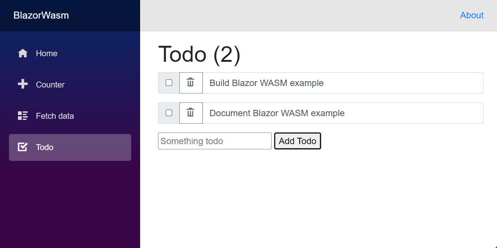

## Orleans ASP.NET Core Blazor WebAssembly Sample

<p align="center">
    
</p>

This sample demonstrates how to integrate [ASP.NET Core Blazor](https://docs.microsoft.com/aspnet/core/blazor/)
with [Microsoft Orleans](https://docs.microsoft.com/dotnet/orleans).
This demonstrates the in-browser [Blazor WebAssembly hosting model](https://docs.microsoft.com/aspnet/core/blazor/hosting-models#blazor-webassembly).

The client-side sample application leverages ASP.NET Web API running alongside Orleans for standard web communication.

The application is based on the [official tutorial](https://dotnet.microsoft.com/learn/aspnet/blazor-tutorial/intro), adapted to showcase integration with Orleans.

### How To Run

Run the sample by opening two terminal windows and executing the following in one terminal:

``` C#
dotnet run --project BlazorWasm.Server
```

Execute the following in the other terminal:

``` C#
dotnet run --project BlazorWasm.Client
```

Once both applications appear to have started, you can access them at these addresses:

* The Swagger UI, hosted by the BlazorWasm.Server process: [http://localhost:5000/swagger/index.html](http://localhost:5000/swagger/index.html)
* The Client-Side Blazor App hosted by the BlazorWasm.Client process: [http://localhost:62654/](http://localhost:62654/)

### Demos

The application showcases three demos:

#### Counter

Shows a button that updates a counter.
This demonstrates basic logic in Blazor.
This demo does not integrate with Orleans.

#### Fetch Data

A page that fetches read-only data from Orleans.
The client-side app sources this data from the ASP.NET Core Web API running alongside Orleans.

#### Todo

A page that manages a todo list.
Allows creating, editing and removing todo items.

The client-side app manages this data via REST calls to the ASP.NET Core Web API running alongside Orleans.