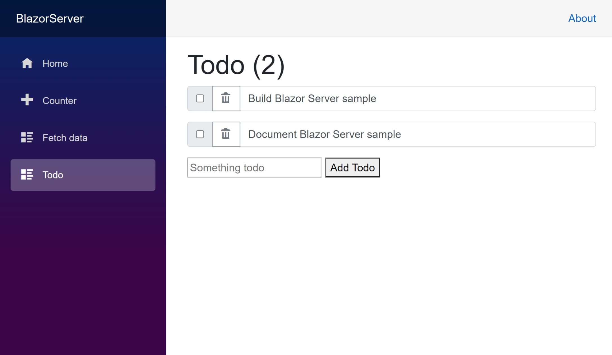

## [Blazor Server](./BlazorServer/#readme) and [Blazor WebAssembly](./BlazorWasm/#readme) Samples

    

These two Blazor samples are based on the [Blazor introductory tutorials](https://dotnet.microsoft.com/learn/aspnet/blazor-tutorial/intro), adapted for use with Orleans.
The [Blazor WebAssembly](./BlazorWasm/#readme) sample uses the [Blazor WebAssembly hosting model](https://docs.microsoft.com/aspnet/core/blazor/hosting-models#blazor-webassembly).
The [Blazor Server](./BlazorServer/#readme) sample uses the [Blazor Server hosting model](https://docs.microsoft.com/aspnet/core/blazor/hosting-models#blazor-server).
They include an interactive counter, a TODO list, and a Weather service.

### Demonstrates

* How to integrate ASP.NET Core Blazor Server with Orleans
* How to integrate ASP.NET Core Blazor WebAssembly (WASM) with Orleans