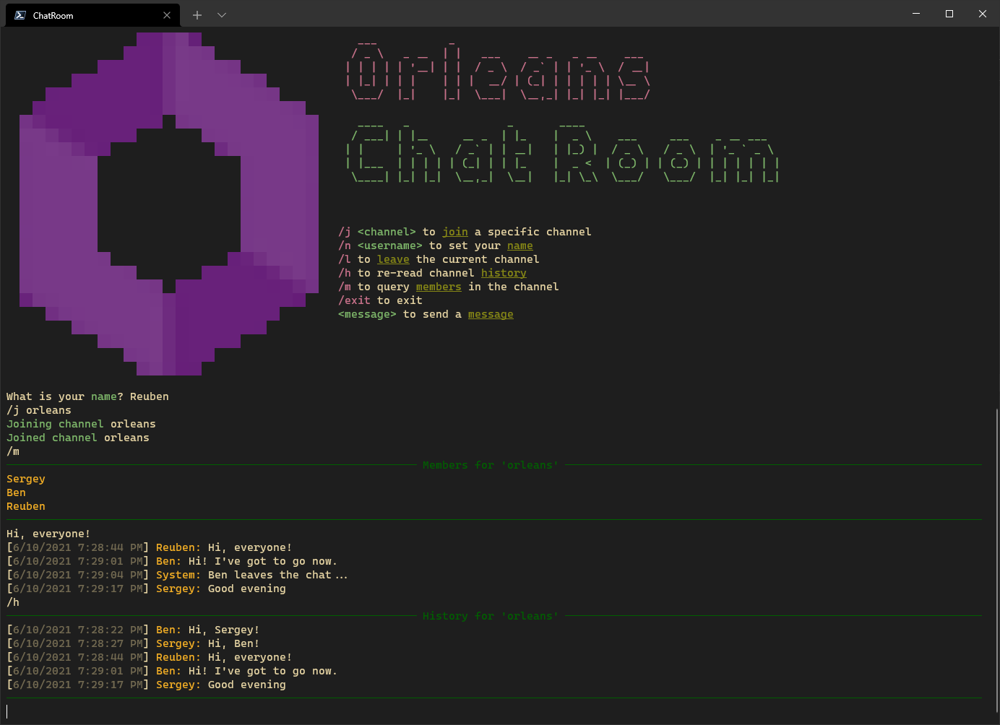

# Chat Room



This sample uses [Orleans Streaming](https://docs.microsoft.com/dotnet/orleans/streaming) to build a basic chat application. In this application, each client can:

* Set their name
* Join and leave a channel
* Send and receive messages in that channel
* List the channel members
* Display the channel's chat history

Each chat channel has a corresponding `ChannelGrain` which is identified by the channel's name, and a stream which is identified by a `Guid` generated by that grain. Clients connect to the `ChannelGrain` for a channel and then subscribe to the stream identified by the `Guid` returned from the `IChannelGrain.Join` call.

## Running the sample

First, start the server in one terminal window by executing the following:

```PowerShell
dotnet run --project .\ChatRoom.Service\
```

Then, once the server has started, open one or more terminal windows and execute the following in each:

```PowerShell
dotnet run --project .\ChatRoom.Client\
```

The clients will print instructions to the terminal which tell you how to interact with the sample.