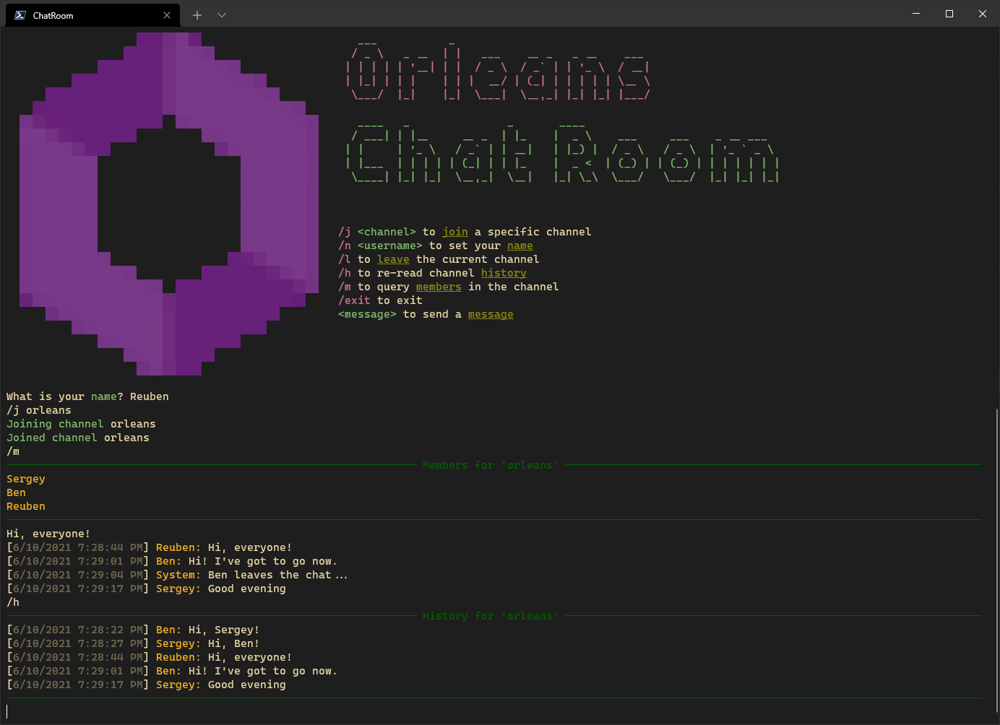

---
languages:
- csharp
products:
- dotnet
- dotnet-orleans
page_type: sample
name: "Orleans Chat Room sample"
urlFragment: "orleans-chat-room-sample"
description: "An Orleans sample chat room app."
---

# Orleans Chat Room sample



This sample uses [Orleans Streaming](https://learn.microsoft.com/dotnet/orleans/streaming) to build a basic chat application. In this application, each client can:

* Set their name
* Join and leave a channel
* Send and receive messages in that channel
* List the channel members
* Display the channel's chat history

Each chat channel has a corresponding `ChannelGrain` which is identified by the channel's name, and a stream which is identified by a `Guid` generated by that grain. Clients connect to the `ChannelGrain` for a channel and then subscribe to the stream identified by the `Guid` returned from the `IChannelGrain.Join` call.

## Sample prerequisites

This sample is written in C# and targets .NET 10. It requires the [.NET 10 SDK](https://dotnet.microsoft.com/download/dotnet/10.0) or later.

## Building the sample

To download and run the sample, follow these steps:

1. Download and unzip the sample.
2. In Visual Studio (2022 or later):
    1. On the menu bar, choose **File** > **Open** > **Project/Solution**.
    2. Navigate to the folder that holds the unzipped sample code, and open the C# project (.csproj) file.
    3. Choose the <kbd>F5</kbd> key to run with debugging, or <kbd>Ctrl</kbd>+<kbd>F5</kbd> keys to run the project without debugging.
3. From the command line:
   1. Navigate to the folder that holds the unzipped sample code.
   2. At the command line, type [`dotnet run`](https://docs.microsoft.com/dotnet/core/tools/dotnet-run).

## Running the sample

First, start the server in one terminal window by executing the following:

```PowerShell
dotnet run --project .\ChatRoom.Service\
```

Then, once the server has started, open one or more terminal windows and execute the following in each:

```PowerShell
dotnet run --project .\ChatRoom.Client\
```

The clients display a pre-rendered logo, text headings, and command instructions using Spectre.Console.

## Regenerating the terminal logo

`ChatRoom.Client\logo.png` is the source artwork. `logo.markup.gz` contains gzip-compressed UTF-8 Spectre.Console markup for widths of 1-25 pixels, separated by form feeds (`\f`). These sizes preserve the logo's appearance in narrow terminals.

To regenerate it after changing the PNG, save the following as `RenderLogo.cs` in a temporary directory and run it with the .NET 10 SDK:

```PowerShell
dotnet run <path-to-RenderLogo.cs> -- .\ChatRoom.Client\logo.png .\ChatRoom.Client\logo.markup.gz
```

This one-off converter uses the original ImageSharp renderer, whose license terms apply. The client uses Spectre.Console and built-in .NET gzip decompression.

```csharp
#:package Spectre.Console.ImageSharp@0.54.0
#:package SixLabors.ImageSharp@4.1.2

using System.IO.Compression;
using System.Text;
using Spectre.Console;
using Spectre.Console.Rendering;

var image = new CanvasImage(args[0]) { MaxWidth = 25 };
var options = new RenderOptions(AnsiConsole.Profile.Capabilities, new Size(50, 25));
using var file = File.Create(args[1]);
using var gzip = new GZipStream(file, CompressionLevel.SmallestSize);
using var writer = new StreamWriter(gzip);

for (var width = 1; width <= 25; width++)
{
    if (width > 1)
    {
        writer.Write('\f');
    }

    var markup = new StringBuilder();
    string? previousStyle = null;
    foreach (var segment in ((IRenderable)image).Render(options, width * 2))
    {
        var style = segment.IsLineBreak ? null : segment.Style.ToMarkup().Replace("default on ", "on ");
        if (style != previousStyle)
        {
            if (!string.IsNullOrEmpty(previousStyle))
            {
                markup.Append("[/]");
            }

            if (!string.IsNullOrEmpty(style))
            {
                markup.Append('[').Append(style).Append(']');
            }

            previousStyle = style;
        }

        markup.Append(segment.IsLineBreak ? "\n" : Markup.Escape(segment.Text));
    }

    writer.Write(markup.ToString().TrimEnd('\n'));
}
```
