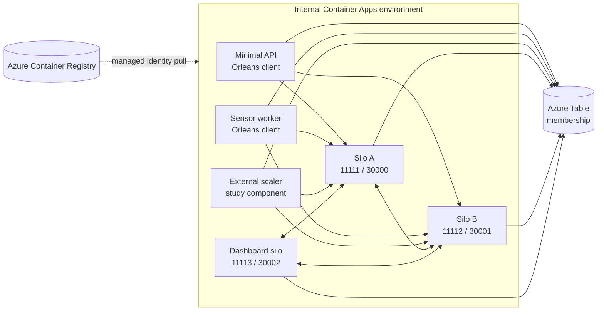

# Deploy an Orleans cluster on Azure Container Apps

> [!NOTE]
> This sample is maintained in the [`dotnet/orleans` repository](https://github.com/dotnet/orleans/tree/main/samples/Deployment/AzureContainerApps). It was imported from [`Azure-Samples/Orleans-Cluster-on-Azure-Container-Apps`](https://github.com/Azure-Samples/Orleans-Cluster-on-Azure-Container-Apps), whose MIT license is preserved in this directory.

This sample demonstrates a multi-component Orleans application on Azure Container Apps:

- Two dedicated silo Container Apps.
- An Orleans Dashboard process which is also a silo.
- A Minimal API Orleans client with a bounded hello-grain route.
- A worker Orleans client which produces simulated sensor traffic.
- A gRPC external-scaler service for studying the KEDA contract.
- Azure Table Storage clustering, Application Insights, and Azure Monitor logs.

The Bicep deployment uses an internal, virtual-network-integrated Container Apps environment and a linked private DNS zone. Every Orleans server runs in a separate Container App with exactly one replica. Each server advertises the environment's private static IP and a unique silo/gateway port pair. It does not depend on undocumented per-replica addresses.



## Important boundaries

- Azure Table Storage is used for **cluster membership only**. The sample grains are stateless, and no durable grain-storage provider is registered.
- The external scaler is deployed but is intentionally not attached to a silo scaling rule. Scaling multiple silo replicas inside one Container App does not provide a documented unique address for each replica.
- The dashboard and API ingress are private because the Container Apps environment is internal. Reach them from the virtual network or a connected private network.
- The sample uses one user-assigned managed identity for all runtime apps. It has `AcrPull` on the registry and `Storage Table Data Contributor` on the membership table.
- The registry and storage data endpoints remain public so GitHub-hosted runners and Container Apps can reach them, but they require Microsoft Entra authentication. Adapt the sample with private endpoints and a private runner when public endpoints are not acceptable.
- The workflow updates existing apps in place. Container Apps can overlap old and new revisions while readiness is evaluated. For a production upgrade, deploy a replacement one-replica silo app with unused ports, wait for it to join, and then drain and remove the old app.

See [Host Orleans on Azure Container Apps](https://dotnet.github.io/orleans/docs/deployment/deploy-to-azure-container-apps/) for production topology, upgrade, and acceptance-test guidance.

## Project layout

| Path | Purpose |
| --- | --- |
| `Abstractions` | Grain interfaces and serialized sensor contracts. |
| `Grains` | Hello and sensor grain implementations and sample placement policy. |
| `Silo` | Dedicated Orleans silo host. |
| `Dashboard` | Orleans Dashboard hosted in a distinct silo. |
| `Clients.MinimalApi` | HTTP API backed by an Orleans client. |
| `Clients.WorkerService` | Simulated sensor workload and probe endpoint. |
| `Scaler` | External scaler gRPC service. |
| `Infrastructure` | Shared telemetry, identity, storage, and endpoint configuration. |
| `Azure` | Foundation, privileged bootstrap, environment, and Container App Bicep modules. |
| `deployment/deploy.yml` | OIDC-authenticated build and deployment workflow. |

## Run locally

The Development configuration accepts only the Azurite shortcut `UseDevelopmentStorage=true`. Production does not fall back to a connection string.

1. Install the [.NET SDK selected by `global.json`](https://dotnet.microsoft.com/download). The sample projects target `net10.0`.
1. Start [Azurite](https://learn.microsoft.com/azure/storage/common/storage-use-azurite).
1. Build the sample:

   ```powershell
   dotnet build .\samples\Deployment\AzureContainerApps\HelloOrleans.sln -c Release
   ```

1. Start `Silo`, then start any clients, the dashboard, and the scaler in separate terminals:

   ```powershell
   dotnet run --project .\samples\Deployment\AzureContainerApps\Silo
   dotnet run --project .\samples\Deployment\AzureContainerApps\Dashboard
   dotnet run --project .\samples\Deployment\AzureContainerApps\Clients.MinimalApi
   dotnet run --project .\samples\Deployment\AzureContainerApps\Clients.WorkerService
   dotnet run --project .\samples\Deployment\AzureContainerApps\Scaler
   ```

Each launch profile sets the Development environment. If you run without a launch profile, set `DOTNET_ENVIRONMENT=Development`.

The Minimal API route `GET /hello/{grain}` accepts only integer keys from 0 through 255. `GET /providers` returns the active hello-grain keys as numbers. Inactive hello grains have a two-minute collection age.

## Deploy to Azure

### Prerequisites

- An Azure subscription and [Azure CLI](https://learn.microsoft.com/cli/azure/install-azure-cli) with Bicep support.
- A GitHub fork with Actions enabled.
- A GitHub OIDC application or user-assigned identity whose federated credential is restricted to this repository and the `azure-container-apps` environment. Follow [Configure OpenID Connect in Azure](https://learn.microsoft.com/azure/developer/github/connect-from-azure-openid-connect).
- A principal with permission to create role assignments for the one-time bootstrap.

Review the role scopes in `Azure/bootstrap.bicep` before deployment. The bootstrap grants the workflow principal `Contributor` only on the sample resource group and `AcrPush` only on the sample registry. The routine workflow cannot create role assignments.

### Run the privileged bootstrap

Sign in as the privileged bootstrap operator, choose a short lowercase base name, and supply the **object ID** of the workflow service principal:

```bash
RESOURCE_GROUP="my-orleans-aca"
LOCATION="eastus"
BASE_NAME="orleansaca"
DEPLOYMENT_PRINCIPAL_OBJECT_ID="00000000-0000-0000-0000-000000000000"

for provider in \
  Microsoft.App \
  Microsoft.Authorization \
  Microsoft.ContainerRegistry \
  Microsoft.Insights \
  Microsoft.ManagedIdentity \
  Microsoft.Network \
  Microsoft.OperationalInsights \
  Microsoft.Storage
do
  az provider register --namespace "$provider" --wait
done

az group create \
  --name "$RESOURCE_GROUP" \
  --location "$LOCATION"

az deployment group create \
  --name aca-bootstrap \
  --resource-group "$RESOURCE_GROUP" \
  --template-file samples/Deployment/AzureContainerApps/Azure/bootstrap.bicep \
  --parameters \
    "baseName=$BASE_NAME" \
    "deploymentPrincipalId=$DEPLOYMENT_PRINCIPAL_OBJECT_ID"
```

Provider registration is subscription-scoped and must be performed by the privileged bootstrap operator. The bootstrap then creates the registry, membership storage/table, and runtime identity before assigning:

- `AcrPull` to the runtime identity.
- `Storage Table Data Contributor` to the runtime identity at the membership-table scope.
- `Contributor` to the workflow principal at the sample resource-group scope.
- `AcrPush` to the workflow principal at the registry scope.

The sample registry selects **RBAC Registry Permissions**, so the `AcrPull` and `AcrPush` roles apply. If you switch it to **RBAC Registry + ABAC Repository Permissions**, replace those roles with repository-scoped reader and writer assignments.

Run the bootstrap only through the governed administrative process used for privileged access in your organization.

### Configure and run the workflow

1. Copy `deployment/deploy.yml` to `.github/workflows/deploy-orleans-container-apps.yml` in your fork.
1. Create a protected GitHub environment named `azure-container-apps`.
1. Add these environment variables:

   | Variable | Value |
   | --- | --- |
   | `AZURE_CLIENT_ID` | Client ID used by the GitHub OIDC login. |
   | `AZURE_TENANT_ID` | Microsoft Entra tenant ID. |
   | `AZURE_SUBSCRIPTION_ID` | Azure subscription ID. |
   | `AZURE_RESOURCE_GROUP` | Existing bootstrapped resource group. |
   | `AZURE_BASE_NAME` | The same base name passed to the bootstrap. |

1. Add the environment's required reviewers and branch restrictions.
1. Run the workflow manually, or push a sample/source change to the `deploy` branch.

The workflow uses no client secret. It signs in with OIDC, idempotently updates the foundation, builds five images with Git-SHA tags, pushes them using Microsoft Entra authentication, and deploys the images by digest. Container Apps pulls each image through the runtime managed identity.

## Deployed topology

The environment private static IP is shared at the load-balancer boundary, but every Orleans process has a unique exposed port pair:

| Container App | Silo port | Gateway port | Replica range |
| --- | ---: | ---: | ---: |
| `silo-a` | 11111 | 30000 | 1–1 |
| `silo-b` | 11112 | 30001 | 1–1 |
| `dashboard` | 11113 | 30002 | 1–1 |

The silo containers listen on ports 11111 and 30000. Container Apps maps each app's unique exposed ports to those target ports. Although TCP ingress uses `external: true`, the environment is internal, so the ingress IP remains private.

All deployed apps have explicit startup, readiness, and liveness probes, a nonzero replica floor, and a 60-second termination grace period. The health endpoints become reachable after the .NET host starts; production applications should extend readiness to reflect their own traffic-draining and dependency requirements.

To add cluster capacity, declare another one-replica silo app with a new, environment-unique silo/gateway pair. Do not raise a silo app's maximum replica count above one.

## Storage and identity

`AzureTable:ServiceUri` is set to the Azure Table service URI. `DefaultAzureCredential` uses the deployed user-assigned identity selected by `AZURE_CLIENT_ID`. Shared-key access is disabled on the storage account, and registry admin credentials are disabled.

To persist grain state, add and configure a grain-storage provider explicitly, provision a separate state store where practical, and grant only the required data-plane role. Do not treat the membership table as durable grain state.

## Explore the deployed sample

The Bicep deployment outputs the private environment IP plus the dashboard, API, and scaler host names. Connect from a machine in the virtual network or a peered network, then:

1. Open the dashboard and verify that `Silo-A`, `Silo-B`, and `Dashboard` are active.
1. Call `GET /hello/0` and `GET /hello/255`; both bounded grain identities should succeed.
1. Confirm that `GET /hello/-1` and `GET /hello/256` return HTTP 400 and that a noninteger route doesn't match.
1. Call `GET /providers` and verify that active hello-grain keys are returned as numbers.
1. Observe the worker client creating a bounded set of simulated sensor identities and distributing calls across the dedicated silos.

### Add cluster capacity

Don't increase a silo app's replica count. Add another entry to `siloDefinitions` in `Azure/main.bicep` with a unique app suffix, silo name, exposed silo port, and exposed gateway port. Redeploy, wait for the new membership row to become active, and verify every existing silo and client can reach its advertised endpoint.

To remove capacity, first stop new application work for that silo, allow Orleans to leave membership within the termination grace period, and remove one app at a time. Test abrupt termination separately because graceful shutdown isn't guaranteed.

### Study the external scaler

The gRPC scaler remains in the solution so you can study Orleans management statistics and the [KEDA external-scaler protocol](https://keda.sh/docs/latest/concepts/external-scalers/). It isn't attached to the silo apps because Container Apps doesn't publish a supported unique address for each replica of a scaled app. Use measured platform metrics or an application-owned deployment controller to add and remove whole one-replica silo apps; don't use the sample threshold as production capacity guidance.

### Inspect health and revisions

Use Container Apps revision and replica commands to correlate image digests, readiness, and restarts with Orleans membership:

```bash
az containerapp revision list \
  --resource-group "$RESOURCE_GROUP" \
  --name "<container-app-name>" \
  --output table

az containerapp replica list \
  --resource-group "$RESOURCE_GROUP" \
  --name "<container-app-name>" \
  --revision "<revision-name>" \
  --output table
```

Readiness removes a sole replica from new ingress selection but doesn't close existing Orleans TCP connections or update membership by itself. Coordinate readiness, application draining, membership departure, and host shutdown.

## Clean up

Delete the dedicated resource group when finished:

```bash
az group delete --name "$RESOURCE_GROUP"
```
