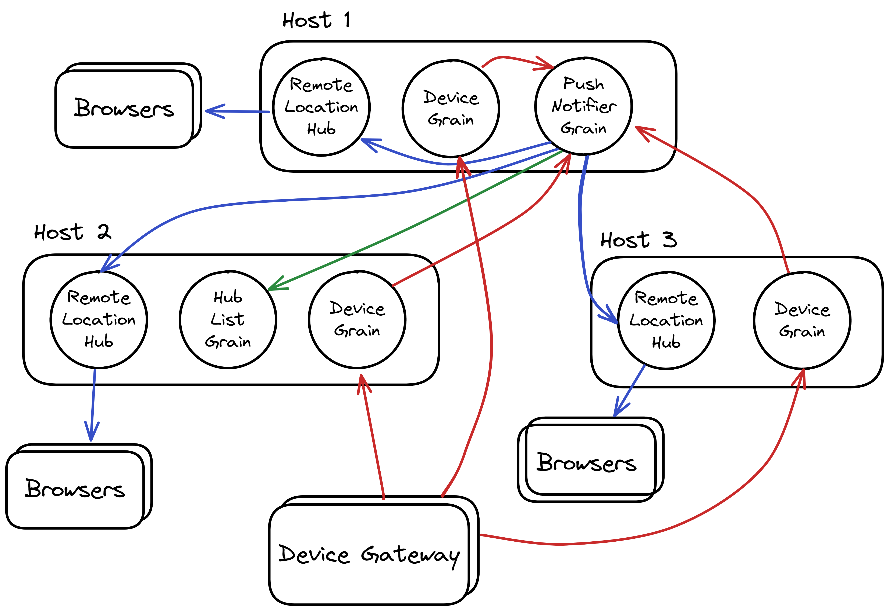

# GPS Device Tracker

This sample demonstrates a service for tracking GPS-equipped IoT devices on a map. Device locations are updated in near-real-time using SignalR and hence this sample demonstrates one approach to integrating Orleans with SignalR. The device updates originate from a *device gateway*, which is implemented using a separate process which connects to the main service and simulates a number of devices moving in a pseudorandom fashion around an area of San Francisco.

<p align="center">
    
</p>

Data flows around the system as follows:

* A device gateway sends periodic location updates to a per-device `DeviceGrain`
* The `DeviceGrain` updates a singleton `PushNotifierGrain` with its location
* The `PushNotifierGrain` collects these updates into batches and pushes them to `IRemoteLocationHub` instances which it discovers by periodically polling the singleton `HubListGrain`
* `HubListGrain` maintains a list containing an `IRemoteLocationHub` reference for each host which is connected to to the Orleans cluster
* Each host has a `HubListUpdater` instance, which implements [`BackgroundService`](https://docs.microsoft.com/aspnet/core/fundamentals/host/hosted-services#backgroundservice-base-class) and periodically updates `HubListGrain` with its local `IRemoteLocationHub` reference.
* The `RemoteLocationHub` class which implements `IRemoteLocationHub` has an instance of [`IHubContext<LocationHub>`](https://docs.microsoft.com/aspnet/core/signalr/hubcontext) injected into its constructor. This allows it to send messages to the Web clients which have connected to the `LocationHub`.

The following diagram is a representation of the above description:


The following an example of how this might look with multiple hosts and many browsers. Note that the `PushNotifierGrain` and `HubListGrain` are singletons and therefore there is one instance of each of those grains shared by the cluster. Singleton grains are a pattern in Orleans whereby only a single grain of a given type is accessed, for example by always calling the instance with a key `0` or `Guid.Empty` or some other fixed value, depending on if the grain is a `IGrainWithIntegerKey` or `IGrainWithGuidKey`. For example, each `DeviceGrain` gets an instance of the `IPushNotifierGrain` with id `0`:

```csharp
var notifier = GrainFactory.GetGrain<IPushNotifierGrain>(0);
```



## Running the sample

Open three terminal windows. In the first terminal window, run the following at the command prompt:

```bash
dotnet run --project GPSTracker.Service
```

In the second terminal, launch another instance of the host, specifying that it's the second host by passing an `InstanceId` value as follows:

```bash
dotnet run --project GPSTracker.Service -- --InstanceId 1
```

Now open a web browser to `http://localhost:5001/index.html`. At this point, there will be no points moving around the map.

In the third terminal window, run the following at the command prompt to begin simulating devices:

```bash
dotnet run --project GPSTracker.FakeDeviceGateway
```

Dots will appear on the map in the Web browser and begin moving randomly around the area.