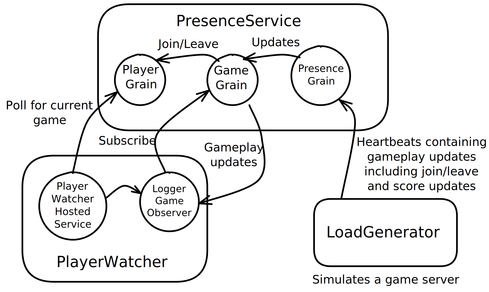

# Gaming Presence Service

This sample demonstrates a gaming presence service in which a game server (represented by the *LoadGenerator* application) sends periodic heartbeats to a cloud service (represented by the *PresenceService* application) containing the status of a game which it is hosting. Inside the service, a corresponding `PresenceGrain` is responsible for unpacking the heartbeat message and reflecting the state of the game in the `PlayerGrain` and `GameGrain` grains. The effects of this can be seen on a client application (*PlayerWatcher*), which polls the player for the current game session. Each time a new game session is returned, the client creates a new `LoggerGameObserver` which subscribes to the game grain so that status updates are pushed to it using the `IGameObserver` interface.



## Build & Run

To build and run the sample step-by-step on the command line, use the following commands:

Build the solution using the .NET CLI:

``` sh
dotnet build
```

Launch the server process:

``` sh
dotnet run --project ./src/PresenceService
```

In a separate terminal window, launch the player watcher:

```
dotnet run --project ./src/PlayerWatcher
```

In a separate terminal window, launch the load generator:

```
dotnet run --project ./src/LoadGenerator
```