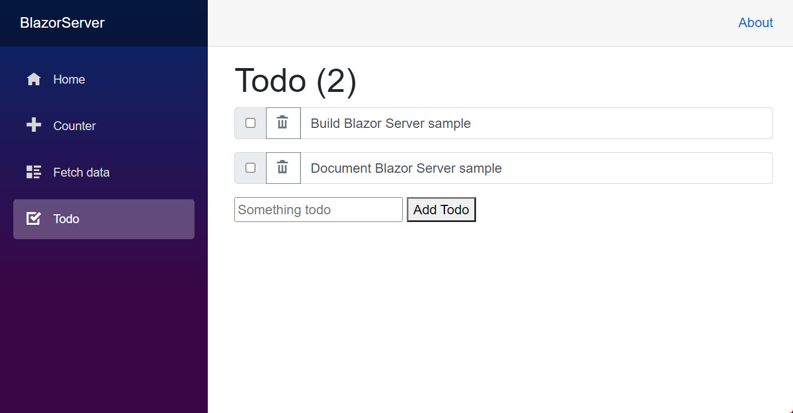

# Orleans Samples

## [Hello, World!](./HelloWorld/#readme)

    

A *Hello, World!* application which demonstrates how to create and use your first grains.

### Demonstrates

* How to get started with Orleans
* How to define and implement grain interface
* How to get a reference to a grain and call a grain

## [Adventure](./Adventure/#readme)

    

Before there were graphical user interfaces, before the era of game consoles and massive-multiplayer games, there were VT100 terminals and there was [Colossal Cave Adventure](https://en.wikipedia.org/wiki/Colossal_Cave_Adventure), [Zork](https://en.wikipedia.org/wiki/Zork), and [Microsoft Adventure](https://en.wikipedia.org/wiki/Microsoft_Adventure).
Possibly lame by today's standards, back then it was a magical world of monsters, chirping birds, and things you could pick up.
It's the inspiration for this sample.

### Demonstrates

* How to structure an application (in this case, a game) using grains
* How to connect an external client to an Orleans cluster (`ClientBuilder`)

## [Chirper](./Chirper/#readme)

    

A social network pub/sub system, with short text messages being sent between users.
Publishers send out short *"Chirp"* messages (not to be confused with *"Tweets"*, for a variety of legal reasons) to any other users that are following them.

### Demonstrates

* How to build a simplified social media / social network application using Orleans 
* How to store state within a grain using grain persistence (`IPersistentState<T>`)
* Grains which implement multiple grain interfaces
* Reentrant grains, which allow for multiple grain calls to be executed concurrently, in a single-threaded, interleaving fashion
* Using a *grain observer* (`IGrainObserver`) to receive push notifications from grains
## [GPS Tracker](./GPSTracker/#readme)

    

A service for tracking GPS-equipped [IoT](https://en.wikipedia.org/wiki/Internet_of_Things) devices on a map.
Device locations are updated in near-real-time using SignalR and hence this sample demonstrates one approach to integrating Orleans with SignalR.
The device updates originate from a *device gateway*, which is implemented using a separate process which connects to the main service and simulates a number of devices moving in a pseudorandom fashion around an area of San Francisco.

### Demonstrates

* How to use Orleans to build an [Internet of Things](https://en.wikipedia.org/wiki/Internet_of_Things) application
* How Orleans can be co-hosted and integrated with [ASP.NET Core SignalR](https://docs.microsoft.com/aspnet/core/signalr/introduction)
* How to broadcast real-time updates from a grain to a set of clients using Orleans and SignalR

## [HanBaoBao](https://github.com/ReubenBond/hanbaobao-web)

    

An English-Mandarin dictionary Web application demonstrating deployment to Kubernetes, fan-out grain calls, and request throttling.

### Demonstrates

* How to build a realistic application using Orleans
* How to deploy an Orleans-based application to Kubernetes
* How to integrate Orleans with ASP.NET Core and a [*Single-page Application*](https://en.wikipedia.org/wiki/Single-page_application) JavaScript framework ([Vue.js](https://vuejs.org/))
* How to implement leaky-bucket request throttling
* How to load and query data from a database
* How to cache results lazily and temporarily
* How to fan-out requests to many grains and collect the results

## [Presence Service](./Presence/#readme)

    

A gaming presence service, similar to one of the Orleans-based services built for [Halo](https://www.xbox.com/games/halo).
A presence service tracks players and game sessions in near-real-time.

### Demonstrates

* A simplified version of a real-world use of Orleans
* Using a *grain observer* (`IGrainObserver`) to receive push notifications from grains

## [Tic Tac Toe](./TicTacToe/#readme)

    

A Web-based [Tic-tac-toe](https://en.wikipedia.org/wiki/Tic-tac-toe) game using ASP.NET MVC, JavaScript, and Orleans.

### Demonstrates

* How to build an online game using Orleans
* How to build a basic game lobby system
* How to access Orleans grains from an ASP.NET Core MVC application

## [Voting](./Voting/#readme)

    

A Web application for voting on a set of choices. This sample demonstrates deployment to Kubernetes.
The application uses [.NET Generic Host](https://docs.microsoft.com/dotnet/core/extensions/generic-host) to co-host [ASP.NET Core](https://docs.microsoft.com/aspnet/core) and Orleans as well as the [Orleans Dashboard](https://github.com/OrleansContrib/OrleansDashboard) together in the same process.

    

### Demonstrates

* How to deploy an Orleans-based application to Kubernetes
* How to configure the [Orleans Dashboard](https://github.com/OrleansContrib/OrleansDashboard)

## [Chat Room](./ChatRoom/#readme)

    

A terminal-based chat application built using [Orleans Streams](http://dotnet.github.io/orleans/docs/streaming/index.html).

### Demonstrates

* How to build a chat application using Orleans
* How to use [Orleans Streams](http://dotnet.github.io/orleans/docs/streaming/index.html)

## [Bank Account](./BankAccount/#readme)

    

Simulates bank accounts, using ACID transactions to transfer random amounts between a set of accounts.

### Demonstrates

* How to use Orleans Transactions to safely perform operations involving multiple stateful grains with ACID guarantees and serializable isolation.

## [Blazor Server](./Blazor/BlazorServer/#readme) and [Blazor WebAssembly](./Blazor/BlazorWasm/#readme)

    

These two Blazor samples are based on the [Blazor introductory tutorials](https://dotnet.microsoft.com/learn/aspnet/blazor-tutorial/intro), adapted for use with Orleans.
The [Blazor WebAssembly](./Blazor/BlazorWasm/#readme) sample uses the [Blazor WebAssembly hosting model](https://docs.microsoft.com/aspnet/core/blazor/hosting-models#blazor-webassembly).
The [Blazor Server](./Blazor/BlazorServer/#readme) sample uses the [Blazor Server hosting model](https://docs.microsoft.com/aspnet/core/blazor/hosting-models#blazor-server).
They include an interactive counter, a TODO list, and a Weather service.

### Demonstrates

* How to integrate ASP.NET Core Blazor Server with Orleans
* How to integrate ASP.NET Core Blazor WebAssembly (WASM) with Orleans

## [Stocks](./Stocks/#readme)

    

A stock price application which fetches prices from a remote service using an HTTP call and caches prices temporarily in a grain.
A [`BackgroundService`](https://docs.microsoft.com/aspnet/core/fundamentals/host/hosted-services#backgroundservice-base-class) periodically polls for updates stock prices from various `StockGrain` grains which correspond to a set of stock symbols.

### Demonstrates

* How to use Orleans from within a [`BackgroundService`](https://docs.microsoft.com/aspnet/core/fundamentals/host/hosted-services#backgroundservice-base-class).
* How to use timers within a grain
* How to make external service calls using .NET's `HttpClient` and cache the results within a grain.

## [Transport Layer Security](./TransportLayerSecurity/#readme)

    

A *Hello, World!* application configured to use mutual [*Transport Layer Security*](https://en.wikipedia.org/wiki/Transport_Layer_Security) to secure network communication between every server.

### Demonstrates

* How to configure mutual-TLS (mTLS) authentication for Orleans

## [Visual Basic Hello World](./VBHelloWorld/#readme)

A *Hello, World!* application using Visual Basic.

### Demonstrates

* How to develop Orleans-based applications using Visual Basic

## [F# Hello World](./FSharpHelloWorld/#readme)

A *Hello, World!* application using F#.

### Demonstrates

* How to develop Orleans-based applications using F#

## [Streaming: Pub/Sub Streams over Azure Event Hubs](./Streaming/Simple/#readme)

An application using Orleans Streams with [Azure Event Hubs](https://azure.microsoft.com/services/event-hubs/) as the provider and implicit subscribers.

### Demonstrates

* How to use [Orleans Streams](http://dotnet.github.io/orleans/docs/streaming/index.html)
* How to use the `[ImplicitStreamSubscription(namespace)]` attribute to implicitly subscribe a grain to the stream with the corresponding id
* How to configure Orleans Streams for use with [Azure Event Hubs](https://azure.microsoft.com/services/event-hubs/)

## [Streaming: Custom Data Adapter](./Streaming/CustomDataAdapter/#readme)

An application using Orleans Streams with a non-Orleans publisher pushing to a stream which a grain consumes via a *custom data adapter* which tells Orleans how to interpret stream messages.

### Demonstrates

* How to use [Orleans Streams](http://dotnet.github.io/orleans/docs/streaming/index.html)
* How to use the `[ImplicitStreamSubscription(namespace)]` attribute to implicitly subscribe a grain to the stream with the corresponding id
* How to configure Orleans Streams for use with [Azure Event Hubs](https://azure.microsoft.com/services/event-hubs/)
* How to consume stream messages published by non-Orleans publishers by providing a custom `EventHubDataAdapter` implementation (a custom data adapter)