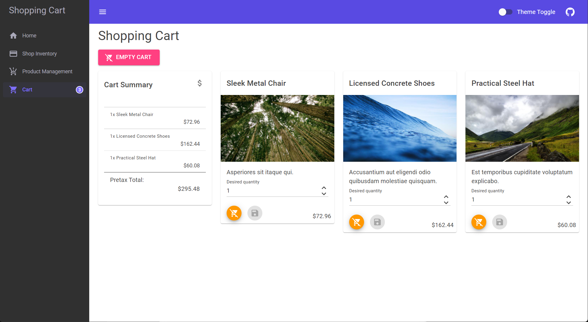
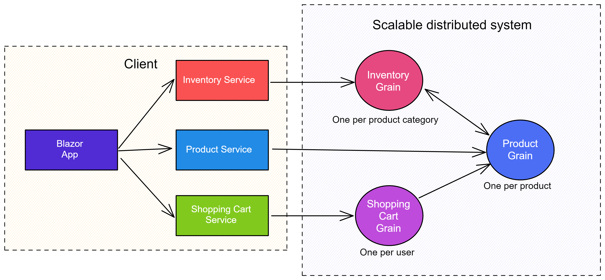

---
languages:
- csharp
products:
- dotnet
- dotnet-orleans
page_type: sample
name: "Orleans: Shopping Cart App sample"
urlFragment: "orleans-shopping-cart-app-sample"
description: "A canonical shopping cart sample application, built using Microsoft Orleans."
---

# Orleans: Shopping Cart App sample

> [!NOTE]
> This sample is maintained in the [`dotnet/orleans` repository](https://github.com/dotnet/orleans/tree/main/samples/ShoppingCart). It was imported from [`dotnet/samples`](https://github.com/dotnet/samples/tree/main/orleans/ShoppingCart).

A canonical shopping cart sample application, built using Microsoft Orleans. This app shows the following features:

- **Shopping cart**: A simple shopping cart application that uses Orleans for its cross-platform framework support, and its scalable distributed applications capabilities.

  - **Inventory management**: Edit and/or create product inventory.
  - **Shop inventory**: Explore purchasable products and add them to your cart.
  - **Cart**: View a summary of all the items in your cart, and manage these items; either removing or changing the quantity of each item.

## Features

- [.NET 10](https://learn.microsoft.com/dotnet/core/whats-new/dotnet-10/overview)
- [ASP.NET Core Blazor](https://docs.microsoft.com/aspnet/core/blazor)
- [Orleans: Grain persistence](https://docs.microsoft.com/dotnet/orleans/grains/grain-persistence)
- [Azure Storage grain persistence](https://docs.microsoft.com/dotnet/orleans/grains/grain-persistence/azure-storage)
  - [Orleans: Cluster management](https://docs.microsoft.com/dotnet/orleans/implementation/cluster-management)
- [Orleans: Code generation](https://docs.microsoft.com/dotnet/orleans/grains/code-generation)
- [Orleans: Startup tasks](https://docs.microsoft.com/dotnet/orleans/host/configuration-guide/startup-tasks)
- [Azure Bicep](https://docs.microsoft.com/azure/azure-resource-manager/bicep)
- [Azure App Service](https://docs.microsoft.com/azure/app-service/overview)
- [GitHub Actions and .NET](https://docs.microsoft.com/dotnet/devops/github-actions-overview)

The app is architected as follows:

## Get Started

### Prerequisites

- A [GitHub account](https://docs.github.com/en/get-started/start-your-journey/creating-an-account-on-github)
- The [.NET 10 SDK or later](https://dotnet.microsoft.com/download/dotnet)
- The [Azure CLI](https://learn.microsoft.com/cli/azure/install-azure-cli)
- A .NET integrated development environment (IDE)
  - Feel free to use the [Visual Studio IDE](https://visualstudio.microsoft.com) or the [Visual Studio Code](https://code.visualstudio.com)

### Quickstart

1. `git clone https://github.com/dotnet/orleans.git`
1. `cd orleans/samples/ShoppingCart`
1. `dotnet run --project Silo\Orleans.ShoppingCart.Silo.csproj --environment ASPNETCORE_ENVIRONMENT=Development`

### Deploying to Azure

Before deploying to Azure, make sure you complete the following steps:

1. Create an Azure Cosmos DB for NoSQL account.
    1. Create a database named `Orleans`.
    1. Within the `Orleans` database, create a container named `OrleansStorage` with a partition key path of `/PartitionKey`.
    1. Create another container named `OrleansCluster` within the `Orleans` database. Ensure this container has a partition key path of `/ClusterId`.
    1. Get the connection string.
1. Create an Azure Container App as the target of your deployment.
    1. Ensure that the target ingress port is `8080`. For more information, see [default ASP.NET Core port changed to 8080](https://learn.microsoft.com/dotnet/core/compatibility/containers/8.0/aspnet-port).
    1. Create a secret in the Container App for the Azure Cosmos DB for NoSQL account's connection string.
    1. Create an environment variable in the Container App's container named `ORLEANS_AZURE_COSMOS_DB_CONNECTION_STRING`. Reference the secret you just created.
1. Deploy the application to the Azure Container App service. For more information, see [Azure Container Apps deployment options](https://learn.microsoft.com/azure/container-apps/code-to-cloud-options).

### Build docker image locally

1. Install Docker Desktop from [Docker Hub](https://hub.docker.com/editions/community/docker-ce-desktop-windows)
2. From this directory, run `docker build ../.. -t orleans-shopping-cart -f Silo/Dockerfile` to build the docker image locally using the repository root as the build context

### Acknowledgements

The Orleans.ShoppingCart.Silo project uses the following open3rd party-source projects:

- [MudBlazor](https://github.com/MudBlazor/MudBlazor): Blazor Component Library based on Material design.
- [Bogus](https://github.com/bchavez/Bogus): A simple fake data generator for C#, F#, and VB.NET.
- [Blazorators](https://github.com/IEvangelist/blazorators): Source-generated packages for Blazor JavaScript interop.

Derived from [IEvangelist/orleans-shopping-cart](https://github.com/IEvangelist/orleans-shopping-cart).

## Resources

- [Deploy Orleans to Azure App Service](https://aka.ms/orleans-on-app-service)
