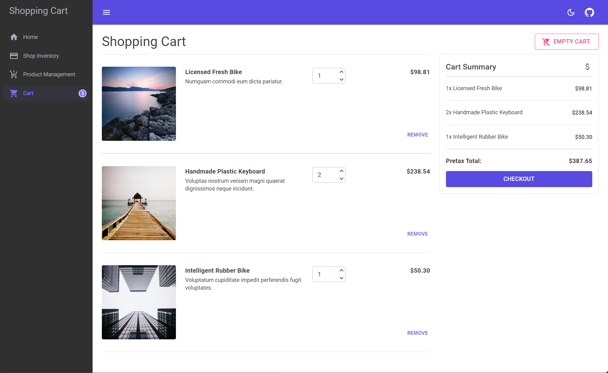

# Microsoft Orleans: Shopping Cart App

A canonical shopping cart sample application, built using Microsoft Orleans. This app shows the following features:

- **Shopping cart**: A simple shopping cart application that uses Orleans for its cross-platform framework support, and its scalable distributed applications capabilities.

  - **Inventory management**: Edit and/or create product inventory.
  - **Shop inventory**: Explore purchasable products and add them to your cart.
  - **Cart**: View a summary of all the items in your cart, and manage these items; either removing or changing the quantity of each item.

## Features

- [.NET 6](https://docs.microsoft.com/dotnet/core/whats-new/dotnet-6)
- [ASP.NET Core Blazor](https://docs.microsoft.com/aspnet/core/blazor/?view=aspnetcore-6.0)
- [Orleans: Grain persistence](https://docs.microsoft.com/dotnet/orleans/grains/grain-persistence)
  - [Azure Storage grain persistence](https://docs.microsoft.com/dotnet/orleans/grains/grain-persistence/azure-storage)
- [Orleans: Cluster management](https://docs.microsoft.com/dotnet/orleans/implementation/cluster-management)
- [Orleans: Code generation](https://docs.microsoft.com/dotnet/orleans/grains/code-generation)
- [Orleans: Startup tasks](https://docs.microsoft.com/dotnet/orleans/host/configuration-guide/startup-tasks)
- [Azure Bicep](https://docs.microsoft.com/azure/azure-resource-manager/bicep)
- [Azure App Service](https://docs.microsoft.com/azure/app-service/overview)
- [GitHub Actions and .NET](https://docs.microsoft.com/dotnet/devops/github-actions-overview)

The app is architected as follows:

## Get Started

### Prerequisites

- A [GitHub account](https://github.com/join)
- The [.NET 6 SDK or later](https://dotnet.microsoft.com/download/dotnet)
- The [Azure CLI](/cli/azure/install-azure-cli)
- A .NET integrated development environment (IDE)
  - Feel free to use the [Visual Studio IDE](https://visualstudio.microsoft.com) or the [Visual Studio Code](https://code.visualstudio.com)

### Quickstart

1. `git clone https://github.com/Azure-Samples/Orleans-Cluster-on-Azure-App-Service.git orleans-on-app-service`
2. `cd orleans-on-app-service`
3. `dotnet run --project Silo\Orleans.ShoppingCart.Silo.csproj`

### Acknowledgements

The Orleans.ShoppingCart.Silo project uses the following open3rd party-source projects:

- [MudBlazor](https://github.com/MudBlazor/MudBlazor): Blazor Component Library based on Material design.
- [Bogus](https://github.com/bchavez/Bogus): A simple fake data generator for C#, F#, and VB.NET.
- [Blazorators](https://github.com/IEvangelist/blazorators): Source-generated packages for Blazor JavaScript interop.

Derived from [IEvangelist/orleans-shopping-cart](https://github.com/IEvangelist/orleans-shopping-cart).

## Resources

- [Deploy Orleans to Azure App Service](https://aka.ms/orleans-on-app-service)
