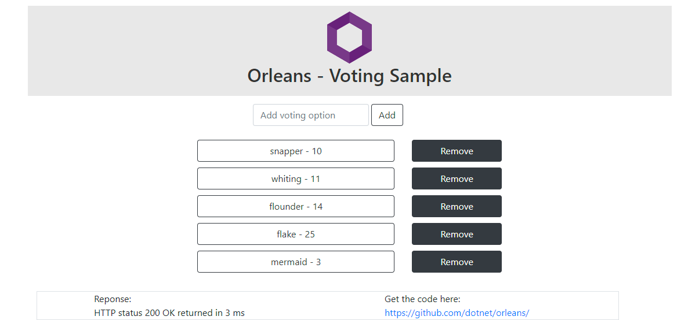
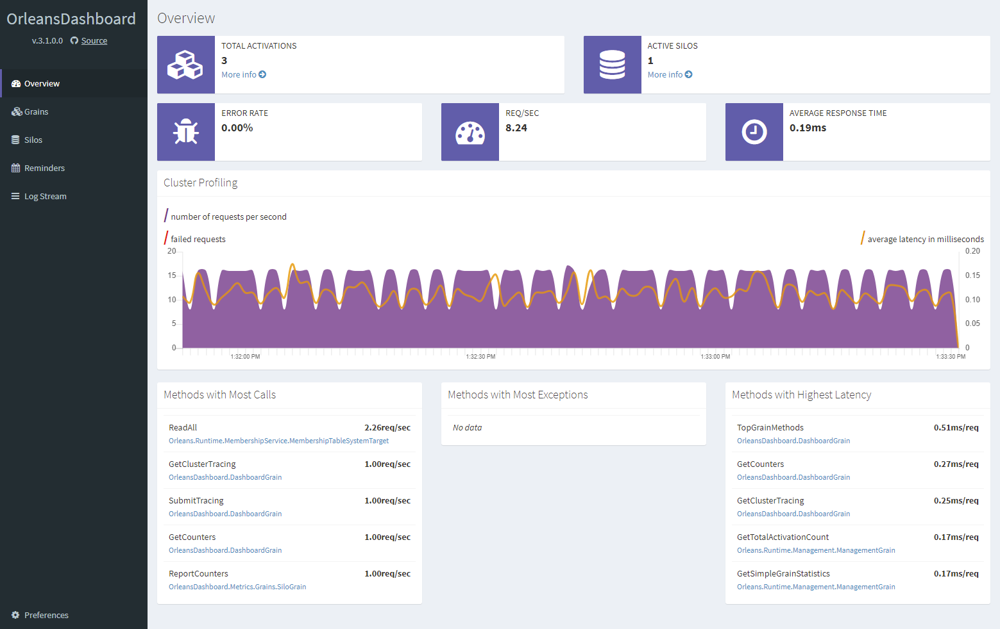

# Voting - Orleans on Kubernetes



This is an [Orleans](https://github.com/dotnet/orleans) sample application which demonstrates deployment to Kubernetes.
The application is a simplistic Web app for voting on a custom set of options.
The application uses [.NET Generic Host](https://docs.microsoft.com/dotnet/core/extensions/generic-host) to co-host [ASP.NET Core](https://docs.microsoft.com/aspnet/core) and Orleans as well as the [Orleans Dashboard](https://github.com/OrleansContrib/OrleansDashboard) together in the same process.



The Web app sends HTTP requests which are handled by ASP.NET Core MVC controllers which call into Orleans grains.
The application can be run locally by executing:

``` PowerShell
dotnet run -c Release -- --environment Development --urls http://localhost:5000
```

Once the application starts, open a browser to http://localhost:5000 to play with the app.
The Orleans Dashboard will be available at http://localhost:8888.
The application can also be deployed to Kubernetes.
The key file for deploying this sample to Kubernetes is [`deployment.yaml`](./deployment.yaml), which describes the required Kubernetes resources.
Before deploying the app, you will need to provision the following resources:

* A resource group
* An Azure Container Registry (ACR) container registry
* An Azure Kubernetes Service (AKS) cluster
* A Service Principal which allows AKS to access ACR

The [`provision.ps1`](./provision.ps1) script attempts to automate these steps, with some required names defined at the top of the script.
It is best to execute the following steps in a **PowerShell** terminal one-by-one, since the script performs no error handling.

``` PowerShell
# Choose some resource names. Note that some of these are globally unique across all of Azure, so you will need to change these values.
$resourceGroup = "votingapp"
$location = "westus"
$clusterName = "votingapp"
$containerRegistry = "votingappacr"

az login

# Create a resource group
az group create --name $resourceGroup --location $location

# Create an AKS cluster. This can take a few minutes
az aks create --resource-group $resourceGroup --name $clusterName --node-count 3

# If you haven't already, install the Kubernetes CLI
az aks install-cli

# Authenticate the Kubernetes CLI
az aks get-credentials --resource-group $resourceGroup --name $clusterName

# Create an Azure Container Registry account and login to it
az acr create --name $containerRegistry --resource-group $resourceGroup --sku Standard

# Create a service principal for the container registry and register it with Kubernetes as an image pulling secret
$acrId = $(az acr show --name $containerRegistry --query id --output tsv)
$acrServicePrincipalName = "$($containerRegistry)-aks-service-principal"
$acrSpPw = $(az ad sp create-for-rbac --name http://$acrServicePrincipalName --scopes $acrId --role acrpull --query password --output tsv)
$acrSpAppId = $(az ad sp show --id http://$acrServicePrincipalName --query appId --output tsv)
$acrLoginServer = $(az acr show --name $containerRegistry --resource-group $resourceGroup --query loginServer).Trim('"')
kubectl create secret docker-registry $containerRegistry --namespace default --docker-server=$acrLoginServer --docker-username=$acrSpAppId --docker-password=$acrSpPw
```

With those resources provisioned, we can define our application and deploy it.
Create a file called `deployment.yaml` with the following contents, making changes where necessary depending on the resource names you chose when provisioning the resources.
Look for the `# REPLACEME` comments and replace those values.
We will explain the structure of the file below.

``` yaml
apiVersion: apps/v1
kind: Deployment
metadata:
  name: redis
spec:
  replicas: 1
  selector:
    matchLabels:
      app: redis
  template:
    metadata:
      labels:
        app: redis
    spec:
      containers:
      - name: redis
        image: mcr.microsoft.com/oss/bitnami/redis:6.0.8
        env:
        - name: ALLOW_EMPTY_PASSWORD
          value: "yes"
        resources:
          requests:
            cpu: 100m
            memory: 128Mi
          limits:
            cpu: 250m
            memory: 256Mi
        ports:
        - containerPort: 6379
          name: redis
---
apiVersion: v1
kind: Service
metadata:
  name: redis
spec:
  ports:
  - port: 6379
  selector:
    app: redis
---
apiVersion: apps/v1
kind: Deployment
metadata:
  name: votingapp
  labels:
    app: votingapp
spec:
  selector:
    matchLabels:
      app: votingapp
  replicas: 3
  template:
    metadata:
      labels:
        app: votingapp

        # The serviceId label is used to identify the service to Orleans
        orleans/serviceId: votingapp

        # The clusterId label is used to identify an instance of a cluster to Orleans.
        # Typically, this will be the same value as serviceId or any fixed value.
        # In cases where you are not using rolling deployments (for example, blue/green deployments),
        # this value can allow for distinct clusters which do not communicate directly with each others,
        # but which still share the same storage and other resources.
        orleans/clusterId: votingapp
    spec:
      containers:
        - name: main
          image: votingappacr.azurecr.io/votingapp # REPLACEME
          imagePullPolicy: Always
          ports:
          - containerPort: 80
          - containerPort: 443
          - containerPort: 11111
          - containerPort: 8888
          env:
          # Configure settings to let Orleans know which cluster it belongs to and which pod it is running in
          - name: ORLEANS_SERVICE_ID
            valueFrom:
              fieldRef:
                fieldPath: metadata.labels['orleans/serviceId']
          - name: ORLEANS_CLUSTER_ID
            valueFrom:
              fieldRef:
                fieldPath: metadata.labels['orleans/clusterId']
          - name: POD_NAMESPACE
            valueFrom:
              fieldRef:
                fieldPath: metadata.namespace
          - name: POD_NAME
            valueFrom:
              fieldRef:
                fieldPath: metadata.name
          - name: POD_IP
            valueFrom:
              fieldRef:
                fieldPath: status.podIP
          - name: DOTNET_SHUTDOWNTIMEOUTSECONDS
            value: "120"
          - name: REDIS
            value: "redis" # The name of the redis service
      terminationGracePeriodSeconds: 180
      imagePullSecrets:
        - name: votingappacr # REPLACEME
  minReadySeconds: 60
  strategy:
    rollingUpdate:
      maxUnavailable: 0
      maxSurge: 1

---
# In order to be able to access the service from outside the cluster, we will need to add a Service object
apiVersion: v1
kind: Service
metadata:
  name: votingapp
spec:
  type: LoadBalancer
  ports:
  - name: http
    port: 80
  - name: https
    port: 433
  - name: orleans-dashboard
    port: 8888
  selector:
    app: votingapp

# For RBAC-enabled clusters, the Kubernetes service account for the pods may also need to be granted the required access:
---
kind: Role
apiVersion: rbac.authorization.k8s.io/v1
metadata:
  name: pod-reader
rules:
- apiGroups: [ "" ]
  resources: ["pods"]
  verbs: ["get", "watch", "list"]
---
kind: RoleBinding
apiVersion: rbac.authorization.k8s.io/v1
metadata:
  name: pod-reader-binding
subjects:
- kind: ServiceAccount
  name: default
  apiGroup: ''
roleRef:
  kind: Role
  name: pod-reader
  apiGroup: ''
```

The file is large and could be intimidating at first, but the basic structure is to create two *Deployment* resources: one for Redis and one for our application.
Each Deployment has a corresponding *Service* which is used for routing traffic.
In addition, because this sample uses the `Microsoft.Orleans.Kubernetes.Hosting` package, which queries the Kubernetes API, you will need to provision a *Role* and corresponding *RoleBinding* if your cluster is RBAC enabled.
The `deployment.yaml` file contains one section for each of those resources, separated by `---`.

With the `deployment.yaml` file created, now we need to build and deploy the application.
Use `docker` to copy the source into a new build container and build the application, then copy the result into a fresh layer.

Execute the following to build the container image, push it to Azure Container Registry, and deploy the `deployment.yaml` file to Kubernetes.
Note that you will need to substitute the variable names as you did when provisioning the resources.

``` PowerShell
$resourceGroup = "votingapp"
$containerRegistry = "votingappacr"

$acrLoginServer = $(az acr show --name $containerRegistry --resource-group $resourceGroup --query loginServer).Trim('"')
az acr login --name $containerRegistry

docker build . -t $acrLoginServer/votingapp &&
docker push $acrLoginServer/votingapp &&
kubectl apply -f ./deployment.yaml &&
kubectl rollout restart deployment/votingapp
```

The last command executed restarts the deployment.
That is only necessary if you use the above script to publish an *updated* image.
Similarly, re-applying the `deployment.yaml` file is not necessary if it is unchanged.

If all of the previous steps succeeded, then we can watch the changes in the active pods:

``` PowerShell
kubectl get pods --watch
```

If no errors were encountered, then the pods should all enter the *Running* state, at which point we can find out what IP address was provisioned for our service by querying the `votingapp` service object which we created:

``` PowerShell 
kubectl get service votingapp
```

The `EXTERNAL-IP` value in the output is how we can access the service using a Web browser.
