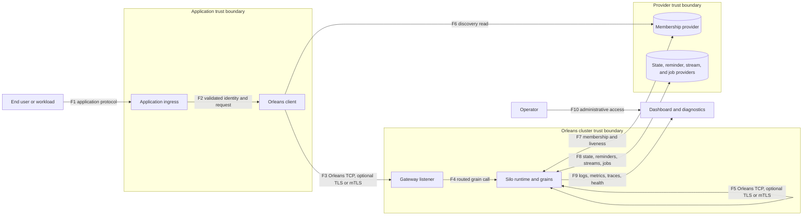
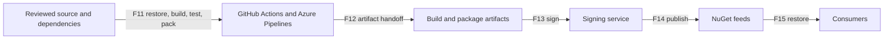

# Orleans threat model

| Field | Value |
|---|---|
| Product | Microsoft Orleans |
| Repository | `dotnet/orleans` |
| Assessed revision | `da77fd69da1cec5e72f9c70d327619d69f825ac7` |
| Prepared | 2026-08-19 |
| Status | Tool-native TM7 generated and validated; reviewer approval pending |

## System overview

Orleans is a distributed virtual-actor framework. Applications define grain
contracts and implementations. Orleans clients address grains by interface and
key, gateways route calls into a cluster, and silos activate grains, execute
calls, coordinate membership and directories, and use configured providers for
state, reminders, streams, and cluster discovery.

### Security objectives

1. Approved workloads establish gateway and silo connections.
2. Intended silos participate in membership and directory coordination.
3. Applications authorize grain operations using validated user, workload,
   tenant, and resource identity.
4. Messages and provider data retain confidentiality and integrity across each
   configured boundary.
5. Serialization rejects unintended types and bounds resource consumption.
6. Membership, directory, and reminder corruption is detected and contained.
7. A compromised client, silo, provider identity, certificate, build agent, or
   package publisher has a bounded blast radius.
8. Published Orleans packages are traceable to reviewed source and protected
   build, signing, and publication systems.
9. Diagnostics preserve operational value without disclosing credentials,
   payloads, tenant data, or sensitive topology.
10. The cluster remains available under malformed traffic, hot keys, retries,
    reconnect storms, and provider degradation.

## Scope and responsibility

### Included

- Orleans source and published NuGet packages.
- Client-to-gateway and silo-to-silo connection establishment.
- Optional TLS and connection authentication mechanisms.
- Message framing, serialization, and deserialization.
- Grain dispatch, call filters, membership, directories, placement, reminders,
  storage, streams, transactions, and durable jobs.
- Provider credentials and Azure identity integration exposed by Orleans.
- Dashboard, logs, metrics, traces, dumps, and health information.
- Repository dependency management, CI/CD, signing, and package publication.

### Shared responsibility

| Owner | Security responsibility |
|---|---|
| Orleans | Framing, routing, serializer type policy, membership and directory consistency mechanisms, optional TLS middleware, call-filter extension points, runtime diagnostics, packages, and guidance. |
| Application | End-user and workload authentication, resource and tenant authorization, post-deserialization validation, safe grain and codec logic, admission control, and application audit. |
| Hosting platform | Network and process isolation, workload identity, certificate and secret lifecycle, provider TLS, firewall policy, capacity, and production operations. |
| Provider operator | Authentication, least-privilege authorization, integrity, availability, backup, audit, quota, and namespace isolation. |
| Delivery system | Dependency provenance, trusted build agents, artifact integrity, signing-key protection, approvals, and publication authorization. |

### Assumptions

- Gateway and silo ports are private unless a deployment intentionally exposes
  them.
- Orleans clients and silos use compatible contracts and serializer
  configuration.
- `ServiceId`, `ClusterId`, grain keys, client identifiers, and silo addresses
  identify routing subjects; they do not authenticate them.
- A compromised silo executes inside the cluster trust boundary with access to
  its process services and credentials.
- Provider SDKs, cloud services, .NET, the operating system, certificate
  authorities, package feeds, and build platforms are external dependencies.

## Assets and sensitive data

- Grain identities, keys, activations, in-memory state, and persisted state.
- Grain calls, responses, request context, exceptions, trace context, and
  cancellation or status traffic.
- Membership rows, silo addresses and status, liveness votes, gateway
  discovery, and table versions.
- Grain-directory registrations, ownership views, and leases.
- Reminder definitions, schedules, ETags, and execution ownership.
- Stream events, checkpoints, durable jobs, and transactional records.
- Provider credentials, connection strings, access tokens, certificates, and
  private keys.
- Logs, metrics, traces, topology, grain state, dashboard history, dumps, and
  profiling artifacts.
- Source, dependencies, build artifacts, NuGet packages, signing identities,
  and publication credentials.

## Actors and identities

- Unauthenticated network actor.
- Authenticated application user.
- Approved or rogue Orleans client workload.
- Intended or rogue silo workload.
- Grain and application code executing in a silo.
- Tenant sharing a process, cluster, provider, or capacity domain.
- Operator using administrative or diagnostic surfaces.
- Provider identity or static credential holder.
- Compromised client, silo, provider account, certificate, dependency, package
  feed, build agent, signing system, or publication identity.

## Architecture and trust boundaries

### Component manifest

| ID | Component | Trust zone | Security decisions |
|---|---|---|---|
| C1 | Application ingress | Application | Authenticates users and workloads, validates public input, rate limits, and establishes trusted identity. |
| C2 | Orleans client | Application | Discovers gateways, creates grain references, and sends calls using application-provided identity context. |
| C3 | Gateway listener and router | Cluster edge | Validates connection preambles and cluster identity, optionally authenticates transport peers, and routes calls. |
| C4 | Silo runtime and grains | Cluster | Executes application code, dispatches calls, applies call filters, and accesses providers. |
| C5 | Serializer and codecs | Client and cluster | Frames messages, resolves permitted types, and constructs object graphs. |
| C6 | Membership and liveness | Cluster and provider | Coordinates joins, status, probes, votes, and membership versions. |
| C7 | Grain directory and placement | Cluster | Maps grain identities to activations and coordinates ownership. |
| C8 | Reminder service | Cluster and provider | Stores schedules and coordinates reminder ownership and execution. |
| C9 | Storage, streams, transactions, and jobs | Provider | Persists application and runtime data using provider-specific credentials. |
| C10 | Dashboard and diagnostics | Administrative | Exposes topology, health, logs, metrics, traces, and optional state inspection. |
| C11 | Build and release system | Delivery | Restores dependencies, builds, tests, packs, signs, and publishes packages. |

### Data-flow manifest

| Flow | Source -> destination | Data and protocol | Required security decisions |
|---|---|---|---|
| F1 | User/workload -> application ingress | HTTP, gRPC, messaging, or application protocol | Authenticate the caller, validate input, authorize the exposed operation, and rate limit. |
| F2 | Application ingress -> Orleans client | Validated subject, tenant, resource, and request data | Preserve trusted identity separately from caller-supplied values. |
| F3 | Orleans client -> gateway | Orleans TCP; optional TLS or mTLS | Restrict network reachability, authenticate the workload where required, and set message limits. |
| F4 | Gateway -> silo/grain | Routed request and request context | Enforce grain, method, key, tenant, and resource authorization before execution. |
| F5 | Silo <-> silo | Calls, membership, directory, and runtime coordination | Authenticate peers, isolate the network, and detect unexpected membership or topology changes. |
| F6 | Client -> membership provider | Gateway discovery reads | Grant only required read access and protect provider transport. |
| F7 | Silo <-> membership provider | Membership rows, liveness, versions, and ETags | Grant narrow write access, audit writers, and isolate cluster namespaces. |
| F8 | Silo <-> application providers | State, reminders, streams, transactions, and jobs | Use workload identity or protected credentials, least privilege, TLS, backup, and auditing. |
| F9 | Runtime -> diagnostics | Logs, metrics, traces, health, dumps, and profiles | Redact payloads and secrets, authenticate collectors, and apply retention and access policy. |
| F10 | Operator -> dashboard/diagnostics | HTTPS and administrative APIs | Require operator authentication, authorization, private ingress, and audit. |
| F11 | Source/dependencies -> CI | Git content, packages, tools, actions, and containers | Review source, pin dependencies, verify provenance, and isolate untrusted contributions. |
| F12 | CI -> artifact staging | DLLs, symbols, NuGet packages, logs, and SBOM data | Bind artifacts to source SHA and test results; prevent substitution. |
| F13 | Artifact staging -> signing | Package and binary digests | Protect signing authority and sign the exact reviewed artifacts. |
| F14 | Signing -> package feed | Signed packages and metadata | Require publication approval, scoped credentials, and post-publication verification. |
| F15 | Package feed -> consumers | NuGet restore | Verify expected package identity, version, source, and signature. |

## Authentication and authorization decisions

- Gateway and silo preambles carry `ClusterId` and caller identifiers. Equality
  and format checks support routing and cluster separation; transport or
  application policy supplies authentication.
- TLS authenticates the endpoint acting as server. mTLS additionally
  authenticates the connecting workload. Certificate identity and grain-call
  authorization remain separate decisions.
- `RequestContext` is transitive caller-controlled data. Identity, role, tenant,
  and administrator values are accepted only after validation by trusted
  application infrastructure.
- `IIncomingGrainCallFilter` provides silo-wide and per-grain authorization
  hooks. Applications implement deny-by-default policy across every grain
  interface, method, extension, key, tenant, and administrative operation.
- Provider identities receive only the data-plane actions needed by the client
  or silo role. Deployment/schema identities remain separate.

## Implemented controls

| Area | Implemented control | Public evidence |
|---|---|---|
| Trust boundaries | Security guidance assigns Orleans, application, platform, and provider responsibilities. | `docs/site/src/content/docs/security/index.md` |
| Transport | Orleans supports server-authenticated TLS and mTLS, TLS 1.2/1.3 defaults, certificate validation, revocation options, and bounded handshakes. | `src/Orleans.Connections.Security`, `docs/site/src/content/docs/host/transport-layer-security.md` |
| Framing | Connection preambles and message frames have configured size limits; invalid framing terminates processing. | `src/Orleans.Core/Networking`, `src/Orleans.Core/Messaging` |
| Type policy | Serializer type authorization is fail closed by default and evaluates generic arguments and array element types. | `src/Orleans.Serialization`, `docs/site/src/content/docs/security/serialization.md` |
| Allocation hardening | Readers validate remaining input before selected payload-sized allocations. | [PR #10340](https://github.com/dotnet/orleans/pull/10340) |
| Membership | Join probes, liveness votes, conditional writes, ETags, versions, and bounded timeouts protect consistency. | `src/Orleans.Runtime/MembershipService` |
| Directory/reminders | Ownership views, leases, versions, and ETags protect concurrent updates. | `src/Orleans.Runtime/GrainDirectory`, `src/Orleans.Runtime/ReminderService` |
| Authorization hooks | Incoming grain-call filters can reject calls before method invocation. | `docs/site/src/content/docs/security/authentication-authorization.md` |
| Resource control | Expired calls are dropped and optional load shedding reacts to CPU and memory pressure. | `src/Orleans.Core`, `src/Orleans.Runtime` |
| Credential handling | Options formatting supports redaction and Azure providers accept token credentials. | `src/Orleans.Core`, `src/Azure` |
| Delivery | Central package versions, CodeQL, CI matrices, manual publication approval, and MicroBuild signing are configured. | `Directory.Packages.props`, `.github/workflows`, `.azure/pipelines`, `sign` |

## STRIDE threat register

Statuses describe evidence-package readiness, not security-review approval.

| ID | STRIDE | Threat scenario | Existing mitigation | Residual risk and required action | Status |
|---|---|---|---|---|---|
| T01 | Spoofing | A reachable actor claims a client identifier and valid `ClusterId`. | Preamble validation, network policy guidance, optional TLS/mTLS. | IDs are not credentials. Require private reachability and workload authentication; bind authenticated identity to allowed role and cluster. | Open |
| T02 | Elevation of privilege | A connected client invokes an unintended grain interface, method, or key. | Trusted ingress guidance and incoming call filters. | Authorization is application policy. Require deny-by-default coverage and regression tests for every callable surface. | Open |
| T03 | Spoofing | A rogue silo joins using a known cluster identifier, broad CA trust, or provider write credential. | Join probes, membership provider controls, optional mTLS. | Use narrow trust roots, explicit cluster identity, private ports, least-privilege membership writers, and membership alerts. | Open |
| T04 | Tampering | A compromised silo sends poisoned membership or directory coordination state. | Membership versions, votes, ETags, ownership views, and leases. | Trusted silos retain broad runtime authority. Monitor unexpected versions and identities; evaluate channel-bound coordination messages. | Open |
| T05 | Tampering | A provider writer changes grain state, reminders, streams, or jobs. | Provider authentication, ETags, and conditional updates. | Provider authorization is the integrity boundary. Separate namespaces and identities, audit writes, and rehearse recovery. | Open |
| T06 | Repudiation | A call is attributed to caller-supplied identity or request-context values. | Application authentication guidance and call filters. | Record the validated subject, workload, tenant, resource, decision, and correlation identifier in protected audit telemetry. | Open |
| T07 | Information disclosure | Gateway or silo traffic crosses a readable network. | Optional TLS and mTLS. | TLS is deployment configuration. Require it on shared or untrusted paths and document approved exceptions. | Open |
| T08 | Information disclosure | Logs, traces, dashboard, dumps, or object formatting expose payloads, keys, state, or credentials. | Redaction support and secure diagnostics guidance. | Authenticate administrative surfaces, filter payloads and baggage, restrict collection, and define retention and deletion. | Open |
| T09 | Denial of service | Slow or repeated connections consume listener and pipeline resources. | Small preamble limit and TLS handshake timeout. | Add connection-count, rate, idle, and non-TLS preamble deadlines at the host/network boundary; test reconnect storms. | Open |
| T10 | Denial of service | Malformed lengths, large collections, nesting, or custom codecs amplify memory or CPU use. | Frame limits, type policy, selected allocation checks, and serializer tests. | Lower limits to contract needs; add collection/depth budgets and allocation-aware fuzzing. | Open |
| T11 | Denial of service | Hot keys, expensive methods, retries, or tenant fan-out exhaust shared capacity. | Request expiration and optional load shedding. | Enable tuned shedding and apply per-user, workload, tenant, method, and key admission controls. | Open |
| T12 | Elevation of privilege | A compromised silo moves laterally through peer, provider, and diagnostic access. | Process isolation, network policy, TLS, and provider credentials. | A silo shares its process identity across grains. Separate high-risk tenants and environments into distinct processes, clusters, accounts, and networks. | Open |
| T13 | Spoofing/Tampering | `ServiceId` or `ClusterId` collisions connect the wrong logical deployment. | Cluster equality checks and provider namespaces. | Set explicit unique values and pair them with separate credentials, namespaces, certificates, and networks. | Open |
| T14 | Tampering | Reminder or directory ownership is redirected or stale state is replayed. | ETags, leases, membership versions, and ownership checks. | Alert on reminder churn and directory instability; restrict provider writers and validate recovery behavior. | Open |
| T15 | Information disclosure | Storage credentials or access tokens appear in configuration, exceptions, logs, or diagnostics. | Secret guidance and option redaction support. | Inventory credential-bearing options and test formatting, exceptions, and health output for disclosure. | Open |
| T16 | Tampering/Elevation of privilege | A malicious dependency, action, container, source generator, or build task modifies output. | Central versions, source mapping, pinned workflow references, CodeQL, and CI. | Expand immutable pinning, dependency review, audit policy, SBOM, and provenance. | Open |
| T17 | Tampering | An artifact is substituted between test, signing, and publication. | Official pipeline, artifact staging, signing, and manual publication approval. | Build and test once, sign and publish the exact digest, and retain source-to-package provenance. | Open |
| T18 | Spoofing/Elevation of privilege | A signing or publication identity is compromised. | Service connections, signing service, and approval gate. | Attest least privilege, short-lived credentials, key custody, approver separation, rotation, and emergency revocation. | Open |
| T19 | Information disclosure | Cross-tenant grain keys, state, telemetry, or provider namespaces are visible to another tenant. | Application authorization and configurable provider isolation. | Shared silos are not hard tenant boundaries. Use separate clusters and provider accounts where isolation is required. | Open |
| T20 | Denial of service | A dependency outage or throttle triggers retries, activation churn, or cluster instability. | Timeouts, health signals, provider-specific resilience, and operations guidance. | Set retry budgets, capacity limits, circuit behavior, and dependency-specific runbooks; test degraded modes. | Open |
| T21 | Tampering/Elevation of privilege | Untrusted type metadata, generalized codecs, or permissive type policy selects an unintended CLR type or code path. | Type authorization is fail closed by default and evaluates constructed types; security guidance requires narrow allow lists and trusted codecs. | Keep `AllowAllTypes` disabled, constrain generalized and external serializers, review custom codec side effects, and test rejected type names and nested constructions. | Open |

## Abuse cases

1. Reach a public gateway, claim a compatible client identity, and invoke known
   grain APIs.
2. Hold many non-TLS connections before completing the preamble.
3. Encode a large collection count that causes disproportionate allocation.
4. Submit deep or expensive data to a custom codec.
5. Present a certificate issued by an overly broad trusted authority.
6. Use a membership write credential to insert a rogue silo or mark healthy
   silos dead.
7. Use a compromised silo to poison routing or access neighboring providers.
8. Flood a hot grain or expensive method and starve unrelated tenants.
9. Modify reminder rows to trigger, suppress, or redirect scheduled work.
10. Reach an unprotected dashboard and inspect topology, logs, reminders, or
    state.
11. Run a malicious build task and modify package output before signing.
12. Cause an invocation object's string representation or trace baggage to
    disclose sensitive data.

## Recommended follow-up work

| Priority | Work |
|---|---|
| P0 | Require private gateway/silo reachability, workload-authenticated TLS where the boundary requires it, deny-by-default grain authorization, separate hard-isolation tenants/environments, and least-privilege provider identities. |
| P1 | Add connection and preamble deadlines, lower message limits, fuzz framing and serializers with allocation budgets, enable load shedding, monitor membership/reminders/directories, and harden diagnostics. |
| P1 | Build and test once, publish the tested digest, require scanning and dependency review, expand immutable pinning, produce SBOM/provenance, and attest signing/publication access. |
| P2 | Add security regression suites, publish a supported-version and vulnerability-servicing policy, document release rollback, and exercise incident response. |

## Review and acceptance

Formal review must record:

- Reviewer and review date.
- Approved scope and assumptions.
- Disposition of each open threat.
- Accepted residual risks, owners, and expiry dates.
- Follow-up work items and target dates.
- Material-change triggers and the next review date.
