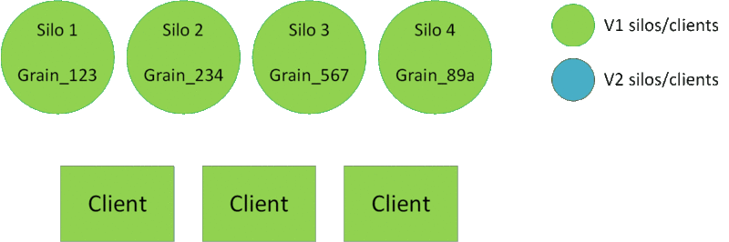

[!include]
# Deploy new version of grains

### Rolling upgrade

In this method you deploy newer silos directly on your environment.
This is the simplest method, but it can be difficult to interrupt an ongoing deployment
and to rollback.

Recommended configuration:
- `DefaultCompatibilityStrategy` set to `BackwardCompatible`
- `DefaultVersionSelectorStrategy` set to `AllCompatibleVersions`

When using this configuration, "old" clients will be able to talk to activations
on both versions of silos. Newer clients and silos will only trigger new activations
on newer silos.

### Using a staging environment

In this method you will need a second environment (Staging environment),
on which you will deploy newer silos before stopping the Production environment.
The Production and the Staging silos and clients will be __part of the same
cluster__. It is important that silos from both environment can talk to each other.

Recommended configuration:
- `DefaultCompatibilityStrategy` set to `BackwardCompatible`
- `DefaultVersionSelectorStrategy` set to `MinimumVersion`

Suggested deployment steps:

1. "V1" silos and clients are deployed and are running in the Production slot.
2. "V2" silos and clients begin to start in the Staging slot. They will join the
same cluster as the Production slot. No "V2" activations will be created so far.
3. Once the deployment in the Staging slot is finished, the developper can redirect
some traffic on the V2 clients (smoke tests, targeted beta users, ect.). This will
create V2 activations, but since Grains are backward compatibles and that all silos
are in the same cluster, no duplicate activations will be created.
4. If the validation is successful, proceed to VIP swap.
  If not, you can safely shutdown the Staging cluster: existing V2 activations will be
  destroyed and V1 activations will be created if needed.
5. V1 activations will naturally "migrate" to V2 silos eventually. You can safely shutdown
V1 silos.

> [!WARNING]
> Remember that stateless workers are not versioned and that streaming agents will
> also start in the staging environment.
