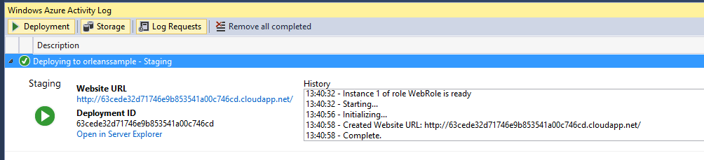
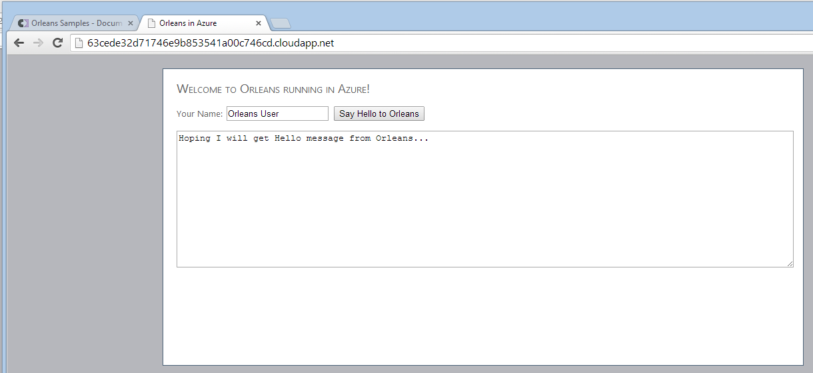
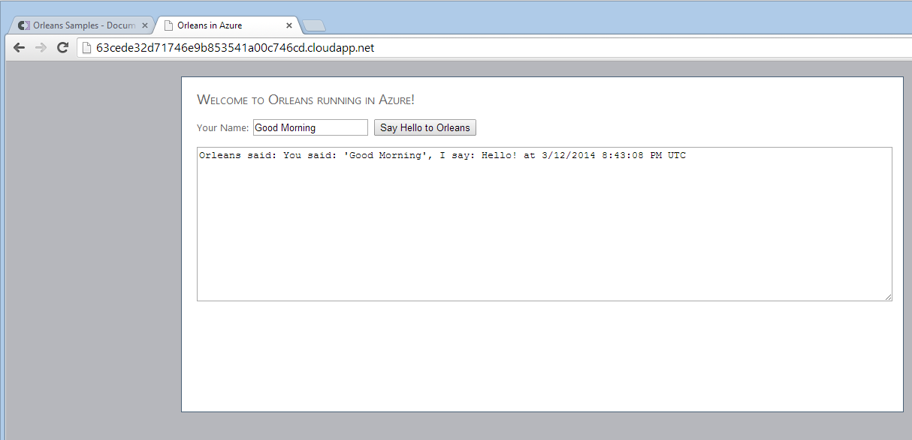

[!include]

# Azure Web Sample

**Important note**: Worker and web role instances are not automatically removed or disabled, even when they go unused for a long time. To avoid a nasty surprise when your Azure bill comes, make sure to delete the instances after you have finished testing the application!

This sample is essentially the same as the [Hello World](Hello-World.md) sample, except that it hosts the grains in an Azure Worker Role instead of in the client process itself.

While the communication interface and grain implementation are identical, three projects replace the client:

- **OrleansAzureSample**, which is the Azure configuration project.
- **OrleansAzureSilos**, the Worker Role integration logic that hosts the Orleans silo in the cloud.
- **WebRole**, which provides a simple HTML UI for the Orleans backend.

## Run AzureWebSample Locally

The sample is configured to run inside of the Azure Compute Emulator on your desktop by default, so make sure that **OrleansAzureSample** is set as the **Startup Project** in this solution and just press F5 to build and run the sample locally.

You do not need to start Visual Studio with administrative privileges to run this sample in the emulator - it is designed to use both **IIS Express** and **Express Emulator**, so make sure these options are selected in OrleansAzureSample->Properties->Web.
You may also need to select the "Use IIS Express for web sites and projects" in Tools->Options->Projects and Solutions->Web Projects.

## Run AzureWebSample in Azure Cloud

To get the sample running in the Azure cloud, open the `ServiceConfiguration.Cloud.cscfg` file in the OrleansAzureSample project.

Edit the connection strings, replacing `MYACCOUNTNAME` and `MYACCOUNTKEY` with data you get from the Azure portal, logged in to your account. It may be useful to set up a new storage account within your subscription just for samples testing. All four connection strings will look exactly the same.

In the file `ServiceDefinition.csdef`, the configuration sets up all instances as ExtraSmall to avoid any unpleasant surprises. If you want something else, modify the settings as you see fit.

Then, build the solution with Visual Studio and right-click on the OrleansAzureSample project, selecting 'Publish.' Visual Studio will take you through the process of publishing your project to Azure, which will take a few minutes.

If things work out, you should see something like this:

This means that the site and its backend are ready. Start a web browser and navigate to the link that VS displayed (or just click on it). You will be greeted by this screen:

Click on "Ask Orleans it's details" and wait for the response. The first time you interact with the site, it may take a few seconds, since the whole system need to warm up. After that first message, it should go quickly.

