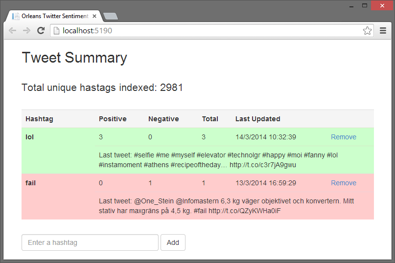

[!include[](../../warning-banner.md)]

# Twitter Sentiment

The Twitter Sentiment application records Twitter sentiment by consuming the Twitter streaming API, calulates a sentiment score for each tweet (i.e. is it a positive/negative/neutral tone of lanuage), and then records that sentiment against each hashtag in the tweet using an Orleans grain to maintain a total score for each unique hashtag.

The sample illustrates using Orleans to manipulate data with high volumes of input traffic, where each grain owns a row in a table (or a key in a key/value store, or a document in a document store) and all updates go through one single grain, reducing contention for individual rows, keys, or documents.



### Client
The sentiment processing on each tweet is performed in a Node.js application, in server.js, and uses the [sentiment library](https://github.com/thisandagain/sentiment) to perform the analysis, which uses key words to determine sentiment. The sentiment score and the actual tweet are posted to the ASP.NET MVC program for processing.

The ASP.NET MVC application serves two main roles. It acts as the end point to post sentiment scores into Orleans, and it provides the UI to view hashtag sentiment scores from Orleans. When updating a sentiment score, the SetScore function in GrainContoller.cs gets a handle for a stateless TweetDispatcher grain, and calls its AddScore method. The GetScores method retrieves the score for an arbitrary list of hashtags, each score being expressed as a combination of the overall positive sentiment score, the overall negative sentiment score, and the total number of tweets tracked containing that hashtag.

Recall that some sentiment analysis will often result in a neutral weighting, so it is good to track the total number of tweets containing the hashtag. The controller also retrieves a count of the total number of hashtags that the system is tracking, to help give a sense of the scale of data coming in from the Twitter fire hose.

### Orleans
There are three main Orleans grains in the sample. The TweetDispatcher is the public “endpoint” for sentiment analysis.

``` csharp
[StatelessWorker]
public interface ITweetDispatcherGrain : Orleans.IGrain
{
    Task AddScore(int score, string[] hashtags, string tweet);
    Task<Totals[]> GetTotals(string[] hashtags);
}
```

Note that it is a stateless grain, and its main role is to pass the work to stateful grains for processing. AddScore takes a tweet, and parses out each hashtag for processing by the appropriate grain. GetTotals retrieves get the number of tweets that have included a specific list of hashtags. This grain exists in part to support the “batch processing” of several hashtags within a single tweet.

One Orleans grain is created for each unique hashtag, and this grain is used to track the current sentiment score.

``` csharp
[ExtendedPrimaryKey]
public interface IHashtagGrain : Orleans.IGrain
{
    Task AddScore(int score, string lastTweet);
    Task<Totals> GetTotals();
}
```    


Note that the ExtendedPrimaryKey attribute indicates that a string, in this case the twitter hashtag, is being used as a composite key for the grain, instead of the more usual Guid or long, which is a more natural fit for grains that have strings rather than numeric keys. The AddMethod updates the current state with the latest sentiment score, and GetTotals returns a Totals structure, with the breakdown of the sentiment analysis, along with the date stamp for the last processed tweet, and the test of the last tweet. The last tweet is kept just to allow the UI to display it, to help give the sentiment more context.

When first activated, the grain tracks this activation by calling the IncrementCounter method on a Counter grain.

``` csharp
public interface ICounter : Orleans.IGrain
{
    Task IncrementCounter();
    Task ResetCounter();
    Task<int> GetTotalCounter();
}
```


To increase performance, the counter grain only persists its internal state periodically, in this case, every 100 calls. The running total does not have to be one hundred percent accurate, so if the data were lost due to a silo failure between updates, that would not be critical. If this grain were to be called repeatedly from other grains, it could become a bottleneck, and some form of aggregation pattern would be needed, but as its only called once from each grain, upon grain initialization, this should not be an issue.

### Prerequisites
The following must be installed prior to running the sample:

* Visual Studio 2013
* Orleans SDK
* [Node.js Tools for Visual Studio](https://nodejstools.codeplex.com/). Make sure to read the instructions and also install
* Node.js, not just the VS tools!
* A [Windows Azure](http://www.windowsazure.com/) storage account
* A [Twitter](https://twitter.com/) account and Twitter application development credentials. Sign up as a [Twitter Developer](https://dev.twitter.com/) and create an application. Make a note of the 'API key', 'API secret', 'Access token' and 'Access secret'. It is important to set the application permissions to include all rights, and then regenerating the keys and tokens before using them. If you don't, the client will silently fail.

### Running the Sample
* Open the `OrleansTwitterDemo.sln` file in Visual Studio 2013, and build the solution.
* Enter the details from Twitter into the TwitterClient\app.js file.

* Start Azure Storage Emulator or replace "UseDevelopmentStorage=true" in `DevTestServerConfiguration.xml` in the `Host` project with your Azure Storage account
* Start the local Orleans Silo by running the `Host` project.
* Start the `TwitterClient` project.
* The Twitter Client should start, showing you every tweet it is consuming.
* Start the `TwitterWebApplication` project.
* Your browser should open on http://localhost:5190/ showing you a few preset hashtags you can monitor.
* Try adding a couple of hashtags to track using the browser UI.
* Got get a cup of coffee or do something else for a while, because it may take some time before the tags you care about are seen in the feed.
