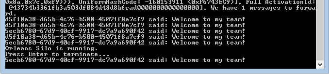

# A Service is a Collection of Communicating Actors

The previous tutorials all relied on interacting with a single actor from the client.
In most real-world situations this is not what would be expected as actors are intended to be more or less as light-weight as objects and treated as such.
Thus, you would no more find an application with just one actor type and one actor instance than you would expect to find a .NET application with one instance of one class.

In this tutorial, we're going to construct multiple actors from a couple of classes with different communication interfaces.
Not everything will be explained while putting together the application, we will go back and elaborate on a few things after we have it working.

## Employees and Managers

This example will use the relationship of employees and managers to demonstrate the concept of multiple actors - it's one we all understand and relate to.

Start by creating a new solution with a silo host, a communications interface project and a grain implementation project as described in previous tutorials.
Don't forget to add the necessary project-to-project references and make sure to add a build dependency on the implementation project so that it is built when the host project is built.

Change the first interface to `IEmployee` and add an interface called `IManager`.
Add a couple of methods to describe relationships and employment level:


``` csharp
public interface IEmployee : IGrainWithGuidKey
{
    Task<int> GetLevel();
    Task Promote(int newLevel);

    Task<IManager> GetManager();
    Task SetManager(IManager manager);
}
```

and

``` csharp
public interface IManager : IGrainWithGuidKey
{
    Task<IEmployee> AsEmployee();
    Task<List<IEmployee>> GetDirectReports();
    Task AddDirectReport(IEmployee employee);
}
```


Note that this looks a bit different to normal .NET interfaces: usually, you have a property with a setter and a getter, but when defining grain interfaces, you need to avoid using properties altogether, only methods are supported.
This is because .NET property setters and getters aren't meant to do I/O.

It is often possible to use traditional object-oriented design methodology with Orleans, but sometimes there are reasons for not doing so.
In this case, we're choosing to not rely on inheritance when defining the `Manager` class, even though a `Manager` is clearly also an `Employee`.
The reason for this will be explained when we discuss Orleans' support for [Declarative Persistence](Declarative-Persistence.md).
With these two interfaces as our starting point, the implementation classes are straightforward to implement, as the interfaces are simple.

Here's what it looks like:

``` csharp
public class Employee : Grain, IEmployee
{
    public Task<int> GetLevel()
    {
        return Task.FromResult(_level);
    }

    public Task Promote(int newLevel)
    {
        _level = newLevel;
        return TaskDone.Done;
    }

    public Task<IManager> GetManager()
    {
        return Task.FromResult(_manager);
    }

    public Task SetManager(IManager manager)
    {
        _manager = manager;
        return TaskDone.Done;
    }

    private int _level;
    private IManager _manager;
}
```

 and

``` csharp
public class Manager : Grain, IManager
{
    public override Task OnActivateAsync()
    {
        _me = this.GrainFactory.GetGrain<IEmployee>(this.GetPrimaryKey());
        return base.OnActivateAsync();
    }

    public Task<List<IEmployee>> GetDirectReports()
    {
        return Task.FromResult(_reports);
    }

    public Task AddDirectReport(IEmployee employee)
    {
        _reports.Add(employee);
        employee.SetManager(this);
        return TaskDone.Done;
    }

    public Task<IEmployee> AsEmployee()
    {
        return Task.FromResult(_me);
    }

    private IEmployee _me;
    private List<IEmployee> _reports = new List<IEmployee>();
}
```

A manager is expressed as an employee through composition: the manager grain has a reference to a grain representing its "employeeness."
The role of `OnActivateAsync()` will be explained later on; for now, you may consider it to be a constructor.

In the client _(Program.cs)_, we can add a few lines to create a couple of employees and their manager:

``` csharp
// Orleans comes with a rich XML and programmatic configuration. Here we're just going to set up with basic programmatic config
var config = Orleans.Runtime.Configuration.ClientConfiguration.LocalhostSilo(30000);
GrainClient.Initialize(config);

var grainFactory = GrainClient.GrainFactory;
var e0 = grainFactory.GetGrain<IEmployee>(Guid.NewGuid());
var e1 = grainFactory.GetGrain<IEmployee>(Guid.NewGuid());
var e2 = grainFactory.GetGrain<IEmployee>(Guid.NewGuid());
var e3 = grainFactory.GetGrain<IEmployee>(Guid.NewGuid());
var e4 = grainFactory.GetGrain<IEmployee>(Guid.NewGuid());

var m0 = grainFactory.GetGrain<IManager>(Guid.NewGuid());
var m1 = grainFactory.GetGrain<IManager>(Guid.NewGuid());
var m0e = m0.AsEmployee().Result;
var m1e = m1.AsEmployee().Result;

m0e.Promote(10);
m1e.Promote(11);

m0.AddDirectReport(e0).Wait();
m0.AddDirectReport(e1).Wait();
m0.AddDirectReport(e2).Wait();

m1.AddDirectReport(m0e).Wait();
m1.AddDirectReport(e3).Wait();

m1.AddDirectReport(e4).Wait();

Console.WriteLine("Orleans Silo is running.\nPress Enter to terminate...");
Console.ReadLine();
```

In the code we have seen so far, it is noteworthy that you can send grain references (interfaces) in messages.
Thus, when a direct report is added to a manager, the manager can communicate directly with the employee without calling `GetGrain()`.
This ability is essential in making the programming model a smooth transition from .NET.

Let's add the ability for employees to send messages to each other:

``` csharp
public interface IEmployee : IGrainWithGuidKey
{
    ...
    Task Greeting(IEmployee  from, string message);
    ...
}
```

then:

``` csharp
public class Employee : Grain, Interfaces.IEmployee
{
    public Task Greeting(IEmployee from, string message)
    {
        Console.WriteLine("{0} said: {1}", from.GetPrimaryKey().ToString(), message);
        return TaskDone.Done;
    }
```

and

``` csharp
public class Manager : Grain, IManager
{
    public Task AddDirectReport(IEmployee employee)
    {
        _reports.Add(employee);
        employee.SetManager(this);
        employee.Greeting(_me, "Welcome to my team!");
        return TaskDone.Done;
    }
```

Executing it, you should see something like this:



The use of a GUID to represent the name of a person leaves something for you to fix, as an exercise. If you want to do this exercise, please keep the rule for always using asynchronous code inside grains. The Result of a Task will block execution if the task hasn’t completed. This should be avoided in Orleans grains; tasks should always be awaited before Result is read.

`TaskDone.Done`, used in the code above, is a convenience object defined by Orleans to allow code to succinctly return an already completed `Task`.

### Asynchrony Bites Us!

In the image above, you may notice that the last message comes out after the request to press Enter -- why is that?
All the client requests to add a direct report dutifully wait for the addition to finish, i.e. they are fully synchronous.
The problem lies elsewhere -- in the implementation of `AddDirectReport()`, which doesn't wait for the greeting to be acknowledged.
Such concurrency is often innocuous and sometimes beneficial, as long as we don't consider the risk of exceptions, which we always must.

A correct version of the method would look like this:

``` csharp
public async Task AddDirectReport(IEmployee employee)
{
    _reports.Add(employee);
    await employee.SetManager(this);
    await employee.Greeting(_me, "Welcome to my team!");
}
```

## The Life of an Actor

Orleans actors are virtual, meaning that even though an actor logically exists, it may not be present in memory at a given point in time.
In fact, Orleans takes this concept to an extreme by claiming that all actors exist at all time (past and present) and are never created or destroyed.
An actor may be inactive, such as before the first time anyone refers to it or after the last use, but is never not existing.

While counter-intuitive and, frankly, strange to most of us with a object-oriented background, this notion actually removes a source of complexity from the system.
An actor is either active (present in memory) or inactive, and that status can not be observed by a client.
Actor activation is on-demand, just like virtual memory is mapped on demand to physical memory.

Thus, the .NET object that holds the actor state is logically just a copy of the actor in memory while it is in the active state.
Implementations of Orleans grains should refrain from having constructors, even parameter-less ones, with any logic.
That is simply the wrong way of thinking about them: grains are never created or destroyed, just moved from the inactive to the active state or vice versa.

Therefore, the implementation should catch the activation event (a call to `OnActivateAsync()`) and perform any initialization steps necessary there.
It is guaranteed to be called before any method on the grain instance is called.
In the `Manager` grain above, it was used to establish the reference to the Employee grain.

There is also an `OnDeactivateAsync()` method, used more infrequently.

## Next

Next up is a look at  [Concurrency](Concurrency.md) in Orleans.
